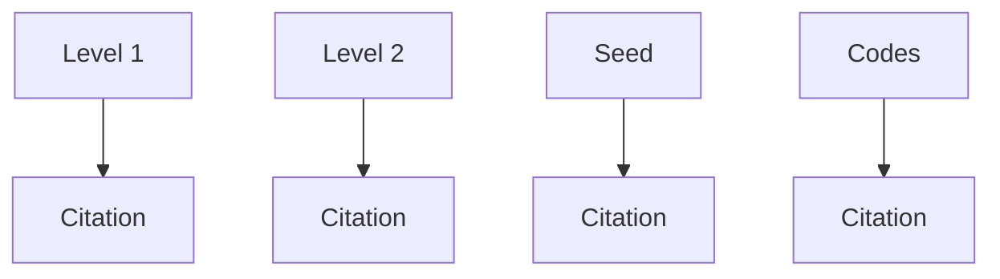
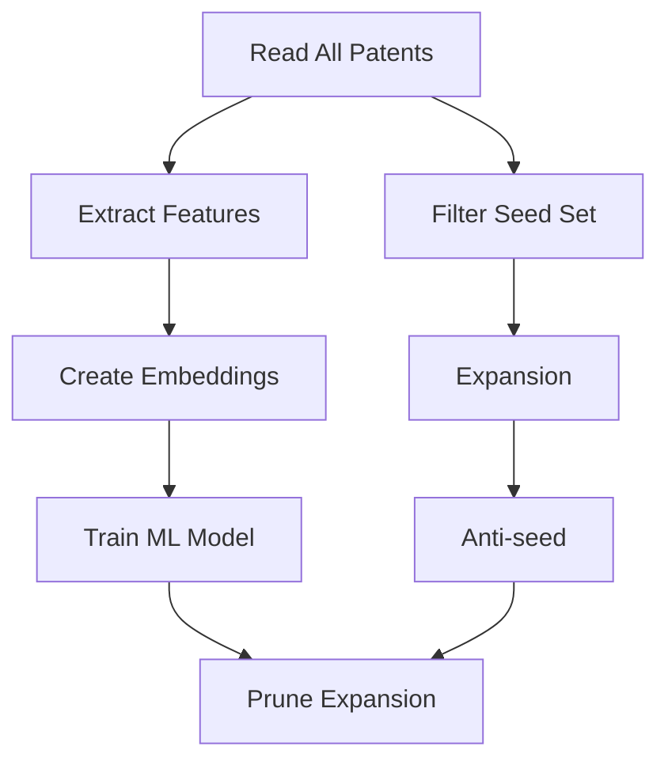
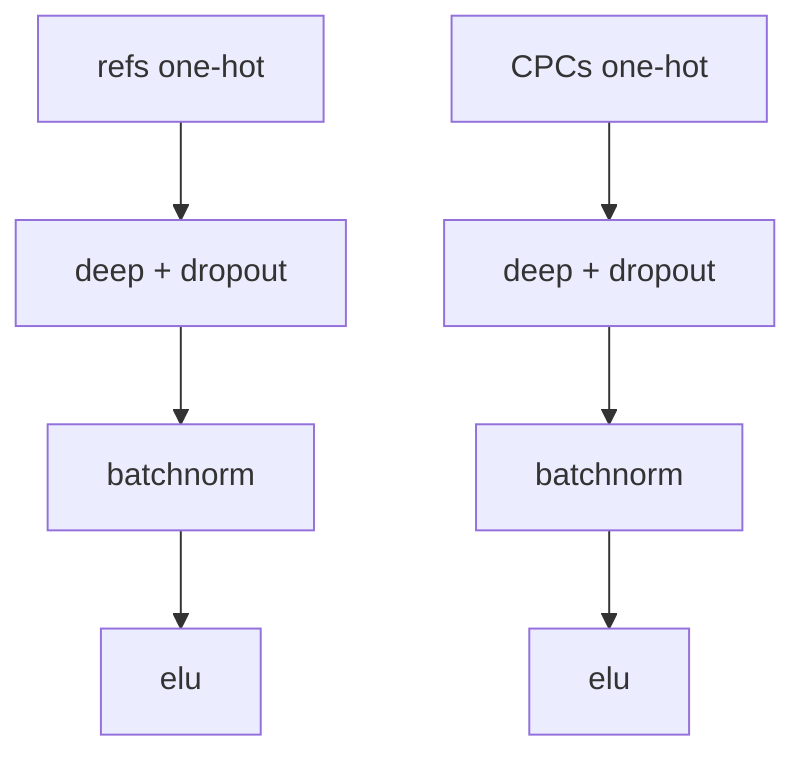
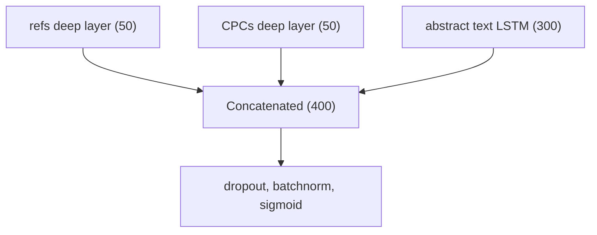

# Automated patent landscaping

Aaron Abood1 • Dave Feltenberger1

Published online: 28 March 2018

\- The Author(s) 2018

Abstract Patent landscaping is the process of finding patents related to a particular topic. It is important for companies, investors, governments, and academics seeking to gauge innovation and assess risk. However, there is no broadly recognized best approach to landscaping. Frequently, patent landscaping is a bespoke human-driven process that relies heavily on complex queries over bibliographic patent databases. In this paper, we present Automated Patent Landscaping, an approach that jointly leverages human domain expertise, heuristics based on patent metadata, and machine learning to generate high-quality patent landscapes with minimal effort. In particular, this paper describes a flexible automated methodology to construct a patent landscape for a topic based on an initial seed set of patents. This approach takes human-selected seed patents that are representative of a topic, such as operating systems, and uses structure inherent in patent data such as references and class codes to ‘‘expand’’ the seed set to a set of ‘‘probably-related’’ patents and anti-seed ‘‘probably-unrelated’’ patents. The expanded set of patents is then pruned with a semi-supervised machine learning model trained on seed and anti-seed patents. This removes patents from the expanded set that are unrelated to the topic and ensures a comprehensive and accurate landscape.

Keywords Patent landscape - Classification - Text analytics - Semi-supervised machine learning

# CCS concepts

• Computing / technology policy - Intellectual property - Patents   
• Machine learning - Learning paradigms - Supervised learning - Supervised learning by classification   
• Machine learning - Machine learning approaches - Neural networks   
• Machine learning - Machine learning approaches - Learning linear models - Perceptron model   
• Applied computing - Law, social and behavioral sciences - Law   
• Applied computing - Document management and text processing - Document metadata.

# 1 Introduction

At the height of the smartphone wars, it was rumored that the smartphone was covered by 250,000 patents (O’connor and 2012; Yang et al. 2010). Or was it 314,390 (Reidenberg et al. 2015)? Which is right, and how does one even arrive at such numbers? This also leads to follow on questions such as: who owns the patents? when were the patents filed? where are the inventors from? what fraction of the patents have been litigated?

These questions are often answered by a technique called patent landscaping. Patent landscaping is important to a number of audiences, including (1) companies that desire to assess risk posed by other patent holders and understand their own relative strength, (2) academics and governments that seek to gauge the level of R&D investment and innovation in particular fields (Trippe 2015), and (3) investors looking to value companies and assess risk (Cockburn and Macgarvie 2009). Once a landscape has been constructed, additional data can be joined to explore the dynamics of the landscape including, location of inventors, litigation rates, payment of maintenance fees, and invalidity rates in litigation on post grant proceedings. Further, visualization techniques can be applied to surfaces underlying technologies how they relate to one another in the landscape (Yang et al. 2010).

Patent landscaping is the exercise of identifying all the patents that are relevant to a topic. This is discussed in detail in the guidelines prepared by the World Intellectual Property Office (WIPO) (Trippe 2015). It is a challenging task that can involve substantial time and expense. In particular, patent landscaping is made difficult by issues such as: over/under inclusion, needing to fully understand the associated technical/product landscape, scalability/data limitations of commercial tools, and proper search methodology. Building patent landscapes is often seen as more of an art than a science with analysts constructing elaborate queries over bibliographic patent databases and assembling multiple lists of patents for inclusion in the resulting landscape. This can make reproducing and updating landscapes difficult while methodologies may be inconsistent or difficult to explain.

It’s important to note that patent landscaping is different than prior art searching. Both involve searching for patents but they differ greatly in use cases and scale.

Fig. 1 Expansion levels   


<details>
<summary>flowchart</summary>


</details>

Prior art searching is focused on identifying a small number of patents, or other publications, that are related to a specific invention. Landscaping is focused on identifying a large number of patents that relate to a topic. The approach described below is intended purely for landscaping, particularly for generating landscapes of thousands of patents.

This paper describes a semi-supervised machine learning approach for automated patent landscaping. The approach starts with a small human curated seed set of patents narrowly related to the topic of interest. The seed set is expanded by citations (forward and backward) and class codes to identify candidate patents for inclusion in the landscape (Levels 1 and 2 in Fig. 1). Patents not included in the expansion are referred to as the anti-seed. A machine learning model is then applied to prune the candidate patents to create a subset of the candidate patents that are relevant to the topic. The model is trained using the seed (positive examples) and a sample of patents from the anti-seed (negative examples). The final landscape is the pruned subset of candidate patents and the seed set. Alternatively, the model could be applied to the full patent corpus to increase coverage missed by the expansion to Levels 1 and 2.

# 2 Patent data

A basic understanding of patent data and its traditional application to patent landscaping is useful for understanding the automated approach described in this paper. Those who are familiar with patent data can skip to the Sect. 3.

Patent documents and their associated data are somewhat unique in that they include multiple text segments as well as a significant array of structured metadata. Such metadata includes class codes, citations, inventors, assignees, and family relationships. The following highlights some of the key types of patent data as they relate to patent landscaping. Note that each type has significant limitations when used in patent landscaping.

# 2.1 Text

Patents contain multiple text segments, such as a title, abstract, and detailed description (body of the patent). Additionally, patents include claims. The claims define the scope of the property right and must be supported by the detailed description.

A common traditional technique for constructing landscapes is to perform boolean keyword searches on some or all of the text segments. However, this can be difficult when words have multiple meanings, when multiple words can describe the same subject, or simply because of spelling variations. Further, constructing such queries can often involve constructing long boolean queries with multi-word phrases and require that the user understand all aspects of the topic.

# 2.2 Class codes

Class codes are topical labels applied by a patent office to classify patents. The primary class code regimes are the US class codes (exclusive to the USPTO) and the Cooperative Patent Class (CPC) codes (applied worldwide). Both are large hierarchical taxonomies with thousands of nested labels. Patents are typically assigned to multiple class codes. The implementations discussed subsequently in this paper are utilize CPC codes.

A common technique for constructing landscapes is to select all the patents from one or more class codes. However, identifying the desired class codes can be difficult and the underlying patents sometimes deviate from the description of the class codes. Additionally, the codes, either alone or in combination, may not line up well with the topic for which the user wants to construct a landscape. Even if they do, selecting the right combinations of codes requires the user to have a nuanced understanding of the topic.

# 2.3 Citations

Like scholarly publications, many patents have citations. During prosecution (the process for obtaining a patent), the examiner as well as the applicant may cite publications that are relevant to the patent’s claims in evaluating whether the claims are novel and nonobvious. Frequently, the cited publications are patent publications. A patent publication is a published version of a patent or patent application produced by a patent office. A given patent may publish multiple times in slightly different forms. The most common example of this is the publication of a patent at the application stage and later publishing again as an issued patent.

When building landscapes, analysts sometimes will expand an initial list to include cited patents. However, this can lead to noise as examiners and applicants often cite patents that are not especially relevant.

# 2.4 Family

One somewhat unique aspect of patents is that they have family relationships. This is often expressed as a family ID. A patent family includes different publications of the same patent/patent application as well as other patents/patent applications that have a priority relationship. One common instance where a priority relationship occurs is where the applicant files the same application in multiple countries (patent rights are country specific). Another is where the applicant files multiple applications in the same country that share a detailed description, but have different claims. Typically, all family members relate to the same technical topic.

It is common to include all family members in a landscape. However, this is typically just a final step to increase coverage for the landscape.

# 3 Automated landscaping

A new automated approach for generating patent landscapes is presented below. This approach greatly mitigates many of the limitations discussed above by leveraging human insights, patent metadata, and machine learning.

This approach takes a human curated set of seed patents and expands it in order to populate a patent landscape. A human curated seed set is a sound starting point as it provides human insight as to the contours of the landscape. The seed set is then expanded using citations and class codes.

The initial results are often over-inclusive, but this is mitigated by pruning out less relevant patents using a machine learning model. The model provides a form of double verification. It is trained using the seed set as positive examples and a random subset of patents not included in the expansion (anti-seed) as negative examples.

The machine learning model can also be applied to the entire patent corpus, not just the expanded patents. This will lead to greater recall, but will also likely result in a drop in precision as there is no longer double verification outside the expansion. Additionally, this may require significantly more computing resources.

Figure 2 shows a high-level flow of the process. Importantly, the Expansion will be discussed later in the Expansion section.

# 3.1 Seed patents

The seed set is the basis for the landscape so its composition is very important. Errors in the seed will propagate throughout the resulting landscape and become magnified. It is important that the seed set be accurate as well as representative so as to correctly represent the full diversity of the desired landscape.

Having an accurate seed set is essential for achieving a good resulting landscape. To ensure accuracy, it is important to verify that the patents included in the seed set are related to the topic. Patents should only be included in the seed set if they would be welcome in the resulting landscape and are representative of the topic. Otherwise, the resulting landscape will be poor as irrelevant patents will be identified in the expansions and the machine learning model may learn incorrect correlations. That said, pruning using a machine learning model should mitigate some inaccuracies in the seed set so long as the model achieves sufficient generalization.

Fig. 2 Landscape construction flow   


<details>
<summary>flowchart</summary>


</details>

A good seed set should also be representative. The seed set should represent the full diversity of sub-topics that are expected in the resulting landscape. Leaving a sub-topic out of the seed set will likely result in that sub-topic being under represented in the resulting landscape. For example, if one wanted to build a landscape for mobile phones, it would be important to include patents relating to screens, antennas, housings, etc.

An advantage to using a seed set is that it minimizes human effort. It frees the user from having to distill search features. No need to identify keywords or class codes. It can also mitigate human review, by allowing the user to simply focus on a narrow subset of the patents to be included in the landscape. Seed sets can often be sourced from pre-existing lists that a user created for another purpose. Further, a user may not need to fully understand all the technical nuances of the topic as much of this is extractable from the seed set. For example, a user building a speech recognition landscape would not need to know about phonemes or hidden Markov models as these common features can be inferred from the patents in the seed set.

Depending on the topic, the size of the seed set may vary. For narrower topics, such as email, a seed set of a few hundred patents may be sufficient. For broader topics, such as processors, a couple thousand patents may be required. Note that these estimates are merely based on informal experimentation taking into account subjective evaluations of patents in the resulting landscapes, the amount of expansion, and the accuracy of the models all in relation to the seed set size. Additional research would be worthwhile here.

# 3.2 Expansion

To identify candidate patents to include in the landscape, the seed set is expanded based on structured patent metadata. This approach uses class codes and citations, though one could also consider using other types of metadata (e.g., inventors and assignees).

# 3.2.1 Family citations

A particularly robust technique for citation expansion is to use bidirectional (i.e., forward and backward) family citations. This captures any patent where that patent, or its family members, cite to or are cited by a patent in the seed set or a family member of a patent in the seed set. This increases the size of the expansion, while sacrificing little accuracy as family members all tend to involve the same technical topic. An efficient way to compute the expansion is to build a family citation graph, where the nodes are families and edges are citation relationships. Then one can simply query the graph for all families within one degree of a family in the seed set.

# 3.2.2 Class codes

Class codes are another way to expand the seed set. This can be accomplished by identifying highly relevant class codes and expanding the seed set to include all patents that have those class codes. Highly relevant class codes can be identified by evaluating the distribution of class codes in the seed set relative to the distribution of class codes in all patents. For example, selecting a class code where (1) it occurs in at least 5% of the patents in the seed set, and (2) the ratio of patents in the seed set having the class code is 50 times higher than the ratio of all patents having the class code. This second condition is important because some class codes could be very prevalent in the seed set, but not very relevant. These very prevalent class codes tend to be very general and can span multiple topics (e.g., CPC code G06 ‘‘computing; calculating; counting’’ (EPO and USPTO 2016)). Expanding on such class codes could bring in hundreds of thousands of patents, most of which would not be especially relevant.

# 3.2.3 Combining approaches

Expansion by citation and expansion by class code are not mutually exclusive and performing both together is beneficial. Expanding by citations is good because the expansion generally reflects all the main technical aspects present in the seed set. However, patent families with few to no citations may not be identified and some citations may be to irrelevant patents. Expanding by class codes is good because all patents have at least one class code and the application of the codes is fairly accurate. However, many technical aspects may not have a specific class code, so expanding on class codes alone will leave gaps. Thus a combination of class codes and citations is preferred.

# 3.2.4 Running at scale

We run our automated expansion and machine learning process (discussed in Sect. 3.4) against all US-issued patents and published applications since 1980, encompassing approximately 15 million documents. The data is taken from an internal corpus and is approximately 40 terabytes in size. Essentially three pipelines are run: first, for expansion, second for feature extraction and model training, and thirdly to classify patents. These pipelines are scaled through Map Reduce (Dean et al. 2004) and an internal implementation of Google’s Cloud Dataflow.

Google has also made a BigQuery table with global patent data publicly available for very simple querying at scale. Details are available at our Github repository, https://github.com/google/patents-public-data. This repository has examples of how to read patent data from BigQuery and, as covered later, a sample implementation of the techniques from this paper using the BigQuery table.

# 3.3 Types of expansions

The citation and class code expansion described above can be combined in multiple ways to construct landscapes. The following describes two examples: one with relatively narrow relevance and one with relatively broad relevance. Note that both these approaches use expansion both to identify the anti-seed, but also to pre-filter the results of the final landscape. Both the broad and narrow landscapes use the same sequence of expansions. The specific derivation of the expansion logic is described in the algorithm below, DeriveExpansions, and the functions on which it depends below.

# DeriveExpansions(S, k)

Input: $S = ( P _ { l } , P _ { 2 } , P _ { 3 } , . . . P _ { n } )$ , where S is a set of patents, each of which, $P _ { i , }$ is an element of a seed set encompassing a particular topic $\mathrm { ( e . g . , }$ ,‘hair dryer patents',or ‘video codec patents).Finally, $k ,$ which is the number of anti-seed patents to select for training data purposes.

Output:L1,L2,AS,where L1 is the result of level1 expansion as described in this paper,L2 is level 2,and AS is the anti-seed (i.e. negative training data) unrelated to the input seed topic, S.

# begin

```txt
FC ← (full corpus of patents)
seedCites ← FamilyOf(ExpandByRef(FamilyOf(S)))
relevantCpcs ← HighlyRelevantCodes(S, FC)
cpcExpansion ← ExpandByCode(FC, relevantCpcs)
L1 ← S ∪ seedCites ∪ cpcExpansion
L2 ← FamilyOf(ExpandByRef(L1))
allNegativeExamples ← (x ∈ FC | x∉(L1 ∪ L2))
AS ← UniformRandomSample(allNegativeExamples, k) 
```

# end

Algorithm1-the high level algorithm for doing patent expansions from a seed set

FamilyOf(S)

Input: $S = ( P \iota , P \sb { 2 } , P \sb { 3 } , \ldots P \sb { n } )$ ,where $P _ { i } = ( f _ { l } , f _ { 2 } , . . . f _ { n } )$ . Where $f _ { i }$ is the publication number of a family member of $P _ { i } .$

Output: $F = ( p _ { l } , p _ { 2 } , p _ { 3 } , . . . p _ { n } )$ ,a set a publication numbers inclusive of all $P _ { i }$ and $F _ { i }$ from the input.

begin   
$F \leftarrow \emptyset$ for $p_{i} \in P$ do
    for $f_{i} \in p_{i}$ do $F \leftarrow F \cup (f_{i})$ end
end
end

Algorithm 2- the method to get the set of all family publication numbers from an input set of patent numbers

ExpandByRef(S)

Input: $S = ( P _ { l } , P _ { 2 } , P _ { 3 } , . . . P _ { n } )$ ,where $P _ { i } = ( r _ { I } , r _ { 2 } , . . . r _ { n } )$ ).Where $r _ { i }$ is the publication number of a reference of $P _ { i }$ (forward and backward references inclusive).

Output: $R = ( r _ { I } , r _ { 2 } , \dots r _ { n } )$ the set of publication numbers that are references from the input publication set.

begin   
$R \leftarrow \emptyset$ for $p_{i} \in P$ do
    for $r_{i} \in p_{i}$ do $R \leftarrow R \cup (r_{i})$ end
    end
end

Algorithm 3- the method of finding all forward and backward references to/from a set of patents

ExpandByCode(P, C)

Input: $P = ( P _ { l } , P _ { 2 } , . . . P _ { n } ) , P _ { i } = ( c _ { l } , c _ { 2 } , . . . c _ { n } ) .$ ,where $P$ is the set of all patents, $P _ { i }$ is the set of CPC codes assigned to a patent.

Output: $P ^ { \prime } = ( p \imath , p \imath , . . p \imath )$ ，where $P ^ { \prime }$ is the set of patents that are assigned codes from C.

begin   
$P^{\prime}\gets \emptyset$ for $p_i\in P$ do for $c_{i}\in p_{i}$ do if $c_{i}$ is in $C$ do $P^{\prime}\gets P^{\prime}\cup (c_{i})$ end end end end   
end

Algorithm 4- method for finding a set of patents that are labeled with any of a set of input CPC codes

HighlyRelevantCodes $( S , F C )$   
Input: $S = (P_{1}, P_{2}, \ldots P_{n})$ , $P_{i} = (c_{1}, c_{2}, \ldots c_{n})$ , and $FC = (c_{1} \to r_{1}, c_{2} \to r_{2}, \ldots c_{n} \to r_{n})$ , where S is the seed set of patents, $P_{i}$ is the set of CPC codes for a patent in the seed set. FC is a map of all codes, $c_{i}$ , to their document frequency ratio across the full patent corpus (i.e., doc freq in corpus / number of total patents in corpus). We assume FC is pre-computed for all CPC codes.   
Output: $C = ( c _ { l } , c _ { 2 } , c _ { 3 } , . . . c _ { n } )$ ,where ci is a code that occurs at a ratio of least 5O times greater than it does in the full corpus.

begin
    C ← ∅
    numSeedPatents ← count(S)
    seedCpcCountMap ← ∅
    for $p_i \in S$ do
    for $c_i \in p_i$ do
    if $c_i$ exists in seedCpcCountMap do
    seedCpcCountMap.increment( $c_i$ )
    else
    seedCpcCountMap.add( $c_i \rightarrow 1$ )
    end
    end
end

for $c_i$ , cnti in seedCpcCountMap do
    fullCorpusRatio = FC.getCount( $c_i$ )
    seedRatio = cnti / numSeedPatents
    if seedRatio > 0.05 and seedRatio/fullCorpusRatio > 50 do
    C ← C ∪ ( $c_i$ )
    end
end
end   
Algorithm 5-method for finding CPC codes that are 50x more common in the seed set than in the full US patent corpus and occur at least 5% of the time in the seed corpus

In the first step from DeriveExpansions, the seed is expanded by family citation, utilizing FamilyOf and ExpandByRef. Next, the seed is expanded by highly relevant class codes as described in Algorithm 4, ExpandByCode. The citation and class code expansions are combined to create Level 1 of the landscape. Next, Level 1 is expanded by family citation again to produce Level 2 of the landscape. Finally, the Anti-seed is created by sampling patents outside Level 2 (Level 1 and the Seed are a subset of Level 2). The Anti-seed is used as negative examples in a later machine learning pruning process described in Sect. 3.4. In this research, we used between 10,000 and 50,000 patents for the anti-seed set. Deeper, more broad topics tended to benefit more from larger anti-seed sets.

# 3.3.1 Narrow

In this narrow landscape example, only Level 1 is retained. The expanded patents in Level 1 are pruned using the machine learning model to ensure precision. This arrangement is well suited for constructing relatively narrow landscapes. Figure 3 gives the intuition of the narrow landscape. Note that the Level 2 expansion described above is still performed to select the anti-seed set.

# 3.3.2 Broad

In this broad example, the patents from both Level 1 and Level 2 are retained. The expanded patents from Levels 1 and 2 are pruned using the machine learning model. The broad landscape is shown in Fig. 4. This broad landscape example is more useful where a user desires to capture tangential topics as well as the primary topic.

Fig. 3 Narrow expansion   


<details>
<summary>text_image</summary>

Level 1
Codes
Seed
Citation
</details>

Fig. 4 Broad expansion   


<details>
<summary>flowchart</summary>


</details>

For example, in a GPS device landscape, a user may want to capture general touchscreen patents as touchscreens are a popular feature of GPS devices.

# 3.4 Machine learning based pruning

Both the class code and citation expansions will be over-inclusive. The results can be filtered using a supervised machine learning model to exclude non-relevant patents, which is covered in sections below. First, however, we look at some existing machine learning work used to automate patent classification.

# 3.4.1 Existing machine learning approaches

Most available literature on machine learning based approaches to patent classification focus on fully supervised classification, where both positive and negative training samples are available. Many approaches use the existing hierarchical International Patent Class (IPC) and its replacement (CPC) schemas. These approaches tend to have relatively low accuracy due to the sheer volume of labels, or they focus on a small subset of labels. There are many thousands of classes across the IPC and CPC schemas, which vary greatly in distribution, making for a challenging classification task. For example, Fall et. al. (2003) focus on a small subset of IPC labels a using bag-of-words approach and achieve between 30-79% accuracy, but conclude that the results are not sufficiently strong to rely on in realworld scenarios. Other interesting approaches incorporate time-based information to increase robustness (Ma et al. 2009) with accuracy above 80%, or using information retrieval techniques to classify patents by finding similar patents already classified into the IPC and then use those patents’ classes (Shimano et al. 2008). Additional methods using bag-of-words models have been described as well, e.g. for routing requests to examiners at the European patent office (Krier and Zacca\` 2002) and to assist with patent searching in a manner similar to medical search on PubMed (Eisinger et al. 2013), with relatively good results (approaching 90% accuracy), but again against the IPC classes. Most of the existing automated approaches do not consider structured metadata outside of class codes, with some notable exceptions (Li et al. 2007).

We are unaware of any previous work that combine (1) semi-supervised techniques to auto-generate portions of the training data, (2) arbitrary labels where the user controls the domain, and (3) running at scale across the entire patent corpus. We were unable to find approaches that do any two of the three, in fact.

# 3.4.2 Training data: seed and anti-seed

Good training data is essential for any supervised machine learning model. The seed set provides positive examples; however, negative examples are needed as well. One can think the of negative examples as the anti-seed.

An efficient way to create the anti-seed is to sample from patents not included in the expansion. If the expansion is done correctly, only a very small fraction patents not included in the expansion should be relevant to the topic of the landscape.

Sampling from these patents provides a large amount of reasonably accurate and representative negative training examples. The best part is that it requires no human effort.

In this research, positive (seed) and negative (anti-seed) data reside at differing poles, with little representative training data that reside in ‘‘the middle’’. This is by design, since the goal is to prune data that isn’t very similar to the seed set, however, it is also a limitation of the semi-supervised approach since the sampling technique has built-in bias.

# 3.4.3 Machine learning methodologies

Here, one could use a wide variety of supervised machine learning methodologies from simple regressions to complex deep neural networks. It’s important to note an important aspect of this paper is that the specific machine learning methodology is orthogonal to the broader technique of deriving the training data in a semisupervised way for automated patent landscaping. We have found some techniques that work better than others, and report on them below, but the machine learning techniques are not intended to break new ground nor provide a comprehensive analysis of all possible approaches. The following describes some methodologies that were applied with good success, including an approach that reliably provides 95% or greater accuracy on landscapes in our experiments.

3.4.3.1 Wide-and-deep long short-term memory neural networks using word2vec embeddings This section describes the methodology that is both the most complex but also highest-accuracy method to build the machine learned model for pruning. The model utilizes a diverse set of inputs: text from abstracts. CPC codes, and citations. There are two primary aspects to the model: the embedding neural network to represent words as dense vectors, and a recurrent LSTM neural network that learns to predict with high accuracy whether a patent is part of a seed or antiseed.

Embeddings with word2vec algorithm A common technique for making a machine learning system ‘understand’ word context and semantics is to use word embeddings, and the most common of these techniques is word2vec (Mikolov et al. 2013). Here, a network is trained to predict, given a word, the words in the surrounding context. After seeing enough text in a corpus, the network’s hidden layer learns that semantically similar words can be represented in vectors that are close to each other (as measured by, for example, cosine similarity).

A nice advantage of training word embeddings is that words with similar meaning are treated similarly by the model due to their vector similarity in n-dimensional space. This allows for more robust modeling with limited training data as synonyms are ‘automatically’ treated as such rather than needing to be learned by the model. Since training word embeddings can be done in an unsupervised manner, it’s also easier to take advantage of larger datasets.

In this work, we trained a word2vec model on 5.9 million US patent abstracts. After the model has been trained, we extract a nxm matrix from the hidden layer of the network, where n is the number of words in the vocabulary and m is the size of the word embedding vector. In this case, the size of the vocabulary was somewhat large due to the many specialized words in patents – the vocab is comprised of 33 million words. The size of the embedding vector was 300 dimensions. In experimentation, embedding vectors with 200 or fewer dimensions caused substantial degradation in model performance, while embedding vectors with more than 300 dimensions did not substantially improve model performance.

Wide-and-deep LSTM neural network The model is use here is a somewhat novel deep neural network. The deep network is composed of two primary parts, and while not exactly the same, is inspired by recent research into Wide-and-Deep models where sparse linear inputs are combined with deep learning to provide a more accurate model (Cheng et al. 2016). The analogous ‘wide’ input is a one-hot encoded input of the CPC codes for a patent and a one-hot encoded input of reference publication numbers. Here one could also use one-hot representations for inventors, inventor citations, assignee, and other patent metadata features. In a change from the wide-and-deep paper, these are fed into separate sub-networks and output 50-dimensional hidden layers for representation. So, while sparse at input, and drawing inspiration from wide-and-deep, these two inputs are ultimately still ‘deep’ networks. The architecture for these two ‘‘wide’’ layers is in Fig. 5.

The third input, the analogous ‘deep’ side of the ‘‘wide-and-deep’’ network, is a sequential input to a Long Short-Term Memory (Hochreiter and Schmidhuber 1997) (LSTM) network that takes the word embeddings as its inputs. There are several parameters that need to be identified to build an LSTM network, perhaps most importantly being the size of sequences the network can handle. Also important is the size of the LSTM hidden cell state. We chose a sequence length to be the length of the longest patent abstract and rounded up to the nearest 100th, which brought the length of the input sequence to 1,000. For abstracts that are shorter than 1,000 words, the sequence is zero-padded for the remainder. This is a common approach for variable length inputs to LSTMs, as the network learns to ignore zeros in the input. We experimentally determined an LSTM hidden cell state size of 128 elements worked well for the training data. Figure 6 shows the high-level LSTM layer architecture.

Both sides of the network—‘‘wide’’ (CPC/references) and ‘‘deep’’ (LSTM)—use dropout of 20% (i.e., randomly zero out 20% of input) (Hinton et al. 2012), batch normalization (Ioffe et al. 2015), and exponential linear units (elu) (Clevert et al.

Fig. 5 References and CPC code layers to neural network   


<details>
<summary>flowchart</summary>


</details>


<details>
<summary>flowchart</summary>


</details>

```mermaid
graph TD
    A["Input Gate"] --> B["×"]
    C["Cell"] --> D["×"]
    E["Forget Gate"] --> F["×"]
    G["×"] --> H["×"]
    I["ft"] --> J["×"]
    K["ot"] --> L["Output Gate"]
    M["xt"] --> N["∫"]
    N --> O["×"]
    P["gt"] --> Q["×"]
    R["ft"] --> S["×"]
    T["gt"] --> U["×"]
    V["gt"] --> W["×"]
    X["gt"] --> Y["×"]
    Z["gt"] --> AA["×"]
    AB["gt"] --> AC["×"]
    AD["gt"] --> AE["×"]
    AF["gt"] --> AG["×"]
    AH["gt"] --> AI["×"]
    AJ["gt"] --> AK["×"]
    AL["gt"] --> AM["×"]
    AN["gt"] --> AO["×"]
    AP["gt"] --> AQ["×"]
    AR["gt"] --> AS["×"]
    AT["gt"] --> AU["×"]
    AV["gt"] --> AW["×"]
    AX["gt"] --> AY["×"]
    AZ["gt"] --> BA["×"]
    BB["gt"] --> BC["×"]
    BD["gt"] --> BE["×"]
    BF["gt"] --> BG["×"]
    BH["gt"] --> BI["×"]
    BJ["gt"] --> BK["×"]
    BL["gt"] --> BM["×"]
    BN["gt"] --> BO["×"]
    BP["gt"] --> BQ["×"]
    BR["gt"] --> BS["×"]
    BT["gt"] --> BU["×"]
    BV["gt"] --> BW["×"]
    BX["gt"] --> BY["×"]
    BZ["gt"] --> CA["×"]
    CB["gt"] --> CC["×"]
    DD["gt"] --> DE["×"]
    DF["gt"] --> DG["×"]
    DH["gt"] --> DI["×"]
    DJ["gt"] --> DK["×"]
    DL["gt"] --> DV["×"]
    DW["gt"] --> DX["×"]
    DX --> DW
    DX --> DX
    DX --> DX
    DX --> DX
    DX --> DX
    DX --> DX
    DX --> DX
```

Fig. 6 LSTM layer architecture (LSTM cell from https://en.wikipedia.org/wiki/Long\_short-term\_ memory)

2015). Both dropout and batch normalization help network stability and avoid overfitting. Using elu activations did not help the model accuracy, but compared to the most common activation function, relu (Nair et al. 2010), the network converged in less time. Using elu the network converged in only 5 epochs on a video codec seed set, while relu required around 7 to converge. The number of epochs can vary by topic—a general rule of thumb is that with more data, the network will need more epochs. The size of training data here is small by most standards—typically under 100,000 training examples for a given topic—so the network can converge in relatively few epochs. Experimentation is the best way to verify.

Finally, the three components (references, CPC codes, and abstract LSTM) are concatenated into a final set of deep layers with dropout, batch normalization, and a sigmoid activation. The initial concatenated layer is a 400-dimensional input: 50 from each of the references and CPC sub-networks and 300 from the LSTM subnetwork. The sigmoid outputs a score between 0 and 1 with a score closer to 0 meaning the network thinks a patent is likely to be a member of the seed class, whereas a score closer to 1 means the patent is likely to be a part of the anti-seed/ negative class. Figure 7 shows the network architecture.

Potential pitfalls and varying needs In some instances, the wide-and-deep model will over-rely on CPC codes or references. This can result in overfitting and ignoring the text based features from the LSTM. Over-reliance on CPC codes or references can occur where the CPC codes or references for patents in the seed sets lack diversity. In some cases this is to be expected, especially where the topic is narrow or the CPC codes line up nicely.


<details>
<summary>flowchart</summary>


</details>

Fig. 7 Final layers of network with concatenated subnetworks for reference, CPC, and abstract LSTM

Over-reliance on CPC codes or references can be mitigated in a number of ways. One option is to diversify the seed set (e.g., look for seed patents from other CPC codes). Another option is to substantially increase dropout on the CPC and refernces sub-networks—for example, randomly dropping 90% of the features such that the network learns to model other features as well.

A further option is to simply use the LSTM-with-word-embeddings sub-network on its own. In our experiments, this leads to slightly degraded test set accuracy and F1 scores—between 1 and 5%, depending on the seed set—but can improve generalizability of the network across different corpuses such as research papers where the only commonality between patents and the papers is text (i.e., no related structured metadata). The LSTM-only approach also works well to increase recall across the entire corpus of patents, where a patent about the seed set might not be connected meaningfully through structured metadata. In this case, the full network would be described by Fig. 6.

Github repository An example implementation of the wide-and-deep LSTM with word embeddings model is available on the Google Github account at https://github. com/google/patents-public-data, in the models/landscaping directory. We provide a Jupyter notebook that walks through the process of creating the expansions using BigQuery queries, persisting the expansions to a local workstation, and training the model using TensorFlow. Also provided at the time of writing (October 2017) are two example seed sets for hair dryer patents and video codec patents. Readers are encouraged to try this out, as the model can easily train on consumer hardware and a single machine. A decent GPU configured to work with TensorFlow improves speeds but is not strictly necessary.

3.4.3.2 Ensemble of shallow neural networks using SVD embeddings A second methodology that produced good results was an ensemble of shallow neural networks using singular value decomposition (SVD) embedding (Lathauwer et al. 2000). This involves constructing SVD embeddings for each of a set of patent data types and training multiple neural networks using the embeddings as inputs. The patent data types that proved to be most useful were family citations, text (title plus abstract and claims), class codes, and inventor citations. The outputs of the neural networks are weighted using a logistic regression model. The results for this approach (below) reflect a single machine implementation with very small SVD embeddings (64 values per data type). Increasing the embedding size should increase accuracy.

Constructing the SVD embeddings is fairly straightforward. For each patent data type construct a sparse matrix of patents by features then apply SVD to compress the sparse feature space into fewer dense features. For family citations the matrix is a binary patent by patent matrix with the positive cells representing citation relationships between patent families. This is very similar to how one would apply SVD embedding for network analysis (SKILLICORN and 2006). For text, use a patent by term frequency matrix. This is essentially a LSA approach (Deerwester et al. 1990). For class codes use a binary patent by class code matrix. For inventor citations use a binary patent by inventor matrix with the positive cells representing a citation relationship between a patent and an inventor. Given the size of the matrices (millions by tens of thousands), a SVD approximation algorithm may be preferred, such as Lanczos (Baglama et al. 2005).

The SVD embeddings are then used as inputs to the ensemble of neural networks. A different neural network is trained for each patent data type, as well as a composite neural network that is trained on all of the embeddings concatenated together. The hyperparameters for each neural network were: (1) an input layer that is the same size as the embeddings, (2) a single hidden layer, and (3) an output layer with a single node.

Once all the neural networks are trained, a logistic regression model is used to weigh their outputs. Using the ensemble increased accuracy and helped prevent overfitting making the machine learning more robust. This is especially important for an automated approach that seeks to reduce human effort by avoiding tuning. Interestingly, the weights assigned to each of the patent type specific networks can vary significantly from landscape to landscape. For example, landscapes that involved topics having well defined class codes had higher weights on the class code network. Conversely, landscapes that did not have well-defined class codes had higher weights on citations and examiner citations.

3.4.3.3 Perceptrons using random feature projection embeddings A third machine learning approach applied during research was the Perceptron (Rosenblatt and 1958) algorithm and embeddings using random feature projection (RFP) (Blum and 2005). When dealing with data at a large scale, such as the universe of patents, sometimes it’s preferable to sacrifice a small amount of accuracy for large increases in efficiency. In addition to more traditional methods such as TF/IDF, a very fast way to reduce a high-dimensionality bag-of-word feature space—in this case, hundreds of millions of tokens across tens of millions of instances—is by using RFP. Random feature projection is very fast and depending on the dimensionality of the resulting feature vector, can provide increased efficiency of machine learning algorithms at little-to-no loss of accuracy.

As with the shallow neural net approach described above, many types of features were used. In particular, the following proved useful:

n-grams of size 1 and 2 for abstract, description, claims, and references’ titles   
• bigrams occurring at least twice across a patent’s description and claims

• the CPC classifications of the patent

Notably absent in this approach, however, was the family citation and LSA of the text. Instead, bag of word text features and CPC classifications were combined into a single matrix. RFP was then applied on the full matrix, reducing the dimensionality to only 5000 columns. Larger feature vectors, e.g. 10,000 or 15,000 columns, proved to have negligible increase in accuracy while increasing model size and slowing down the training and inference process.

Finally, while many algorithms were experimented with on the RFP data embeddings, including support vectors and logistic regression, the perceptron proved the most accurate on RFP embeddings by a minimum of 5% F1 score across most experimental landscapes.

# 4 Results

# 4.1 Previous work

As discussed above in Sect. 3.4.1, which covers previous work more thoroughly, most classification research focuses around automating classification into the existing IPC or CPC classification hierarchies (Eisinger et al. 2013; Krier and Zacca\` 2002; MA et al. 2009; SHIMANO et al. 2008). There is not a substantial amount of published previous work in this area, particularly around semi-supervised methods or with arbitrary topics encompassing many class codes and sub-topics.

The current research was performed on an internal Google dataset containing all patents since 1980 that are English-language and US-issued, which is approximately 15 million patents and published applications. However, this automated technique should apply equally to non-US patents as most countries make use of citations and class codes. Also note that an example implementation exists on our Github as discussed in the Github Repository section.

# 4.2 Analysis methodology

The machine learning analysis is primarily done by evaluating F1 scores (Van Rijsbergen 1979). Reported here are the F1 scores and additional details for three example landscapes. Further, a plot of 60 landscapes illustrating the broad applicability of the methodology.

In addition to the standard machine learning analysis, internal patent domain experts reviewed the resulting landscapes for validity. This was somewhat subjective and involved reviewing representative portions of the results, comparing overlap to traditionally generated landscapes, and analysis of aggregate statistics (e.g., assignee distributions).

# 4.3 Machine learning results

Figure 8 shows the landscapes across the top columns, and in subsequent rows are the F1 scores for the machine learning process, the number of patents in the seed set, the number in the narrow expansion, the number in the narrow landscape after pruning, and similarly for the broad landscape.

The F1 score was calculated by training the machine learning models on the seed and anti-seed sets, running k-folds cross-validation (k = 10), and retaining the maximum F1 score. Note that the scores reflect the F1 score for the minority class, that is, the patents in the seed set. What this tells us is that, while the training set is imbalanced (as heavily as 1:10 in extreme cases), by calculating the F1 for the minority class we show the classifier isn’t always choosing the majority class to ‘‘cheat.’’ The majority (negative) class also scores strongly, but results are not presented as it is not important to the task of pruning with high precision. We also vary the randomization seed for cross-validation splits between runs to help avoid overfitting.

While the results are very promising, they may overstate the actual accuracy of the model as there are likely to be few borderline positive/negative examples in the training data. In the current context, this is acceptable, as the goal is to prune patents from the expansion that are not clearly related to the seed topic.

As shown in Fig. 8, patents identified in the Level 1 expansion are much less likely to be pruned by the machine learning model than patents identified in the Level 2 expansion. For the browser topic 68% (49,363/72,895) of patents identified in Level 1 are retained whereas only 10% (92,362-49,363)/(511,173-72,895) of patents identified first in Level 2 are retained. This, especially in light of the high F1 scores, supports the notion that the citation and class code expansions are a reasonably good way to identify potentially relevant patents and strong negatives (anti-seed). This also suggests the model is dealing with close positives and negatives fairly well, at least in aggregate. We see similar shapes of expansion and pruning across other landscapes not detailed here.

<table><tr><td>Topic</td><td>browser</td><td>operating system</td><td>video codec</td><td>machine learning</td></tr><tr><td>RFP F1 Score</td><td>.954</td><td>.882</td><td>N/A</td><td>.929</td></tr><tr><td>SNN F1 Score</td><td>.930</td><td>.797</td><td>N/A</td><td>.895</td></tr><tr><td>LSTM F1 Score</td><td>.987</td><td>.965</td><td>.991</td><td>.982</td></tr><tr><td># Patents in Seed Set</td><td>1094</td><td>1083</td><td>1711</td><td>1238</td></tr><tr><td># in Level 1 Expansion</td><td>72,895</td><td>44,779</td><td>55,004</td><td>46,570</td></tr><tr><td># in Narrow Landscape (RFP)</td><td>49,363</td><td>30,319</td><td>37,409</td><td>28,947</td></tr><tr><td># in Level 2 Expansion</td><td>511,173</td><td>505,176</td><td>214,199</td><td>527,203</td></tr><tr><td># in Broad Landscape (RFP)</td><td>92,362</td><td>118,675</td><td>59,826</td><td>86,432</td></tr></table>

Fig. 8 Seed and expansion counts for four sample landscapes


<details>
<summary>line</summary>

| Landscape | F1 Score |
| --------- | -------- |
| 1         | 0.78     |
| 2         | 0.81     |
| 3         | 0.83     |
| 4         | 0.86     |
| 5         | 0.88     |
| 6         | 0.90     |
| 7         | 0.91     |
| 8         | 0.92     |
| 9         | 0.93     |
| 10        | 0.94     |
| 11        | 0.95     |
| 12        | 0.96     |
| 13        | 0.97     |
| 14        | 0.98     |
| 15        | 0.99     |
| 16        | 0.995    |
| 17        | 0.998    |
| 18        | 0.999    |
| 19        | 0.9995   |
| 20        | 0.9998   |
</details>

Fig. 9 Distribution of F1 scores for some sample patent landscapes produced using RFP and perceptron approach

Note that the patent counts in Fig. 8 include patents as well as published applications. Depending on the use case, it may be desirable to perform additional filtering, such as, only keeping active patents and applications.

The plot from Fig. 9 above shows the distribution of F1 scores from the RFP & Perceptron approach across a range of 60 topics in ascending order by F1 score. Details of each topic are omitted, however this demonstrates that the Automated Patent Landscaping technique can be applied to numerous topics with success. Most landscapes achieved an F1 score above .90. There were some with poorer scores, of course. For example, the lowest score was for a landscape about ‘‘car infotainment.’’ In that model, the classifier frequently confused car-related patents that had no infotainment components as being part of the topic. Were this landscape to be used in a real-world scenario, more tuning of the model and seed set would likely be necessary.

# 4.4 Patent landscape results

The resulting patents in both the broad and narrow sets have two sets of validation (expansion and machine learning), as described previously. The results are in line with internal expert evaluations that found the resulting landscapes to be both accurate and reasonably comprehensive using the methodology described above in Sect. 4.2. At least one other company has implemented the methodology and found it useful for identifying patents to acquire.

# 5 Conclusion

As demonstrated in the results and expert evaluation, this automated patent landscaping approach provides a repeatable, accurate, and scalable way to generate patent landscapes with minimal human effort. This has significant implications for companies, governments, and investors that benefit from patent landscape analysis, but are discouraged because of cost and effort. Further this approach, especially if widely adopted, makes patent landscapes more compelling to external audiences as they can focus on the results rather than questioning the underlying methodology.

The is approach is quite flexible and can be adapted to new advances and future research. In particular, others may find gains in using different meta data for the expansions or different ML techniques for the pruning.

It should be noted that the landscaping approach described here could be applicable to other domains that have similar metadata. Two that come to mind, in particular, are scholarly articles and legal opinions.

Open Access This article is distributed under the terms of the Creative Commons Attribution 4.0 International License (http://creativecommons.org/licenses/by/4.0/), which permits unrestricted use, distribution, and reproduction in any medium, provided you give appropriate credit to the original author(s) and the source, provide a link to the Creative Commons license, and indicate if changes were made.

# References

Baglama J, Reichel L (2005) Augmented implicitly restarted lanczos bidiagonalization methods. Society for Industrial and Applied Mathematics 27:19–42   
Blum A (2005) Random projection, margins, kernels, and feature-selection. In: Proceedings of the 2005 international conference on subspace, latent structure and feature selection, Springer, Pittsburgh, pp 52–68   
Cheng H-T, Koc L, Harmsen J, Shaked T, Chandra T, Aradhye H, Anderson G, Corrado G, Chai W, Ispir M, Anil R, Haque Z, Hong L, Jain V, Liu X, Shah H (2016) Wide & deep learning for recommender systems. ArXiv e-prints. http://adsabs.harvard.edu/abs/2016arXiv160607792C   
Clevert D-A, Unterthiner T, Hochreiter S (2015) Fast and accurate deep network learning by exponential linear units (ELUs). ArXiv e-prints. http://adsabs.harvard.edu/abs/2015arXiv151107289C   
Cockburn IM, Macgarvie MJ (2009) Patents, Thickets and the Financing of Early-Stage Firms: evidence from the Software Industry. Journal of Economics and Management Strategy 18(3):729–773   
De Lathauwer L et al (2000) A multilinear singular value decomposition. Soc Ind Appl Math 21:1253–1278   
Dean J, Ghemawat S (2004) MapReduce: simplified data processing on large clusters. In: Proceedings of the 6th conference on symposium on opearting systems design and implementation, vol 6 (OSDI’04), Berkeley   
Deerwester S, Al E (1990) Indexing by latent semantic analysis. J Am Soc Inf Sci 41:391   
Eisinger D, Tsatsaronis G, Bundschus M, Wieneke U, Schroeder M (2013) Automated patent categorization and guided patent search using IPC as inspired by MeSH and PubMed. J Biomed Semant   
EPO and USPTO (2016) Cooperative patent classification. http://worldwide.espacenet.com/ classification?locale=en\_EP#!/CPC=G06   
Fall CJ, To¨rcsva´ri A, Benzineb K, Karetka G (2003) Automated categorization in the international patent classification. In SIGIR Forum 37:10–25   
Hinton GE, Srivastava N, Krizhevsky A, Sutskever I, Salakhutdinov RR (2012) Improving neural networks by preventing co-adaptation of feature detectors. ArXiv e-prints. http://adsabs.harvard.edu/ abs/2012arXiv1207.0580H

Hochreiter S, Schmidhuber J (1997) Long short-term memory. Neural Comput 9(8):1735–1780   
Ioffe S, Szegedy C (2015) Batch normalization: accelerating deep network training by reducing internal covariate shift. ArXiv e-prints. http://adsabs.harvard.edu/abs/2015arXiv150203167I   
Krier M, Zacca\` F (2002) Automatic categorisation applications at the European patent office. World Patent Inf 24(3):187–196   
Li X, Chen H, Zhang Z, Li J (2007) Automatic patent classification using citation network information: an experimental study in nanotechnology. In: Proceedings of the 7th ACM/IEEE-CS joint conference on Digital libraries, New York   
Ma C, Lu B-L, Utiyama M (2009) Incorporating prior knowledge into task decomposition for large-scale patent classification. In: Proceedings of the 6th international symposium on neural networks: advances in neural networks—part II, Berlin   
Mikolov T, Chen K, Corrado G, Dean J (2013). Efficient estimation of word representations in vector space. ArXiv e-prints. http://adsabs.harvard.edu/abs/2013arXiv1301.3781M   
Nair VE, Hinton G (2010) Rectified Linear Units Improve Restricted Boltzmann Machines Vinod Nair   
O’connor D (2012) One in six active u.s. patents pertain to the smartphone. In: Disruptive competition project. http://www.project-disco.org/intellectual-property/one-in-six-active-u-s-patents-pertain-tothe-smartphone/   
Reidenberg JR, Al E (2015) Patents and small participants in the smartphone industry. Center on Law and Information Policy at Fordham Law School, New York   
Rosenblatt F (1958) The perceptron: a probabilistic model for information storage and organization. Psychol Rev 65:386–408   
Shimano T, Yukawa T (2008) An automated research paper classification method for the IPC system with the concept base. In: Proceedings of the NTCIR-7 workshop meeting, Tokyo   
Skillicorn DB (2006) Social network analysis via matrix decompositions. In: Popp RL, Yen J, Wiley, Hoboken, pp 367-392   
Trippe A (2015) Guidelines for preparing patent landscape reports. World Intellectual Property Organization, Geneva   
Van Rijsbergen CJ (1979) Evaluation. In: Information Retrieval Butterworths, pp. 133–134. http://www. dcs.gla.ac.uk/Keith/Preface.html   
Yang YY, Akers L, Yang CB, Klose T, Pavlek S (2010) Enhancing patent landscape analysis with visualization output. World Patent Information 32(3):203–220