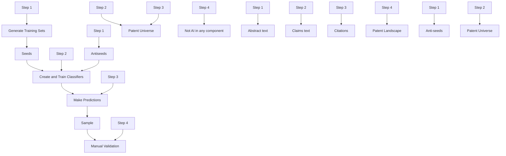

# Identifying artificial intelligence (AI) invention: A novel AI patent dataset

Alexander V. Giczy, Data Scientist

Nicholas A. Pairolero, Economist

Andrew A. Toole, Chief Economist

USPTO Economic Working Paper No. 2021-2

August 2021

USPTO Economic Working Papers are preliminary research being shared in a timely manner with the public in order to stimulate discussion, scholarly debate, and critical comment. For more information about the USPTO’s Office of the Chief Economist, visit www.uspto.gov/economics.

The AIPD and working paper were updated on August 2, 2021 to fix a minor issue affecting the 2019 and 2020 (Phase 2) predictions.

# Identifying artificial intelligence (AI) invention: A novel AI patent dataset

August 2021

Alexander V. Giczy,a,b Nicholas A. Pairolero,a Andrew A. Toolea,c

aUnited States Patent and Trademark Office

bAddx Corporation

cCentre for European Economic Research (ZEW), Mannheim, Germany

ABSTRACT: Artificial Intelligence (AI) is an area of increasing scholarly and policy interest. To help researchers, policymakers, and the public, this paper describes a novel dataset identifying AI in over 13.2 million patents and pre-grant publications (PGPubs). The dataset, called the Artificial Intelligence Patent Dataset (AIPD), was constructed using machine learning models for each of eight AI component technologies covering areas such as natural language processing, AI hardware, and machine learning. The AIPD contains two data files, one identifying the patents and PGPubs predicted to contain AI and a second file containing the patent documents used to train the machine learning classification models. We also present several evaluation metrics based on manual review by patent examiners with focused expertise in AI, and show that our machine learning approach achieves state-of-the-art performance across existing alternatives in the literature. We believe releasing this dataset will strengthen policy formulation, encourage additional empirical work, and provide researchers with a common base for building empirical knowledge on the determinants and impacts of AI invention.

JEL: O31, O34, C45, L86

Keywords: patent, patent landscape, artificial intelligence, AI, machine learning, patent dataset

ACKNOWLEDGEMENTS: We would like to thank James Forman for implementing the Phase 1 data construction, the machine learning code, and analysis. We also thank Christyann Pulliam, Matthew Such, Kakali Chaki, David Orange, Anne Thomas Homescu, Jesse Frumkin, Ying Yu Chen, Vincent Gonzalez, Christian Hannon, Steve Melnick, Eric Nilsson, and Ben Rifkin for their contributions to this project as members of the USPTO AI patent landscaping team. We would also like to thank Sandy Phetsaenngam, Robert Kimble, and Mark Finlayson.

# Introduction

Artificial intelligence (AI) has progressed rapidly in recent years, generating considerable interest among academic researchers and policymakers. By diffusing broadly across a variety of technologies, products, and services, AI may represent the next “general-purpose” technology like electricity or the semi-conductor, and create a disproportionately large impact on economic growth and standards of living (Bresnahan and Trajtenberg 1995; Crafts 2004; Crafts and Mills 2004; Rosenberg and Trajtenberg 2004; Jovanovic and Rousseau 2005; Kim 2005; Basu and Fernald 2007; Atack et al. 2008; Toole et al. 2020b).

Surprisingly, and despite the far-reaching economic potential of AI, empirical evidence on the determinants and impacts of AI inventions is still limited (Raj and Seamans 2018; Felten et al. 2021). One reason is a paucity of publicly available data. In areas where researchers have made progress, the underlying data supporting any findings are generally not available. In contrast, when data are available, multiple perspectives and approaches can be used by a broad swath of researchers and research findings can be replicated and validated. In this way, publicly available datasets are important for advancing the frontiers of knowledge and supporting evidence-based policy.

To assist researchers and policymakers, we are publicly releasing two data files, collectively called the Artificial Intelligence Patent Dataset (AIPD) (https://www.uspto.gov/ippolicy/economic-research/research-datasets/artificial-intelligence-patent-dataset). The first data file identifies United States (U.S.) patents issued between 1976 and 2020 and pre-grant publications (PGPubs) published through 2020 that contain one or more of several AI technology components (including machine learning, natural language processing, computer vision, speech, knowledge processing, AI hardware, evolutionary computation, and planning and control). We generated this data file using a machine learning (ML) approach that analyzed patent text and citations to identify AI in U.S. patent documents (Abood and Feltenberger 2018; Toole et al. 2020b). Our approach is based on the methodology of Abood and Feltenberger (2018), but we added an analysis of patent claims to better identify AI contained in the technical and legal scope of the invention. The second data file contains the patent documents used to train the ML models.

To evaluate our approach, we assessed the predictions made by our algorithm against annotations made by several U.S. Patent and Trademark Office (USPTO) patent examiners with expertise in AI. Our evaluation revealed several insights. First, our ML approach achieves superior performance relative to a variety of benchmarks from the academic and policy literatures. Second, identifying AI in patent documents is challenging, even for humans skilled in AI. Both

machines and humans struggled with classification at the boundaries of the various AI component technologies, despite our best efforts to concisely define each technology component. Third, the performance of our ML classifier varies by component technology. Some areas like evolutionary computation, knowledge processing, and planning and control have lower performance statistics than others. For evolutionary computation, for example, our true positive set may have been too small to effectively train an ML classifier that could match the performance of the other technology components. We provide AI predictions for each AI technology component so researchers considering these differences may define AI accordingly.

As the first publicly available dataset on a broad set of AI patent documents, we hope the AIPD will encourage additional empirical work and provide researchers and policymakers with a common foundation for building empirical knowledge on the determinants and impacts of AI invention. The remainder of the paper is organized as follows. The next section provides a brief literature review which is followed by a description of the methodology used to create the data files. Next, we evaluate the quality of the training and prediction data files using several diagnostic methods, including comparisons of our results to annotations by patent examiners who specialize in AI. The final substantive section discusses the structure of the AIPD for users and this is followed by concluding remarks.

# Literature Review

The development and release of the AIPD advances two strands of literature. The first strand is methodological. State-of-the-art approaches use ML methods to identify specific technologies within patent documents (called patent landscaping). Traditional approaches to patent landscaping have relied on sophisticated patent classification and keyword searches (see Trippe (2015) for a detailed survey on this approach). Toole et al. (2020a) describes the benefits of using ML for patent landscaping over traditional methods. Abood and Feltenberger (2018) were the first to use ML and natural language processing for patent landscaping. Their approach relies on identifying a set of patent documents known to be in the technology of interest (called the seed set), and then develops an expansion methodology to identify patent documents far from the true positive set that are unlikely to be in that technology (called the anti-seed set). Next, they train a variety of ML models on the seed and anti-seed sets, select the model with the optimal fit, and use that model to predict on the rest of the patent corpus. Choi et al. (2019) and Alderucci et al. (2020) develop methods similar to Abood and Feltenberger (2018), but they modify the methods used to create the training data as well as the underlying structure of the prediction algorithm.

The critical aspect of these approaches is curating the training data. Ideally, the training data accomplishes two things. First, it fully captures the technology of interest by accurately separating patent documents in the target technology from patent documents outside the technology. Second, and relatedly, it successfully classifies the documents that are challenging to identify on the boundaries (called “edge cases”).

After building AI models for patent landscaping, evaluation is necessary for benchmarking performance across alternatives. Harris et al. (2020) describes important considerations for creating evaluation datasets called “gold-standards.” Unfortunately, due to the costs involved with creating gold standards, very few evaluation datasets are publicly available. The AIPD does not contain a gold-standard data file for overall AI or its component technologies.

The second strand of literature focuses on the determinants and impacts of AI invention. Several studies use traditional query-based approaches as applied to either multiple intellectual property jurisdictions (Fujii and Managi 2018; Cockburn et al. 2019; China Institute for Science and Technology Policy (CISTP) 2018; WIPO 2019; UKIPO 2019; and OECD 2020) or specific jurisdictions, including the USPTO (Webb et al. 2018; Furman and Seamans 2019; Toole et al. 2020b; Alderucci et al. 2020), the Canadian Intellectual Property Office (CIPO 2020), the European Patent Office (EPO 2017; Benassi et al. 2019), IP Australia (2020), and the Japan Patent Office (JPO 2019). Each study uses its own methodology to identify AI patents and none of these studies have released the underlying data publicly. All studies use traditional patent landscaping methods, except for Alderucci et al. (2020) and Toole et al. (2020b), which use ML methods to identify AI patents.1

This literature has argued that AI invention has the potential to be truly transformative for at least two reasons. First, AI is broadly applicable to product and process innovations across technologies and industries. Second, AI may itself be used as a method of invention (Cockburn et al. 2019). For example, sophisticated AI models are used to isolate aspects of DNA that are relevant for disease. From this literature, it is clear that AI invention is growing rapidly and diffusing broadly. From 2002 to 2018, the share of USPTO patent applications that contained AI increased from 9 percent to around 16% (Toole et al. 2020b). This growth was not limited to a few companies or industries. Analyzing the extensive margin across firms, Toole et al. (2020b) finds that in 2018, around 25 percent of all USPTO assignees patented in AI technologies.

Relative to the 1970-89 period, in 2000-2015 AI assignees tended to be entrants, suggesting an acceleration in the growth of new companies with AI technology (Webb et al. 2018).

Despite evidence on the extensive growth and diffusion of AI invention, there is little empirical work about its impacts on economic outcomes, such as innovation or firm-level productivity. The primary issue is that detailed firm-level data on the development and adoption of AI innovation is not readily available (Raj et al. 2018). A few recent studies have started to bridge this gap (Alderucci et al. 2020; Babina et al. 2020). Babina et al. (2020) find that firms investing in AI are more likely to be larger and have higher sales, markups, and cash reserves. Further, these firms have faster sales and employment growth than firms that are not investing in AI (Babina et al. 2020). Similarly, by combining AI patent data with U.S. Census microdata at the firm level, Alderucci et al. (2020) finds that employment growth is 25 percent higher and revenue growth is 40 percent higher for firms with patented AI inventions. Although these studies suggest a positive relationship between AI investment and invention on one hand, and faster growth on the other, more research is needed to ensure that the relationship is causal – that AI is the reason for the observed improvements. A promising area of further research is to disentangle the decision to invest in AI from other time varying unobserved features of firms and industries that also effect outcomes.

There is evidence that technology firms are increasingly recruiting AI researchers, which may offset the findings in recent research that companies are moving away from basic science (Arora et al. 2018; Arora et al. 2020; Hartmann and Henkel 2020). It may be that the locus of research opportunities in AI is moving away from universities toward companies based on their ability to collect large data repositories that are essential for modern AI research. It remains unclear what implications the movement of AI researchers into the private sector may have on AI research or the broader innovation ecosystem. Will it increase the rate of AI invention and innovation at the expense of basic AI research? Or might the movement of AI researchers to technology firms slow the development of fundamental AI methods relative to applications?

A final area of increasing policy interest is the impact of recent Supreme Court jurisprudence on the patent eligibility of AI technologies.2 A series of Supreme Court decisions, starting in 2010 with Bilski v. Kappos3, have dramatically altered the types of inventions that are eligible for patent protection. These decisions generally reduced the patent eligibility of inventions that contain abstract ideas, laws of natures and products of nature (USPTO 2017;

Aboy et al. 2019; Kesan and Wang 2020; Chien et al. 2020; Toole and Pairolero 2020). However, it is currently unclear how these decisions have affected innovation in AI technologies. Since patents play a number of important roles in economic activity (Spulber 2015), understanding these impacts is an important area of future study.

# Definition of AI

We created the Artificial Intelligence Patent Dataset using an ML methodology to identify AI patent documents. The first step of our approach was defining AI. Rather than providing a single definition, we used eight AI component technologies: knowledge processing, speech, AI hardware, evolutionary computation, natural language processing, machine learning, computer vision, and planning/control. 4 The Artificial Intelligence Patent Dataset identifies patent documents containing each AI component technology. Notably, there may be some overlap in the components. For example, an invention in natural language processing may rely on an underlying machine learning method. We define the AI technology components in the following way.

# Knowledge processing

The field of knowledge processing contains methods to represent facts about the world and to derive new facts (or knowledge) from a knowledge base. For example, expert systems generally contain a knowledge base and an inference method to obtain new facts from that knowledge base.

# Speech

Speech recognition includes methods to understand a sequence of words given an acoustic signal. For example, the noisy channel model is a statistical approach used to identify the most likely sequence of words given verbal input using Bayes’ rule (Russell et al. 2009).

# AI hardware

The field of AI hardware includes physical hardware designed to implement artificial intelligence software. For example, Google designed the Tensor Processing Unit (TPU) to run neural network algorithms more efficiently. AI hardware may include logic circuitry, memory, video, processors, and solid-state technologies. It may also include embedded software that implements other AI component technologies, such as machine learning algorithms.

# Evolutionary computation

Evolutionary computation contains a set of computational methods utilizing aspects of nature and, specifically, evolution (Russell et al. 2009). For example, genetic algorithms include methods for selecting algorithm variants through the selection of optimal random mutations by maximizing fitness.

# Natural language processing

Natural language processing contains methods for understanding and using data encoded in human natural language. For example, language models represent probability distributions of language expressions (Russell et al. 2009).

# Machine learning

The field of machine learning contains a broad class of computational learning models. For example, supervised learning classification models are algorithms that learn to classify observations based on pre-labeled training data. Machine learning includes, among other techniques, neural networks, fuzzy logic, adaptive systems, probabilistic networks, regression and intelligent searching.

# Computer vision

The field of computer vision contains methods to extract and understand information from visual input, including images and videos. For example, edge detection identifies the boundaries and borders contained in an image. Additional areas of computer vision include object recognition, manipulation (e.g., transformation, enhancement, or restoration), color processing, and conversion.

# Planning/control

The field of planning and control contains methods to identify and execute plans to achieve specified goals. Key aspects of planning include representing actions and states of the world, reasoning about the effects of actions, and efficiently searching over potential plans. Modern control theory includes methods to maximize objectives over time (Russell et al. 2009). For example, stochastic optimal control considers dynamic optimization in uncertain environments. Additionally, planning and control includes data systems for administration/management (e.g., managing an organization and its employees, including

inventory, workflow, forecasting, and time management), adaptive control systems, and models or simulators of systems.

# Algorithm used to identify AI in patent documents

For each AI component technology, we built an ML model to identify whether a patent document (PGPubs or patents) contains that AI component based on the document’s text and citations. For those unfamiliar with machine learning, but familiar with traditional econometric methods like logistic regression, we use a binary classification model that was estimated on a set of true and negative observations. Figure 1 summarizes our methodology. The ML process of Steps 1-3 mirror the automated patent landscaping approach described by Abood and Feltenberger (2018). From a body of patent documents, we constructed a seed set providing positive examples of AI and an anti-seed set providing negative examples (Step 1) to train a classification model (Step 2) which was then used to classify the documents of the “patent universe” (Step 3). As seen in Figure 1, we used the text of patent document abstracts and claims, in addition to patent citations for the model. We created eight models, one for each AI technology component. We also added a manual validation step (Step 4) that evaluated a random sample of model predictions against assessments made by experienced USPTO patent examiners. The validation allowed us to assess the performance of our methodology.

Figure 1: AI patent landscape methodology overview   


<details>
<summary>flowchart</summary>


</details>

# Input data construction

We constructed the input data in two phases. The Phase 1 data consisted of 11,723,981 individual patent documents published between January 1976 and February 2019. This data was used to train the ML models. Phase 2 updated the set of documents to those published through December 2020, adding 1,520,056 patent documents not previous analyzed in Phase 1. 5 We used the trained ML algorithms to predict on all documents in the Phase 1 and 2 input datasets. The predictions for the Phase 2 data were created using the same methodology, embedding, and trained classifier models that were used in Phase 1 (minor differences are discussed below and summarized in Appendix A). The Phase 1 and 2 input datasets comprised patent document text and citations, as well as other bibliographic data, such as application numbers and patent classifications.

The primary input to the ML models was text from patent document abstracts and claims. The abstract provides a short summary of the invention and indicates what is new to the art.6 The claims “particularly point out and distinctly claim the subject matter which the inventor or joint inventor regards as his or her invention”7 and thus establish the technical and legal bounds of the patent document. Abood and Feltenberger’s (2018) implementation used only abstract text. We included claims text to identify AI in the precise technical and legal scope of the invention. We used the patent document text publically available through the USPTO Bulk Data Storage System (BDSS).8 For patents, we used the Patent Grant Full Text Data (PatFT), which starts in January 1976. For PGPubs, we used the Application Full Text Data (AppFT), which starts on March 15, 2001. 9 For Phase 1, we also used the Google Patents Public Datasets as part of Google Big Query 10 for abstract text. 11

ML processes typically standardize text to increase performance, a step called preprocessing. We pre-processed both claims and abstract text. This pre-processing included lowercasing text; removing starting numbers, symbols, and formulas; cleaning special characters, and removing extra spaces. Additionally, we removed parenthetical text since, for example, numerals that reference items in figures are placed in parentheses, and the status of claims in PGPubs may be within parentheses at the beginning of the claim. We also removed cancelled claims.12 Finally, we concatenated all the claims of a patent document into a single string of text and similarly concatenated the sentences of the abstract into a single text string.

ML algorithms also require the translation of text into a numeric format that is understandable by a computer (i.e. text encoding or embedding). “Word2vec” is an embedding algorithm that maps each word to a vector in the context of neighboring words (Mikolov et al. 2013). Following pre-processing, we used word2vec to separately encode the text of the abstracts and claims, resulting in each word being represented by a 300-dimension vector.13

In addition to text from patent document abstracts and claims, our ML algorithm also used patent citations: both backward citations (i.e., the references a given patent document cites) and forward citations (i.e., the documents citing a given patent document). We used only citations to granted U.S. patents and to U.S. PGPubs. Our source for citations listed on granted patents was PatentsView (www.patentsview.org). There are no citations listed on PGPubs, and thus backward citation data is not directly available. We overcame this limitation in two ways. First, there were no issues for forward citations: if a PGPub was cited by a document, then that document was recorded as a forward citation of that PGPub. Second, we used the common patent application number of a PGPub and its patent to derive a consolidated list of citations for both (in essence copying the citations from a patent to its corresponding PGPub and vice versa). However, if a PGPub was neither cited nor granted as a patent (i.e., the application was abandoned or is still under review) then the PGPub did not have any citations recorded in our data.

Similar to text, we needed to encode the citations in a machine-readable format. As in Abood and Feltenberger (2018), we used one-hot encoding. Each citation was assigned a position in a vector, and for each patent document one-hot encoding created a citation vector having the value of “1” in the positions corresponding to its citations (and “0” otherwise). To simplify the ML algorithm, we limited the size of the vector to 50,000 unique citations. Since a patent document may have only a handful of citations, the citation vectors were very sparse.

Finally, we needed additional patent document data to execute our methodology. Specifically, we required a patent “application-PGPub-patent” crosswalk to create citations (as described above), and patent families and classifications to select the set of patent documents that do not contain AI (described below). For the application-PGPub-patent crosswalk and USPTO patent families we used internal USPTO data called the Patent Application Location and Monitoring System (PALM). The public Patent Application Information Retrieval (PAIR) system contains all the records that are available in PALM that are from public applications, and therefore our PALM data is publicly available via the USPTO Office of the Chief Economist Patent Examination Research Dataset (Graham et al. 2018). 14 For patent classifications, we used the USPTO Bulk Data Storage System (BDSS) Master Classification File (MCF).15 The MCF contains two files, one for PGPubs and one for granted patents, and lists the classification codes of each document per the Cooperative Patent Classification (CPC) system. Each patent document may have several CPC codes, and we used all code types (i.e., CPC First, Inventive, and Additional). We also used the CPC codes as found on printed patent documents (i.e., at the main group or sub-group hierarchical level).16

# Patent landscape methodology

This section lays out the methodology used to create the AI patent landscape, moving through each of the steps in Figure 1 above: generating the training set, creating and training the classifiers, and making patent document predictions for each AI component technology.

# Generate training sets (step 1)

Supervised ML classification models require a set of seed and anti-seed examples to train the algorithms. We started by generating a narrow seed set, then expanded the seed set using USPTO patent family 17 citations and classification codes (called Level 1 and 2, or L1 and L2, expansions), and finally selected the anti-seed set from the remaining patent documents outside the seed, L1, and L2 document groups. L1 and L2 were less likely to be related to the topic of interest (L2 less likely than L1), and excluding both from the anti-seed set increased the chance that the negative examples were not related to the topic of interest (Abood and Feltenberger 2018).

We generated eight individual seed sets, one for each AI technology component. The seed sets were created using the USPTO [Patent] Examiner Automated Search Tool (EAST)18 to query USPTO patent search datasets and the Clarivate Derwent World Patent Index™19 for patent documents in classifications relevant to the target AI technology component. In general, the seed set documents were at the intersection of the CPC system, the International Patent Classification (IPC) system, the U.S. Patent Classification (USPC) system, and Derwent’s patent index. Intersecting these four groups increased the likelihood that the resulting patent documents represented the AI technology component since all classifications agreed that the documents were AI. Appendix B provides the specific queries used for each seed set.

We then performed the L1 and L2 expansions for each seed set (see Abood and Feltenberger (2018) for the pseudo-code). For L1, we first determined the USPTO family members of each of the patent documents in the seed set, then found the backward and forward citations of those family members, and finally determined the family members of those citations (“family-citation-family expansion”). Second, we calculated the patent document shares for each CPC code comprising the seed set documents (i.e., for each CPC code, the number of seed set documents classified in that CPC code divided by the number of seed set documents). For each CPC code that was 50 times the corresponding share in the full patent document data file (i.e., for each CPC code, the number of documents classified in that CPC code divided by the number of documents), we identified the patent documents within that CPC code (“CPC code expansion”). The L1 expansion comprised all the patent documents in the family-citation-family expansion or the CPC code expansion. For L2, we identified the forward and backward citations of each of the L1 patent documents and their family members. The L2 expansion comprised all the citation and family member patent documents of L1.

The anti-seed set for an AI technology component was a random sample from the patent documents that were not in the seed set, L1 expansion, or the L2 expansion for that component. We selected 15,000 patents documents to be the size for each AI component anti-seed set.

Figure 2 illustrates the results for the ML component. Table 1 presents results for all AI components. 20   
Figure 2: Seed, L1, L2, and anti-seed generation for the ML component   
LEARNING   


<details>
<summary>bar_stacked</summary>

| Category         | Value       |
| ---------------- | ----------- |
| Anti-seed        | 15,000      |
| L2 Expansion     | 470,598     |
| L1 Expansion     | 61,079      |
| Seed             | 959         |
| Remaining        | 11,176,348  |
</details>

# U.S. Patent Documents

11,723,984 patent documents total

Table 1: Number of patent documents in each group by AI component 

<table><tr><td>AI Component</td><td>Seed</td><td>L1 Expansion</td><td>L2 Expansion</td><td>Anti-seed</td><td>Remaining</td><td>Total</td></tr><tr><td>Machine learning</td><td>959</td><td>61,079</td><td>470,598</td><td>15,000</td><td>11,176,348</td><td>11,723,984</td></tr><tr><td>Evolutionary computation</td><td>82</td><td>59,316</td><td>349,570</td><td>15,000</td><td>11,300,016</td><td>11,723,984</td></tr><tr><td>Natural language processing</td><td>1,084</td><td>82,762</td><td>396,564</td><td>15,000</td><td>11,228,574</td><td>11,723,984</td></tr><tr><td>Speech</td><td>763</td><td>92,346</td><td>427,397</td><td>15,000</td><td>11,188,478</td><td>11,723,984</td></tr><tr><td>Vision</td><td>803</td><td>166,434</td><td>629,961</td><td>15,000</td><td>10,911,786</td><td>11,723,984</td></tr><tr><td>Knowledge processing</td><td>661</td><td>89,419</td><td>518,719</td><td>15,000</td><td>11,100,185</td><td>11,723,984</td></tr><tr><td>Planning/control</td><td>1,451</td><td>179,753</td><td>799,828</td><td>15,000</td><td>10,727,952</td><td>11,723,984</td></tr><tr><td>AI hardware</td><td>2,659</td><td>117,056</td><td>838,484</td><td>15,000</td><td>10,750,785</td><td>11,723,984</td></tr></table>

Table 1 shows that there are approximately 1,000 documents for each seed set (ranging from a low of 82 for evolutionary computation to a high of 2,659 for AI hardware). The seed and anti-seed are presumed to be “gold standards” for positive and negative patent documents, respectively. The other patents documents—those in the L1, L2 and remaining groups—are unknowns. In the next step, we created and trained ML models to classify the unknowns.

# Create and train classifiers (step 2)

We used the seed and anti-seed sets to train eight ML models, one model for each AI component. The model architectures consisted of long short-term memory (LSTM) neural networks. To capture contextual information in the abstract and claims we encoded this text using word2vec, one set of embeddings for abstracts and a second for claims, trained on the abstracts and claims, respectively, from the entire Phase 1 patent document data. 21

Figure 3 provides an overview of the model architecture. Each word of the abstract text and the claims text of a patent document was translated into its 300-dimension word2vec embedded vector and input into a separate LSTM neural network. Use of two networks allowed the model to consider abstract and claims text independently from the other. As these neural networks processed each word they passed a 64-dimension vector (hidden state) from the output of one word to the input of the next word—this internal structure allowed the LSTM networks to consider the sequence of words in the abstract and claims (Krohn et al. 2020). Simultaneously, the forward and backward citations of the patent document were one-hot encoded and input into two dense neural network layers. The outputs of the abstract LSTM network, claims LSTM network, and citation dense network were concatenated into a 664- dimension vector that was input into a 64-neuron dense neural network. The output of this dense layer was finally input into a single neural network layer having a sigmoid activation function. This function produced a number between 0.0 and 1.0, which is interpreted as the probability that the patent document does not belong in that AI technology component. For ease of interpretation, we transformed the prediction so that it indicates the probability of being AI (i.e. 1.0 – predicted probability from the model). To implement the models we used code posted by Abood and Feltenberger on GitHub,22 modifying it to also include claims text.

Figure 3: Overview of the classification model architecture   


<details>
<summary>flowchart</summary>

```mermaid
graph TD
    A["Abstract text"] --> B["word2vec embedding"]
    B --> C["LSTM network"]
    C --> D["Dense NN layer (300-dim output)"]
    D --> E["Concatenate (664-dim output)"]
    E --> F["Dense NN layer (64-dim output)"]
    F --> G["Dense NN layer (1-dim output)"]
    G --> H["P(not in AI category)\n50% classification threshold"]
    
    I["Claims text"] --> J["word2vec embedding"]
    J --> K["LSTM network"]
    K --> L["Dense NN layer (300-dim output)"]
    L --> M["Concatenate"]
    M --> N["Dense NN layer (64-dim output)"]
    N --> O["Dense NN layer (1-dim output)"]
    
    P["Backward/forward citations"] --> Q["one-hot encoding"]
    Q --> R["Dense NN layer (256-dim output)"]
    R --> S["Dense NN layer (64-dim output)"]
    
    style A fill:#f9f,stroke:#333
    style I fill:#f9f,stroke:#333
    style P fill:#f9f,stroke:#333
    
    note right of C: hidden cell state = 64
    note left of L: dropout = 40% batchnorm ELU activation
    note right of Sigmoid activation
    note right of Q: dropout = 40% batchnorm ELU activation
    note right of R: dropout = 40% batchnorm ELU activation
```
</details>

Notes: dim = dimension; NN = neural network; LSTM = long short-term memory; ELU = exponential linear unit. For simplicity, details of the abstract text and claims text LSTM networks and dense NN layers are listed once between the applicable branches.

# Make predictions (step 3)

After training, the models were used to predict whether each document contained the AI component technologies. Each model produced a number between 0 and 1 (or 0% to 100%), interpreted (after the aforementioned transformation) as the probability of being in that particular AI component technology. We used a 50% threshold to determine whether a given patent document was in the AI component—those equal to or above the threshold were in the technology, and those below were not. Additionally, we consolidated the results from the eight models such that if one model predicted AI in a component technology, then we labeled the patent document as having “any AI.”

After initially training the models and predicting on patent documents published through early 2019 (Phase 1), we updated the predictions for patent documents published through 2020 (Phase 2). For Phase 2 we used the same ML models used for the Phase 1 predictions through early 2019; that is, we did not retrain the models.23 We also used the same abstract and claims text preprocessing and text representations (i.e., word2vec embeddings). Minor differences in the Phase 1 and Phase 2 analyses are noted in Appendix A.

# Model Evaluation

To evaluate our ML patent landscape process, we compared the predictions from our algorithm to decisions made by several patent examiners specialized in AI. Our evaluation sample was drawn randomly from all patent documents published through early 2019 (the Phase 1 data) in the seed set, anti-seed set, and the combined L1, L2, and remaining sets of patent documents. Sampling from the seed and the anti-seed allowed us to evaluate the quality of the training data. However, to characterize predictive performance we used only the sample from the combined L1, L2, and remaining sets (i.e., the patent documents not used to train the model). Importantly, we updated the predictions for all Phase 2 documents published through 2020 after we drew the evaluation sample, so our evaluation discussed in this section is only relevant for the original Phase 1 population of patent documents published through early 2019.

Manual validation is labor-intensive, and due to resource limitations, we selected patent documents at a “consolidated group” level to assess the patent landscaping process as a whole, as opposed to the performance of the individual classification models for each AI technology component. If a patent document was used in the seed set for any classification model, then it was placed in the consolidated seed group; if used in any L1 expansion, then it was placed in the consolidated L1 group; and so on for L2 and anti-seed. We then randomly selected 216 documents each from the consolidated seed and anti-seed sets, and 368 documents from the combined L1, L2, and remaining groups.

Four patent examiners experienced in AI annotated the patent documents in the random sample for each AI technology component. Two examiners annotated each patent document and each of the four patent examiners reviewed 400 documents. The patent documents in each consolidated group (seed; anti-seed; and L1, L2, and remaining) were allocated approximately evenly among each of the six pairs of patent examiners.24 In the same manner as the model predictions, we integrated the eight AI technology component annotations into a single “any AI” annotation. If the resulting “any AI” conclusion of the two patent examiner annotators disagreed, then the difference was resolved by a fifth adjudicating patent examiner (not involved with the annotations). Adjudication was performed for the overall “any AI” conclusion and not for individual AI technology components.

# AI prediction discrimination analysis

We first used the examiner annotations to analyze the appropriateness of using 50 percent as the prediction threshold for identifying AI in a given patent document. Figure 4 is a threshold plot comparing precision, recall, and the F1 score based on different “any AI” discrimination thresholds over our manual validation sample of patent documents.25 “Precision” is the number of true positives divided by the number of predicted positives, or, the fraction of patent documents classified as AI that are actually AI. “Recall” is the number of true positives divided by the number of actual positives, or the fraction of true AI patent documents that are classified as AI by the algorithm. The “F1 score” is a combination of precision and recall metrics using the harmonic mean.

Figure 4 shows that as the threshold increases, precision increases and recall decreases. This behavior is expected since as the threshold increases, fewer documents are classified as AI, resulting in fewer documents classified as AI that are not actually AI (higher precision), and fewer documents that are AI correctly classified as AI (lower recall). The F1 score is an inverted Ushaped curve. Precision and recall intersect at about a 0.35 threshold, but the curves are relatively flat from between 0.30 through approximately 0.55. While this analysis does not identify a specific discrimination threshold, it does allow us to conclude that 0.50 is reasonable, adequately balancing precision and recall. F1 could be slightly higher with a lower prediction threshold, but would have far higher recall than precision.

Figure 4: Discrimination threshold analysis   


<details>
<summary>line</summary>

| Discrimination threshold | F1    | Precision | Recall |
| ------------------------ | ----- | --------- | ------ |
| 0.0                      | 0.2   | 0.1       | 1.0    |
| 0.1                      | 0.48  | 0.38      | 0.65   |
| 0.2                      | 0.45  | 0.4       | 0.55   |
| 0.3                      | 0.42  | 0.41      | 0.45   |
| 0.4                      | 0.4   | 0.4       | 0.38   |
| 0.5                      | 0.39  | 0.4       | 0.37   |
| 0.6                      | 0.39  | 0.42      | 0.36   |
| 0.7                      | 0.39  | 0.45      | 0.35   |
| 0.8                      | 0.38  | 0.48      | 0.32   |
| 0.9                      | 0.32  | 0.45      | 0.25   |
| 1.0                      | 0.3   | 0.47      | 0.22   |
</details>

Note: Analysis based on patent examiner annotations, with adjudication, of the combined L1, L2, and remaining set and the highest p(AI) prediction of the AI component classification models for the patent documents in this set. The vertical dotted line identifies the 50% threshold used in the analysis.

In addition to exploring the impact of varying the discrimination threshold, we also plotted the predictions for each AI technology component to see how well the component models were able to distinguish patent documents in the component from those not in the component. A large density of predictions near 0.50 would indicate that the model was having a difficult time discriminating the documents in the AI component from those not in the component.

Figure 5 provides the prediction densities for each AI component. In each sub-figure, the red histogram plots the distribution of predictions for patent documents that were predicted not to be in the AI component (i.e. those with predictions less than 0.50), and the green histogram plots the predictions for those predicted to be in the AI component. From the figure, the probability distribution for “not AI” (red histogram) spikes close to 0.0 for all models. For the probability distribution for “AI” (green histogram), all models except for evolutionary computation spike near 1.0. These spikes at 1.0 and 0.0 indicate that most of the models were highly certain about their predictions. Regarding evolutionary computation, the density is relatively flat, with most of the positive predictions being close to 0.50, indicating uncertainty about its predictions. This result may reflect the relatively small number of true positives in the seed set for evolutionary computation.

Figure 5: Distribution of the model predictions for AI and not AI   
  
Note: Each sub-graph plots two separate distributions, one for documents predicted to be the AI component (green) and one for documents predicted not to be in the AI component (red). The plot includes only the Phase 1 predictions for consistency with the discussion in the remainder of this section.

# Analysis of annotator agreement

We next assessed how well the patent examiner annotators agreed with each other. This assessment provides some information about how challenging it is to identify AI in patent documents. We also used patent examiner agreements and disagreements to benchmark the performance of our algorithm relative to human assessment.

We first compared whether the pairs of patent examiners reviewing a single document agreed or disagreed using a confusion matrix. The confusion matrix gives four numbers for annotators A and B: the number of times (1) annotator A and B agreed the document was AI, (2) annotator A and B agreed the document was not AI, (3) annotator A thought the document was AI but annotator B thought the document was not AI and (4), annotator A thought the document was not AI and annotator B thought the document was AI. Since we used four annotator examiners, there were six pairs of examiners that reviewed the documents (all combinations of size 2 for the four examiner annotators). Without loss of generality, we arbitrarily assigned one of the examiners in each pair as A, and one of the examiners as B in order to aggregate the results.

Table 2 provides the confusion matrices and the number of documents reviewed for the seed; anti-seed; and L1, L2, and remaining sets. The table suggests that identifying AI in patent documents is very challenging, even for humans skilled in the technology. For example, in the L1, L2, and remaining column, the two examiners disagreed on 84 documents (41 plus 43) out of 368, or 22 percent of the time. They disagreed less on the seed and anti-seed sets at 9.72 percent and 17.13 percent, respectively. Although we provided the examiners detailed instructions with our definition of AI, there was still significant disagreement. Identifying AI in patent documents is simply a hard task.

Table 2: Confusion matrix and metrics for Annotator A vs. Annotator B 

<table><tr><td>Confusion Matrixes</td><td colspan="2">Seed</td><td colspan="2">Anti-seed</td><td colspan="2">L1, L2, and remaining</td></tr><tr><td></td><td>B: any AI</td><td>B: not AI</td><td>B: any AI</td><td>B: not AI</td><td>B: any AI</td><td>B: not AI</td></tr><tr><td>A: any AI</td><td>185</td><td>7</td><td>14</td><td>26</td><td>31</td><td>43</td></tr><tr><td>A: not AI</td><td>14</td><td>10</td><td>11</td><td>165</td><td>41</td><td>253</td></tr><tr><td colspan="7">Metrics</td></tr><tr><td># documents</td><td colspan="2">216</td><td colspan="2">216</td><td colspan="2">368</td></tr></table>

Note: Analysis compares the “any AI” annotation of patent examiner A (first examiner reviewing a document) to the annotation from patent examiner B (second examiner reviewing the same document).

To create a benchmark for our algorithm, we incorporated the adjudicating patent examiner: for each document having a disagreement, the adjudicator agreed with one of the reviewing patent examiners and disagreed with the other. Table 3 provides the new confusion matrices comparing the decisions by the annotators (rows) and adjudicator (columns). The row “A or B: any AI” provides all the documents that the annotator examiners indicated as containing some aspect of AI, even if they disagreed. The row “A or B: not AI” provides all the documents that the annotator examiners indicated as not containing any aspect of AI, even if they disagreed. The columns are the truth, as determined by the adjudicator if the annotator examiners disagreed. The number of documents is larger in Table 3 than in Table 2 since each disagreement between the annotators added an additional comparison: a comparison between the adjudication and the examiner that indicated the document contained AI, and the adjudication and the examiner that indicated the document did not contain AI.

Table 3 provides several metrics, including the number of documents, precision, recall, accuracy, and the F1 score. Precision is the percentage of the documents determined to be AI that were actually AI. In the L1, L2, and remaining group, there were 115 documents that the annotators determined had some aspect of AI, but only 40 that actually contained AI. This gives a precision value of 34.78 percent. Recall is the percentage of documents that were actually AI that the annotators determined were AI. There were 49 documents that were actually AI, and the examiners determined that 40 of these were AI. This produces a recall value of 81.63 percent. The F1 score is the harmonic mean of precision and recall and for the L1, L2, and remaining sample is 48.78 percent. These metrics provide further evidence that the task of identifying AI in patent documents is challenging, even for humans skilled in the technology. Although recall was high, precision was relatively low, resulting in an F1 score close to 50 percent.

Table 3: Confusion matrix and metrics for Annotators A and B with adjudication 

<table><tr><td>Confusion Matrixes</td><td colspan="2">Seed</td><td colspan="2">Anti-seed</td><td colspan="2">L1, L2, and remaining</td></tr><tr><td></td><td>Adj: any AI</td><td>Adj: not AI</td><td>Adj: any AI</td><td>Adj: not AI</td><td>Adj: any AI</td><td>Adj: not AI</td></tr><tr><td>A or B: any AI</td><td>199</td><td>7</td><td>16</td><td>35</td><td>40</td><td>75</td></tr><tr><td>A or B: not AI</td><td>14</td><td>17</td><td>2</td><td>200</td><td>9</td><td>328</td></tr><tr><td colspan="7">Metrics</td></tr><tr><td># documents</td><td colspan="2">237</td><td colspan="2">253</td><td colspan="2">452</td></tr><tr><td>Precision</td><td colspan="2">0.9660</td><td colspan="2">0.9901</td><td colspan="2">0.3478</td></tr><tr><td>Recall</td><td colspan="2">0.9343</td><td colspan="2">0.8511</td><td colspan="2">0.8163</td></tr><tr><td>Accuracy</td><td colspan="2">0.9114</td><td colspan="2">0.8538</td><td colspan="2">0.8142</td></tr><tr><td>F1 score</td><td colspan="2">0.9499</td><td colspan="2">0.9153</td><td colspan="2">0.4878</td></tr></table>

Note: Analysis compares the “any AI” annotation of patent examiner A (first examiner reviewing a document) to the annotation by patent examiner B (second examiner reviewing the same document) plus adjudication. The confusion matrix reflects the results of examiner A and B (rows) and the results of adjudication (columns, where “Adj” is shorthand for adjudicator in the column heading). If there is no disagreement between A and B, we assume the adjudicator would agree with A and B. If there is a disagreement, the adjudicator would agree with one of A or B and disagree with the other of B or A. Hence, the total number in each confusion matrix differs from Table 2. For the anti-seed set, the metrics are calculated such that “not AI” is the positive result. See discussion for metric definitions.

# Assessing the quality of the training data

Next, we used the examiner annotations to assess the quality of the data used to train our ML algorithms. As previously described, we performed a narrow search to identify seed set documents and used the L1 and L2 expansions to generate the anti-seed sets. The algorithm learned to detect each AI component technology from the set of documents containing the component (seed set) and the set of documents not containing the AI component (anti-seed set). Table 4 contains confusion matrices for both the aggregate seed set and anti-seed set, where the rows indicate whether the document was in the seed or anti-seed, and the columns indicate where the annotators (including adjudication) placed the document.

The results indicate that the seed and anti-seed generation process performed well. Accuracy was approximately 92% for both groups. As previously discussed, disagreements between patent examiners exist: considering adjudication, examiner accuracy is 91% for the seed set and 85% for the anti-seed set (seed and anti-seed columns in Table 3, above). The automated approach to generating the seed and anti-seed set and human annotations produced similar accuracy numbers. This suggests that the automated seed and anti-seed generation process were as good as a more labor-intensive process of human review.

Table 4: Confusion matrix and metrics for seed and anti-seed generation 

<table><tr><td>Confusion Matrixes</td><td colspan="2">Seed set generation</td><td colspan="2">Anti-seed set generation</td></tr><tr><td></td><td>Examiners: any AI</td><td>Examiners: not AI</td><td>Examiners: any AI</td><td>Examiners: not AI</td></tr><tr><td>AI (seed)</td><td>199</td><td>17</td><td>0</td><td>0</td></tr><tr><td>Not AI (anti-seed)</td><td>0</td><td>0</td><td>16</td><td>200</td></tr><tr><td colspan="5">Metrics</td></tr><tr><td># documents</td><td colspan="2">216</td><td colspan="2">216</td></tr><tr><td>precision</td><td colspan="2">0.9213</td><td colspan="2">0.9259</td></tr><tr><td>recall</td><td colspan="2">1.0000</td><td colspan="2">1.0000</td></tr><tr><td>accuracy</td><td colspan="2">0.9213</td><td colspan="2">0.9259</td></tr><tr><td>f1 score</td><td colspan="2">0.9590</td><td colspan="2">0.9615</td></tr></table>

Note: Analysis compares patent examiner annotation and adjudication scoring, which is assumed to be “truth,” to the assumption that seed and anti-seed documents are all AI and all not-AI, respectively. Patent examiner annotation includes adjudication to resolve differences. For the anti-seed set, the metrics are calculated such that “not AI” is the positive result. See discussion for metric definitions.

# Evaluating the model predictions

Next, we compared the patent examiner annotations, including adjudication, with the AI predictions of our models on the L1, L2, and remaining set of documents. Restricting to this set was necessary to evaluate the overall performance of our algorithm since these documents were not used to train the classification models. Table 5 contains a confusion matrix with the rows indicating the model predictions and the columns indicating the truth, as determined by annotation and adjudication. Comparing the results of Table 5 to the human rater classifications from Table 3 (L1, L2, and remaining set columns in Table 3 above), we see that the model precision and accuracy is higher than the humans, but recall is much lower (0.3750 for the model vs. 0.8142 for the humans). That is, our algorithm is more accurate when identifying AI (higher precision), but does not accurately indicate AI as often as the humans. The model F1 score is also lower than the human F1 (0.3896 for the model vs. 0.4878), but is comparable overall.

Table 5: Confusion matrix and metrics for model predictions 

<table><tr><td>Confusion Matrix</td><td colspan="2">Model predictions (L1, L2, and remaining set)</td></tr><tr><td></td><td>Examiners: any AI</td><td>Examiners: not AI</td></tr><tr><td>Model: AI</td><td>15</td><td>22</td></tr><tr><td>Model: not AI</td><td>25</td><td>306</td></tr><tr><td colspan="3">Metrics</td></tr><tr><td># documents</td><td colspan="2">368</td></tr><tr><td>precision</td><td colspan="2">0.4054</td></tr><tr><td>recall</td><td colspan="2">0.3750</td></tr><tr><td>accuracy</td><td colspan="2">0.8723</td></tr><tr><td>f1 score</td><td colspan="2">0.3896</td></tr></table>

Note: Analysis compares patent examiner annotation and adjudication scoring, which is assumed to be “truth,” to USPTO model prediction results for “any AI.” Patent examiner annotation includes adjudication to resolve differences. For the anti-seed set, the metrics are calculated such that “not AI” is the positive result. See discussion for metric definitions.

We also used the manual validation to analyze the model results at the AI component technology level. For each component, we plotted the distribution of model predictions in three groups: (1) model predictions of patent documents in which both annotating patent examiners agreed were in the AI technology component, (2) model predictions of patent documents in which both annotating patent examiners agreed were not in the AI component, and (3) model predictions of patent documents in which the annotating patent examiners disagreed about the component. We expected model predictions for documents with examiner AI agreement to have a high predictive probability for that AI component, model predictions for documents with not AI agreement to have a low prediction probability, and model predictions for documents having disagreement to be somewhere in the middle.

Figure 6: Distribution of model predictions by examiner annotation results   


<details>
<summary>bar</summary>

| Category           | Both reviewers agree AI | Both reviewers agree not AI | Both reviewers disagree |
| ------------------ | ---------------------- | --------------------------- | ----------------------- |
| Machine learn      | 1.00                   | 0.00                        | 0.25                    |
| Evolve comp        | 0.00                   | 0.00                        | 0.00                    |
| NLP                | 1.00                   | 0.00                        | 0.95                    |
| Speech             | 0.75                   | 0.00                        | 1.00                    |
| Vision             | 0.95                   | 0.00                        | 0.95                    |
| Kowledg proc       | 0.00                   | 0.00                        | 1.00                    |
| Plan/ctrl          | 0.75                   | 0.00                        | 0.80                    |
| AI hardware        | 1.00                   | 0.05                        | 1.00                    |
</details>

Notes: Analysis includes only patent documents in the consolidated L1, L2, and remaining set. The box plots illustrate the following: the top and bottom sides of the box indicate the 25th and 75th percentiles, respectively, and the median is the “x” within the box; the whiskers indicate adjacent values; and solid circles outside the whiskers, if any, are outside values. The number of documents in each AI technology component and distribution group is listed below the AI component label, ordered as per the legend (i.e., both reviewers agree AI in the left number, both reviewers agree not AI in the middle number, and reviewers disagree in the right number).

Figure 6 provides the results. Since we did not randomly select the patent documents by individual AI technology components, the number of patent documents in each analysis varies, and in some instances is too small to draw conclusions (see “n\_docs” below each category for the number of documents). Immediately clear is that the model predictions are close to zero for the patent documents with agreement of not AI—the brown box plots are barely visible, and the medians are very close to 0.0. For the patent documents with agreement of AI (green box plots), the results are mixed: the prediction distribution for ML is high (median above 0.90), and high for knowledge processing and natural language processing (NLP) (although the number of documents is smaller). For planning/control, however, the median is close to zero but the distribution extends to a 75th percentile of around 0.70. For the remaining components in the “both reviewers agree AI” group, the number of documents is insufficient to draw strong conclusions.

Regarding the disagreement group (red box plots), the distribution of model predictions shows a lot of variation (i.e., large boxes) and the medians are close to zero, indicating the models favor predicting not AI over AI. The notable exceptions are for NLP, which has a median close to the middle (which would be expected for uncertain results), and knowledge processing, which has median close to 1.0 (which would favor predicting AI over not AI).

These results indicate that the planning/control component model may have a high false negative error rate (since most of the documents the annotators agreed were planning/control are predicted as being not in that component) and that the knowledge processing classification model may overly favor predicting AI. However, since annotating patent examiner disagreements far outnumber agreements for AI in these two components, these results may indicate that both humans and the classification model had a hard time identifying these categories.

# Comparison to other studies

As a final assessment, we compared our model results to the AI classifications from Cockburn et al. (2019) and from WIPO (2019), in addition to a naive classifier where all patent documents were predicted to be not AI. The AI query in Cockburn et al. (2019) consisted of USPC class 901 and 706 combined with a patent title keyword search (see Appendix C, Table C1, for query details), which we executed using the USPTO EAST patent search tool. Cockburn et al. (2019) limited the study to patents between 1990 and 2014, inclusive. We identified 15,004 patents versus the 13,615 identified in Cockburn et al. (2019) using their query. Since our analysis used a longer time period and included PGPubs, we expanded the query from Cockburn et al. (2019) to remove the time constraint and include both U.S. Patents and U.S. PGPubs. The result was 52,442 patent documents when including a patent and PGPub from the same patent application only once. Merging this result with the 800 randomly selected patent documents in our manual validation resulted in 57 patent documents that were “AI.” The remaining 743 documents (out of the 800 in our random sample) were set to “not AI” since they did not come up as AI using the query in Cockburn et al. (2019).

Similar to Cockburn et al. (2019), WIPO used a combination of patent classifications and keywords to identify AI in patent documents (WIPO 2019). We replicated their query using EAST, but excluded Japanese patent applications since our analysis was limited to U.S. patent documents. We also included U.S. PGPubs (see Appendix C, Table C2). The result was 294,470 patent documents. Merging this result with the 800 randomly selected patent documents in our manual validation resulted in 143 patent documents that were “AI”: 136 from the seed set, 1 from the anti-seed set, and 6 from the combined L1, L2, and remaining set. The remaining 657 documents were “not AI.”

We also created a naive classifier in which all 800 randomly selected patent documents were set to “not AI.” This case was useful for benchmarking accuracy measures across the different approaches.

Table 6: Confusion matrixes and metrics for other studies 

<table><tr><td>Confusion Matrixes</td><td colspan="2">Cockburn (recreated)</td><td colspan="2">WIPO (recreated)</td><td colspan="2">Naive (all not AI)</td></tr><tr><td></td><td>Examiners: any AI</td><td>Examines: not AI</td><td>Examiners: any AI</td><td>Examines: not AI</td><td>Examiners: any AI</td><td>Examines: not AI</td></tr><tr><td>Study: any AI</td><td>0</td><td>0</td><td>4</td><td>2</td><td>0</td><td>0</td></tr><tr><td>Study: not AI</td><td>40</td><td>328</td><td>36</td><td>326</td><td>40</td><td>328</td></tr><tr><td colspan="7">Metrics</td></tr><tr><td># documents</td><td colspan="2">368</td><td colspan="2">368</td><td colspan="2">368</td></tr><tr><td>Precision</td><td colspan="2">0.0000</td><td colspan="2">0.6667</td><td colspan="2">0.0000</td></tr><tr><td>Recall</td><td colspan="2">0.0000</td><td colspan="2">0.1000</td><td colspan="2">0.0000</td></tr><tr><td>Accuracy</td><td colspan="2">0.8913</td><td colspan="2">0.8967</td><td colspan="2">0.8913</td></tr><tr><td>F1 score</td><td colspan="2">0.0000</td><td colspan="2">0.1739</td><td colspan="2">0.0000</td></tr></table>

Note: Analysis compares patent examiner and adjudication annotation scoring, which is assumed to be “truth,” to other studies. Only patent documents corresponding to the consolidated L1, L2, and remaining set reviewed by the patent examiners, with adjudication, are included. Cockburn et al. (2019) and WIPO (2019) results are recreated. The naive results are based on the assumption that all patent documents are predicted as being “not AI.” See discussion for metric definitions.

The confusion matrices and metrics for each approach are presented in Table 6. We compared the approaches using the patent documents in the L1, L2, and remaining set since they were not used to train our models. We draw several conclusions from the table. First, naively predicting not AI for each document results in an accuracy of approximately 89 percent. All of the approaches achieve a similar accuracy, but accuracy is not very informative since simply predicting “not AI” for each document achieves this result. Precision and recall are much more informative in this situation since naively predicting not AI produces zero for both.

The approach used in Cockburn et al. (2019) does not identify any of the documents in our L1, L2, and remaining random sample as AI, and therefore achieves zero for both precision and recall. WIPO has higher precision than our approach, but far lower recall, resulting in a lower F1 score of 0.17 than our method, which achieves F1 of 0.39. This result implies that our model achieves a more favorable balance of precision and recall than WIPO. Importantly, the low recall achieved by WIPO may reflect their traditional query based approach—relying on keywords and classifications specified ex-ante results in a narrower patent landscape. The benefit of a machine learning classification approach is that after being trained, the algorithm analyzes the text and citations of all patent documents and identifies AI wherever it exists in the patent corpus (Toole et al. 2020a).

# Summary of model evaluation

Our evaluation revealed several important characteristics of the AI patent dataset. First, identifying AI in patent documents is challenging, even for humans skilled in AI. Second, our approach compared favorably to the ability of human raters to assess AI in patent documents, and far better than existing approaches in the literature. Third, our algorithm appeared to be better at identifying some AI component technologies than others. For example, the model was less able to accurately identify evolutionary computation, planning/control, and knowledge processing than the other components. These caveats will be important for researchers to consider when using the AIPD for their particular research question.

# Description of the AI patent dataset

Our data release consists of two data files, each file provided in a Stata .dta format and in a text .tsv.zip format. The first, named ai\_model\_predictions.dta

(ai\_model\_predictions.tsv.zip), includes AI prediction data for all patents and PGPubs classified by our models. The data file contains 13,244,037 patent documents: 6,920,965 are patents (of which 19,486 are reissue patents) and 6,323,072 are PGPubs. The publication dates of the documents are between 1976 and 2020.

The second data file, named ai\_model\_training\_doc\_seedgroups.dta (ai\_model\_training\_doc\_seedgroups.tsv.zip), lists the patent and PGPub documents we used to train our eight classification models. The data file includes the document number and the group in which it belongs for each model: seed set, anti-seed set, L1 expansion, or L2 expansion. The seed sets provide positive examples of AI patents for model training, and the anti-seed sets provide negative examples. The L1 and L2 expansions provide the basis to generate the antiseed sets. Since a document may not have a role in a given model (e.g., it is part of the seed set for another model), we identify it as “na” for that model. The dataset includes 2,224,278 documents: 1,430,041 patents (of which 3,597 are reissue patents) and 794,237 PGPubs. The number of seed set documents varies for each model, as do the resulting L1 and L2 expansions. As discussed above, the number of anti-seed set documents is fixed at 15,000 for each model.

The data files contain metadata to aid research. For example, the variable flag\_patent may be used to filter the documents and run analysis only on granted patents. The appl\_id variable may be used to conduct an application-level analysis and the flag\_train\_[component] variables may be used to filter out documents used to train the individual AI technology component models.

To assist researchers using the Artificial Intelligence Patent Dataset, we formatted the data files to be compatible with PatentsView. In both data files, each row is a patent document, and the variable doc\_id is the primary key or unique identifier. This variable is formatted26 to be compatible with the patent and PGPub numbers in PatentsView. Also consistent with PatentsView, both tsv versions of the data files are formatted as tab-separated (\t) files with strings delimited by double quotation marks (“) using the QUOTE\_NONNUMERIC convention.

A description of the variables in each of the data files follows in the next subsection. Appendixes D and E provide additional details of each file, such as summary tables of the variables and descriptive statistics. Appendix F provides several use cases that rely on merging the AI Patent Dataset with PatentsView data.

# Variables Included in the AI Prediction Data

# Document number

Each document has a unique identification number, captured by the variable doc\_id, which has a string data type. For utility patents, the number is seven or eight digits long. If the patent is a reissue patent, then the number begins with “RE” followed by several digits. The patent numbers do not include any leading zeros, either at the beginning of utility patent numbers or after the “RE” for reissue patents. For PGPubs, the number is 11 digits long: a fourdigit year (corresponding to the publication year of the PGPub) followed by seven numbers. In the data, the PGPub number does not include a forward slash between the year and numbers.

# Application number

Each patent application has an associated patent application number. An application may be published multiple times, e.g., as a PGPub and as a patent. An application may also include a corrected PGPub. Hence, the application number is not unique and if necessary may be used to combine all publications of a given application.27 The application number for utility patents is a 2-digit series code that includes a leading zero for series below 10, followed by a 6- digit serial number. In the data, the application number does not include a slash between the series code and serial number. The application number is contained in the variable appl\_id.

# Publication date

We capture the publication date of the document by the variable pub\_dt (for granted patents, this date is also known as the grant date or issue date). The date format is “YYYY-MM-DD,” where YYYY is the calendar year, MM is the numeric month (1-12), and DD is the numeric day of the month. This variable is a string data type.

# Patent flag

To easily distinguish between patents and PGPubs, we include a flag variable, flag\_patent, of data type integer that is equal to 1 for patents and 0 for PGPubs.

# Consolidated “any AI” variables

There are two variables that look across all AI technology component models: flag\_tng\_any and predict50\_any\_ai. Both of these are binary variables of data type integer. The first variable, flag\_tng\_any is equal to 1 if the document was used in training any of the eight technology component models, i.e., if it was in the seed or anti-seed sets of any model, and it is equal to 0 if not used for training in any model. The second variable, predict50\_any\_ai, takes a value of 1 if the document was predicted to be AI in any of the eight technology component models based on a 50% threshold and 0 if not predicted as AI in any of the models.

# Training flags

Since we employed multiple models and did not want the documents used in training to automatically default as AI or not AI, we generated predictions for all the training documents. We include a flag of data type integer whether the document was part of the seed or anti-seed set for each component technology model. The variables are flag\_train\_ml for machine learning, flag\_train\_evo for evolutionary computation, flag\_train\_nlp for natural language processing, flag\_train\_speech for speech, flag\_train\_vision for vision, flag\_train\_kr for knowledge processing, flag\_train\_planning for planning and control, and flag\_train\_hardware for AI hardware. The variable takes on a value of 1 if the document was in the seed or anti-seed sets for that model, and 0 if not.

# AI prediction score

Each AI technology component model generates a probability score between 0.0 and 1.0 as a prediction of whether the document belongs in the AI technology component. There are eight variables, one for each component technology, of data type float. The variables are ai\_score\_ml for machine learning, ai\_score\_evo for evolutionary computation, ai\_score\_nlp for natural language processing, ai\_score\_speech for speech, ai\_score\_vision for vision, ai\_score\_kr for knowledge processing, ai\_score\_planning for planning and control, and ai\_score\_hardware for AI hardware. In our code, the scores are data type float64. We do not round the data to any number of significant digits.

# AI prediction using a 50% threshold

For convenience, we also include a variable for each AI technology component that translates the probability score into a binary prediction based on a 50% threshold. If the score is greater than or equal to 0.50, then the document is predicted to be AI in that component technology. The variables are predict50\_ml for machine learning, predict50\_evo for evolutionary computation, predict50\_nlp for natural language processing, predict50\_speech for speech, predict50\_vision for vision, predict50\_kr for knowledge processing, predict50\_planning for planning and control, and predict50\_hardware for AI hardware. The variables take a value of 1 if the technology component model score predicts AI in that component based on a 50% threshold, and 0 if the model score does not.

# Analysis phase

The final variable identifies whether we created the data under the Phase 1 analysis or the updated Phase 2 analysis. As described above, Phase 1 includes patent documents to train the models and predictions for patent documents through early 2019. Phase 2 includes predictions for additional patent documents through 2020 (primarily 2019 and 2020).The analysis\_phase variable is of data type integer and takes a value of 1 if the predictions were generated under Phase 1 and a value of 2 if the predictions were generated under the updated Phase 2 analysis.

# Variables included in the training document data

The training document data file includes the document number, doc\_id, and patent flag variable, flag\_patent that were defined in the same way as the AI prediction data file. We only describe the new variables here.

# Model group

There are eight model group variables, one for each of the eight classification models corresponding to the eight AI technology components. The variables are grp\_ml for machine learning, grp\_evo for evolutionary computation, grp\_nlp for natural language processing, grp\_speech for speech, grp\_vision for vision, grp\_kr for knowledge processing, grp\_planning for planning and control, and grp\_hardware for AI hardware. The variables take on the following categorical values:

seed = seed set;   
antiseed = anti-seed set;   
• l1 = L1 expansion set;   
• l2 = L2 expansion set;   
na = document is not applicable to the given model.

# Conclusion

The Artificial Intelligence Patent Dataset consists of two data files. The first file classifies 13,244,037 granted patents and PGPubs published from 1976 through 2020 in eight AI component technologies using state-of-the art machine learning based models. The second lists the documents and their roles in training those classification models. Both files are available in bulk download format for researchers and the public (https://www.uspto.gov/ippolicy/economic-research/research-datasets/artificial-intelligence-patent-dataset). We believe these data will greatly assist scholars with understanding the determinants and economic impacts of artificial intelligence invention.

# References

Abood, A. and Feltenberger, D., 2018. Automated patent landscaping. Artificial Intelligence and Law, 26(2), pp. 103-125.   
Alderucci, D., Branstetter, L., Hovy, E., Runge, A. and Zolas, N., 2020. Quantifying the Impact of AI on Productivity and Labor Demand: Evidence from US Census Microdata. mimeo.   
Arora, A., Belenzon, S. and Patacconi, A., 2018. The decline of science in corporate R&D. Strategic Management Journal, 39(1), pp. 3-32.   
Arora, A., Belenzon, S., Patacconi, A. and Suh, J., 2020. The changing structure of American innovation: Some cautionary remarks for economic growth. Innovation Policy and the Economy, 20(1), pp. 39-93.   
Atack, J., Bateman, F. and Margo, R.A., 2008. Steam power, establishment size, and labor productivity growth in nineteenth century American manufacturing. Explorations in Economic History, 45(2), pp. 185-198.   
Basu, S. and Fernald, J., 2007. Information and communications technology as a general-purpose technology: Evidence from US industry data. German Economic Review, 8(2), pp. 146-173.   
Benassi, M., Grinza, E. and Rentocchini, F., 2019. The Rush for Patents in the Fourth Industrial Revolution: An Exploration of Patenting Activity at the European Patent Office.   
Bresnahan, T.F. and Trajtenberg, M., 1995. General purpose technologies ‘Engines of growth’? Journal of econometrics, 65(1), pp. 83-108.   
Chien, C., Halkowski, N., He M. and Swartz R., 2020. The impact of 101 on patent prosecution – Post guidance updates. 2020 Patently-O Patent Law Journal.   
CIPO (Canadian Intellectual Property Office), 2020. Processing Artificial Intelligence: Highlighting the Canadian Patent Landscape. Gatineau, Quebec: Canadian Intellectual Property Office.   
CISTP (China Institute for Science and Technology Policy at Tsinghua University), 2018. China AI development report. Beijing, China: China Institute for Science and Technology Policy at Tsinghua University.

Choi, S., Lee, H., Park, E.L. and Choi, S., 2019. Deep Patent Landscaping Model Using Transformer and Graph Embedding. arXiv preprint arXiv:1903.05823.   
Cockburn, I.M., Henderson, R. and Stern, S., 2019. The Impact of Artificial Intelligence on Innovation. In The Economics of Artificial Intelligence: An Agenda, edited by Ajay Agrawal, Joshua Gans, and Avi Goldfarb, pp. 115–46. Chicago: University of Chicago Press.   
Crafts, N., 2004. Steam as a general purpose technology: a growth accounting perspective. The Economic Journal, 114(495), pp. 338-351.   
Crafts, N. and Mills, T.C., 2004. Was 19th century British growth steam-powered?: the climacteric revisited. Explorations in Economic History, 41(2), pp. 156-171.   
Felten, E., Raj, M. and Seamans, R., 2021. Occupational, Industry, and Geographic Exposure to Artificial Intelligence: A Novel Dataset and Its Potential Uses. Strategic Management Journal.   
Feltenberger, D., 2019. “Automated patent landscaping” github post (January 11). https://github.com/google/patents-public-data/tree/master/models/landscaping.   
Fujii, H. and Managi, S., 2018. Trends and priority shifts in artificial intelligence technology invention: A global patent analysis. Economic Analysis and Policy, 58, pp. 60-69.   
Furman, J. and Seamans, R., 2019. AI and the Economy. Innovation Policy and the Economy, 19(1), pp. 161-191.   
Graham, S.J., Marco, A.C. and Miller, R., 2018. The USPTO patent examination research dataset: A window on patent processing. Journal of Economics & Management Strategy, 27(3), pp.554-578.   
Harris, S., Trippe, A., Challis, D. and Swycher, N., 2020. Construction and evaluation of gold standards for patent classification—A case study on quantum computing. World Patent Information, 61, p. 101961.   
Hartmann, P. and Henkel, J., 2020. The rise of corporate science in AI: Data as a strategic resource. Academy of Management Discoveries, 6(3), pp. 359-381.   
JPO (Japan Patent Office), 2019. Recent trends in AI-related inventions – Report. Toyko: Japan Patent Office.

Jovanovic, B. and Rousseau, P.L., 2005. General purpose technologies. In Handbook of economic growth (Vol. 1, pp. 1181-1224). Amsterdam: Elsevier B.V.   
Kesan J. and Wang R., 2020. Eligible subject matter at the patent office: An empirical study of the influence of Alice on patent examiners and patent applications. Minnesota Law Review, 105(2).   
Kim, S., 2005. Industrialization and urbanization: Did the steam engine contribute to the growth of cities in the United States? Explorations in Economic History, 42(4), pp. 586-598.   
Mikolov, T., Chen, K., Corrado, G., and Dean, J., 2013. Efficient estimation of word representations in vector space. arXiv preprint arXiv:1301.3781.   
PatentsView, 2021. https://www.patentsview.org.   
Persiyanov, D., 2018. “\*2Vec File-based Training: API Tutorial.” (last commit September 14). https://github.com/RaRe-Technologies/gensim/blob/develop/docs/notebooks/ Any2Vec\_Filebased.ipynb.   
Raj, M. and Seamans, R., 2018. AI, labor, productivity, and the need for firm-level data. Economics of artificial intelligence, May 14.   
Rosenberg, N. and Trajtenberg, M., 2004. A general-purpose technology at work: The Corliss steam engine in the late-nineteenth-century United States. The Journal of Economic History, 64(1), pp. 61-99.   
Spulber, D.F., 2015. How patents provide the foundation of the market for inventions. Journal of Competition Law & Economics, 11(2), pp. 271-316.   
Toole, A.A., Pairolero, N.A., Forman, J.Q., and Giczy, A.V., 2020a. The Promise of Machine Learning for Patent Landscaping. Santa Clara High Tech. LJ, 36, p. 433.   
Toole, A., Pairolero, N., Giczy, A., Forman, J., Pulliam, C., Such, M., Chaki, K., Orange, D., Thomas Homescu, A., Frumkin K., Chen, Y.Y., Gonzales, V., Hannon, C., Melnick, S., Nilsson, E., and Rifkin, B., 2020b. Inventing AI: Tracing the diffusion of artificial intelligence with U.S. patents. (October). Alexandria, VA: United States Patent and Trademark Office.

\_, 2020c. Supplementary Material for Inventing AI: Tracing the diffusion of artificial intelligence with U.S. patents. (October). Alexandria, VA: United States Patent and Trademark Office.   
Toole, A. and Pairolero, N., 2020. Adjusting to Alice: USPTO patent examination outcomes after Alice Corp. v. CLS Bank International. Alexandria, VA: United States Patent and Trademark Office.   
Trippe, A., 2015. Guidelines for preparing patent landscape reports. Geneva: World Intellectual Property Office.   
UKIPO (United Kingdom Intellectual Property Office), 2019. Artificial intelligence – A worldwide overview of AI patents. Newport, UK: United Kingdom Intellectual Property Office.   
USPTO (United States Patent and Trademark Office), 2017. Patent Eligible Subject Matter: Report on Views and Recommendations from the Public. Alexandria, Virginia: United States Patent and Trademark Office.   
\_, 2020. Manual of Patent Examining Procedure (MPEP), ninth edition, revision 10.2019 (last revised June). Available from https://www.uspto.gov/web/offices/pac/mpep/index.html.   
\_, 2021. Withdrawn patent numbers website (last updated June 1). Available from https://www.uspto.gov/patents/search/withdrawn-patent-numbers.   
van Beuzekom, B., Dernis, H., Harhoff, D. and Squicciarini, M., 2020. Identifying and measuring developments in artificial intelligence: Making the impossible possible.   
Webb, M., Short, N., Bloom, N. and Lerner, J., 2018. Some facts of high-tech patenting (No. w24793). National Bureau of Economic Research.   
WIPO (World Intellectual Property Office), 2019. WIPO Technology Trends 2019 – Artificial Intelligence. Geneva, Switz.: World Intellectual Property Organization.

# Appendix A. Summary of analysis differences

This appendix provides a summary of the differences between the Phase 1 and the Phase 2 analysis. As seen in the table below, the differences are minor—we made every effort to replicate the Phase 1 data sources and methodology when analyzing the new set of patent documents for the Phase 2 predictions.

Table A1: Phase 1 and Phase 2 data sources 

<table><tr><td>Item</td><td>Phase 1 analysis</td><td>Phase 2 updated analysis</td></tr><tr><td>Abstract text</td><td>PatFT and Google Big Query</td><td>PatFT and AppFT</td></tr><tr><td>Claims text</td><td>PatFT and AppFT</td><td>PatFT and AppFT</td></tr><tr><td>Citations (references)</td><td>PatentsView citations from patents to U.S. patents and to PGPubs; patent, PGPub, and application cross-walk using internal PALM data</td><td>Same</td></tr><tr><td>Application-patent-PGPub cross-walk for L1 and L2 expansion</td><td>Internal PALM data</td><td>N/A (training data (not recreated from Phase 1))</td></tr><tr><td>Patent families for L1 and L2 expansion</td><td>Internal PALM data</td><td>N/A (training data not recreated from Phase 1)</td></tr><tr><td>CPC Classification for L1 and L2 expansion</td><td>MCF</td><td>N/A (training data not recreated from Phase 1)</td></tr></table>

Notes: PatFT is Patent Grant Full Text Data and AppFT is Patent Application Full Text Data (both available from the USPTO Bulk Data Storage System (BDSS), https://bulkdata.uspto.gov/). MCF is the Master Classification File and is also available from the USPTO BDSS. PALM is the Patent Application Location and Monitoring system (public records are in the public Patent Application Information Retrieval (PAIR) system and are available via the USPTO Office of the Chief Economist Patent Examination Research Dataset).

The basis for the list of patent documents in Phase 1 was Google Big Query, and the basis for the list of patent documents in Phase 2 was the AppFt and PatFT XML files. Since the XML files are historic, they contain withdrawn patents. The Google data, however, does not. For consistency between the two phases, we removed all withdrawn patents28 from the final AI prediction data file. These removed patents included three that were part of Phase 1 data that have since been withdrawn.

Table A2: Summary of Phase 1 and Phase 2 methodologies 

<table><tr><td>Item</td><td>Phase 1 analysis</td><td>Phase 2 updated analysis</td></tr><tr><td>Scope</td><td>Utility patents, PGPubs, and reissue patents through early February 2019</td><td>Utility patents, PGPubs, and reissue patents through the end of 2020 not previously analyzed</td></tr><tr><td>List of patent documents</td><td>As gathered from abstract and claims text files (below)</td><td>PatFT and AppFT, with previously analyzed documents removed</td></tr><tr><td>Abstract word embedding</td><td>Pre-processing and word2vec using text from Google Big Query</td><td>Pre-processing routine unchanged; previous word2vec embedding used</td></tr><tr><td>Claims word embedding</td><td>Pre-processing and word2vec embedding using text from PatFT and AppFT</td><td>Pre-processing routine unchanged; previous word2vec embedding used</td></tr><tr><td>Citation one-hot encoding</td><td>Encoding based on training data</td><td>Encoding unchanged</td></tr><tr><td>Model training data</td><td>Seed and anti-seed documents</td><td>Seed and anti-seed documents (to initialize classification models for prediction) $^{29}$ </td></tr><tr><td>Trained classification models, one model for each AI technology component</td><td>Trained as part of analysis</td><td>Same trained models used, except the computer vision model was retrained using the same training data as before</td></tr><tr><td>Patent document bibliographic data (e.g., publication date)</td><td>Previous bibliographic data replaced with PatFT and AppFT as per updated Phase 2 analysis for consistency</td><td>PatFT and AppFT</td></tr></table>

Notes: PatFT is Patent Grant Full Text Data and AppFT is Patent Application Full Text Data (both available from the USPTO Bulk Data Storage System (BDSS), https://bulkdata.uspto.gov/).

# APPENDIX B: QUERIES FOR SEED SET GENERATION

The table below presents the Clarivate Derwent™ dataset queries we used to generate the seed sets for each of the eight AI technology components. The queries included classification codes from the Cooperative Patent Classification (CPC) system (query code “.cpc.”), the International Patent Classification (IPC) system (query codes “.ipcr,.cipg,cicl.cips.”), and the U.S. Patent Classification (USPC) system (query codes “.clas.”, “.ccls.”, “.cor”, or “.cas.”) systems, in addition to the Clarivate Derwent World Patent Index™ (query codes “.EMCD,CMCD.”). Results were limited to U.S. patent documents (query code “.pfpc.”).

We note that the CPC, IPC, and USPC classifications are as they existed in the Derwent™ dataset at the time the queries were run in December 2018. Additionally, wildcards were represented by the “\$” and “?” symbols.

Table B1: Queries for seed set generation 

<table><tr><td>AI Component</td><td>Query</td><td colspan="2">Discussion and Glossary</td></tr><tr><td>AI hardware</td><td>( ( ( (708/$ OR 712/$ OR326/$ OR 257/$ OR365/$ OR 711/$).COR.OR(G06N99/002 ORG06F9/$ OR G06T1/20 ORG06T1/60 ORH04N19/42$ ORH04N19/43$).cpc.)ANDT01-J16$.EMCD,CMCD.)OR(G06N3/002 OR G06N3/02 ORG06N3/06$ ORG06N7/04$).cpc.)ANDUS.pfpc.</td><td colspan="2">Intersection of processing circuitry, solid state, or memory in USPC with processing, memory, or video hardware in CPC with DerwentTM AI, which is then in union with bio-molecular computers, neural network hardware, or fuzzy logic hardware in CPC.CPC and/or IPCG06F9: Program controlG06T1/20: Processor architecturesG06T/60: MemoryH04N19/42,43: Video hardwareG06N3/002: Bio-molecular computersG06N3/06: Neural network hardwareG06N7/04J: Fuzzy logic hardwareDerwentTM T01-J16: Artificial IntelligenceUSPC712: Processing architectures326: Circuitry365: Solid-state711: Memory</td></tr><tr><td>AI Component</td><td>Query</td><td colspan="2">Discussion and Glossary</td></tr><tr><td>Evolutionary computation</td><td>(T01-J16C4$).EMCD,CMCD. AND706/13.cor.ANDUS.pfpc.AND(G06N3/086 OR G06N3/12 OR G06N3/12?).cpc.</td><td colspan="2">Intersection of DerwentTM genetic algorithms with genetic algorithms in USPC with genetic algorithms or genetic models in CPC.CPC and/or IPCG06N3/086 Genetic algorithmsG06N3/12 Genetic modelsDerwentTM T01-J16C4: Genetic algorithmsUSPC706/13: Genetic algorithm and genetic programming</td></tr><tr><td>Knowledge processing</td><td>(G06F17/3$ OR G06N5/$ OR G06F19/00 OR G06F19/24).cpc.AND(G06F17/3$ OR G06N5/$ OR G06F19/00 OR G06F19/24).ipcr,cipg,cicl,cips.AND(T01-J16$).EMCD,CMCD.ANDUS.pfpc.AND(706/45 OR 706/46 OR 706/47 OR 706/48 OR 706/49 OR 706/5? OR 706/60 OR 706/61 OR 706/61).COR.</td><td colspan="2">Intersection of information retrieval, adapted digital processing, machine learning, or knowledge-based models in CPC and in IPC with DerwentTM AI with knowledge processing in USPC.CPC and/or IPCG06F17/30: Information retrievalG06F19/00: Adapted Digital ProcessingG06F19/24: Machine LearningG06N5/$: Knowledge-Based ModelsDerwentTM T01-J16: Artificial IntelligenceUSPC706/45-61: Knowledge Processing</td></tr><tr><td>AI Component</td><td>Query</td><td colspan="2">Discussion and Glossary</td></tr><tr><td>Machine learning</td><td>(G06N99/005 OR G06N3/$ OR G06F15/18 OR G06F19/24 OR A61B5/7267 OR G06N7/005 G06N7/023).cpc.AND(T01-J16C1$ OR T01-J16C2$ T01-J16C4$ T01-J16C6$).EMCD,CMCD.ANDUS.pfpc.AND(706/12 OR 706/13 OR 706/14 OR 706/15 OR 706/16 OR 706/17 OR 706/18 OR 706/19 OR 706/2? OR 706/3? OR 706/40 OR 706/41 OR 706/42 OR 706/43 OR 706/44).cor.</td><td colspan="2">Intersection of learning machines, biological computation, bioinformatics, training physiological classifiers, or neural networks in CPC with neural networks, genetic algorithms, or intelligent searching in DerwentTM with machine learning, adaptive systems, or neural networks in USPC.CPC and/or IPCG06N99/005: Learning machinesG06N3: Computer systems based on biological modelsG06F19/24: Bioinformatics for machine learning, data mining, or biostatisticsG06N7/005: Probabilistic networksG06N7/023: Parameters of a fuzzy systemA61B5/7267: Classification of physiological signals involving training the classification deviceDerwentTMT01-J16C1: Neural networksT01-J16C2: LearningT01-J16C4: Genetic algorithmsT01-J16C6: Intelligent searchingUSPC706/12-44: Machine learning, adaptive system, neural networks</td></tr><tr><td>AI Component</td><td>Query</td><td colspan="2">Discussion and Glossary</td></tr><tr><td>Natural language processing</td><td>(G06F17/2$ OR G06N99/005 OR G06F19/00 OR G06F19/24).cpc.AND(G06F17/2$ OR G06F19/00 OR G06F19/24).ipcr,cipg,cicl,cips.AND(T01-J16C3$ OR T01-J14$).EMCD,CMCD.ANDT01-J16$.EMCD,CMCD.ANDUS.pfpc.AND(704/? OR 704/10 OR 706/45 OR 706/46 OR 706/47 OR 706/48 OR 706/49 OR 706/5? OR 706/60 OR 706/61).cor.</td><td colspan="2">Intersection of natural language processing in CPC, IPC, DerwentTM and USPC.CPC and/or IPCG06F17/20: Handling natural language dataG06F19/00: Adapted Digital ProcessingG06F19/24: Machine LearningG06N99/005: Learning MachinesDerwentTMT01-J16C: Natural and pictorial language processingT01-J14: Language translationT01-J16: Artificial IntelligenceUSPC704/1-10: Linguistics706/45-61: Knowledge Processing</td></tr><tr><td>AI Component</td><td>Query</td><td colspan="2">Discussion and Glossary</td></tr><tr><td>Planning/control</td><td>(G06Q10/$ OR G05B13/$ OR G05B17/$ OR G06N3/006 OR G06N3/008).cpc.AND(G06Q10/$ OR G05B13/$ OR G05B17/$).ipcr,cipg,cicl,cips.AND(T01-J16$ OR T06-A05A$).EMCD,CMCD.ANDUS.pfpc.</td><td colspan="2">Intersection of software/business applications or adaptive control systems in CPC and in IPC with AI or AI-based adaptive control in DerwentTM CPC and/or IPCG06Q10: Administration, managementG05B13: Adaptive control systemsG05B17: Models or SimulatorG06N3/006: Artificial life based on virtual entitiesG06N3/008: Artificial life based on physical entitiesDerwentTM T01-J16: Artificial IntelligenceT06-A05A: Artificial Intelligence-based adaptive control systems</td></tr><tr><td>AI Component</td><td>Query</td><td colspan="2">Discussion and Glossary</td></tr><tr><td>Speech</td><td>(G10L15/$ OR G10L17/$ OR G10L21/$ OR G10L25/$ OR G10L13/$).cpc.AND(G10L15/$ OR G10L17/$ OR G10L21/$ OR G10L25/$ OR G10L13/$).ipcr,cipg,cicl,cips.AND(T01-C08A$ OR W04-V$).EMCD,CMCD.ANDT01-J16$.EMCD,CMCD.ANDUS.pfpc.AND704/2??.CCLS,COR.</td><td colspan="2">Intersection of speech in CPC, IPC, DerwentTM and USPC.CPC and/or IPCG10L15: Speech RecognitionG10L17: Speaker IdentificationG10L21: Processing of Speech or Voice SignalG10L25: Speech or voice analysisG10L13: Speech synthesisDerwentTMT01-C08A: Speech recognition/synthesisW04-V: Analysis, synthesis, and processing of sound wavesT01-J16: Artificial IntelligenceUSPC704/200-278: Speech Signal Processing</td></tr><tr><td>AI Component</td><td>Query</td><td colspan="2">Discussion and Glossary</td></tr><tr><td>Vision</td><td>(G06K9/$ OR G06T3/$ OR G06T5/$ OR G06T7/$).cpc. AND (G06K9/$ OR G06T3/$ OR G06T5/$ OR G06T7/$).ipcr,cipg,cicl,cips. AND (T01-J10B$ OR T04-D$).EMCD,CMCD. AND "382".clas. AND T01-J16$.EMCD,CMCD. AND US.pfpc.</td><td colspan="2">Intersection of vision in CPC, IPC, DerwentTM and USPC.CPC and IPCG06K9: Recognition of characters or patternsG06T3: Image TransformationG06T5: Image enhancement/restorationG06T7: Image AnalysisDerwentTMT01-J10B: Image ProcessingT04-D: Character and signal pattern recognitionT01-J16: Artificial IntelligenceUSPC382: Image Analysis</td></tr></table>

# APPENDIX C: COMPARISON TO OTHER STUDIES

The queries to replicate the Cockburn et al. (2019) and WIPO (2019) AI classifications are provided below. We adapted the original queries to be compatible with the USPTO EAST patent search tool. Additionally, we modified the queries for consistency with our analysis, i.e., time period, inclusion of U.S. PGPubs, and analysis limited to U.S. patent documents.

Table C1: Queries to recreate Cockburn et al. (2019) 

<table><tr><td>Query type</td><td>EAST query</td></tr><tr><td>USPC classification</td><td>(@PY&gt; = &quot;1990&quot; AND @PY &lt;= &quot;2014&quot;) AND (901/$.CIOR. OR 706/$.CIOR.)</td></tr><tr><td>Title keywords</td><td>(@PY&gt; = &quot;1990&quot; AND @PY &lt;= &quot;2014&quot;) AND ( OR &quot;natural language processing&quot; OR &quot;image grammars&quot; OR &quot;pattern recognition&quot; OR &quot;image matching&quot; OR &quot;symbolic reasoning&quot; OR &quot;symbolic error analysis&quot; OR &quot;pattern analysis&quot; OR &quot;symbol processing&quot; OR &quot;physical symbol system&quot; OR &quot;natural languages&quot; OR &quot;pattern analysis&quot; OR &quot;image alignment&quot; OR &quot;optimal search&quot; OR &quot;symbolic reasoning&quot; OR &quot;symbolic error analysis&quot; OR &quot;machine learning&quot; OR &quot;neural networks&quot; OR &quot;reinforcement learning&quot; OR &quot;logic theorist&quot; OR &quot;bayesian belief networks&quot; OR &quot;unsupervised learning&quot; OR &quot;deep learning&quot; OR &quot;knowledge representation and reasoning&quot; OR &quot;crowdsourcing and human computation&quot; OR &quot;neuromorphic computing&quot; OR &quot;decision making&quot; OR &quot;machine intelligence&quot; OR &quot;neural network&quot; OR &quot;computer vision&quot; OR &quot;robot&quot; OR &quot;robots&quot; OR &quot;robot systems&quot; OR &quot;robotics&quot; OR &quot;robotic&quot; OR &quot;collaborative systems&quot; OR &quot;humanoid robotics&quot; OR &quot;sensor network&quot; OR &quot;sensor networks&quot; OR &quot;sensor data fusion&quot; OR &quot;systems and control theory&quot; OR &quot;layered control systems&quot;).ti.</td></tr><tr><td>Final query</td><td>Combined UPSC classification and title keywords without time limitations (i.e., remove (@PY&gt; = &quot;1990&quot; AND @PY &lt;= &quot;2014&quot;)) using U.S. Patent and U.S. PGPub datasets</td></tr></table>

Notes: Cockburn et al. (2019) as expanded by USPTO.

Table C2: Queries to replicate WIPO (2019) 

<table><tr><td>Query type</td><td>EAST query</td></tr><tr><td>Block 1</td><td>(Y10S706/$ OR G06N3/$ OR G06N5/003-027 OR G06N7/005-06 OR G06N99/005 OR G06T2207/20081 OR G06T2207/20084 OR G06T3/4046 OR G06T9/002 OR G06F17/16 OR G05B13/027 OR G05B13/0275 OR G05B13/028 OR G05B13/0285 OR G05B13/029 OR G05B13/0295 OR G05B2219/33002 OR G05D1/0088 OR G06K9/$ OR G10L15/$ OR G10L17/$ OR G06F17/27-2795 OR G06F17/28-289 OR G06F17/30029 OR G06F17/30035 OR G06F17/30247 OR G06F17/30262 OR G06F17/30401 OR G06F17/3043 OR G06F17/30522 OR G06F17/3053 OR G06F17/30654 OR G06F17/30663 OR G06F17/30666 OR G06F17/30669 OR G06F17/30672 OR G06F17/30684 OR G06F17/30687 OR G06F17/3069 OR G06F17/30702 OR G06F17/30705 OR G06F17/30713 OR G06F17/30731 OR G06F17/30737 OR G06F17/30743 OR G06F17/30746 OR G06F17/30784 OR G06F17/30814 OR G06F19/24 OR G06F19/707 OR G01R31/2846-2848 OR G01N2201/1296 OR G01N29/4481 OR G01N33/0034 OR G01R31/3651 OR G01S7/417 OR G06N3/004-008 OR G06F11/1476 OR G06F11/2257 OR G06F11/2263 OR G06F15/18 OR G06F2207/4824 OR G06K7/1482 OR G06N7/046 OR G11B20/10518 OR G10H2250/151 OR G10H2250/311 OR G10K2210/3024 OR H01J2237/30427 OR H01M8/04992 OR H02H1/0092 OR H02P21/0014 OR H02P23/0018 OR H03H2017/0208 OR H03H2222/04 OR H04L2012/5686 OR H04L2025/03464 OR H04L2025/03554 OR H04L25/0254 OR H04L25/03165 OR H04L41/16 OR H04L45/08 OR H04N21/4662-4666 OR H04Q2213/054 OR H04Q2213/13343 OR H04Q2213/343 OR H04R25/507 OR G08B29/186 OR B60G2600/1876 OR B60G2600/1878 OR B60G2600/1879 OR B64G2001/247 OR E21B2041/0028 OR B23K31/006 OR B29C2945/76979 OR B29C66/965 OR B25J9/161 OR A61B5/7264-7267 OR Y10S128/924 OR Y10S128/925 OR F02D41/1405 OR F03D7/046 OR F05B2270/707 OR F05B2270/709 OR F16H2061/0081 OR F16H2061/0084 OR B60W30/06 OR B60W30/10-12 OR B60W30/14-17 OR B62D15/0285 OR G06T2207/30248-30268 OR G06T2207/30236 OR G05D1/$ OR A61B5/7267 OR F05D2270/709 OR G06T2207/20084 OR G10K2210/3038 OR G10L25/30 OR H04N21/4666 OR A63F13/67 OR G06F17/2282).CPC.</td></tr><tr><td>Block 2</td><td>((ARTIFIC$ OR COMPUTATION$) ADJ INTELLIGEN$) OR (NEURAL ADJ NETWORK$4) OR ((NEURAL ADJ NETWORK$4) OR (NEURALNETWORK$)) OR (BAYES$ ADJ NETWORK$4) OR ((BAYESIAN ADJ NETWORK$4) OR (BAYESIANNETWORK$)) OR (CHATBOT$1) OR (DATA ADJ MINING$) OR (DECISION ADJ MODEL$1) OR (DEEP ADJ LEARNING$) OR ((DEEP ADJ LEARNING$) OR (DEEPLEARNING$)) OR (GENETIC ADJ ALGORITHM$1) OR ((INDUCTIVE ADJ LOGIC) NEAR1 PROGRAMM$) OR (MACHINE ADJ LEARNING$) OR ((MACHINE ADJ LEARNING$) OR (MACHINELEARNING$)) OR ((NATURAL NEAR1 LANGUAGE) ADJ (GENERATION OR PROCESSING)) OR (REINFORCEMENT ADJ LEARNING) OR (SUPERVISED ADJ (LEARNING$ OR TRAINING)) OR ((SUPERVISED ADJ LEARNING$) OR (SUPERVISEDLEARNING$)) OR (SWARM ADJ INTELLIGEN$) OR ((SWARM ADJ INTELLIGEN$) OR (SWARMINTELLIGEN$)) OR (UNSUPERVISED ADJ (LEARNING$ OR TRAINING)) OR ((UNSUPERVISED ADJ LEARNING$) OR (UNSUPERVISEDLEARNING$)) OR (SEMISUPERVISED ADJ (LEARNING$ OR TRAINING)) OR ((SEMI ADJ SUPERVISED ADJ LEARNING$) OR (SEMISUPERVISEDLEARNING$) OR (SEMISUPERVISED ADJ LEARNING$)) OR CONNECTIONIS? OR (EXPERT ADJ SYSTEM$1) OR (FUZZY ADJ LOGIC$1) OR ((TRANSFER ADJ LEARNING) OR (TRANSFERLEARNING)) OR (TRANSFER ADJ LEARNING) OR (LEARNING ADJ3 ALGORITHM$1) OR (LEARNING ADJ MODEL$1) OR (SUPPORT ADJ VECTOR ADJ MACHINE$1) OR (RANDOM ADJ FOREST$1) OR (DECISION ADJ TREE$1) OR (GRADIENT ADJ TREE ADJ BOOSTING) OR (XGBOOST) OR ADABOOST OR RANKBOOST OR (LOGISTIC ADJ REGRESSION) OR (STOCHASTIC ADJ GRADIENT DESCENT) OR (MULTILAYER ADJ PERCEPTRON$1) OR (LATENT ADJ SEMANTIC ADJ ANALYSIS) OR (LATENT ADJ DIRICHLET ADJ ALLOCATION) OR (MULTI-AGENT ADJ SYSTEM$1) OR (HIDDEN ADJ MARKOV ADJ MODEL$1)).ti,ab,clm.</td></tr><tr><td>Block 3C1</td><td>(G06T7/$ OR G06T1/20 OR G10L13/$ OR G10L25/$ OR G10L99/$ OR G06F17/14-148 OR G06F17/153 OR G10H2250/005-021 OR G06F17/50 OR G06Q30/02-0284 OR G07C9/$ OR G06F21/$).CPC.</td></tr><tr><td>Block 3C2</td><td>(A61B5/$ OR A63F13/67 OR B23K31/$ OR B25J9/16 OR B25J9/18 OR B25J9/20 OR B29C65/$ OR B60W30/06 OR B60W30/10 OR B60W30/12 OR B60W30/14 OR B60W30/16 OR B60W30/165 OR B60W30/17 OR B62D15/02 OR B62D15/0295 OR B64G1/24 OR B64G1/26 OR B64G1/28 OR B64G1/32 OR B64G1/34 OR B64G1/36 OR B64G1/38 OR E21B41/$ OR F02D41/14 OR F02D41/16 OR F03D007/04 OR F03D7/048 OR F16H61/$ OR G01N29/44 OR G01N29/46 OR G01N29/48 OR G01N29/50 OR G01N29/52 OR G01N33/$ OR G01R31/28 OR G01R31/30$ OR G01R31/31$ OR G01R31/36$ OR G01S7/41$ OR G05B13/02 OR G05B13/04$ OR G05D1/$ OR G06F9/44$ OR G06F11/14$ OR G06F11/22$ OR G06F11/24$ OR G06F11/25$ OR G06F11/26$ OR G06F11/27$ OR G06F15/18 OR G06F17/14 OR G06F17/15 OR G06F17/16 OR G06F17/20 OR G06F17/27 OR G06F17/28 OR G06F19/24 OR G06K7/14$ OR G06K9/$ OR G06N3/$ OR G06N5/$ OR G06N7/$ OR G06N99/$ OR G06T1/20 OR G06T1/40$ OR G06T3/40$ OR G06T7/$ OR G06T9/$ OR G08B29/18$ OR G08B29/20$ OR G08B29/22$ OR G08B29/24$ OR G08B29/26$ OR G08B29/28$ OR G10L13/$ OR G10L15/$ OR G10L17/$ OR G10L25/$ OR G10L99/$ OR G11B20/10$ OR G11B20/12$ OR G11B20/14$ OR G11B20/16$ OR G11B20/18$ OR G16H50/20 OR H01M8/04992 OR H02H1/$ OR H02P21/$ OR H02P23/$ OR H03H17/02$ OR H03H17/04$ OR H03H17/06$ OR H04L12/24$ OR H04L12/70$ OR H04L12/751$ OR H04L25/02$ OR H04L25/03$ OR H04L25/04$ OR H04L25/05$ OR H04L25/06$ OR H04L25/08$ OR H04L25/10$ OR H04L25/12$ OR H04L25/14$ OR H04L25/17$ OR H04L25/18$ OR H04L25/20$ OR H04L25/22$ OR H04L25/24$ OR H04L25/26$ OR H04L25/03$ OR H04N21/466$ OR H04R25/$ OR G07C9/$ OR G06F21/$).IPC.</td></tr><tr><td>Block 3C3</td><td>N/A for U.S. patent analysis, since the WIPO query pertains to Japanese applications</td></tr><tr><td>Block 3C4</td><td>N/A for U.S. patent analysis, since the WIPO query appears to be a Questel classification associated with Japanese applications</td></tr><tr><td>Block 3 K2</td><td>(CLUSTERING OR (COMPUT$9 ADJ CREATIVITY) OR (DESCRIPTIVE ADJ MODEL$1) OR (INDUCTIVE ADJ REASONING) OR OVERFITTING OR (PREDICTIVE ADJ (ANALYTICS OR MODEL$1)) OR (TARGET ADJ FUNCTION$1) OR ((TEST OR TRAINING OR VALIDATION) NEAR1 DATA NEAR1 SET$1) OR BACKPROPAGATION$1 OR ((SELF ADJ LEARNING) OR (SELFLEARNING)) OR (OBJECTIVE ADJ FUNCTION$1) OR (FEATURE$1 ADJ SELECTION) OR (EMBEDDING$1) OR (ACTIVE ADJ LEARNING) OR (REGRESSION ADJ MODEL$1) OR ((STOCHASTIC OR PROBABILIST$) NEAR2 (APPROACH$ OR TECHNIQUE$1 OR METHOD$1 OR ALGORITHM$1)) OR (RECOMMEND$ ADJ SYSTEM$1) OR ((TEXT OR SPEECH OR ((HAND ADJ WRITING) OR (HANDWRITING)) OR FACIAL OR FACE$1 OR CHARACTER$1) ADJ (ANALYSIS OR ANALYTIC$1 OR RECOGNITION))).ti,ab,clm.</td></tr><tr><td>Final query</td><td>((Block 1) OR (Block 2) OR (((Block 3 C1) OR (Block 3 C2)) AND (Block 3 K2)) ) using U.S. Patent and U.S. PGPub datasets</td></tr></table>

Notes: WIPO (2019) as modified by USPTO.

# Appendix D. Summary of AI Prediction Data

Table D1: Variables in the AI prediction data file 

<table><tr><td>Variable</td><td>Type</td><td>Brief Description</td></tr><tr><td>doc_id</td><td>str</td><td>Document number: 7 or 8 digits for utility patents, “RE” followed by number for reissue patents, 11 digits for PGPubs (4-digit year followed by number without intermediate slash)</td></tr><tr><td>flag_patent</td><td>int</td><td>Patent flag: 1 for patent, 0 for PGPub</td></tr><tr><td>pub_dt</td><td>str</td><td>Document publication date in YYYY-MM-DD format: equivalent to issue date for granted patents</td></tr><tr><td>appl_id</td><td>str</td><td>Patent application number: 2-digit series code (to include a leading zero for series below 10) followed by a 6-digit serial number; excludes intermediate slash between series code and serial number</td></tr><tr><td>flag_train_any</td><td>int</td><td>Flag if document is used in the training set (seed or anti-seed) of any AI technology component classification model: 1 if in any training set, 0 if not</td></tr><tr><td>predict50_any_ai</td><td>int</td><td>AI prediction in any of the eight AI technology components based on 50% threshold: 1 if AI in any component, 0 if not AI in all components</td></tr><tr><td>flag_train_ml</td><td>int</td><td>Flag if document is used in the training set (seed or anti-seed) of the machine learning classification model: 1 if in the training set, 0 if not</td></tr><tr><td>ai_score_ml</td><td>float</td><td>Machine learning classification model score, from 0.0 (not AI) to 1.0 (AI)</td></tr><tr><td>predict50_ml</td><td>int</td><td>Flag if the document is predicted as AI in machine learning based on 50% threshold, i.e., corresponding model score is greater than or equal to 0.50: 1 if predicted as machine learning AI, 0 if not</td></tr><tr><td>flag_train_evo</td><td>int</td><td>Flag if document is used in the training set (seed or anti-seed) of the evolutionary computation classification model: 1 if in the training set, 0 if not</td></tr><tr><td>ai_score_evo</td><td>float</td><td>Evolutionary computation classification model score, from 0.0 (not AI) to 1.0 (AI)</td></tr><tr><td>predict50_evo</td><td>int</td><td>Flag if the document is predicted as AI in evolutionary computation based on 50% threshold, i.e., corresponding model score is greater than or equal to 0.50: 1 if predicted as evolutionary computation AI, 0 if not</td></tr><tr><td>flag_train_nlp</td><td>int</td><td>Flag if document is used in the training set (seed or anti-seed) of the natural language processing classification model: 1 if in the training set, 0 if not</td></tr><tr><td>ai_score_nlp</td><td>float</td><td>Natural language processing classification model score, from 0.0 (not AI) to 1.0 (AI)</td></tr><tr><td>predict50_nlp</td><td>int</td><td>Flag if the document is predicted as AI in natural language processing based on 50% threshold, i.e., corresponding model score is greater than or equal to 0.50: 1 if predicted as natural language processing AI, 0 if not</td></tr><tr><td>flag_train_speech</td><td>int</td><td>Flag if document is used in the training set (seed or anti-seed) of the speech classification model: 1 if in the training set, 0 if not</td></tr><tr><td>ai_score_speech</td><td>float</td><td>Speech classification model score, from 0.0 (not AI) to 1.0 (AI)</td></tr><tr><td>predict50_speech</td><td>int</td><td>Flag if the document is predicted as AI in speech based on 50% threshold, i.e., corresponding model score is greater than or equal to 0.50: 1 if predicted as speech AI, 0 if not</td></tr><tr><td>flag_train_vision</td><td>int</td><td>Flag if document is used in the training set (seed or anti-seed) of the vision classification model: 1 if in the training set, 0 if not</td></tr><tr><td>ai_score_vision</td><td>float</td><td>Vision classification model score, from 0.0 (not AI) to 1.0 (AI)</td></tr><tr><td>predict50_vision</td><td>int</td><td>Flag if the document is predicted as AI in vision based on 50% threshold, i.e., corresponding model score is greater than or equal to 0.50: 1 if predicted as vision AI, 0 if not</td></tr><tr><td>flag_train_kr</td><td>int</td><td>Flag if document is used in the training set (seed or anti-seed) of the knowledge processing classification model: 1 if in the training set, 0 if not</td></tr><tr><td>ai_score_kr</td><td>float</td><td>Knowledge processing classification model score, from 0.0 (not AI) to 1.0 (AI)</td></tr><tr><td>predict50_kr</td><td>int</td><td>Flag if the document is predicted as AI in knowledge processing based on 50% threshold, i.e., corresponding model score is greater than or equal to 0.50: 1 if predicted as knowledge processing AI, 0 if not</td></tr><tr><td>flag_train_planning</td><td>int</td><td>Flag if document is used in the training set (seed or anti-seed) of the planning/control classification model: 1 if in the training set, 0 if not</td></tr><tr><td>ai_score_planning</td><td>float</td><td>Planning/control classification model score, from 0.0 (not AI) to 1.0 (AI)</td></tr><tr><td>predict50_planning</td><td>int</td><td>Flag if the document is predicted as AI in planning/control based on 50% threshold, i.e., corresponding model score is greater than or equal to 0.50: 1 if predicted as planning/control AI, 0 if not</td></tr><tr><td>flag_train_hardware</td><td>int</td><td>Flag if document is used in the training set (seed or anti-seed) of the AI hardware classification model: 1 if in the training set, 0 if not</td></tr><tr><td>ai_score_hardware</td><td>float</td><td>AI hardware classification model score, from 0.0 (not AI) to 1.0 (AI)</td></tr><tr><td>predict50_hardware</td><td>int</td><td>Flag if the document is predicted as AI hardware based on 50% threshold, i.e., corresponding model score is greater than or equal to 0.50: 1 if predicted as AI hardware, 0 if not</td></tr><tr><td>analysis_phase</td><td>int</td><td>Analysis phase: 1 if Phase 1 analysis, 2 if updated Phase 2 analysis</td></tr></table>

Table D2: Summary of documents 

<table><tr><td>Document</td><td>Total number of documents</td><td>Number of Phase 1 documents</td><td>Number of added Phase 2 documents</td></tr><tr><td>Total number of documents</td><td>13,244,037</td><td>11,723,981</td><td>1,520,056</td></tr><tr><td>Number of patents</td><td>6,920,965</td><td>6,208,362</td><td>712,603</td></tr><tr><td>Number of utility patents</td><td>6,901,479</td><td>6,191,011</td><td>710,468</td></tr><tr><td>Number of reissue patents</td><td>19,486</td><td>17,351</td><td>2,135</td></tr><tr><td>Number of PGPubs</td><td>6,323,072</td><td>5,515,619</td><td>807,453</td></tr></table>

Notes: Erroneous publications dates and their frequency are 1970 (1), 1974 (2), 1975 (8), 9176 (1), 9177(1). The updated Phase 2 analysis focused on patent documents published after the Phase 1 analysis, i.e., Phase 2 focused on 2019 and 2020 and picked up previously published documents inadvertently not included in Phase 1.   
Table D3: Summary of documents by publication year 

<table><tr><td>Publication year</td><td>Total number of documents</td><td>Number of Phase 1 documents</td><td>Number of added Phase 2 documents</td></tr><tr><td>1976</td><td>70,608</td><td>70,488</td><td>120</td></tr><tr><td>1977</td><td>65,614</td><td>65,487</td><td>127</td></tr><tr><td>1978</td><td>66,449</td><td>66,333</td><td>116</td></tr><tr><td>1979</td><td>49,150</td><td>49,095</td><td>55</td></tr><tr><td>1980</td><td>62,098</td><td>62,023</td><td>75</td></tr><tr><td>1981</td><td>66,131</td><td>66,045</td><td>86</td></tr><tr><td>1982</td><td>58,146</td><td>58,074</td><td>72</td></tr><tr><td>1983</td><td>57,216</td><td>57,141</td><td>75</td></tr><tr><td>1984</td><td>67,492</td><td>67,419</td><td>73</td></tr><tr><td>1985</td><td>71,931</td><td>71,862</td><td>69</td></tr><tr><td>1986</td><td>71,120</td><td>71,055</td><td>65</td></tr><tr><td>1987</td><td>83,176</td><td>83,105</td><td>71</td></tr><tr><td>1988</td><td>78,164</td><td>78,088</td><td>76</td></tr><tr><td>1989</td><td>95,855</td><td>95,728</td><td>127</td></tr><tr><td>1990</td><td>90,728</td><td>90,622</td><td>106</td></tr><tr><td>1991</td><td>96,767</td><td>96,632</td><td>135</td></tr><tr><td>1992</td><td>97,796</td><td>97,681</td><td>115</td></tr><tr><td>1993</td><td>98,668</td><td>98,537</td><td>131</td></tr><tr><td>1994</td><td>101,990</td><td>101,836</td><td>154</td></tr><tr><td>1995</td><td>101,734</td><td>101,599</td><td>135</td></tr><tr><td>1996</td><td>109,918</td><td>109,855</td><td>63</td></tr><tr><td>1997</td><td>112,258</td><td>112,227</td><td>31</td></tr><tr><td>1998</td><td>147,804</td><td>147,268</td><td>536</td></tr><tr><td>1999</td><td>153,925</td><td>151,757</td><td>2,168</td></tr><tr><td>2000</td><td>158,011</td><td>157,978</td><td>33</td></tr><tr><td>2001</td><td>222,914</td><td>222,881</td><td>33</td></tr><tr><td>2002</td><td>366,372</td><td>366,345</td><td>27</td></tr><tr><td>2003</td><td>406,081</td><td>406,059</td><td>22</td></tr><tr><td>2004</td><td>432,681</td><td>432,677</td><td>4</td></tr><tr><td>2005</td><td>433,357</td><td>433,352</td><td>5</td></tr><tr><td>2006</td><td>468,459</td><td>468,437</td><td>22</td></tr><tr><td>2007</td><td>457,557</td><td>457,545</td><td>12</td></tr><tr><td>2008</td><td>478,660</td><td>478,636</td><td>24</td></tr><tr><td>2009</td><td>495,752</td><td>495,737</td><td>15</td></tr><tr><td>2010</td><td>553,551</td><td>553,532</td><td>19</td></tr><tr><td>2011</td><td>546,445</td><td>546,424</td><td>21</td></tr><tr><td>2012</td><td>585,221</td><td>585,198</td><td>23</td></tr><tr><td>2013</td><td>625,280</td><td>625,268</td><td>12</td></tr><tr><td>2014</td><td>681,127</td><td>681,109</td><td>18</td></tr><tr><td>2015</td><td>680,806</td><td>680,763</td><td>43</td></tr><tr><td>2016</td><td>684,504</td><td>684,469</td><td>35</td></tr><tr><td>2017</td><td>693,148</td><td>693,105</td><td>43</td></tr><tr><td>2018</td><td>684,222</td><td>684,190</td><td>32</td></tr><tr><td>2019</td><td>749,381</td><td>305</td><td>749,076</td></tr><tr><td>2020</td><td>765,756</td><td>nan</td><td>765,756</td></tr><tr><td>missing</td><td>1</td><td>1</td><td>0</td></tr><tr><td>erroneous</td><td>13</td><td>13</td><td>0</td></tr><tr><td>Total</td><td>13,244,037</td><td>11,723,981</td><td>1,520,056</td></tr></table>

Table D4: Number and percentage of documents predicted as AI 

<table><tr><td>AI technology component</td><td>Total number (%) documents predicted as AI</td><td>Number (%) Phase 1 documents predicted as AI</td><td>Number (%) Phase 2 documents predicted as AI</td></tr><tr><td>Machine learning</td><td>195,974 (1.48%)</td><td>149,278 (1.27%)</td><td>46,696 (3.07%)</td></tr><tr><td>Evolutionary computation</td><td>48,999 (0.37%)</td><td>39,255 (0.33%)</td><td>9,744 (0.64%)</td></tr><tr><td>Natural language processing</td><td>157,625 (1.19%)</td><td>131,923 (1.13%)</td><td>25,702 (1.69%)</td></tr><tr><td>Speech</td><td>92,067 (0.70%)</td><td>74,648 (0.64%)</td><td>17,419 (1.15%)</td></tr><tr><td>Vision</td><td>398,230 (3.01%)</td><td>314,575 (2.68%)</td><td>83,655 (5.50%)</td></tr><tr><td>Planning/control</td><td>933,134 (7.05%)</td><td>769,171 (6.56%)</td><td>163,963 (10.79%)</td></tr><tr><td>Knowledge processing</td><td>863,636 (6.52%)</td><td>705,012 (6.01%)</td><td>158,624 (10.44%)</td></tr><tr><td>AI hardware</td><td>485,721 (3.67%)</td><td>400,547 (3.42%)</td><td>85,174 (5.60%)</td></tr><tr><td>Any AI technology component</td><td>1,517,174 (11.46%)</td><td>1,262,041 (10.76%)</td><td>255,133 (16.78%)</td></tr></table>

Note: Percentages calculated based on the number of documents in each column, i.e., total documents, the number of documents in the previous Phase 1 analysis and the number of documents in the updated Phase 2 analysis. A document may be predicted as AI in more than one component technology and thus the numbers in “Any AI technology component“ are not the sum of individual components.

# Appendix E. Summary of Training Document Data

Table E1: Variables of training document data file 

<table><tr><td>Variable</td><td>Type</td><td>Brief Description</td></tr><tr><td>doc_id</td><td>str</td><td>Document number: 7 or 8 digits for utility patents, "RE" followed by number for reissue patents, 11 digits for PGPubs (4-digit year followed by number without intermediate slash)</td></tr><tr><td>flag_patent</td><td>int</td><td>Patent flag: 1 for patent, 0 for PGPub</td></tr><tr><td>grp_ml</td><td>str</td><td>Model group of the document in the machine learning model: "seed" for seed set, "l1" for L1 expansion, "l2" for L2 expansion, and "antiseed" for antiseed set; "na" if the document is not applicable to this model</td></tr><tr><td>grp_evo</td><td>str</td><td>Model group of the document in the evolutionary computation model: "seed" for seed set, "l1" for L1 expansion, "l2" for L2 expansion, and "antiseed" for antiseed set; "na" if the document is not applicable to this model</td></tr><tr><td>grp_nlp</td><td>str</td><td>Model group of the document in the natural language processing model: "seed" for seed set, "l1" for L1 expansion, "l2" for L2 expansion, and "antiseed" for antiseed set; "na" if the document is not applicable to this model</td></tr><tr><td>grp_speech</td><td>str</td><td>Model group of the document in the speech model: "seed" for seed set, "l1" for L1 expansion, "l2" for L2 expansion, and "antiseed" for antiseed set; "na" if the document is not applicable to this model</td></tr><tr><td>grp_vision</td><td>str</td><td>Model group of the document in the vision model: "seed" for seed set, "l1" for L1 expansion, "l2" for L2 expansion, and "antiseed" for antiseed set; "na" if the document is not applicable to this model</td></tr><tr><td>grp_kr</td><td>str</td><td>Model group of the document in the knowledge processing model: "seed" for seed set, "l1" for L1 expansion, "l2" for L2 expansion, and "antiseed" for antiseed set; "na" if the document is not applicable to this model</td></tr><tr><td>grp_planning</td><td>str</td><td>Model group of the document in the planning and controls model: “seed” for seed set, “l1” for L1 expansion, “l2” for L2 expansion, and “antiseed” for antiseed set; “na” if the document is not applicable to this model</td></tr><tr><td>grp_hardware</td><td>str</td><td>Model group of the document in the AI hardware model: “seed” for seed set, “l1” for L1 expansion, “l2” for L2 expansion, and “antiseed” for antiseed set; “na” if the document is not applicable to this model</td></tr></table>

Table E2: Summary of documents 

<table><tr><td>Document</td><td>Number of documents</td></tr><tr><td>Total number of documents</td><td>2,224,278</td></tr><tr><td>Number of patents</td><td>1,430,041</td></tr><tr><td>Number of utility patents</td><td>1,426,444</td></tr><tr><td>Number of reissue patents</td><td>3,597</td></tr><tr><td>Number of PGPubs</td><td>794,237</td></tr></table>

Note: All training data created as part of the Phase 1 analysis.

Table E3: Number of documents by group 

<table><tr><td>AI technology component</td><td>Seed set</td><td>L1 expansion</td><td>L2 expansion</td><td>Anti-seed set</td></tr><tr><td>Machine learning</td><td>959</td><td>61,079</td><td>470,598</td><td>15,000</td></tr><tr><td>Evolutionary computation</td><td>82</td><td>59,316</td><td>349,570</td><td>15,000</td></tr><tr><td>Natural language processing</td><td>1,084</td><td>82,762</td><td>396,564</td><td>15,000</td></tr><tr><td>Speech</td><td>763</td><td>92,346</td><td>427,397</td><td>15,000</td></tr><tr><td>Vision</td><td>803</td><td>166,434</td><td>629,961</td><td>15,000</td></tr><tr><td>Knowledge processing</td><td>661</td><td>89,419</td><td>518,719</td><td>15,000</td></tr><tr><td>Planning and control</td><td>1,451</td><td>179,753</td><td>799,828</td><td>15,000</td></tr><tr><td>AI hardware</td><td>2,659</td><td>117,056</td><td>838,484</td><td>15,000</td></tr></table>

Note: We created the seed set from a keyword and classification search and used the L1 and L2 expansions to generate the anti-seed set (Abood and Feltenberger 2018); the anti-seed set is fixed at 15,000 documents for each model.

# Appendix F: Sample uses cases

This appendix provides sample use cases for combining the Artificial Intelligence Patent Dataset with PatentsView (https://patentsview.org/). PatentsView is a data platform sponsored by the USPTO’s Office of the Chief Economist (OCE) that provides publicly available patent datasets. It contains data from U.S. granted patents and PGPubs that may be queried via an application programming interface (API) or downloaded as tab-separated tsv files.

# De-duplicate utility patent documents by application number

In Toole et al. (2020b), we created a dataset with one observation per utility patent application. The first step to create this dataset was to drop all reissue patents30—the doc\_id for these patent types begin with “RE.” Then for each application, we kept the document observation with the newest publication date while saving the publication date of its earliest publication. For example, if an application were published as a PGPub and granted as a patent, then this algorithm would preserve the granted patent while also keeping the date on which the subject matter of the patent was first made publically available (i.e., the PGPub). An exception exists for applications with more than one patent—since the data does not contain withdrawn patents, we assume the application numbers for these patents are in error31 and keep all patents. 32

Pseudo-code:   
```python
drop if doc_id begins with "RE"
if application contains no more than one patent, then by appl_id group:
    copy earliest pub_dt across all observations of appl_id group
    keep latest pub_dt observation
else:
    if no PGPub exists for appl_id: keep all patents and their pub_dt
    if PGPub exists for appl_id: manually determine the earliest
    pub_dt for each patent after review 
```

# Inventors for machine learning patents

The next use case describes how to identify all inventors from patents that contain machine learning. First, filter out PGPubs (identified by the variable flag\_patent having a value of 0) and keep patents that are predicted to contain AI in machine learning33 (e.g., using the variable predict50\_ml having a value of 1 for a 50% threshold, or using the variable ai\_score\_ml and filtering based on a desired threshold). Then merge the remaining machine learning patent data with the PatentsView patent-inventor crosswalk data table using doc\_id (AI) and patent\_id (PatentView). The patent-inventor crosswalk table (patent-inventor.tsv) contains the variable inventor\_id that allows users to merge with disambiguated inventor information in the PatentsView inventor table (inventor.tsv). The inventor information contains the first name, last name, and gender attribution.

Pseudo-code:   
```txt
drop if flag_patent == 0
drop if doc_id begins with "RE"
keep if predict50_ml == 1
(or keep if ai_score_ml >= threshold)
left merge patent_inventor.tsv on doc_id (left), patent_id (right)
left merge inventor.tsv on inventor_id (left), id (right) 
```

# Number of patents in a given CPC subclass

Patent documents are classified by technology subject area according to the hierarchical Cooperative Patent Classification (CPC) system. For some research, it may be useful to determine the number of AI patents granted within a particular CPC code, such as a particular CPC subclass. The Artificial Intelligence Patent Dataset and PatentsView can be used for this analysis. First filter out PGPubs and reissue patents (as described above). Identify AI patents using the variable predict50\_any\_ai with a value of 1 for a 50% threshold (if another threshold is desired then each ai\_score\_[component] variable would need to be evaluated as to whether it meets or exceeds the desired threshold). Then merge the set of AI patents with the PatentsView CPC table (cpc\_current.tsv) and filter the CPC codes at the desired level.

Pseudo-code:   
drop if flag_patent == 0
drop if doc_id begins with "RE"
keep if predict50_any_ai == 1
(or keep if any ai_score_[component] >= threshold)
left merge cpc_current.tsv on doc_id (left), patent_id (right)
for a given CPC_subclass:
    keep if group_id == CPC_subclass #see footnote $^{34}$