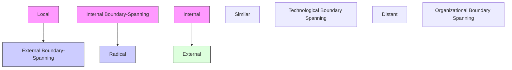
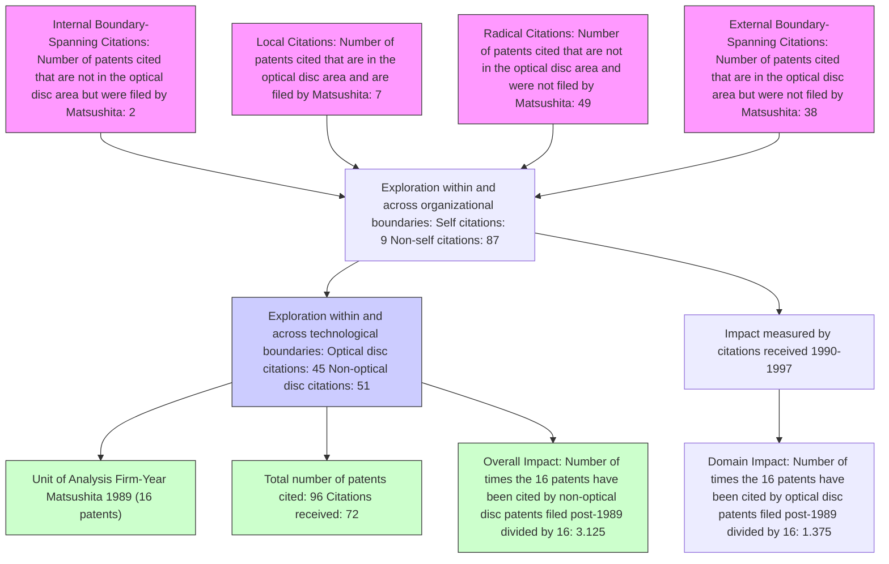

Beyond Local Search: Boundary-Spanning, Exploration, and Impact in the Optical Disk Industry

Author(s): Lori Rosenkopf and Atul Nerkar

Source: Strategic Management Journal, Vol. 22, No. 4 (Apr., 2001), pp. 287-306

Published by: John Wiley & Sons

Stable URL: http://www.jstor.org/stable/3094369

Accessed: 26/09/2008 15:33

Your use of the JSTOR archive indicates your acceptance of JSTOR's Terms and Conditions of Use, available at http://www.jstor.org/page/info/about/policies/terms.jsp. JSTOR's Terms and Conditions of Use provides, in part, that unless you have obtained prior permission, you may not download an entire issue of a journal or multiple copies of articles, and you may use content in the JSTOR archive only for your personal, non-commercial use.

Please contact the publisher regarding any further use of this work. Publisher contact information may be obtained at http://www.jstor.org/action/showPublisher?publisherCode=jwiley.

Each copy of any part of a JSTOR transmission must contain the same copyright notice that appears on the screen or printed page of such transmission.

JSTOR is a not-for-profit organization founded in 1995 to build trusted digital archives for scholarship. We work with the scholarly community to preserve their work and the materials they rely upon, and to build a common research platform that promotes the discovery and use of these resources. For more information about JSTOR, please contact support@jstor.org.

# BEYOND LOCAL SEARCH: BOUNDARY-SPANNING, EXPLORATION, AND IMPACT IN THE OPTICAL DISK INDUSTRY

LORI ROSENKOPF $^{1*}$ and ATUL NERKAR $^{2}$

$^{1}$ The Wharton School, University of Pennsylvania, Philadelphia, Pennsylvania, U.S.A.

$^{2}$ Graduate School of Business, Columbia University, New York, New York, U.S.A.

Recognition of the firm's tendency toward local search has given rise to concepts celebrating exploration that overcomes this tendency. To move beyond local search requires that exploration span some boundary, be it organizational or technological. While several studies have encouraged boundary-spanning exploration, few have considered both types of boundaries systematically. In doing so, we create a typology of exploration behaviors: local exploration spans neither boundary, external boundary-spanning exploration spans the firm boundary only, internal boundary-spanning exploration spans the technological boundary only, and radical exploration spans both boundaries. Using this typology, we analyze the impact of knowledge generated by these different types of exploration on subsequent technological evolution.

In our study of patenting activity in optical disk technology, we find that exploration that does not span organizational boundaries consistently generates lower impact on subsequent technological evolution. In addition, we find that the impact of exploration on subsequent technological evolution within the optical disk domain is highest when the exploration spans organizational boundaries but not technological boundaries. At the same time, we find that the impact of exploration on subsequent technological development beyond the optical disk domain is greatest when exploration spans both organizational and technological boundaries. Copyright © 2001 John Wiley & Sons, Ltd.

# INTRODUCTION

In high-technology industries, firm success depends on the ability to innovate consistently. No wonder that ‘knowledge-creating companies’ and ‘learning organizations’ are celebrated for the ability to generate, acquire, and integrate both internal and external sources of knowledge (Nonaka and Takeuchi, 1995; Simonin, 1997; Leonard-Barton, 1995). Indeed, firm-level differences in managing learning and knowledge have been shown to influence the transfer and imitation of capabilities (Zander and Kogut, 1995), the likelihood of diversification into related areas (Kim and Kogut, 1996), and research productivity (Henderson and Cockburn, 1994; Ahuja and Katila, 1999; Ahuja, 2000).

Path-dependent exploration that involves search along different dimensions is the fundamental mechanism by which firms learn and organizational knowledge evolves. In evolutionary theory, a central assumption is that of ‘local search,’ where a firm’s R&D activity is closely related to its previous R&D activity (March and Simon, 1958; Nelson and Winter, 1982; Helfat, 1994a). Likewise, Cohen and Levinthal’s (1990) concept of ‘absorptive capacity’ suggests that a firm’s ability to assimilate and integrate new technological knowledge is strongly associated with its past R&D activity.

Key words: innovation; exploration; knowledge creation; boundary-spanning; patent data

\*Correspondence to: Lori Rosenkopf, The Wharton School, University of Pennsylvania, 2000 Steinberg Hall–Dietrich Hall, Philadelphia, PA 19104-6370, U.S.A.

The resource-based view of the firm argues that the development of firm-specific competence and capabilities underlies competitive advantage (Wernerfelt, 1984; Barney, 1991; Porter, 1991; Peteraf, 1993). Recent literature, however, has stressed that sustainable competitive advantage relies more heavily on the firm's ability to move beyond local search and to reconfigure its knowledge. Such ability has been termed ‘combinative capability’ (Kogut and Zander, 1992), ‘dynamic capability’ (Teece, Pisano, and Shuen, 1997), and ‘architectural competence’ (Henderson and Cockburn, 1994).

In this paper, we have two objectives. First, we introduce a typology of exploration that recognizes firms' tendencies toward local search as well as their attempts to integrate knowledge from nonlocal domains. We do so by systematically distinguishing organizational and technological boundaries that may be spanned during exploration. Second, we use patent data to empirically explore how the various types of exploration affect the extent to which firms' knowledge is recognized by other firms and integrated into future technological developments.

# THEORY AND HYPOTHESES

# Beyond local search: exploration, boundaries, and ‘second-order competence’

Building on the concepts introduced by March and Simon (1958) and Nelson and Winter (1982), local search has been defined as the behavior of any firm or entity to search for solutions in the neighborhood of its current expertise or knowledge (Stuart and Podolny, 1996). Empirical evidence validates firms' tendencies toward local search. Helfat (1994b) has demonstrated, for petroleum firms, how R&D spending on various technologies varied little from year to year. Recently, Martin and Mitchell (1998) have shown that local search leads most product market incumbents to introduce designs that are similar to those incorporated in their existing products. Likewise, Stuart and Podolny (1996) showed, for large semiconductor firms, how patenting activity tended to concentrate in the technological domains where the firm has previously patented.

This empirical evidence suggests that firms focus their exploration on closely related technological domains. The ability to identify ‘closely related technological domains' relies on an implicit notion of boundaries between different technological domains. By indulging in local search, the firm focuses on similar technology, creates incremental innovations, and becomes more expert in its current domain. This focus enables firms, over time, to build what we can call ‘first-order competence’. This accumulated expertise is considered to be a distinctive competence if it is superior to competition and leads to competitive advantage. However, the focus that sustains such first-order competence can lead firms to develop ‘core rigidities’ (Leonard-Barton, 1995) or fall into ‘competency traps’ (Levitt and March, 1988).

While notions like core rigidities and competency traps suggest a focus on closely related technology, they also suggest that the organization focuses inward by relying on internally generated developments. These notions, like other work on local search, do not systematically distinguish when firms focus on their own developments in particular technologies versus integrating developments generated by other firms. For example, using empirical data from the semiconductor and biotechnology industries, Sorenson and Stuart (2000) suggest that greater levels of reliance on the firm's own prior developments is associated with more innovation, but that this innovation is less relevant, and is therefore a hallmark of obsolescence. Here, search is localized both technologically and organizationally. So we must also consider studies that rely on organizational boundaries between firms as markers of different types of exploration.

Stuart and Podolny (1996) show that in their sample only Matsushita was able to reposition itself technologically by moving away from local search. They suggest that this repositioning may have been accomplished through the extensive use of alliances with other firms that gave them access to different technologies. Likewise, Nagarajan and Mitchell (1998) show that firms wishing to generate ‘encompassing’ technological change must rely on coordination among firms through strong interrelationships. So these works suggest that spanning interfirm boundaries naturally leads to spanning more technological boundaries.

Several authors have introduced constructs intended to capture the idea of reconfiguring a firm's knowledge bases. Specifically, Kogut and Zander (1992) define ‘combinative capability’ as the ability ‘to synthesize and apply current and acquired knowledge.’ Built into this definition is the idea that organizational boundaries matter: ‘current’ knowledge is already owned by the firm, while ‘acquired’ knowledge means that the firm must import knowledge from beyond its boundaries. Similarly, Henderson and Cockburn (1994) define ‘architectural competence’ as ‘the ability to access new knowledge from outside the boundaries of the organization and the ability to integrate knowledge flexibly across disciplinary and therapeutic class boundaries within the organization.’ Again, boundaries matter; here it is not only the boundary that separates the organization from its environment, but it is also internal boundaries that have arisen to organize various technological subunits.

Therefore, in this paper our focus is on what we call ‘second-order competence’: the ability of a firm to create new knowledge through recombination of knowledge across boundaries. In particular, we focus on the knowledge reconfiguration capabilities of firms in the context of R&D for one particular set of technologies, and we explore the implications of both organizational and technological boundaries in this process.

# Four types of exploration

Second-order competence stresses the importance of acquiring and synthesizing knowledge across boundaries. Since these boundaries may be either organizational or technological, we propose a typology of exploration that considers both organizational and technological boundaries as separate, salient entities. In Figure 1, four types of exploration are generated by considering whether the built-upon knowledge is internal or external to the firm (the x-axis) and whether the built-upon knowledge is from similar or distant technology (the y-axis). $^{1}$ Implicit in this typology is the notion that exploration is undertaken by some technological subunit of the firm. The technological subunit faces the choice of whether or not to integrate knowledge from distant technological domains or to focus on similar knowledge. It also faces the choice of whether to access knowledge from within the firm (either its own knowledge or that of other technological subunits in the firm) or from external sources. Speaking in the language of boundary-spanning, the subunit faces the choice of whether to span no boundaries in its exploration, one boundary (either technological or organizational), or both.

flowchart

Figure 1. Types of exploration

'Local' exploration builds upon similar technology residing within the firm. $^{2}$ Thus, neither the organizational nor the technological boundary is spanned during this type of exploration—all activity is contained within the technological subunit. Local exploration builds 'component competence' (Henderson and Cockburn, 1994) and is exemplified by Prahalad and Hamel's (1990) study of Canon's core competences in precision mechanics, fine optics, microelectronics, and electronic imaging. In the optical disk area, both Sony and Philips developed numerous incremental innovations that built upon the original CD standard introduced in 1982, such as CD-ROM, CD-Video, and Mini Disc (Nakajima and Ogawa, 1992). Each of these did not change the original aspect of the CD standard but added to it. For instance, CD-ROM allowed for storage of only data while CD-V allowed storage of video on the CD digitally.

In contrast, on the other diagonal, ‘radical’ exploration builds upon distant technology that resides outside of the firm. The technological subunit utilizes knowledge from a different technological domain and does not obtain that knowledge from other subunits with the firm. Thus, both organizational and technological boundaries are spanned during this type of exploration. One prominent example is found in Nonaka and Takeuchi’s (1995) study of Matsushita’s Home Bakery, where the firm sent a software programmer to learn the art of kneading bread from an esteemed chef. In optical disk, an example of radical exploration is the probable overcoming of current storage limits of today’s DVD standard by laser pickups that utilize inert gases—a dramatic departure from today’s pickups. Established firms are determining how to integrate this distinctive technology, developed by a small firm outside the industry.

Both of the off-diagonals represent types of exploration that fall between the extremes of local and radical exploration. In each off-diagonal case, one boundary of the two is spanned by the exploration. 'Internal boundary-spanning' exploration integrates technologically distant knowledge residing within the firm. The technological subunit utilizes knowledge from a different technological domain, but is able to obtain that knowledge from another subunit within the firm. For example, Kao innovated in the floppy disk arena by utilizing their knowledge of surfactant (soap) technologies to develop a better coating for the disks. In optical disk, Toshiba and Matsushita were each able to improve CD data storage by internal boundary-spanning. The CD design introduced in 1982 allowed for recording of 2 hours of audio or 680 MB of data. This limitation of data storage meant that the CD could not carry a full-length feature movie. This was overcome in 1995 through the introduction of the DVD format, which allowed for data up to 17 GB to be stored on a disk. This breakthrough in data storage was a result of R&D in two different areas. One, by leveraging their materials science knowledge, the firms were able to increase the density of data stored on the same disk. Two, by using lasers with wavelengths that could read both sides of a disk, the DVD had data stored on both sides as opposed to single-side storage of the CD.

In contrast, ‘external boundary-spanning’ exploration integrates knowledge from other organizations that is close to the technology of interest. The technological subunit utilizes knowledge from its own technological domain, but obtains the knowledge from external sources. As an example, Microsoft’s development of the Windows user interface built upon knowledge developed first at Xerox PARC and subsequently at Apple. In the optical disk arena, Sony and Philips shared knowledge of two complementary components—Sony’s error correction techniques and Philips’ digital storage techniques—to generate the CD standard. Error correction allowed the CD to reproduce complete data, sound, or video even when parts of the data were missing or lost. Digital storage records data on disks in the form of pits to represent 0s and 1s as opposed to the tracks in a phonograph record or signals on a magnetic tape. The CD design gained acceptance amongst all constituents as it incorporated the above technologies, while competing designs at that time were incremental offshoots of the phonograph.

Note that both internal and external boundary-spanning exploration would be forms of Henderson and Cockburn's (1994) 'architectural competence.' While internal and external boundary-spanning each span one boundary, it is important to clarify that the mechanisms for integrating knowledge within and across firms may differ dramatically. For example, in Henderson and Cockburn's (1994) attempts to measure architectural competence, they examine several organizational activities that might encourage knowledge flow across firm boundaries and across therapeutic areas within the firm. For flow across firm boundaries, they examined whether the organization included researchers' standing in the larger scientific community in promotion criteria, as well as measures of the firm's geographic closeness and involvement in joint research projects with research universities. For flow across intrafirm boundaries, they examined the extent of cross-functional teams as well as financial and geographic centralization of global R&D activities. These measures alone suggest that some firms' boundary-spanning capabilities are not identical over the organizational and technological domains, so we are careful to keep internal and external boundary-spanning exploration separate

in our study.

The four types of exploration are not mutually exclusive. It is unlikely that all of a firm's R&D activities for a certain product or technology area would fall exclusively into one of the four categories, but it is likely that certain types of exploration would predominate. Furthermore, the mix of the four behaviors would of course vary with time. For this reason we undertake longitudinal study of exploration activity.

# Exploration and impact

In the previous section we highlighted two different boundaries that may be crossed when a subunit of a firm explores. To explore the effects of the various forms of exploration, we focus on the result of exploration—the firm's technological developments—and examine the impact of these developments on the overall path of subsequent technological evolution. More specifically, technological evolution of a product class may be thought of as the aggregate of the variation, selection, and retention trajectories undertaken by all firms working in the product class. Firm-level technological trajectories influence, and are influenced by, trajectories of other firms and of the overall evolution of the product class (Rosenkopf and Nerkar, 1999). In other words, firms do not make decisions about which technological options to pursue without regard to the actions of other firms—technological evolution is generated by communities of organizations (Rosenkopf and Tushman, 1998; Tushman and Rosenkopf, 1992).

To capture this interdependent evolution of firm-level exploration trajectories, we need to understand if knowledge generated by a firm is assimilated by other firms. When other firms recognize and build upon a firm's knowledge, it demonstrates this firm's influence on the overall evolution of a particular product class or technology. We use the term 'impact' to denote that knowledge has been retained and built upon as technology continues to evolve. $^{3}$ Impact may be evaluated within a specific technological domain or more broadly.

# Domain impact

One type of impact reflects a firm's influence in a specific technological arena. In the personal computing arena, for example, first IBM and subsequently Microsoft were most influential. Most personal computers manufactured in the late 1980s carried the legend ‘IBM compatible’; during the 1990s, both hardware and software stressed compatibility via Microsoft's Windows operating systems. Similarly, in the academic arena, research has specific domain applications. For instance, biotechnology research has many implications for new drug development. In some sense, domain impact represents the firm's ability to maintain continued technological leadership within the particular product class arena and its associated technological community.

# Overall impact

In contrast to influencing a specific technological domain, some new knowledge may be influential beyond its focal technological domain. Anecdotally, both Xerox PARC and Bell Laboratories are recognized as entities that developed technologies with implications far beyond the traditional markets of their parent firms. Similarly, Pfizer developed Viagra for its cardiovascular applications, but Viagra's additional applications have far outpaced the original intentions. In contrast to domain impact, then, overall impact represents the firm's ability to create broadly useful technological developments. While these developments may not be harnessed for their commercial potential by the firm, they represent possible avenues where the firm may choose to diversify. Thus, we are likely to observe that certain exploration strategies may result in higher overall impact at the expense of domain impact, or vice versa.

# Hypotheses

To examine the impact of exploration while systematically analyzing both the organizational and the technological dimensions of the process, we develop hypotheses that focus on each of the boundaries independently and then combine these effects to address the four types of exploration generated in our typology. We consider effects on both domain impact and overall impact.

# Exploration within and beyond organizational boundaries

Theory on the results of inwardly focused exploration yields mixed predictions. Building up a base of knowledge within the organization is one of the hallmarks of core competence, suggesting that knowledge-building on the organization's previous work will be associated with technological impact. At the same time, researchers argue that such myopic behavior leads to the development of competency traps (Levitt and March, 1988; Levinthal and March, 1993) and core rigidities (Leonard-Barton, 1992). Empirically, Henderson and Cockburn (1994) demonstrate that firms that place more emphasis on being part of the larger scientific community (i.e., look beyond the firm's competence) generate more patents. In addition, Sorenson and Stuart (2000) have shown that while older firms create more innovations and build more heavily on their own work, these innovations are less relevant to other members of the technological community. Taken together, these findings suggest a negative effect of exploration within organizational boundaries on impact.

We argue that the gains associated with the internal development of technology are not sustainable unless the organization is able to integrate external developments. Indeed, Jaffe, Fogarty, and Banks (1998) argue that companies are becoming increasingly aware of their ‘mutual technological dependence.’ This awareness and this integration across organizational boundaries have the effect of moving the locus of innovation to the level of the community, rather than the firm. In other words, organizational boundary-spanning should yield greater impact than exploring within organizational boundaries.

Hypothesis 1a: Exploration within organizational boundaries has less impact on subsequent technological evolution within the domain than exploration that spans organizational boundaries.

Hypothesis 1b: Exploration within organizational boundaries has less impact on subsequent technological evolution beyond the domain than exploration that spans organizational boundaries.

# Exploration within technological boundaries

As a firm generates expertise in a particular technology, they improve the overall performance of this technology but decrease variance in the learning process (March, 1991; Fleming, 2001). As industries and technologies evolve, continued exploration in one particular technological domain creates competence that may be more recognizable to firms operating in that same domain. After all, members of a technological community frequently cooperate to influence technological evolution (Nagarajan and Mitchell, 1998; Rosenkopf and Tushman, 1998; Van de Ven and Garud, 1994). So the more the firm's knowledge builds on developments within the specified technological domain, the more these developments will impact subsequent technological evolution within the domain. More broadly, drawing on any particular technological expertise will make the development more relevant for continued work in that area of expertise.

In contrast, ongoing incremental improvements within one domain are likely to become more specialized and less applicable to other domains, particularly when technological discontinuities disrupt existing incremental trajectories. Thus, the more the firm's knowledge builds on developments within the specified technological domain, the less these developments will impact subsequent technological evolution beyond the domain.

Hypothesis 2a: Exploration within technological boundaries has more impact on subsequent technological evolution within the domain than exploration that spans technological boundaries.

Hypothesis 2b: Exploration within technological boundaries has less impact on subsequent technological evolution beyond the domain than exploration that spans technological boundaries.

# Simultaneous consideration of organizational and technological boundaries

While the literature that we have reviewed on second-order competence recognizes the value of boundary-spanning exploration, other authors point out the challenges of transferring knowledge across boundaries (Szulanski, 1996; von Hippel, 1998). While firms may develop capabilities that enable effective boundary-spanning exploration, we must recognize that organizational boundary-spanning and technological boundary-spanning require different capabilities, and that expertise in one type of boundary-spanning does not necessarily translate into expertise in the other type of boundary.

Winter (1987) implies that bits of information or prior knowledge become new pieces of knowledge only in some context. Without context, knowledge is nothing but bits of data. Organizational and technological boundaries separate different contexts, and movement across each of these boundaries is managed differently. To move knowledge across organizational boundaries, contractual agreements are frequently observed. Concerns for intellectual property rights are paramount. Routines for codifying knowledge or special arrangements for transferring tacit knowledge must be developed (Zollo and Singh, 1997). Repeated interactions and relationships seem to improve this capability (Dyer and Singh, 1998). Within the firm, fewer of these considerations apply when attempting to cross technological boundaries. Yet complications arise for different reasons: for example, Henderson and Clark (1990) demonstrated how architectural innovations (those that redefined technological relationships between components) were so difficult for established firms to accommodate because of the attendant organizational reconfigurations required. To move knowledge across intraorganizational boundaries, managers may convene task forces, designate liaisons, adjust incentives, reorganize the boundaries, or perform some combination of these activities. Certain organizations, such as 3M, have embraced the notion of recombination as part of their culture and practices (Tushman and O'Reilly, 1997).

Our reason for elaborating these mechanisms is to suggest that expertise in spanning the organizational boundary, for example, may be largely irrelevant for spanning the technological boundary, or vice versa. Indeed, Nagarajan and Mitchell (1998) suggest that the locus of innovation—interfirm or intrafirm—as well as the mechanisms of interfirm coordination will vary with the degree of technological change.

With this distinction in mind, we can see how the initial hypotheses, focused only on one type of boundary, need to be more fully specified. With respect to Hypothesis 1, for example, exploration within organizational boundaries may or may not span the technological boundary (i.e., it may be what we call internal boundary-spanning exploration or local exploration). Likewise, exploration spanning the organizational boundary may or may not span the technological boundary (i.e., it may be what we call radical exploration or external boundary-spanning exploration). Then the question of whether the one boundary is spanned transforms into the questions of how many boundaries are spanned and which boundaries are spanned.

To begin, we consider our previous hypotheses about the impact of each type of boundary-spanning on domain impact simultaneously. Recall that organizational boundary-spanning was hypothesized to have a positive effect on domain impact (Hypothesis 1a), while technological boundary-spanning was hypothesized to have a negative effect on domain impact (Hypothesis 2a). If we consider both types of boundary-spanning simultaneously, it follows that the highest domain impact should be generated by exploration that spans organizational boundaries but does not span technological boundaries. In the language of our typology of exploration, this is external boundary-spanning. The firm is focused on developments that are relevant to its technological community, but is noninsular. Similarly, it follows that the lowest domain impact should be generated by exploration that spans technological boundaries, but not organizational boundaries—internal boundary-spanning. Here, the firm is more insular, and less relevant to others in the community.

Hypothesis 3a: External boundary-spanning exploration has the highest impact on subsequent technological evolution within the domain.

Hypothesis 3b: Internal boundary-spanning exploration has the lowest impact on subsequent technological evolution within the domain.

Note that we do not offer specific hypotheses about the relative effects of local or radical exploration on domain impact, other than the implicit notion that they each generate ‘moderate’ impact. This is because each of these exploration types combines opposing effects from each boundary. Specifically, radical exploration generates a positive effect from spanning the organizational boundary, but a negative effect from spanning the technological boundary; while the reverse is true for local exploration. Since it is not clear whether one type of boundary-spanning effect would overwhelm the other, we leave this issue to our empirical analyses.

Next, we follow similar logic to derive the effects of exploration type on overall impact. Recall that both organizational and technological boundary-spanning were hypothesized to have positive effects on overall impact (Hypotheses 1b and 2b). In this case, considering both types of boundary-spanning simultaneously, it follows that the more boundaries spanned, the higher the overall impact. Thus, it follows that the highest overall impact would be achieved by radical exploration, as it spans both boundaries. Here, the firm's developments are relevant to a broad cross-section of innovators, as it integrates various technologies developed by various firms. In contrast, the lowest overall impact would be achieved by local exploration, as it does not span either boundary. Here, the firm's insularity, both technologically and organizationally, make its developments least relevant.

Hypothesis 4a: Radical exploration has the highest impact on subsequent technological evolution beyond the domain.

Hypothesis 4b: Local exploration has the lowest impact on subsequent technological evolution beyond the domain.

Note that we do not offer specific hypotheses about the effects of internal or external boundary-spanning on overall impact. Again, this is because each of these exploration types combines opposing effects from each boundary, and we leave comparisons to our empirical analyses.

Taken together, Hypotheses 3 and 4 suggest different effects of exploration type on domain and overall impact, which are summarized in Figure 2.

# METHODOLOGY

# Data

To examine our hypotheses, we categorize and measure exploration and impact by using patent data. This follows the research efforts of several other scholars who have used patents as a measure of knowledge held by the firm $^{4}$ (Dutta and Weiss, 1997; Henderson and Cockburn, 1994; Jaffe, Trajtenberg, and Henderson, 1993; Engelsman and van Raan, 1994; Albert et al., 1991; Narin, Noma, and Perry, 1987). Each patent contains extensive information about the inventor, the company to which the patent is assigned, and the technological antecedents of the invention, all of which can be accessed in computerized form. Every patent is assigned to a three-digit technical class, which we use for the purpose of identifying distinct technical areas being developed by the firms in our sample. At this level there are currently 400 such technical three-digit classes and approximately 100,000 subclasses within these 400 classes. The information that we use in this paper is related to technological subclasses and assignee companies. The basic unit of analysis is the individual patent and its associated content, and the level of the analysis is the firm. We consider only patents filed in the United States. The sources for this information include the U.S. Patent Office and online data bases.

We began our data collection by establishing the patent classes that circumscribe optical disk technology. Eight components of an optical disk system were identified through consultation of technical sources (Pohlmann, 1989; Nakajima and Ogawa, 1992). We then searched the manual of classification for the patent system to find the technical subclasses corresponding to these types. Next, we compared our set of technical subclasses to those designated by Miyazaki (1995) in her extensive analysis of the patent classification system. All the subclasses that we designated as optical disk classes were similarly designated by Miyazaki; we also added two other subclasses that she had designated in this area. $^{5}$ Our complete set of subclasses and their correspondence to the eight components can be found in Table 1.

EFFECT ON
DOMAIN IMPACT   
EFFECT ON
OVERALL IMPACT 

<table><tr><td rowspan="2">Within Technological Domain</td><td>Local</td><td>External Boundary-Spanning</td><td>Local</td><td>External Boundary-Spanning</td></tr><tr><td>Moderate</td><td>Highest</td><td>Lowest</td><td>Moderate</td></tr><tr><td rowspan="2">Beyond Technological Domain</td><td>Internal Boundary-Spanning</td><td>Radical</td><td>Internal Boundary-Spanning</td><td>Radical</td></tr><tr><td>Lowest</td><td>Moderate</td><td>Moderate</td><td>Highest</td></tr><tr><td></td><td>Within Firm</td><td>Beyond Firm</td><td>Within Firm</td><td>Beyond Firm</td></tr></table>

Figure 2. Hypothesized relationships

Table 1. Components of an optical disk system 

<table><tr><td>Component</td><td>Name</td><td>Function</td><td>Patent subclasses</td></tr><tr><td>1</td><td>Optical servo system</td><td>Control motor, spindle and focusing of optical pickup</td><td>369#44-46</td></tr><tr><td>2</td><td>Optical storage</td><td>Construct pits via laser beam</td><td>369#13</td></tr><tr><td>3</td><td>Control of information signal</td><td>Convert digital signal into analog output</td><td>369#48</td></tr><tr><td>4</td><td>Laser beam technology</td><td>Store and reproduce digital information using laser pickups</td><td>369#100-125</td></tr><tr><td>5</td><td>Optical track structure</td><td>Format pits (via specification of density)</td><td>369#275</td></tr><tr><td>6</td><td>Transducer assembly linear guide</td><td>Read digital signal and correct errors</td><td>369#249</td></tr><tr><td>7</td><td>Material</td><td>Physical medium of disk</td><td>346#135.1</td></tr><tr><td>8</td><td>Measuring electricity signals</td><td>Transmission of information throughout optical disk system</td><td>324#244,96</td></tr></table>

A total of 3598 patents were filed and granted in these areas between 1971 and October 1995. These 3598 patents were owned by a total of 413 firms. Not surprisingly, 22 firms account for more than 60 percent of the total patenting activity. To facilitate statistical analyses, we focus

our attention on these 22 firms. This focus trims our set of patents to the 2333 patents issued by the most active firms. A distribution of the number of patents owned by each of these most active firms and the number of years in which each firm patented is displayed in Table 2. Thus, the findings may be biased toward the experiences of large firms and should be interpreted accordingly.

By sorting these 2333 patents by firm, we were able to create 25-year longitudinal records of the patenting activity in the optical disk arena for each firm. For our ultimate analyses, the unit of analysis is the firm-year. $^{6}$ Observations from 1995, since incomplete, were therefore removed from our analysis. In addition, since each firm did not patent in every year of the study period, a total of 371 firm-year observations are analyzed.

Table 2. Distribution of patents and firm-year observations for sample 

<table><tr><td>Firm</td><td>Total patents</td><td>Total years</td></tr><tr><td>Canon</td><td>205</td><td>20</td></tr><tr><td>Philips</td><td>202</td><td>22</td></tr><tr><td>Hitachi</td><td>195</td><td>20</td></tr><tr><td>Matsushita</td><td>181</td><td>21</td></tr><tr><td>Pioneer</td><td>180</td><td>18</td></tr><tr><td>Sony</td><td>160</td><td>22</td></tr><tr><td>IBM</td><td>115</td><td>21</td></tr><tr><td>Ricoh</td><td>112</td><td>17</td></tr><tr><td>Kodak</td><td>108</td><td>19</td></tr><tr><td>Toshiba</td><td>106</td><td>11</td></tr><tr><td>Sharp</td><td>104</td><td>15</td></tr><tr><td>Thomson</td><td>103</td><td>21</td></tr><tr><td>Olympus</td><td>94</td><td>15</td></tr><tr><td>Mitsubishi</td><td>90</td><td>16</td></tr><tr><td>RCA</td><td>82</td><td>13</td></tr><tr><td>Fuji</td><td>75</td><td>21</td></tr><tr><td>Discovision</td><td>43</td><td>18</td></tr><tr><td>Drexler</td><td>39</td><td>11</td></tr><tr><td>NEC</td><td>39</td><td>11</td></tr><tr><td>Xerox</td><td>34</td><td>15</td></tr><tr><td>Fujitsu</td><td>33</td><td>10</td></tr><tr><td>JVC</td><td>33</td><td>14</td></tr><tr><td>Total</td><td>2333</td><td>371</td></tr></table>

Each patent contains citations to previous patents ('prior art'). Thus, the overall pattern of citations to earlier patents provides a credible record of built-upon knowledge, which we examine on a yearly basis. At the same time, patents granted to a firm in any year that are subsequently cited by other firms permit the construction of impact measures. A sample data point—Matsushita in 1989—is shown in Figure 3. Both the exploration and the impact variables are derived from different components of the firm's set of patents during the year, as we describe in the following section.

# Variables

We display descriptive statistics and correlations in Table 3 for each of the variables described below.

# Exploration

We classified the exploration activities of firm $i$ in year $t$ by classifying and tabulating all citations included in the firm's optical disk patents during year $t$ . Note that these citations are to patents issued earlier than the focal patents during year $t$ . Each citation to another patent was traced to determine if the built-upon patent was assigned to the same firm, and whether the built-upon patent was classified in one of our optical disk technology classes. This classification enabled the construction of several variables, each of which is denoted in Figure 4. The four inner cells correspond to the four types of exploration: local, radical, internal boundary-spanning, and external boundary-spanning. Each citation was tabulated into one and only one of these four cells. Summing the rows yields counts of the total number of citations by firm $i$ in year $t$ to optical disk technology as well as to nonoptical disk technology. Similarly, summing the columns yields counts of the total number of self-citations by firm $i$ in year $t$ as well as the total number of nonself-citations. The grand total represents the total number of citations made by firm $i$ 's optical disk patents in year $t$ . Due to the additive nature of all the exploration variables, we control for total citations in all regressions to reduce the correlation between these measures. As such, the reported correlations in Table 1 represent partial correlations.

Two ‘exploration trajectories’ are shown in Figure 5(a) and (b) to demonstrate how the exploration variables can vary by firm and by year. In each graph, the x-axis represents the proportion of self-citations, and the y-axis represents the proportion of disk citations. The firm’s position in each year is plotted (the initial year is shown in bold type) and the points connected so that one may follow the evolution of exploration behavior. Note also that the median values of self-citation and disk citation (9% and 52% respectively) are shown as dotted lines in the graph, effectively splitting the citation space into four areas that may be associated with our four types of exploration.

flowchart

Figure 3. Example of a data point and construction of variables

Observe how Philips and Toshiba explore so differently. Philips works its way into a position of consistently high self-citation, with some variance in the extent to which it integrates prior disk developments. In contrast, Toshiba undertakes only a medium amount of self-citation, but heavily relies on developments within the optical disk domain. The differences in these trajectories are especially interesting when one considers how Toshiba has recently occupied a position of prominence in the development of DVD standards, to some extent at the expense of Philips and Sony, the two leaders for the previous CD standards.

# Impact

We measured the impact of firm $i$ 's patents in year $t$ on subsequent technological evolution by tracking all patents that cited the focal patents after they were granted. For each firm i in each year t, we took its set of optical disk patents and performed a search to find all patents that cited the focal patents after they were granted. $^{8}$ So in contrast to the exploration variable, constructed from the citations made by firm i's patents in year t to earlier patents, the impact variable utilizes citations from subsequent patents from any firm that cites firm i's patents in year t. Note that, ceteris paribus, patents granted in earlier years are likely to have more citations than patents granted in later years since they are at risk for citations during a longer time period. We control for this bias by including year dummies in our analyses.

These citation counts enabled the construction of our two impact variables. Domain impact for firm i in year t equals the number of citations from optical disk patents (that is, citing patents that were classified in any of our initial optical

Table 3. Descriptive statistics (n = 371) 

<table><tr><td colspan="8"></td><td colspan="9">Partial correlations (with respect to total citations)</td></tr><tr><td></td><td>Variable</td><td>Mean</td><td>S.D.</td><td>Min.</td><td>Max.</td><td>Partial S.D.</td><td>2</td><td>3</td><td>4</td><td>5</td><td>6</td><td>7</td><td>8</td><td>9</td><td>10</td><td>11</td></tr><tr><td>1</td><td>Domain impact</td><td>17.0</td><td>21.1</td><td>0</td><td>128</td><td>20.5</td><td>0.84*</td><td>0.13*</td><td>-0.012</td><td>-0.14*</td><td>0.15*</td><td>0.058</td><td>-0.094</td><td>-0.020</td><td>0.27*</td><td>0.33*</td></tr><tr><td>2</td><td>Overall impact</td><td>24.2</td><td>29.4</td><td>0</td><td>229</td><td>27.2</td><td>-</td><td>0.085</td><td>-0.11*</td><td>-0.096</td><td>0.065</td><td>0.066</td><td>-0.15*</td><td>0.080</td><td>0.26*</td><td>0.30*</td></tr><tr><td>3</td><td>Self-citation</td><td>4.62</td><td>6.72</td><td>0</td><td>41</td><td>3.97</td><td>-</td><td>-</td><td>-0.036</td><td>-0.036</td><td>0.77*</td><td>0.77*</td><td>-0.46*</td><td>-0.39*</td><td>0.13*</td><td>-0.010</td></tr><tr><td>4</td><td>Disk citation</td><td>15.9</td><td>17.8</td><td>0</td><td>89</td><td>4.86</td><td>-</td><td>-</td><td>-</td><td>-0.068</td><td>0.32*</td><td>-0.37*</td><td>0.85*</td><td>-0.85*</td><td>-0.27*</td><td>0.10*</td></tr><tr><td>5</td><td>Citation age</td><td>5.81</td><td>6.25</td><td>0</td><td>70</td><td>6.17</td><td>-</td><td>-</td><td>-</td><td>-</td><td>-0.014</td><td>0.070</td><td>-0.062</td><td>0.032</td><td>0.43*</td><td>-0.046</td></tr><tr><td>6</td><td>Local exploration</td><td>2.40</td><td>3.83</td><td>0</td><td>25</td><td>2.59</td><td>-</td><td>-</td><td>-</td><td>-</td><td>-</td><td>0.18*</td><td>-0.22*</td><td>-0.44*</td><td>0.0093</td><td>-0.050</td></tr><tr><td>7</td><td>Internal boundary-spanning</td><td>2.22</td><td>3.69</td><td>0</td><td>23</td><td>2.58</td><td>-</td><td>-</td><td>-</td><td>-</td><td>-</td><td>-</td><td>-0.48*</td><td>-0.17*</td><td>-0.20*</td><td>0.035</td></tr><tr><td>8</td><td>External boundary-spanning</td><td>13.5</td><td>15.1</td><td>0</td><td>81</td><td>4.72</td><td>-</td><td>-</td><td>-</td><td>-</td><td>-</td><td>-</td><td>-</td><td>-0.63*</td><td>-0.29*</td><td>0.13*</td></tr><tr><td>9</td><td>Radical exploration</td><td>11.8</td><td>12.6</td><td>0</td><td>65</td><td>4.57</td><td>-</td><td>-</td><td>-</td><td>-</td><td>-</td><td>-</td><td>-</td><td>-</td><td>0.18*</td><td>-0.13*</td></tr><tr><td>10</td><td>Other citations</td><td>5.37</td><td>6.79</td><td>0</td><td>44</td><td>6.41</td><td>-</td><td>-</td><td>-</td><td>-</td><td>-</td><td>-</td><td>-</td><td>-</td><td>-</td><td>0.14*</td></tr><tr><td>11</td><td>Number of patents</td><td>6.27</td><td>5.81</td><td>1</td><td>34</td><td>2.32</td><td>-</td><td>-</td><td>-</td><td>-</td><td>-</td><td>-</td><td>-</td><td>-</td><td>-</td><td>-</td></tr><tr><td>12</td><td>Total citations</td><td>29.9</td><td>31.5</td><td>0</td><td>166</td><td>-</td><td>-</td><td>-</td><td>-</td><td>-</td><td>-</td><td>-</td><td>-</td><td>-</td><td>-</td><td>-</td></tr></table>

$^{*}p <   0.05$

<table><tr><td>Local Citations</td><td>External Boundary-Spanning Citations</td><td>Disc Citations</td></tr><tr><td>Internal Boundary-Spanning Citations</td><td>Radical Citations</td><td>Non-Disc Citations</td></tr><tr><td>Self Citations</td><td>Non-Self Citations</td><td>Total Citations</td></tr></table>

Figure 4. Relationships between exploration variables

disk subclasses) received by firm i's patents granted in year t. Overall impact is the total number of citations from nonoptical disk patents received by firm i's patents granted in year t. $^{9}$ For both of these measures, self-citations were excluded. Since both types of impact are likely to correlate with the total number of patents issued by the firm during that year, we control for this yearly number of patents in our analyses.

# Citation age

We include a measure of the average age of all citations made during each year by each firm. This measure is intended as a control, as the tendency for patents with older citations to generate less impact has been noted (Sorenson and Stuart, 2000), and this measure may serve as a proxy for competence traps.

# Analyses

# Regressions

Since our dependent variable is a nonnegative count variable with overdispersion, negative binomial models are indicated (Hausman, Hall, and Griliches, 1984). Since our data structure includes longitudinal panels with missing obser-

vations, we took several steps to ensure the integrity of our results. First, we included firm dummies to capture any unmeasured heterogeneity across panels. In addition, we report significance levels based on Huber–White robust standard errors to control for any residual heteroscedasticity across panels. We also include year dummies to capture any overall changes in impact due to technological standardization, patent-related legislation, and the like. $^{10}$

Recall that we have missing observations in years where firms did not patent, because there are no citations with which to construct the independent variables. As a test, we generated pseudo-observations for the 157 nonpatenting firm-years by setting all citation-related counts to zero and average citation age to its maximum value. Results were not appreciably different.

# Models

Capturing the effects of the various types of exploration requires caution because of the additive nature of the various categories. We begin by considering each type of boundary independently. In Model 1 we include measures of self-citation and disk citation. We are interested in capturing the difference between self-citation and nonself-citation on impact, as well as the difference between disk citation and nondisk citation on impact. However, it is not possible to include all four of these terms in one regression, because the sum of self-citations and nonself-citations equals the sum of disk citations and nondisk citations. Instead, we include this sum—total citations—in the model, and omit nonself-citations and nondisk citations. This means that the coefficient on self-citation actually represents the difference between self- and nonself-citations, $^{11}$ and likewise for the coefficient on disk citation. In Model 2, we include the multiplicative interaction of self-citation and disk citation. A significant coefficient on this variable indicates that simultaneous consideration of both boundaries should yield additional insight. To interpret these effects in a straightforward way, we elaborate both boundaries simultaneously.

line

| Year | SELF CITATION (%) | DISC CITATION (%) |
|------|-------------------|-------------------|
| 1973 | 0                 | 0                 |
| 1968 | 20                | 60                |
| 1969 | 25                | 50                |
| 1990 | 30                | 75                |
| 1985 | 30                | 25                |
| 1987 | 30                | 20                |
| 1986 | 35                | 45                |
| 1983 | 35                | 40                |
| 1980 | 40                | 50                |
| 1978 | 40                | 70                |
| 1977 | 50                | 25                |
| 1976 | 55                | 30                |
| 1974 | 30                | 5                 |
| 1982 | 40                | 70                |
| 1981 | 40                | 75                |
| 1980 | 40                | 50                |
| 1978 | 40                | 60                |
| 1964 | 45                | 65                |
| 1992 | 40                | 70                |
| 1993 | 40                | 50                |
| 1984 | 45                | 65                |
| 1975 | 30                | 10                |
| 1973 | 0                 | 0                 |

line

| Year | SELF CITATION (%) | DISC CITATION (%) |
| ---- | ----------------- | ----------------- |
| 1984 | 3.0               | 45.0              |
| 1985 | 2.0               | 50.0              |
| 1986 | 4.0               | 52.0              |
| 1987 | 6.0               | 65.0              |
| 1988 | 3.0               | 60.0              |
| 1989 | 8.0               | 75.0              |
| 1990 | 10.0              | 60.0              |
| 1991 | 8.0               | 72.0              |
| 1992 | 14.0              | 55.0              |
| 1993 | 12.0              | 62.0              |
| 1994 | 2.0               | 70.0              |

Figure 5. (a) Philips' exploration; (b) Toshiba's exploration

Therefore, in Model 3, we replace our measures that focus on a single boundary (i.e., self-citation and disk citation) and incorporate both types of boundaries simultaneously by including measures of local exploration, internal boundary-spanning exploration, external boundary-spanning exploration, and radical exploration. Note that since these four measures sum to the total number of citations, we implicitly control for the total citations measure even though the term is omitted from the regression. These coefficients allow us to compare the effects of each of the four types of exploration using Wald tests.

# RESULTS

Table 4 summarizes the relevant coefficients for negative binomial regression of domain impact on exploration behavior. $^{12}$ In Model 1, the significant negative coefficient on self-citation demonstrates that exploration within organizational boundaries generates less domain impact than exploration beyond organizational boundaries, supporting Hypothesis 1a. Likewise, the significant positive coefficient on disk citation demonstrates that exploration within technological boundaries generates more domain impact than exploration beyond technological boundaries, supporting Hypothesis 2a.

Table 4. Negative binomial regression of domain impact on exploration (n = 371) 

<table><tr><td></td><td>1</td><td>2</td><td>3</td></tr><tr><td>Self-citation (SC)</td><td>-0.053**</td><td>-0.020</td><td></td></tr><tr><td>Disk citation (DC)</td><td>0.017*</td><td>0.031**</td><td></td></tr><tr><td>SC × DC</td><td></td><td>-0.00098**</td><td></td></tr><tr><td>Total citations (SC + non-SC; DC + non-DC)</td><td>0.0016</td><td>0.0017</td><td></td></tr><tr><td>Number of patents</td><td>0.11**</td><td>0.094**</td><td>0.11**</td></tr><tr><td>Average citation age</td><td>-0.054**</td><td>-0.052**</td><td>-0.054**</td></tr><tr><td>Other citations</td><td>0.020*</td><td>0.022*</td><td>0.020*</td></tr><tr><td>Local exploration (SC and DC)</td><td></td><td></td><td>-0.033*</td></tr><tr><td>Internal boundary-spanning (SC and non-DC)</td><td></td><td></td><td>-0.053**</td></tr><tr><td>External boundary-spanning (non-SC and DC)</td><td></td><td></td><td>0.018**</td></tr><tr><td>Radical exploration (non-SC and non-DC)</td><td></td><td></td><td>0.0019</td></tr><tr><td>Firm dummies (21)</td><td>2 firms**</td><td>1 firm**</td><td>2 firms**</td></tr><tr><td>Year dummies (23)</td><td>n.s.</td><td>1 year**</td><td>**</td></tr><tr><td>Constant</td><td>-20.1</td><td>-19.8</td><td>-19.4</td></tr><tr><td>Alpha</td><td>0.37**</td><td>0.35**</td><td>0.37**</td></tr><tr><td>Log-likelihood</td><td>-1179.8</td><td>-1173.8</td><td>-1179.8</td></tr></table>

$^{*}p < 0.05$ ; $^{**}p < 0.01$ (significance derived from robust standard errors)

In Model 2, addition of an interaction term between self- and disk citation obtains a significant coefficient, which suggests that simultaneous consideration of both boundaries will add insight. For that insight, we turn to Model 3, where we examine the four types of exploration in the same model. Here we observe that internal boundary-spanning obtains a significant negative effect on domain impact, while external boundary-spanning obtains a significant positive effect on domain impact. We also observe that local exploration obtains a significant negative effect on domain impact, while radical exploration does not obtain a significant coefficient. We hypothesized that internal boundary-spanning would have the lowest impact, and external boundary-spanning would have the highest impact. Wald tests demonstrate that the coefficient of external boundary-spanning is significantly higher than those of internal boundary-spanning and local exploration (p < 0.05) as well as that of radical exploration (p < 0.10), fully supporting Hypothesis 3a. At the same time, the coefficient of internal boundary-spanning is significantly lower than those of external boundary-spanning and radical exploration (p < 0.05), but not significantly different than that of local exploration, partially supporting Hypothesis 3b. It is also interesting to note that local exploration generates significantly less impact than radical exploration (p < 0.05).

In addition, note that the effects of our control variables persist across all models. As expected, the number of patents granted to a firm in a year is positively associated with the number of subsequent citations those patents receive. At the same time, the higher the average age of the citations contained within those patents, the lower the impact of the patents. We also find that our control for other citations obtains a significant positive association with domain impact.

Table 5 summarizes the relevant coefficients for negative binomial regression of overall impact on exploration behavior. $^{13}$ In Model 1, the significant negative coefficient on self-citation demonstrates that exploration within organizational boundaries generates less overall impact than exploration beyond organizational boundaries, supporting Hypothesis 1b. Likewise, the significant negative coefficient on disk citation demonstrates that exploration within technological boundaries generates less domain impact than exploration beyond technological boundaries, supporting Hypothesis 2b.

Table 5. Negative binomial regression of overall impact on exploration (n = 371) 

<table><tr><td></td><td>1</td><td>2</td><td>3</td></tr><tr><td>Self-citation (SC)</td><td>-0.052**</td><td>-0.014</td><td></td></tr><tr><td>Disk citation (DC)</td><td>-0.020*</td><td>-0.0031</td><td></td></tr><tr><td>SC × DC</td><td></td><td>-0.0011**</td><td></td></tr><tr><td>Total citations (SC + non-SC; DC + non-DC)</td><td>0.027**</td><td>0.027**</td><td></td></tr><tr><td>Number of patents</td><td>0.11**</td><td>0.088**</td><td>0.11**</td></tr><tr><td>Average citation age</td><td>-0.019</td><td>-0.017</td><td>-0.019</td></tr><tr><td>Other citations</td><td>0.0036</td><td>0.0068</td><td>0.0036</td></tr><tr><td>Local exploration (SC and DC)</td><td></td><td></td><td>-0.043**</td></tr><tr><td>Internal boundary-spanning (SC and non-DC)</td><td></td><td></td><td>-0.026</td></tr><tr><td>External boundary-spanning (non-SC and DC)</td><td></td><td></td><td>0.0071</td></tr><tr><td>Radical exploration (non-SC and non-DC)</td><td></td><td></td><td>0.027**</td></tr><tr><td>Firm dummies (21)</td><td>2 firms**</td><td>2 firms**</td><td>2 firms**</td></tr><tr><td>Year dummies (23)</td><td>**</td><td>**</td><td>**</td></tr><tr><td>Constant</td><td>-16.6**</td><td>-16.5**</td><td>-16.6**</td></tr><tr><td>Alpha</td><td>0.60**</td><td>0.57**</td><td>0.60**</td></tr><tr><td>Log-likelihood</td><td>-1356.6</td><td>-1350.5</td><td>-1356.6</td></tr></table>

$^{*}p < 0.05$ ; $^{**}p < 0.01$ (significance derived from robust standard errors)

In Model 2, once again, addition of an interaction term between self- and disk citation obtains a significant coefficient, which suggests that simultaneous consideration of both boundaries will add insight. For that insight, we turn to Model 3, where we examine the four types of exploration in the same model. Here we observe that local exploration obtains a significant negative effect on overall impact, while radical exploration obtains a significant positive effect on overall impact. We also observe that internal and external boundary-

spanning do not obtain significant effects on overall impact. Wald tests demonstrate that the coefficient of radical exploration is significantly higher than those of internal boundary-spanning and local exploration (p < 0.05) as well as that of external boundary-spanning (p < 0.10), fully supporting Hypothesis 4a. At the same time, the coefficient of local exploration is significantly lower than those of external boundary-spanning and radical exploration (p < 0.05), but not significantly different than that of internal boundary-spanning, partially supporting Hypothesis 4b. Also note that internal boundary-spanning yields marginally lower overall impact than external boundary-spanning (p < 0.10).

Once again, the effects of our control variables persist across all models. While number of patents maintains the same positive effect as observed for domain impact, the effects of average citation age and other citations are no longer significant for overall impact.

# DISCUSSION

Our results highlight the value of organizational boundary-spanning. Even while controlling for obsolescence, we found that exploration beyond organizational boundaries persistently obtained more impact than exploration within organizational boundaries. Apparently, firms that focus inward on their core competencies run the risk of developing innovations that wind up being peripheral to the aggregate path of technological development.

At the same time, our results on technological boundary-spanning highlight tradeoffs between domain and overall impact. While exploration within technological boundaries increases domain impact, it decreases overall impact. Thus managers should recognize that casting a broad net to incorporate sources of technological variation is more likely to yield impact outside the domain than within it, and incorporate this tradeoff as they choose their exploration strategies: while domain impact suggests the likelihood of short-term gains in the given technological area, overall impact suggests the possibility of new platforms that may provide longer-term gains.

Our theory and results suggest that organizational boundary-spanning and technological boundary-spanning manifest both similarities and differences, depending on the context in which one examines their effects. With respect to overall impact, each type of boundary-spanning is expected to yield a positive effect on impact, and we did not distinguish between the effects of internal and external boundary-spanning theoretically. Empirically, the difference between the two coefficients for these effects is marginal—external boundary-spanning yields somewhat more impact than internal boundary-spanning. In contrast, when we examine domain impact, we support the hypotheses that internal boundary-spanning yields the lowest impact, and external boundary-spanning yields the highest impact. In this case, each type of boundary-spanning yields dramatically different effects. Evidence of this type demonstrates that the normative assumption that internal recombination should be a beneficial activity for the firm (cf. Teece, 1997) may be misleading, particularly when considering within-domain impact.

One possible explanation for these dramatic differences in internal and external boundary-spanning on domain impact may be that when firms choose to build upon external expertise, they are more likely to choose well-regarded technology. In contrast, when they build upon internal expertise, they are consigned to their own firm's level of expertise, be it above or below the norm. Our results suggest that the ‘make-or-buy’ decision for technological competences should not be influenced unduly by exhortations to leverage knowledge within the firm. Indeed, the importance of coalescing the knowledge of multiple organizations into the firm’s exploration trajectories is particularly important for systemic technologies such as optical disk and is illustrated by Toshiba’s prominence in the DVD realm.

One limitation of our study is that patent data can only track the exploration patterns of innovations successful enough to have resulted in patents. Firms certainly undertake exploratory activities that do not result in granted patents. Detailed, painstaking fieldwork should be undertaken to determine whether this unmeasured activity could bias our results.

# CONCLUSIONS

Our contribution in this paper is the systematic exploration of the distinction between exploration that spans technological boundaries and exploration that spans organizational boundaries. Extant literature typically considers only one type of boundary-spanning exploration; rarely are the two types distinguished or compared simultaneously. Thus, the celebrations of boundary-spanning exploration, or second-order competence, are well placed, but need to be more carefully specified.

We made the distinction between technological and organizational boundary-spanning because we believe that the skills and routines required to recombine knowledge from different technological areas may differ dramatically from those required to recombine knowledge from different firms. In this paper, our empirical data do not specify which mechanisms facilitate knowledge building; we simply focus on the boundary-spanning possibilities and their effects. There is much work today on the mechanisms by which firms build knowledge within and across boundaries (Mowery, Oxley, and Silverman, 1996; Dutta and Weiss, 1997; Nerkar, 1997; Almeida and Rosenkopf, 1997; Nagarajan and Mitchell, 1998; Almeida and Kogut, 1999). Knowledge-building expertise of one type as demonstrated in papers like these may not transfer to other types; organizations may be proficient at one type of boundary-spanning, both, or neither. Future research should delve into whether and how organizations build capabilities for boundary-spanning activity, as well as whether these capabilities are at all transferable between organizational and technological boundary-spanning activities.

Our results show that the simultaneous distinction of organizational and technological boundaries is worthwhile—for our sample of optical disk firms, the dangers of competence traps are real. In this arena, managers that focus primarily on exploration that builds upon the developments of other organizations generate more impact. Furthermore, in balancing between building on similar technology vs. different technology, managers face tradeoffs between domain and overall impact. At the same time, our results suggest the difficulty for managers in assessing the value of their own firm's technology in distant domains. Future research should explore how these assessments are made and compared against external alternatives.

We recognize that our study, limited to a single technology focus, may not be fully generalizable. Our results are more likely to apply in high-technology contexts where the technology, like optical disk, is systemic. In systemic contexts, knowledge-building evolves hand in hand with the socio-technical coalitions that shape technological evolution. Stronger regulatory contexts may also moderate the relationship between exploration type and impact. Future efforts to compare and contrast these behaviors in varying technological contexts will be fruitful.

Finally, as our analyses examine the impact of innovations on the future stream of technological evolution, we recognize that many researchers will be curious about the more downstream effects of innovation on firm performance. All technological developments (in our case, patents) do not have equal commercialization value. A next step here might be to address distinctions between developments in core components versus more peripheral components, as core component expertise may be more critical to subsequent developments in the domain. Similarly, developments before and after dominant designs emerge may be more or less influential, due to coordination and appropriability concerns. Subsequent work will examine the links between patents, products, timing, and performance.

# ACKNOWLEDGEMENTS

Wharton's Jones Center for Management Policy, Strategy, and Organization and its Snider Entrepreneurial Research Center both provided financial support for this project. The authors wish to thank their two anonymous reviewers, Christina Ahmadjian, Hank Chesbrough, Wilbur Chung, Lee Fleming, Mauro Guillen, Donald Hambrick, Connie Helfat, Andy Henderson, Rebecca Henderson, Ray Horton, Paul Ingram, Bruce Kogut, Dan Levinthal, Ian MacMillan, Phanish Puranam, Brian Silverman, Jae-Yong Song, Gabriel Szulanski, Mike Tushman, Joel Waldfogel, Julie Wulf, Arvids Ziedonis, Rosemarie Ham Ziedonis, and participants in seminars at Wharton, Harvard, and NYU for helpful comments. We also thank Eileen McCarthy, Samson Lo, Narayan Raj, and Preetam Rao for able research assistance.

# REFERENCES

Ahuja G. 2000. Collaboration networks, structural holes, and innovation: a longitudinal study. Administrative Science Quarterly 45: 425–455.   
Ahuja G, Katila R. 1999. The antecedents and consequences of innovation search: a longitudinal study. Working paper, University of Texas at Austin.   
Albert MB, Avery D, Narin F, McAllister P. 1991. Direct validation of citation counts as indicators of industrially important patents. Research Policy 20(3): 251–260.   
Almeida P, Kogut B. 1999. Localization of knowledge and the mobility of engineers in regional networks. Management Science 45(7): 905–917.   
Almeida P, Rosenkopf L. 1997. Interfirm knowledge building by semiconductor startups: the role of alliances and mobility. Working paper, University of Pennsylvania.   
Barney JB. 1991. Firm resources and sustained competitive advantage. Journal of Management 17(1): 99–120.   
Cohen WM, Levinthal DA. 1990. Absorptive capacity: a new perspective on learning and innovation. Administrative Science Quarterly 35: 128–152.   
Dutta S, Weiss AM. 1997. The relationship between a firm's level of technological innovativeness and its pattern of partnership agreements. Management Science 43(3): 343–356.   
Dyer J, Singh H. 1998. The relational view: cooperative strategy and sources of interorganizational competitive advantage. Academy of Management Review 23:660–679.   
Engelsman EC, van Raan AFJ. 1994. A patent-based cartography of technology. Research Policy 23: 1–26.

Fleming L. 2001. Recombinant uncertainty in technological search. Management Science (forthcoming).   
Gavetti G, Levinthal D. 2000. Looking forward and looking backward: cognitive and experiential search. Administrative Science Quarterly 45: 113–137.   
Griliches Z, Pakes A, Hall BH. 1987. The value of patents as indicators of inventive activity. In Economic Policy and Technical Performance, Dasgupta P, Stoneman P (eds). Cambridge University Press: New York; 97–124.   
Hausman J, Hall B, Griliches Z. 1984. Econometric models for count data with an application to the patents–R&D relationship. Econometrica 52: 909–938.   
Helfat CE. 1994a. Evolutionary trajectories in petroleum firm R&D. Management Science 40(12):1720–1747.   
Helfat CE. 1994b. Firm-specificity in corporate applied R&D. Organization Science. 5(2): 173–184.   
Henderson RM, Clark KB. 1990. Architectural innovation: the reconfiguration of existing product technologies and the failure of established firms. Administrative Science Quarterly 35: 9–30.   
Henderson R, Cockburn I. 1994. Measuring competence? Exploring firm effects in pharmaceutical research. Strategic Management Journal, Winter Special Issue 15: 63–84.   
Jaffe A, Fogarty M, Banks B. 1998. Evidence from patents and patent citations on the impact of NASA and other federal labs on commercial innovation. Journal of Industrial Economics 46: 183–205.   
Jaffe AB, Trajtenberg M, Henderson R. 1993. Geographic localization of knowledge spillovers as evidenced by patent citations. Quarterly Journal of Economics (August): 577–675.   
Kim D-J, Kogut B. 1996. Technological platforms and diversification. Organization Science 7: 283–301.   
Kogut B, Zander U. 1992. Knowledge of the firm, combinative capabilities, and the replication of technology. Organization Science 3(3): 383–397.   
Leonard-Barton D. 1992. Core capabilities and core rigidities: a paradox in managing new product development. Strategic Management Journal, Summer Special Issue 13: 111–126.   
Leonard-Barton D. 1995. Wellsprings of Knowledge: Building and Sustaining the Sources of Innovation. Harvard Business School Press: Boston, MA.   
Levin RC, Klevorick AK, Nelson RR, Winter SG. 1990. Appropriating the returns from industrial research and development. Brookings Papers on Economic Activity 3: 783–831.   
Levinthal DA, March JG. 1993. The myopia of learning. Strategic Management Journal, Winter Special Issue 14: 95–112.   
Levitt B, March JG. 1988. Organizational learning. Annual Review of Sociology 14: 319–340.   
March JG. 1991. Exploration and exploitation in organizational learning. Organization Science 2(1): 71–87.   
March JG, Simon H. 1958. Organizations. Wiley: New York.   
Martin X, Mitchell W. 1998. The influence of local search and performance heuristics on new design

introduction in a new product market. Research Policy 26(7,8): 753–771.   
Miyazaki K. 1995. Building Competencies in the Firm: Lessons from Japanese and European Optoelectronic Firms. St Martins' Press: New York.   
Mowery D, Oxley J, Silverman B. 1996. Strategic alliances and interfirm knowledge transfer. Strategic Management Journal, Winter Special Issue 17:77–92.   
Nagarajan A, Mitchell W. 1998. Evolutionary diffusion: internal and external methods used to acquire encompassing, complementary, and incremental technological changes in the lithotripsy industry. Strategic Management Journal 19(11): 1063–1077.   
Nakajima H, Ogawa H. 1992. Compact Disc Technology. IOS Press: Tokyo.   
Narin F, Noma E, Perry R. 1987. Patents as indicators of corporate technological strength. Research Policy 16(2–4): 143–146.   
Nelson RR, Winter SG. 1982. An Evolutionary Theory of Economic Change. Belknap Harvard: Cambridge, MA.   
Nerkar A. 1997. The development of technological competence: an evolutionary perspective. Doctoral dissertation, University of Pennsylvania.   
Nonaka I, Takeuchi H. 1995. The Knowledge-Creating Company: How Japanese Companies Create the Dynamics of Innovation. Oxford University Press: New York.   
Peteraf MA. 1993. The cornerstones of competitive advantage: a resource-based view. Strategic Management Journal 14(3): 179–191.   
Podolny J, Stuart T. 1995. A role-based ecology of technological change. American Journal of Sociology 100: 1224–1260.   
Pohlmann KC. 1989. The Compact Disc: A Handbook of Theory and Use. A-R Editions: Madison, WI.   
Porter ME. 1991. Towards a dynamic theory of strategy. Strategic Management Journal, Winter Special Issue 12: 95–117.   
Prahalad CK, Hamel G. 1990. The core competence of the corporation. Harvard Business Review 68(3):79–91.   
Rosenkopf L, Nerkar A. 1999. On the complexity of technological evolution: exploring coevolution within and across hierarchical levels in optical disc technology. In Variations in Organization Science: In Honor of D. T. Campbell, Baum J, McKelvey W (eds). Sage: Thousand Oaks, CA; 169–183.   
Rosenkopf L, Tushman ML. 1998. The coevolution of community networks and technology: lessons from the flight simulation industry. Industrial and Corporate Change 7: 311–346.   
Simonin BL. 1997. The importance of collaborative know-how: an empirical test of the learning organization. Academy of Management Journal 40(5):1150–1174.   
Sorenson JB, Stuart TE. 2000. Aging, obsolescence and organizational innovation. Administrative Science Quarterly 45: 81–112.   
Stuart TE, Podolny JM. 1996. Local search and the evolution of technological capabilities. Strategic

Management Journal, Summer Special Issue 17:21–38.   
Szulanski G. 1996. Exploring internal stickness: Impediments to the transfer of best practice within the firm. Strategic Management Journal, Winter Special Issue 17: 27–43.   
Teece DJ. 1997. Distinguished speaker presentation for Technology and Innovation Management Division. Academy of Management: Boston, MA.   
Teece DJ, Pisano G, Shuen A. 1997. Dynamic capabilities and strategic management. Strategic Management Journal 18(7): 509–533.   
Tushman M, O'Reilly C. 1997. Winning Through Innovation. Harvard Business School Press: Boston, MA.   
Tushman M, Rosenkopf L. 1992. On the organizational determinants of technological change: toward a sociology of technological evolution. In Research in Organizational Behavior, Vol. 14: Staw B, Cummings L (eds). JAI Press: Greenwich, CT; 311–347.   
Van de Ven A, Garud R. 1994. The coevolution of technical and institutional events in the development

of an innovation. In Evolutionary Dynamics of Organizations, Baum J, Singh J (eds). Oxford University Press: New York; 425–443.   
Von Hippel E. 1998. Economics of product development by users: the impact of ‘sticky’ local information. Management Science 44(5): 629–644.   
Wernerfelt B. 1984. A resource-based view of the firm. Strategic Management Journal 5(2): 171–181.   
Winter S. 1987. Knowledge and competence as strategic assets. In The Competitive Challenge: Strategies for Innovation and Renewal, Teece DJ (ed). Ballinger: Cambridge, MA; 186–219.   
Zander U, Kogut B. 1995. Knowledge and the speed of the transfer and imitation of organizational capabilities: an empirical test. Organization Science 6:76–92.   
Zollo M, Singh H. 1997. Learning to acquire: knowledge codification, process routinization and post-acquisition integration strategies. Working paper of the Wharton Financial Institution Center.