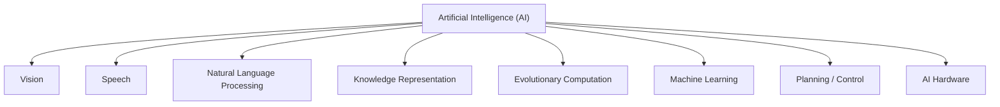

# The Promise of Machine Learning for Patent Landscaping

Andrew A. Toole, Chief Economist, U.S. Patent and Trademark Office Nicholas A. Pairolero, Economist, U.S. Patent and Trademark Office James Q. Forman, Data Scientist, Google Alexander V. Giczy, Data Scientist, U.S. Patent and Trademark Office (Addx Corporation)

USPTO Economic Working Paper No. 2020-1 March 2020

The views expressed are those of the individual authors and do not necessarily reflect official positions of the Office of the Chief Economist or the U. S. Patent and Trademark Office. USPTO Economic Working Papers are preliminary research being shared in a timely manner with the public in order to stimulate discussion, scholarly debate, and critical comment. For more information about the USPTO’s Office of the Chief Economist, visit www.uspto.gov/economics.

# The Promise of Machine Learning for Patent Landscaping

Andrew A. Toole

Chief Economist, U.S. Patent and Trademark Office

Nicholas A. Pairolero

Economist, U.S. Patent and Trademark Office

James Q. Forman

Data Scientist, Google1

Alexander V. Giczy

Data Scientist, U.S. Patent and Trademark Office (Addx Corporation)

ABSTRACT: Patent landscaping involves the identification of patents in a specific technology area to understand the business, economic, and policy implications of technological change. Traditionally, patent landscapes were constructed using keyword and classification queries, a labor-intensive process that produced results limited to the scope of the query. In this paper, we discuss the advantages and disadvantages of using machine learning to produce patent landscapes. Machine learning leverages traditional queries to construct the data necessary to train the machine learning models, and the models allow the resultant landscapes to extend more broadly into areas of technology not expected a priori. The models, however, are “black boxes” that limit transparency into their underlying reasoning. To illustrate these points, we summarize two landscapes we recently conducted, one in mineral mining and another in artificial intelligence.

DISCLAIMER: The views expressed are those of the individual authors and do not necessarily reflect the official positions of the Office of the Chief Economist or the U.S. Patent and Trademark Office.

ACKNOWLEDGEMENTS: We wish to thank Kakali Chaki, Jesse Frumkin, Christian Hannon, Anne Thomas Homescu, David Landrith, Steve Melnick, David B. Orange, Christyann Pulliam, and Matthew Such, current and former employees at the U.S. Patent and Trademark Office for their assistance regarding the machine learning approach used in the AI Landscape.

# Introduction

Patent landscaping identifies patents in a specific technology area to understand the business, economic, and policy implications of technological change. It has traditionally been a time consuming and complex process relying on the careful construction of queries to identify relevant patents (Trippe 2015; Abood and Feltenberger 2018). Recent machine learning advances promise to reduce these costs by automating landscaping while providing scalability and accuracy (Abood and Feltenberger 2018). This paper provides an overview of how machine learning overcomes shortcomings of traditional approaches, and clarifies these points by describing two studies conducted by the U.S. Patent and Trademark Office (USPTO).

# Traditional Approach

Several traditional methods exist to search for patents: (1) keywords against patent text, (2) classification classes, and (3) citations. These queries may be narrow or broad, and allow for precise control over results. This leads to high transparency in the resulting landscape. There are, however, several shortcomings. Queries may become very complex with keyword synonyms explicitly stated. Since words and concepts change over time (e.g., “horseless carriages” are now “automobiles”), a specific query may become less effective over time. Word context matters (e.g., oil “extraction” versus dental “extraction”), and the applicant may be their own lexicographer.2 Patent classification schema are dynamic: classes are created for new technologies or to reduce the scope of large existing classes. Finally, citations are subject to truncation error and may be influenced by many factors (Lerner and Seru 2017)3. All these considerations lead to increasingly complex queries. Table 1 displays a query from a WIPO (2019) landscape to illustrate.

Table 1. Sample text query for artificial intelligence 

<table><tr><td>(((ARTIFIC+ OR COMPUTATION+) 1W INTELLIGEN+) OR (NEURAL 1W NETWORK+) OR NEURAL_NETWORK+ OR NEURAL_NETWORK+ OR (BAYES+ 1W NETWORK+) OR BAYESIAN-NETWORK+ OR BAYESIAN_NETWORK+ OR (CHATBOT?) OR (DATA 1W MINING+) OR (DECISION 1W MODEL?) OR (DEEP 1W LEARNING+) OR DEEP-LEARNING+ OR DEEP_LEARNING+ OR (GENETIC 1W ALGORITHM?) OR ((INDUCTIVE 1W LOGIC) 1D PROGRAMM+) OR (MACHINE 1W LEARNING+) OR MACHINE_LEARNING+ OR MACHINE-LEARNING+ OR ((NATURAL 1D LANGUAGE) 1W (GENERATION OR PROCESSING)) OR (REINFORCEMENT 1W LEARNING) OR (SUPERVISED 1W (LEARNING+ OR TRAINING)) OR SUPERVISED-LEARNING+ OR SUPERVISED_LEARNING+ OR (SWARM 1W INTELLIGEN+) OR SWARM-INTELLIGEN+ OR SWARM_INTELLIGEN+ OR (UNSUPERVISED 1W (LEARNING+ OR TRAINING)) OR UNSUPERVISED-LEARNING+ OR UNSUPERVISED_LEARNING+ OR (SEMI-SUPERVISED 1W (LEARNING+ OR TRAINING)) OR SEMI-SUPERVISED-LEARNING OR SEMI_SUPERVISED_LEARNING+OR CONNECTIONIS# OR (EXPERT 1W SYSTEM?) OR (FUZZY 1W LOGIC?) OR TRANSFER-LEARNING OR TRANSFER_LEARNING OR (TRANSFER 1W LEARNING) OR (LEARNING 3W ALGORITHM?) OR (LEARNING 1W MODEL?) OR (SUPPORT VECTOR MACHINE?) OR (RANDOM FOREST?) OR (DECISION TREE?) OR (GRADIENT TREE BOOSTING) OR (XGBOOST) OR ADABOOST OR RANKBOOST OR (LOGISTIC REGRESSION) OR (STOCHASTIC GRADIENT DESCENT) OR (MULTILAYER PERCEPTRON?) OR (LATENT SEMANTIC ANALYSIS) OR (LATENT DIRICHLET ALLOCATION) OR (MULTI-AGENT SYSTEM?) OR (HIDDEN MARKOV MODEL?))/BI/OBJ/CLM</td></tr></table>

Source: WIPO Technology Trends 2019 Artificial Intelligence, Data collection and method and clustering scheme: Background paper, 23.

This approach is essentially trial and error -- defining a query, examining results, refining the query – and may become very time consuming. In the end, the results mirror a priori expectations about where the technology is and what language is used to describe it.

# Machine Learning Approach

Patent landscaping is a classification problem: does a patent document belong in the technology of interest or not? Models classify patent documents by learning from a set of pre-classified documents belonging to the technology of interest (the “seed” set) and not (the “anti-seed” set). Traditional queries build the seed set; the anti-seed set is trickier. Abood and Feltenberger (2018) solve this problem by expanding from the seed set using families, citations, or classifications, and randomly sample outside this expansion (presumed unlikely to contain the technology of interest) for the anti-seed set.4 Several models may be used, e.g., support vector machines (SVM) and neural networks (Abood and Feltenberger 2018; Alderucci 2019). Inputs commonly include patent text (or a subset thereof) and may be augmented by classification and citations. Text must be encoded.5 Model output is typically the probability that a given document is in the technology of interest.

One advantage of this approach is results are not constrained to the seed queries, enabling the landscape to better capture diffusion across technology. However, the seed and anti-seed must be representative, with the seed set covering all significant aspects of the target technology or the model will not detect these aspects, and borderline cases (i.e. patents that are more challenging to classify) should be included in training. One disadvantage is a lack of transparency, particularly with more complex models. Finally, if traditional approaches are overly narrow then machine learning runs the risk being overly broad, classifying documents a posteriori for reasons that are not entirely clear.

# Examples

# Mineral Mining

This project explored the safety and health impact of U.S. mineral mining patents (Toole et al. 2019). A mineral mining patent landscape was a necessary starting point. After receiving a dataset of 92,000 patents generated using a set of queries, it became evident the dataset contained non-relevant documents; e.g., data mining and landmines. Manual filtering was impractical, so we employed a machine learning approach. For the seed set we matched patent assignees to known mining companies and extracted their patents, and for the anti-seed set to known oil/gas and non-mining companies.6 We selected an SVM model. Only 50% of the original 92,000 patents were classified as relevant to mineral mining. We further used queries and a neural network to identify safety and health-related patents. Machine learning, in combination with traditional query methods, allowed us to complete our analysis with a high degree of confidence.

# Artificial Intelligence

In the second project, we developed a patent landscape for U.S. AI patents7 using the approach of Abood and Feltenberger (2018). Since a consensus definition of AI does not exist (Russell and Norvig 2009), we defined eight AI categories (Figure 1).

Figure 1. USPTO artificial intelligence patent landscape AI categories.   

flowchart

We trained a neural network for each category, with seed sets drawn from narrowly defined traditional search queries.8 The models included patent abstract text, claims text, and citations as inputs. This analysis resulted in 1.3M of 11.7M patent documents (10.8%) categorized in at least one of the eight AI categories.

Additionally, we manually scored 800 randomly selected documents ex post facto using experienced patent examiners, enabling us to review and compare results across methodologies (Table 2). The review shows that our seed and anti-seed sets were not perfect, although this may be due to interpretation differences across examiners, highlighting difficulties in defining AI. Of the different methods, the evaluation examiners outperform based on F1 scores,9 and accuracy is comparable across all.10 Interestingly, the traditional approach used in Cockburn et al. (2018) did not identify any AI documents in our sample, illustrating the limitations of overly narrow queries. Our neural network model achieved higher recall than WIPO’s (2019) traditional query approach, and our higher F1 score indicates our method did not adversely sacrifice precision.

Table 2. AI Landscape model comparisons 

<table><tr><td></td><td colspan="2">USPTO Model Seed/Anti-seed Generation</td><td colspan="5">Comparison of Scoring and AI Model Predictions</td></tr><tr><td></td><td>Seed</td><td>Anti-seed</td><td>Manual scoring</td><td>USPTO Model</td><td>Cockburn (recreated)</td><td>WIPO (recreated)</td><td>Naïve (all not AI)</td></tr><tr><td>precision</td><td>0.9213</td><td>0.9259</td><td>0.3478</td><td>0.4054</td><td>0</td><td>0.6667</td><td>0</td></tr><tr><td>recall</td><td>1.0000</td><td>1.0000</td><td>0.8163</td><td>0.3750</td><td>0</td><td>0.1000</td><td>0</td></tr><tr><td>accuracy</td><td>0.9213</td><td>0.9259</td><td>0.8142</td><td>0.8723</td><td>0.8913</td><td>0.8967</td><td>0.8913</td></tr><tr><td>F1 score</td><td>0.9590</td><td>0.9615</td><td>0.4878</td><td>0.3896</td><td>0</td><td>0.1739</td><td>0</td></tr></table>

Source: USPTO analysis

Notes: Each of the randomly selected patent documents was manually scored by two patent examiners, and disagreements adjudicated by a third. USPTO model seed and anti-seed generation compare examiner scoring to the assumption that seed and anti-seed documents are all AI and all not-AI, respectively. Manual scoring results include adjudication. Cockburn et al. (2018) and WIPO (2019) results were recreated and limited to the documents reviewed by the patent examiners; naïve results are based on the assumption that all document are predicted as being not-AI.

# Conclusions

Both traditional queries and machine learning are beneficial in patent landscaping. In our mineral mining study, the query returned results that were too broad, and we pruned this set down by using machine learning. In our AI study, we used a narrow query to build training data (seed and anti-seed sets). The machine learning classifier then accurately identified a landscape beyond patents obtained through traditional approaches. Seed and anti-seed generation is crucial to machine learning, as is rigorous evaluation. Manual review outperforms any traditional or machine learning approach but is too costly to scale to large document sets. The promise of machine learning is not to replace traditional query approaches but to allow the landscape to extend beyond preconceived notions of where, and what constitutes the technology. This greater representation allows for better decision-making by business leaders and policy-makers.

# References

Abood, A. and Feltenberger, D., 2018. “Automated patent landscaping.” Artificial Intelligence and Law, 26(2), 103-125. Available at: https://doi.org/10.1007/s10506-018-9222-4.   
Alderucci D., Hovy E., Zolas N., Branstetter, L., and Runge A., 2019 (Preliminary) “Quantifying the Impact of AI on Productivity and Labor Demand: Evidence from U.S. Census Microdata.” Available at: https://www.aeaweb.org/conference/2020/preliminary/paper/Tz2HdRna.   
Cockburn, I.M., Hendersoni, R., and Stern, S., 2018. The Impact of Artificial Intelligence on Innovation. (No. w24449). National bureau of economic research. Available at: https://www.nber.org/papers/w24449.   
Devlin, J., Chang, M. W., Lee, K., and Toutanova, K., 2018. “Bert: Pre-training of deep bidirectional transformers for language understanding.” arXiv preprint arXiv:1810.04805.   
Kuhn, J.M., Younge, K.A. and Marco, A.C., 2019. “Patent citations reexamined.” RAND Journal of Economics, Forthcoming.   
Lerner, J., & Seru, A., 2017. “The use and misuse of patent data: Issues for corporate finance and beyond” (No. w24053). National Bureau of Economic Research.   
Mikolov, T., Sutskever, I., Chen, K., Corrado, G. S., and Dean, J., 2013. “Distributed representations of words and phrases and their compositionality.” Advances in neural information processing systems, 3111-3119.   
Russell, S.J. and Norvig, P., 2016. Artificial intelligence: a modern approach. Malaysia; Pearson Education Limited.   
Toole, A., Forman, J., and Tesfayesus, A., 2019. “The Miner Act of 2006: Innovating for Safety and Health in U.S. Mining.” USPTO Economic Working Paper No. 2019-01. Available at SSRN: https://ssrn.com/abstract=3376091 or http://dx.doi.org/10.2139/ssrn.3376091.   
Trippe, A., 2015. Guidelines for Preparing Patent Landscape Reports. Geneva: World Intellectual Property Organization. Available at: https://www.wipo.int/edocs/pubdocs/en/wipo\_pub\_946.pdf.   
U.S. Patent and Trademark Office (USPTO), 2018. Manual of Patent Examination Procedure (MPEP), 9th Edition, Revision 08.2017. Available at: https://www.uspto.gov/web/offices/pac/mpep/index.html.   
Wikipedia. “F1 score” webpage. https://en.wikipedia.org/wiki/F1\_score; last accessed February 10, 2020.

Wikipedia. “Bag-of-words model” webpage. https://en.wikipedia.org/wiki/Bag-of-words\_model; last accessed March 2, 2020.

World Intellectual Property Organization (WIPO), 2019. WIPO Technology Trends 2019: Artificial Intelligence. Available at: https://www.wipo.int/tech\_trends/en/artificial\_intelligence.