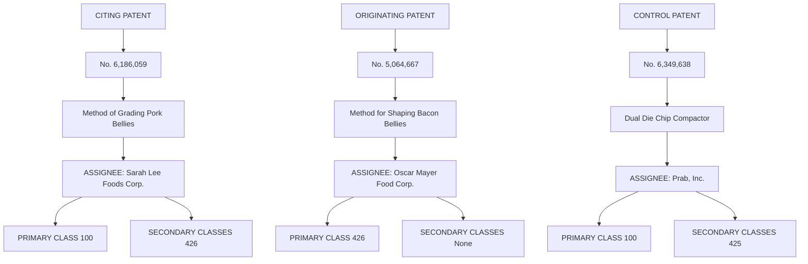

# Patent Citations and the Geography of Knowledge Spillovers: A Reassessment

Peter Thompson Carnegie Mellon University and Melanie Fox-Kean University of Houston

April 2002 Revised January 2004

Forthcoming: American Economic Review

Jaffe, Trajtenberg and Henderson (Quarterly Journal of Economics, 108(3):577- 98, 1993) developed a matching method to study the geography of knowledge spillovers using patent citations, and found that knowledge spillovers are strongly localized. Their method matches each citing patent to a non-citing patent intended to control for the pre-existing geographic concentration of production. We show how the method of selecting the control group may induce spurious evidence of localized spillovers. This paper reassesses their findings using control patents selected under different criteria. Doing so eliminates evidence of strong intranational localization effects at the state and metropolitan levels, but leaves largely unaffected evidence of international localization effects. (JEL O310, O340)

Thompson: Carnegie Mellon University, Dept. of Social & Decision Sciences,208 Porter Hall, Pittsburgh, PA 15213 (email: pt@andrew.cmu.edu); Fox-Kean: Department of Economics, University of Houston, Houston TX, 77204-5882. We have benefited from insightful comments from three anonymous referees This research was supported by the National Science Foundation under Grant No. SBR-0296192.

A revival of interest in economic geography during the last decade has renewed efforts at measuring location-specific externalities. These efforts have largely been guided by Alfred Marshall’s (1920) three explanations for agglomeration economies: labor market pooling, scale economies in the provision of intermediate goods and services, and localization of knowledge spillovers. Perhaps because, as Paul R. Krugman (1991, p. 53) has argued, “knowledge flows . . are invisible; they leave no paper trail by which they may be measured and tracked”,1 the measurement of knowledge spillovers has proved the most challenging task.

The challenge was taken up most prominently by Adam B. Jaffe, Manuel Trajtenberg and Rebecca Henderson (1993, hereafter JTH), who pointed out that knowledge spillovers may well leave a paper trail in the citations to prior art recorded in patents. Moreover, because patents record the residence of the inventors they are an invaluable resource for studying how knowledge flows are affected by geography. JTH undertook the considerable task of constructing a large dataset of patents and matching the locations of their inventors to the locations of inventors of all patents that subsequently cited them as prior art.

Of course, such an exercise would be futile unless one can also control for the existing geographic distribution of production. Patents linked by citation presumably not only share a technology, but they are often developed by inventors working in a common industry. Patents linked by citation are therefore much more likely to share a geographic location than are a pair of patents drawn at random from the entire pool, but the observation tells us nothing about knowledge flows. JTH’s important innovation was to construct a control group to mimic the existing geography of production.

JTH constructed three patent samples, a set of originating patents, a set of citing patents which referenced one of the originating patents, and a set of control patents matched to each citing patent. Each control patent shared the same technology class and (approximate) application date as its matched citing patent, but did not reference the matched originating patent. JTH's experiment was to compare the probabilities that the citing patent and its matched control patent were filed by inventors living in the same geographic location as the originating patent. The experiment yielded remarkable evidence that knowledge spillovers are localized. Citing patents were up to 1.2 times more likely than the control patents to come from the same country as the originating patent, up to two times more likely to come from the same state, and up to six times more likely to come from the same metropolitan area.

The number of citations a patent receives has also been used as a proxy for its value (see, e.g., Trajtenberg, 1990; Bronwyn H. Hall, Jaffe and Trajtenberg, 2000). By the same criterion, the citations to JTH’s paper places it far in the upper tail of the value distribution. JTH’s results have been used to motivate numerous theoretical models of growth and geography in which localized knowledge spillovers are simply assumed (e.g. Edward L. Glaeser, 1999), and their methodology has been applied with similar results in more specialized settings (e.g. Paul Almeida, 1996; Tony S. Frost, 2001; Diana Hicks et al., 2001; Jaffe and Trajtenberg, 1999). Now that a wealth of patent data has been released to the profession (Hall, Jaffe, and Trajtenberg, 2001), we expect to see many more applications of their methods.

This paper argues that the evidence for localized knowledge spillovers generated by JTH’s matched case-control methodology includes a significant spurious component. Controlling for unobservables using matching methods is invariably a dangerous exercise because one can rarely be confident that the controls are doing their job. In some applications imperfect matching may simply introduce noise and a corresponding loss of efficiency, but these are not the applications where matching is critical. In applications such as JTH’s, where matching is critical, imperfect matching induces systematic bias in the results. We show that JTH’s selection of control patents using technology classifications cannot adequately control for the existing geographic distribution of production, and that failure to do so accounts for much of the evidence that knowledge spillovers are localized.

There are at least two reasons why JTH’s method does not adequately control for existing patterns of industrial activity. First, control patents were selected using the broad, three-digit, technological classification codes of the US patent office, a level of aggregation that suppresses considerable within-class heterogeneity. Second, patents typically contain many distinct claims, to each of which a technological classification is assigned. The particular claim in a citing patent that can be associated with a citation to prior art may be quite distinct from the claim that generated the corresponding control patent. These two features of the control selection process mean there is no guarantee that the control patent has any industrial similarity either to the citing or to the originating patent.

We construct a new dataset in which control patents are selected under different criteria. First, we select controls patents using the technology subclass, a much finer level of disaggregation than the three-digit classification scheme. Second, we restrict attention to originating-citing-control triads in which all three patents have at least one subclass in common. We then apply JTH’s methods to the new dataset. While we continue to find evidence of international localization effects similar in magnitude to those found by JTH, there is no evidence of the remarkably strong intranational localization reported in JTH.

The remainder of the paper is organized as follows. Section I explains further the problems induced by JTH’s selection method. Section II describes the methods used to construct our dataset. Section III reports our results on geographic matching rates. Section IV concludes.

# I. The Selection of Control Patents

This section describes in more detail our two principal concerns with the way in which control patents have been selected. The first is the level of aggregation in the technological classes used. The second is that the selection process does not ensure the existence of any industrial link between the originating and control patents.

# A. The Aggregation Problem

The three-digit level in the US classification system (USCS) for patents groups together highly disparate technologies and industries. If a citing patent falls into the same three-digit technological class as the originating patent, it is also likely to fall into the same subclass. In contrast, the control patent is likely to be drawn from a different subclass, and consequently fails to control for preexisting geographic patterns of production. It then follows that the control patent is less likely to be filed by an inventor in the same location as the originating patent for the simple reason that it is more likely to be relevant to a different industry.

As illustration, consider class "231-Whips and Whip Apparatus”, which JTH cite as an example of the narrowness of the three-digit technological divisions. For reasons not relevant to the present paper, this is a technological class with which one of us happens to be quite familiar. And it turns out that there is a lot more to whips and whip apparatus than you might think. Class 231 contains seven distinct subclasses, which can usefully be grouped into three economically distinct activities. Subclass 231.1 consists of machines peculiar to whip manufacture, mostly rolling, pressing, and shaping machines. Subclasses 231.2 through 231.6 consist of whips, convertible whips and canes, lashes, lash fastenings, and joints, i.e. the pieces that one would expect to go into the average whip. The third subclass, "231.7-Electric Prods", is a rather different beast, and in the last 25 years has yielded patents for cattle prods, electric dog collars, personal security devices and the rather more intriguing electrically chargeable trousers.2 Class 231 has yielded 39 patents since January 1, 1976, one in 231.1, seventeen in 231.2 through 231.6, and 21 in 231.7. These patents cite 305 domestic utility patents as prior art, of which 222 (73 percent) references are to patents sharing at least one three-digit classification with the citing patent. Once there is a match at the three-digit level, a match at the subclass level is likely: 179 (81 percent) of the pairs with a three-digit match also have at least one subclass match.3

These numbers are not atypical. In a sample of 7,627 citations to patents granted in January 1976 (the construction of which is explained in Section II), a somewhat lower 63 percent of the originating-citing pairs share at least one threedigit class, but an identical 81 percent of these also share at least one subclass.

In view of these numbers, how much spurious localization of knowledge might we expect to infer from selecting control patents at the three-digit level? Consider the following thought experiment. There is a patent class with k distinct subclasses, each of which is produced in the same number of geographic regions, and each of which generates the same number of patents. It then follows that the probability that a control patent selected at the three-digit level is taken from the same subclass is approximately 1/k. 4 Assume also that 0.63x0.81=51 percent of originating-citing pairs share the same subclass. The extent to which inferences about localization of knowledge spillovers are biased depends on the fraction of output of each subclass that is produced in geographically distinct areas. It will be convenient to divide the class into two groups: group A consists only of subclass 1, while group B consists of the remaining k−1 subclasses. Imagine that there are n geographic regions; that production of group B is uniformly distributed across all n regions; and production of group A is uniformly distributed across $m \leq n$ regions. It is then easy to calculate that, absent localization of knowledge spillovers, the probability that the citing patent is from the same region as the originating patent is given by $P _ { 0 } { = } 0 . 5 1 / m { + } 0 . 4 9 / n$ , while the probability that the three-digit control patent is from the same region is

$$
P _ {1} = 0. 6 3 \left(\frac {1}{k m} + \frac {k - 1}{k n}\right) + 0. 3 7 \left(\frac {1}{n}\right).
$$

The ratio of the citing matching rate to the control matching rate, $P _ { 0 } / \ P _ { 1 ; }$ depends on the three parameters k, m, and n. At the metropolitan level, JTH used the 1981 definitions of the 17 consolidated metropolitan statistical areas (CMSAs) plus one artificial CMSA for foreign patents and 50 artificial CMSAs, one for each state, containing all inventor locations not included in one of the 17 official CMSAs. Only 4.5 percent of patents were assigned to the artificial domestic CMSAs and, as the bias problem is rapidly increasing in n, we can set $n { = } 1 8$ . k varies significantly across three-digit classes. Class 231, with seven subclasses, has an unusually small number, and many three-digit manufacturing classes have more than one hundred. Finally, we have no information on m. Figure 1 therefore plots the ratio $P _ { 0 } / P _ { 1 }$ for all possible values of m when $n { = } 1 8$ , and $k = \{ 1 0 , 2 5 , 5 0 $ , 100}. A ratio of unity implies no spurious evidence for localization of knowledge spillovers, but is obtained only when the originating patent is produced in every single area. For $m { < } n ,$ , in contrast, $P _ { 0 } > P _ { 1 }$ , and the ratio becomes especially large for large values of k/m. Note in particular that the ratio can handily exceed the values reported by JTH.

The importance of aggregation bias evidently turns on the number m of regions in which the average subclass is produced. But because production data coincide neither with CMSAs nor the USCS, we cannot address this question directly. What we can attempt to do, however, is ameliorate the aggregation problem by constructing a version of the JHK data set in which control patents are selected at the technological subclass level, rather than at the three-digit level.

line

| m, number of regions in which A is produced | k=100 | k=50 | k=25 | k=10 |
| --------------------------------------------- | ----- | ---- | ---- | ---- |
| 0                                             | 9.0   | 8.5  | 7.5  | 6.5  |
| 3                                             | 4.5   | 4.0  | 3.5  | 3.0  |
| 6                                             | 2.5   | 2.2  | 2.0  | 1.8  |
| 9                                             | 1.8   | 1.7  | 1.6  | 1.5  |
| 12                                            | 1.5   | 1.4  | 1.3  | 1.2  |
| 15                                            | 1.3   | 1.2  | 1.1  | 1.05 |
| 18                                            | 1.1   | 1.05 | 1.0  | 1.0  |

FIGURE 1. SPURIOUS LOCALIZATION EFFECTS

# B. How Well Do Control Patents Do Their Job?

Consider a citing patent that contains claims in two subclasses, A and B, where subclass A is the primary classification assigned to the patent. It cites prior art protected by a patent in subclass B, but a control patent is selected using the primary subclass A. It is possible under these circumstances that the control patent and the originating patent have no technological class in common. Sometimes, of course, this produces exactly what we want: the control and citing patents have an industry in common, but only the citing patent exploits knowledge embodied in the originating patent. But in many other cases, the outcome is perverse: the originating and citing patents come from the same industry but the control and citing patents are essentially unrelated.

Figure 2 provides an illustration. An originating patent for a method to shape bacon bellies was assigned to packaged meat manufacturer Oscar Mayer Food Corporation. At a later date, Sara Lee Foods Corporation, also a major manufacturer of packaged meats, was assigned a patent for grading pork bellies. The latter patent required that the pork bellies be flattened prior to grading, and cited Oscar Meyer’s prior art. Obtaining the matching control patent using the primary class is a deterministic process and in this case it leads at the three-digit level to a patent for a metal chip compactor, assigned to Prab Inc., a manufacturer of metal scrap reclamation systems. The technological classification that links the control and citing patents turns out to be a generic class covering any type of press, whose only commonality is that they are “apparatus for subjecting material to compressive force” (USPTO, 2002).5

The problems illustrated in Figure 2 do not simply introduce noise that can be overcome with a sufficiently large sample size. Sometimes the control patents do their job and sometimes they do not, and those that do not introduce systematic bias into the empirical analysis. Overcoming this problem is not straightforward. Selecting control patents using technological subclasses may reduce the bias, but it cannot eliminate it. For example, the primary subclass, 100/35, for the Sara Lee patent leads to a different control patent. In this case, however, we make little progress, because the new control patent is for a method to reduce variations in the gloss on certain types of paper. The patent is assigned to Stora Enso North America, a major paper manufacturer.

In an attempt to further reduce the bias, one might restrict the sample to observations in which the originating and control patents also share at least one subclass in common. This restriction will increase the likelihood that all three matched patents are drawn from firms engaged in similar activities. Doing so may go too far, because citing and originating patents need not have a technological code in common. Nonetheless, if knowledge spillovers are localized, they should continue to be evident even in this restricted sample.

flowchart

FIGURE 2. UNRELATED PATENTS   
Note: Although the citing and originating patents share a technological class, and the citing and control patents share a technological class, the originating and control patents are unrelated. In the example here, the citing and originating patents belong to firms operating in a common industry (meat processing), but the control patent does not.

# II. Data Construction

In this section we describe how we constructed a dataset to address the concerns raised above. We began with a sample of 2,724 originating patents consisting of all patents granted during January 1976 (the first month for which text search capabilities are offered), that had at least one inventor domiciled in the United States, and that was assigned to a company or institution. We then identified 18,551 patents granted between January 1976 and April 2001 that cite one or more of the originating patents. Finally we constructed two control groups. First, for each citing patent we paired it with a control patent having a similar application date and that matched the primary classification of its paired citing patent at the three-digit level. The second group selected control patents that matched the primary classification of its paired citing patent at the level of the subclass.6

These datasets are analogs to those created by JTH, and our intention was to match their data construction procedure as closely as possible. However, financial constraints required us to extract our data from the U.S. Patent and Trademark Office (USPTO) web site, with consequent limitations on access speed and search capabilities. These limitations imposed some minor differences between our procedure and JTH’s:

• JTH selected controls in which the primary class of the citing patent matched the primary class its control patent. We match the primary class of the citing patent to any class of the selected control patent.   
• Among all admissible control patents (i.e. those with a technological match to the citing patent but that do not cite the corresponding originating patent), JTH deterministically selected the control patent that most closely matched the citing patent’s application date. We randomly selected a control from all admissible patents with application dates within a one-month window either side of the citing patent’s application date. If no admissible patent was found within the plus-or-minus onemonth window, the search was repeated with a plus-or-minus threemonth window and again, if necessary with a plus-or-minus six-month

window. If no control patent could be located within the widest window, a null observation was returned.7

The sample was then culled in three ways. First, following JTH we eliminated self-cites by removing observations in which the citing and originating patents had the same assignee. Second, we removed any observation for which we did not, as a result of our automated data extraction procedure, have readable data.8 Third, we removed observations for which either the citing patent or either of the two controls patents were not assigned to a corporation or institution.9

The final task was to assign geographic locations to each patent. Patents report the towns/cities and states of the inventors. These were first converted to counties and then to the 17 CMSAs as defined in 1981, using correlation files provided by the Office of Social and Economic Data Analysis (OSEDA) of the University of Missouri. Following JTH we also created one phantom CMSA for foreign patents and 50 phantom CMSAs, one for each state, containing all locations not included in one of the 17 CMSAs. For each patent we made a list of the locations of all domestic inventors, and then selected at random a single inventor from this list to assign a unique location to the patent.10

The resulting data set is composed of 7,627 observations generated from 1,913 originating patents, each of which has four elements: an originating patent, a citing patent, and two controls. Table 1 provides some details. At the three-digit level, 58 percent of the observations match the primary class of the citing patent to the primary class of the control. The primary matching rate at the subclass level is rather lower, at 31.5 percent. Unsurprisingly, in view of the modest number of three-digit classes and the very large number of subclasses defined by the USPTO, almost all three-digit controls have an application date within the narrowest window around the citing patent’s application date, but this was the case for only 71.5 percent of the disaggregated controls.

TABLE 1   
Sample Sizes 

<table><tr><td rowspan="2"></td><td rowspan="2">TOTAL (N)</td><td colspan="2">RATE OF TECHNOLOGICAL CLASSIFICATION MATCHING BETWEEN CONTROLS AND CITING PATENTS</td><td colspan="3">PERCENTAGE OF CONTROL PATENTS WITH APPLICATION DATE WITHIN A GIVEN TIME-WINDOW OF CITING PATENT APPLICATION DATE</td></tr><tr><td>PRIMARY USC (%)</td><td>SECONDARY USC (%)</td><td>+/- 1 MONTH</td><td>+/- 3 MONTHS</td><td>+/- 6 MONTHS</td></tr><tr><td>ORIGINATING</td><td>1,913</td><td>—</td><td>—</td><td>—</td><td>—</td><td>—</td></tr><tr><td>CITING</td><td>7,627</td><td>—</td><td>—</td><td>—</td><td>—</td><td>—</td></tr><tr><td>3-DIGIT CONTROL</td><td>7,627</td><td>58.1</td><td>41.9</td><td>&gt;99.9</td><td>&lt;0.1</td><td>0.0</td></tr><tr><td>DISAGGREGATED CONTROLS</td><td>7,627</td><td>31.5</td><td>68.5</td><td>70.5</td><td>21.0</td><td>8.5</td></tr></table>

such that one patent in each pair has all inventors located in Los Angeles, while the other has two inventors located in Los Angeles and three in New York. JTH’s plurality approach would fail to show a match between any such pairs; the alternative makes a match between every such pair. Because our interest is in the aggregate proportion of geographic matches, a methodology that weights the proportion of matches according to the degree of overlap seems appropriate. The methodology we use does this, and in the present example would produce a geographic match 40 percent of the time.

# III. Results

If, as we have argued, the disaggregation of technological classes matters for geographic location, the fraction of control patents that match the location of the citing patent will be higher the greater the disaggregation. Table 2 provides support for this prediction. The matching rates at the disaggregated level are 1.06, 1.35 and 1.38 times greater than at the aggregated level for the country, state, and CMSA respectively, and all these differences are statistically significant at the one percent level.

Table 3 presents the main results. Columns (1) and (2) of Table 3 summarize the sample-weighted geographic matching rates for the 1975 and 1980 cohorts of corporate originating patents presented in Table III of JTH. Their findings for this sample were that, excluding self-citations, (a) 68.0 [11.2, 7.3] percent of citing patents matched the country [state, CMSA] of the corresponding originating patent; (b) 62.1 [6.4, 2.2] percent of control patents matched the country [state, CMSA] of the corresponding originating patent. That is, a citing patent is 1.1 times more likely than the control patent to match the originating patent country, 1.7 times more like to match the state, and 3.3 times more likely to match the CMSA. These differences are statistically significant at a level much less than the one percent.

TABLE 2 Geographic Matches Between Citing and Control Patents 

<table><tr><td rowspan="2"></td><td colspan="2">CONTROL PATENTS</td></tr><tr><td>3-DIGIT</td><td>DISAGGREGATED</td></tr><tr><td>PERCENTAGE MATCHED COUNTRY</td><td>53.79</td><td>57.17(4.20)</td></tr><tr><td>PERCENTAGE MATCHED STATE</td><td>17.65</td><td>23.93(9.58)</td></tr><tr><td>PERCENTAGE MATCHED CMSA</td><td>16.14</td><td>22.23(9.58)</td></tr></table>

Numbers in parentheses in DISAGGREGATED column give the t-statistic for the test of equality between the indicated geographic matching rate and the corresponding matching rate for the 3-DIGIT controls.

ABLE   
hic Matching Rates (Self-Citations R 

<table><tr><td rowspan="3"></td><td colspan="2">JTH&#x27;S CORPORATE PATENTS</td><td rowspan="3">CITING PATENTS</td><td rowspan="3">3-DIGIT CONTROLS</td><td colspan="3">DISAGGREGATED CONTROLS</td></tr><tr><td rowspan="2">CITING PATENTS</td><td rowspan="2">3-DIGIT CONTROLS</td><td colspan="2">CITING-CONTROL CODE MATCH</td><td rowspan="2">CONTROL PATENT HAS ANY SUBCLASS CODE IN COMMON WITH ORIGINATING PATENT</td></tr><tr><td>ANY CODE</td><td>PRIMARY CODE</td></tr><tr><td></td><td>(1)</td><td>(2)</td><td>(3)</td><td>(4)</td><td>(5)</td><td>(6)</td><td>(7)</td></tr><tr><td>NO. OF CITATIONS</td><td>4,234</td><td>4,234</td><td>7,627</td><td>7,627</td><td>7,627</td><td>2,466</td><td>2,122</td></tr><tr><td>% MATCH COUNTRY</td><td>68.0</td><td>62.1(5.70)</td><td>68.61</td><td>55.63(16.7)</td><td>55.74(16.5)</td><td>54.33(12.6)</td><td>56.93(9.74)</td></tr><tr><td>% MATCH STATE</td><td>11.2</td><td>6.4(7.53)</td><td>7.75</td><td>5.00(6.96)</td><td>6.03(4.20)</td><td>6.69(1.80)</td><td>7.73(0.03)</td></tr><tr><td>% MATCH CMSA</td><td>7.3</td><td>2.2(11.1)</td><td>5.22</td><td>3.47(5.31)</td><td>4.10(3.28)</td><td>4.37(1.76)</td><td>5.18(0.07)</td></tr></table>

are adjusted from those reported by JTH to reflect self-citation rates reported in their Table I. ghted average of their "top corporate" and "other corporate" samples for 1975 and 1980 origin

itations. Column (2) gives t-statistics for test of equality with the corresponding row entry i e test of equality between the indicated geographic matching rate and the corresponding mat

tatistics for test of equality with the corresponding row entry

Results from our new sample are reported in columns (3) through (7). The geographic matching rates for citing patents [column (3)] at the state and CMSA levels are a little lower than those obtained by JTH. Our citing patents were awarded over a period of 25 years compared with periods of nine and fourteen years for JTH’s two samples, so these lower matching rates are consistent with JTH’s finding that apparent localization effects appear to fade with time. However, the numbers remain comparable, particularly in the rate of decline in matching rates as we move to finer geographic entities.11

While the country and state matching rates of our three-digit control patents are also lower, our CMSA matching rate for the three-digit controls, at 3.47 percent, is noticeably higher than the rate reported by JTH.12 Nonetheless, our sample replicates JTH's central result that a citing patent is significantly more likely to match the location of the originating patent than is the three-digit control patent. As the t-statistics in column 4 show, the difference between the matching rates for the citing and for the three-digit controls are highly significant at each geographic level. Citing patents are 1.2 times more likely than the control patents to match the country, 1.6 times more likely to match the state and 1.5 times more likely to match the CMSA. In conclusion, we also obtain strong evidence of international and intranational localization effects from three-digit controls.

Columns (5) and (6) report the results of our attempts to resolve the bias created by the problem of aggregation. Column (5) reports the matching rates for the disaggregated controls in the full sample, while column (6) reports the rates when the sample is restricted to control patents whose primary subclass matches the primary subclass of the citing patent. At the state and CMSA levels, the introduction of the more disaggregated controls moves the matching rates in the direction expected. In column (5), the state and CMSA matching rates rise to 6.03 and 4.10 percent respectively, an increase of about 20 percent in each case. Restricting the sample to observations in which the primary subclass of the citing and control patents coincide further increases the matching rates at the state and CMSA levels. The new control group has a state matching rate of 6.7 percent and a CMSA matching rate of 4.4 percent. At the customary five percent standard, neither of these differ significantly from the citing-originating matching rates reported in column (3).

Column (7) further restricts the sample in an attempt to reduce the bias caused by a failure of the control selection procedure to ensure that there is some technological link across patents. The state and CMSA matching rates for the control sample, which now includes only patents that have at least one technological subclass in common with the originating patent, show further changes in the expected direction. The state matching rate between control and originating patents is now 7.7 percent, while the CMSA matching rate rises to 5.18 percent, both of which are virtually identical to the citing-originating matching rates.

The results for state and CMSA matching rates stand in stark contrast to those obtained for country matches. Moving from three-digit to disaggregated controls, and further restricting the control group to patents sharing a primary code with the citing patent, induce essentially no change in the country matching rate. Even with the restricted control groups, highly significant localization effects are apparent at the country level. The country matching rate for citing patents is 68.6 percent, while for the controls it stays within the narrow range of 54.3 to 56.9 percent across all columns.

It might reasonably be argued that the comparisons made across different sample sizes is inappropriate. In moving from column (5) to column (7), the control group has declined in size by about two-thirds, and it is possible that the reduced sample of 2,122 citing patents that are matched to the control patents in column (7) are systematically different from the full sample. It is not obvious why the reduced sample might differ from the full sample but, somewhat surprisingly, it does. Columns (1) and (2) provide the matching rates for the 2,122 citingoriginating pairs that correspond to the control patents in column (7) of Table 3, and the 5,505 that do not. The matching rate for the in-sample patents is lower at the country level, but higher at the state and CMSA levels, and each difference is significant at the five percent level. Column (3) replicates the matching rates from Column (7) of Table 3, but now tests them against the reduced sample of citing patents. On the basis of the t-statistics, the changes in the matching rates for the citing patents do not alter our conclusions.

TABLE 4 Geographic Matching Rates, Reduced Sample 

<table><tr><td rowspan="2"></td><td colspan="2">CITING PATENTS</td><td rowspan="2">CONTROL PATENTS (FROM COLUMN (7) OF TABLE 3)</td></tr><tr><td>IN SAMPLE</td><td>NOT IN SAMPLE</td></tr><tr><td></td><td>(1)</td><td>(2)</td><td>(3)</td></tr><tr><td>SAMPLE SIZE</td><td>2,122</td><td>5,505</td><td>2,122</td></tr><tr><td>PERCENTAGE MATCHED COUNTRY</td><td>66.11</td><td>69.57 (-2.89)</td><td>56.93 (6.17)</td></tr><tr><td>PERCENTAGE MATCHED STATE</td><td>8.77</td><td>7.36 (2.00)</td><td>7.73 (1.23)</td></tr><tr><td>PERCENTAGE MATCHED CMSA</td><td>6.07</td><td>4.89 (1.98)</td><td>5.18 (1.26)</td></tr></table>

Columns (2) and (3) give t-statistics for test of equality with the corresponding row entry in column (1).

# IV. Conclusions

We have evaluated the robustness of Jaffe, Trajtenberg and Henderson's (1993) evidence on the localization of knowledge spillovers inferred from patent citations. We had been concerned with the level of aggregation employed in selected patents designed to control for the existing geography of production, and with the fact that the method used to select control patents did not ensure that the control and originating patents had any technological class in common. JTH selected control patents using the three-digit technological classification system of the patent office, but patent citations are commonly made within more detailed technological subclasses. We showed how, if there is geographic concentration of production within subclasses, the use of the three-digit classification system may generate spurious evidence of localized spillovers. Using a sample of corporate and university originating patents, we found that selecting control patents with a finer technological classification accounts for a significant fraction of the evidence for state and CMSA localization effects inferred from the three-digit controls.13 The combination of using finer technological classifications and ensuring that the control and originating patents have at least one technological class in common eliminates any statistical support for intranational localization effects, evidence. Remarkably, in view of these results, JTH's finding of significant localization effects at the country level easily survive our reassessment.

Reporting these results is rather easier than interpreting them. An optimistic interpretation is that the underlying methodology in JTH is in principle capable of identifying localization effects as long as the controls are carefully selected, that the present paper has done so, and produced evidence that only national borders restrict knowledge flows. A natural corollary of this interpretation is that making financial resources available to merge subclass data into the Hall, Jaffe, and Trajtenberg (2000) database would be money well spent.

But this is just wishful thinking. The construction of controls using subclasses may enhance technological or industrial similarities between the citing and control patents, but subclasses are no panacea. It should not be forgotten that the USCS is a library classification system designed for the sole purpose of facilitating searches by patent examiners. Any correlation with industrial activity is purely incidental, and any application of the classification system to other ends is fraught with risk. Even disaggregated controls leave a lot of unobserved heterogeneity in industrial activity. Moreover, the use of subclasses introduces new problems, the full implications of which remain unexplored. Most important, for fully 40 percent of the time we were unable to find any subclass control patent with an application date within one year of the application date of the citing patent, and further restricting the type of subclass match only exacerbates this problem. One can easily construct scenarios in which these failures induce selection bias, some of which would have caused us to overestimate the geographic matching rates, others to underestimate it.14

The fact that our new selection criteria for control patents induce significant movements in matching rates must lead us to conclude that imperfect matching at the three-digit level is quantitatively important. But there is no doubt that matching remains far from perfect with the disaggregated controls. Moreover, the disaggregated controls introduce additional concerns. Perhaps a more productive route in the search for localized knowledge spillovers is to move away from the USPTO classification scheme altogether, merge citation data with other measures of technological and industrial proximity, and supplement matching methods with regression methods.15 But ultimately, any nonexperimental evidence for localization effects may always be attributed to unobserved within-technology heterogeneity. The implication is that we must devise identification strategies that

14 One referee suggested the following scenario. Assume that older industries produce fewer patents and are less geographically concentrated. Then citing patents for which no satisfactory controls were found are more likely to come from an older industry and less likely to share the same location as the control patent than are observations included in the sample. This will induce an underestimate of the localization of knowledge spillovers. But consider an alternative scenario. Subclasses that are more narrowly defined are more likely to generate controls closely related to their corresponding citing patents, but they also generate fewer patents. Under this scenario, the omitted observations are more likely to share the same location as the citing patent than are observations included in the sample.   
15 See, for example, Jaffe and Trajtenberg (2002), and Jasjit Singh (2003a, 2003b).

do not rely on attempts to measure and classify technology. One recent approach (Peter Thompson, 2004), which exploits within-patent variations in geographic matching for citations added by inventors and citations added by examiners finds evidence of modest localization effects. However, it remains to be seen whether alternative identification schemes such as this can also withstand closer scrutiny.

# References

Almeida, Paul. “Knowledge Sourcing by Foreign Multinationals: Patent Citation Analysis in the US Semiconductor Industry.” Strategic Management Journal, February 1996, 17(Winter Special Issue), pp.101-23.   
Almeida, Paul and Kogut, Bruce. “Localization of Knowledge and the Mobility of Engineers in Regional Networks.” Management Science July 1999, 45(7), pp. 905- 17.   
Frost, Tony S. “The Geographic Sources of Foreign Subsidiaries’ Innovations.” Strategic Management Journal, February 2001, 22(2), pp.101-23.   
Glaeser, Edward L. “Learning in Cities.” Journal of Urban Economics, September 1999, 46(2), pp. 254-77.   
Hall, Bronwyn H.; Jaffe, Adam B. and Trajtenberg, Manuel. “Market Value and Patent Citations: A First Look.” National Bureau of Economic Research (Cambridge, MA) Working Paper No. 7741, 2000.   
Hall, Bronwyn H.; Jaffe, Adam B. and Trajtenberg, Manuel. "The NBER Patent Citation Data File: Lessons, Insights and Methodological Tools." National Bureau of Economic Research (Cambridge, MA) Working Paper No. 8498, 2000.   
Hicks, Diane; Breitzman, Tony; Olivastro, Dominic and Hamilton, Kimberly. “The Changing Composition of Innovative Activity in the US – A Portrait Based on Patent Analysis.” Research Policy, April 2001, 30(4), pp. 681-703.   
Jaffe, Adam B. and Trajtenberg, Manuel. “International Knowledge Flows: Evidence from Patent Citations.” Economics of Innovation and New Technology, February 1999, 8(1), pp. 105-36.   
Jaffe, Adam B. and Trajtenberg, Manuel. Patents, Citations, and Innovations: A Window on the Knowledge Economy. Cambridge, MA: MIT Press, 2002.

Jaffe, Adam B.; Trajtenberg, Manuel and Henderson, Rebecca. "Geographic Knowledge Spillovers as Evidenced by Patent Citations." Quarterly Journal of Economics, August 1993, 108(3):577-98.   
Krugman, Paul R. Geography and Trade. Cambridge, MA: MIT Press, 1991.   
Marshall, Alfred. Principles of Economics, 8th edition. London: Macmillan, 1920.   
Singh, Jasjit. "Social Networks as a Determinant of Knowledge Diffusion Patterns." Working paper, Harvard Business School, 2003a.   
Singh, Jasjit. "Multinational Firms and Knowledge Diffusion: Evidence Using Patent Citation Data." Working paper, Harvard Business School, 2003b.   
Thompson, Peter. “Patent Citations and the Geography of Knowledge Spillovers: What do Patent Examiners Know?” Working paper, Carnegie Mellon University, 2004.   
Trajtenberg, Manuel. “A Penny for Your Quotes: Patent Citations and the Value of Innovations.” RAND Journal of Economics, Spring 1990, 21(1), pp. 172-87.   
USPTO. US Manual of Classification. United States Patent Office [http://www. uspto.gov/web/patents/classification/]. Accessed 5 April 2002.   
USPTO. Examiner Handbook to the U.S. Patent Classification System. [http://www.uspto.gov/web/offices/pac/dapp/sir/co/examhbk/index.html]. Accessed 25 July 2003a.   
USPTO. Manual of Patent Examining Procedure. 8th edition, August, 2001 (revised February 2003). [http://www.uspto.gov/web/offices/pac/mpep/index. html]. Accessed 25 July 2003b.