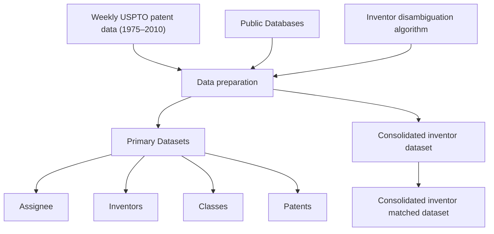
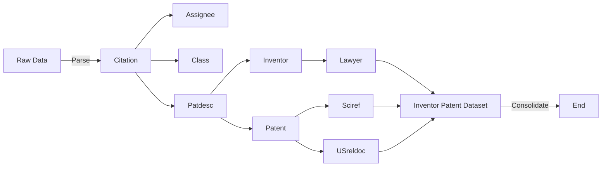
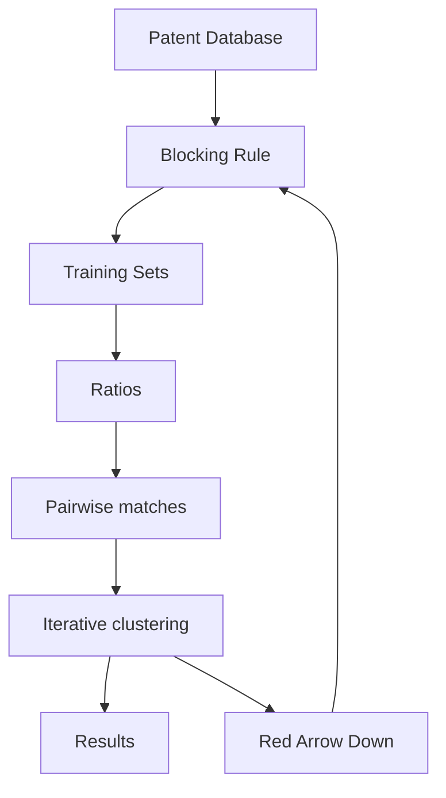

# Disambiguation and co-authorship networks of the U.S. patent inventor database (1975–2010)

CrossMark

Guan-Cheng Li a, Ronald Lai b, Alexander D’Amour c, David M. Doolind, Ye Sune, Vetle I. Torvik f , Amy Z. Yu g, Lee Fleming h,∗

a Fung Institute for Engineering Leadership, UC Berkeley College of Engineering, Berkeley, CA 94550, United States   
b Institute for Quantitative Social Science, Harvard University, Cambridge, MA 02138, United States   
c Department of Statistics, Harvard University, Cambridge, MA 02138, United States   
d CloudPassage, Inc., 153 Townsend Street, San Francisco, CA 94026, United States   
e Grantham, Mayo, Van Otterloo & Co. LLC, 40 Rowes Wharf, Boston, MA 02110, United States   
f Graduate School of Library and Information Science, University of Illinois at Urbana-Champaign, 501 E Daniel Street, Champaign, IL 6182, United States   
g MIT Media Lab, Massachusetts Institute of Technology, Cambridge, MA 02139, United States   
h Fung Institute for Engineering Leadership, UC Berkeley College of Engineering, Berkeley, CA 94550, United States

# a r t i c l e i n f o

Article history:

Received 24 November 2011

Received in revised form 18 January 2014

Accepted 19 January 2014

Available online 28 February 2014

Keywords:

Disambiguation

Patents

Networks

Inventors

Careers

# a b s t r a c t

Research into invention, innovation policy, and technology strategy can greatly benefit from an accurate understanding of inventor careers. The United States Patent and Trademark Office does not provide unique inventor identifiers, however, making large-scale studies challenging. Many scholars of innovation have implemented ad-hoc disambiguation methods based on string similarity thresholds and string comparison matching; such methods have been shown to be vulnerable to a number of problems that can adversely affect research results. The authors address this issue contributing (1) an application of the Author-ity disambiguation approach (Torvik et al., 2005; Torvik and Smalheiser, 2009) to the US utility patent database, (2) a new iterative blocking scheme that expands the match space of this algorithm while maintaining scalability, (3) a public posting of the algorithm and code, and (4) a public posting of the results of the algorithm in the form of a database of inventors and their associated patents. The paper provides an overview of the disambiguation method, assesses its accuracy, and calculates network measures based on co-authorship and collaboration variables. It illustrates the potential for large-scale innovation studies across time and space with visualizations of inventor mobility across the United States. The complete input and results data from the original disambiguation are available at (http://dvn.iq.harvard.edu/dvn/dv/patent); revised data described here are at (http://funglab.berkeley.edu/pub/disamb no postpolishing.csv); original and revised code is available at (https://github.com/funginstitute/disambiguator); visualizations of inventor mobility are at (http://funglab.berkeley.edu/mobility/).

© 2014 Elsevier B.V. All rights reserved.

# 1. Introduction

Reasonably complete though raw United States patent data first became available in the 1990s for research in the fields of technology and innovation. Publication of a curated dataset by the National Bureau of Economic Research (NBER) enabled access by a much broader set of researchers (Hall et al., 2001) especially those that

lacked the resources and hardware or programming skills to manipulate the raw data. The original NBER database included inventor names, firm name and state level data but did not identify unique inventors over time.

Uniquely identifying inventors presents at least two challenges. First, the United States Patent and Trademark Office (USPTO) does not require consistent and unique identifiers for inventors. For example, the last author of this paper is listed as Lee O. Fleming on patent 5,136,185 (Fleming, 1992) but as Lee Fleming on patent 5,029,133 (Fleming, 1991). Both inventors work for Hewlett Packard, both invent digital hardware, and both live in Fremont, California – without personal knowledge, with what confidence could we infer that this is the same inventor? Moving directly into the second challenge, could we repeat this process for millions of inventors? Accurate and automatic disambiguation of the entire patent record requires careful algorithm design to ensure scalability and, even then, significant computational resources to ensure feasibility. For example, the brute force approach to compare all pairwise inventor-patent records is not feasible at full scale for any but the most powerful computers in existence.

In recent years there has been a flurry of activity surrounding the problem of name ambiguity in bibliographic records such as journal and conference paper collections (reviewed by Smalheiser and Torvik, 2009). Of particular note, and strong motivation for this paper, recent work has highlighted the pitfalls of poor or simplistic author disambiguation; for example: Raffo and Lhuillery (2009) demonstrate differences in econometric inferences, Diesner and Carley (2009) show differences in entity resolution and relationships in newspaper corpora, and Fegley and Torvik (2013) illustrate dramatic distortions in social networks due to non-existent or poor disambiguation. Due to space constraints, we will not make similar comparisons here, but recommend the reader to this literature, and encourage the community to heed this literature’s concerns in future analyses.

# 1.1. Existing work and contribution

Our paper contributes (1) an application of the Author-ity disambiguation approach (Torvik et al., 2005; Torvik and Smalheiser, 2009) to the US utility patent database, (2) a new iterative blocking scheme that expands the match space of this algorithm while maintaining scalability, (3) a public posting of the algorithm and code, and (4) a public posting of the results of the algorithm in the form of a database of inventors and their associated patents. The work builds directly on prior efforts by a variety of innovation researchers (Fleming and Juda, 2004; Singh, 2005; Trajtenberg et al., 2006; Raffo and Lhuillery, 2009; Carayol and Cassi, 2009; Lai et al., 2009; Pezzoni et al., 2012). The database provides unique identifiers for each patent’s inventors from 1975 through 2010. It also provides social network measures by each inventor, by threeyear blocks over the same time period. To illustrate applications of the data, we provide movies of inventor mobility across large U.S. states since 1975. The algorithms and code are made public to encourage further development and improvement by the community of patent and innovation investigators. In addition to improved disambiguation, the Harvard Dataverse Network (DVN) website provides a network interface that enables a researcher to subset the co-authorship networks of inventors.1 Output formats support both regression analysis and graphical network programs.

# 1.2. Precís

The second section of the paper (“Overview of dataset preparation”) provides an explanation on how the inventor dataset is created; the third section (“Disambiguation: overview, theory, and implementation”) provides a non-technical overview and explanation of the disambiguation processes; the fourth section (“Results and accuracy metrics”) describes how we report results and accuracy; the fifth section (“Disambiguated data and illustrative applications”) illustrates applications of the data. Appendices include patent data descriptions, listings of data and results distributed through the Harvard Dataverse Network and schemas used in and produced by the disambiguation.

# 2. Overview of dataset preparation

Fig. 1 illustrates an overview of the patent disambiguation data preparation process. Source data come from the NBER database (Hall et al., 2001), directly from the USPTO weekly publications, and secondary sources. Dataset preparation consists of obtaining, parsing, and cleaning the raw data, creating four preliminary datasets containing inventor, patent, assignee, and classification data, and consolidating all data into a single database with inventor-patent instances.

# 2.1. Primary data sources

The final inventor, assignee, patent, and class datasets were built using primary data sources from the USPTO and the NBER.2 The USPTO makes up-to-date patent data available on their public web resource3 through collaborations with the European and Asian patent offices. The weekly data file is a concatenated list of granted patents, where each patent is represented by an XML document (that is, all files are merged chronologically). The NBER patent database contains patents granted from 1975 to 1999 and is publicly available.4 Since the patent office only began automating data storage in 1975,5 we are utilizing information from 1975 onwards. To the best of our knowledge, there is no freely available and comprehensive computer database containing U.S. inventor information before 1975, though bulk download of images and OCR text (of variable quality) files are available.6

# 2.2. Secondary data sources

In addition to the primary data sources, we used data from secondary public data sources to help identify inventors. These secondary data sources include the USPTO CASSIS dataset,7 the National Geospatial-Intelligence Agency country files,8 the US Board on Geographic Names9 and NBER File of Patent Assignees.10

When a patent is granted, the USPTO assigns multiple alphanumeric codes to classify the technology. As technology advances, the USPTO creates new classifications and updates previously coded patents. These classification changes are indicated in CAS-SIS, a dataset that is updated bimonthly. Classifications reflect the November 2009 concordance. Geographic metrics are sourced from public databases such as the National Geospatial-Intelligence Agency and the US Board on Geographic Names, current through 2009 (recent efforts have improved upon this, see Johnson, 2013).

flowchart

Fig. 1. The patent disambiguation data preparation process. Squares represent code and processing; canisters represent databases.

Since assignees are often public firms, we leverage the NBER Patent Data Project (PDP).11 Through a combination of the NBER PDP data and heuristic string matching procedures, we have incorporated NBER’s unique assignee identifier, PDPASS, into our input dataset.12

# 2.3. Preparing the inventor dataset

Fig. 2 provides a schematic of the data preparation process. The initial step parses the raw data input. In order to minimize redundancy, several smaller tables were created and joined together using unique patent and inventor identifiers rather than generating one large dataset containing all unique combinations of patent information. USPTO patent data contain 60+ fields of information. If we were to restrain our data into one primary dataset, unique permutations of each field would be difficult to manage.

The smaller, independent datasets consist of assignees, citations, patent technology classes, inventors and patents. The data within the independent datasets are further cleaned before being consolidated for disambiguation. Cleaning includes removing excess whitespace, standardizing date formats and similar tasks. Consolidation includes adding location and assignee data, which are matched between the primary and secondary data sources to merge longitude, latitude, and assignee identifier information within the inventor and patent datasets. The cleaned, consolidated data comprise the input dataset for the disambiguation process.

# 2.4. Inventor-patent instance data

The unit of analysis in our disambiguation is an inventor-patent instance, also referred to as an inventorship, each corresponding

to a record in the input dataset. Each record contains attributes used for disambiguation, such as the inventor’s first and last names, the latitude and longitude of the inventor’s hometown, the patent assignee, and others as explained below. Each inventorpatent instance occurs only once. In contrast, a patent may appear multiple times, once for each inventor listed on the patent. For example, disambiguating a patent with four inventors would result in four inventor-patent instances, hence four records. The input dataset was created by merging data from the relevant databases to create a table containing over 8 million inventorpatent instances.

An inventor’s name is the most distinguishing attribute. In the raw dataset, the inventor name is split into a first name (with middle name, when present) and last name (with suffix, when present). We define a full name as having both first and last name present, which is available for 99.99% of records. Having a full name for disambiguating patent inventors is a major advantage over disambiguation of journal and conference paper collections, which often lack authors’ first names.

The original owner of the patent is listed as the assignee on the patent grant. The assignee’s name would ideally be enough to identify the firm that holds the patent, but problems arise from misspellings, from different forms of the same company’s name and from subsidiaries having completely different names from the parent. For example, consider “IBM” versus “International Business Machines”, the same assignee with different forms of the company name.

A combination of address features (city, state, and country) was matched against public geographic databases from the National Geo-spatial Intelligence Agency to extract longitude and latitude of inventor’s physical location. Using geographic coordinates permits calculating distances between inventors where simple address string similarity does not accurately capture the “closeness” of two different addresses. Street addresses were not available for all records and were not used. Converting the variety of geographical data fields to a longitude and latitude makes the comparison more robust to missing data.

flowchart

Fig. 2. Preparing patent data for disambiguation.

Table 1 Example patents for inventors named Matthew Marx. 

<table><tr><td>ID</td><td>Patent</td><td>First name</td><td>Middle name</td><td>Last name</td><td>Coauthor</td><td>Class</td><td>Assignee</td></tr><tr><td>P1</td><td>7285077</td><td>Matthew</td><td>NONE</td><td>Marx</td><td>NONE</td><td>482</td><td>NONE</td></tr><tr><td>P2</td><td>7321856</td><td>Matthew</td><td>Talin</td><td>Marx</td><td>MANY</td><td>704/379</td><td>Microsoft</td></tr><tr><td>P3</td><td>5995928</td><td>Matthew</td><td>T</td><td>Marx</td><td>ONE</td><td>704</td><td>Speechworks</td></tr></table>

Each patent also has a list of technology classes and co-authors. These categories provide information about the inventor’s area of expertise and co-authorship network, respectively. For simplicity and computational efficiency, shared co-inventor and technology classes are truncated at the first four primary classes and six co-inventors. Table 1 illustrates the fundamental challenge of disambiguation: given the attributes, are these patents invented by the same person?

# 3. Disambiguation: overview, theory, and implementation

Put simply, the challenge in studying inventor careers from the raw patent data is determining which patents belong to the same inventor career. The patent data include unique identifiers for each patent, but not for inventors, so clustering of patents by distinct inventors on a large scale requires a procedure that can cluster together patents by the same inventor and distinguish them from patents by other inventors with the same or similar name.

Many existing disambiguation algorithms cluster records by calculating similarities between pairs of records, then grouping together sets of records that exceed arbitrary thresholds, or by assigning ad hoc weights to record attributes such as inventor name, assignee, technology class, co-inventors, etc. in order to determine a unitless match score (Fleming and Juda, 2004; Singh, 2005; Trajtenberg et al., 2006; Lai et al., 2009). Above a predetermined threshold, two records would be declared a match. This weighting scheme is then often tuned to optimize results with a hand-curated dataset.

However, manually optimizing a disambiguation scheme is susceptible to a number of problems that our machine learning approach mitigates. The first is model-dependence; the linearly weighted combination fails to capture clear and non-trivial interactions between certain feature similarities. For example, if two records match on assignee, but the assignee is large and has patents in multiple fields, the technology class overlap can have a large impact on how the assignee match ought to be considered (for a small firm, for whom all patents are in the same technology, class overlap may add little information, but for a large firm, it may add a great deal). Linear specifications could handle these dependencies by introducing interaction terms, but this model-selection problem would be cumbersome and lead to non-linearities whose predictive accuracy would be hard to assess.

The second problem with manual optimization is that the dataset being used to train the weights (that is, the dataset used to inform the selection of the weights), no matter how accurate, typically represents a small and biased sample. Inventors in these gold-standard datasets tend to belong to the same communities (e.g. the BIIS dataset in Trajtenberg et al., 2006, or our dataset, based on the Marschke survey of academic inventors, see Gu et al., 2008) or tend to be more prolific than average, making them more visible to researchers doing a manual survey. Despite the best efforts by researchers, hand-curated datasets often remain incomplete; many inventors do not maintain a complete and updated (let alone published) list of patents that they have invented. Even carefully sampled and executed surveys remain vulnerable to bias, for example, some inventors remain difficult to contact (e.g., the deceased). Hand-curated datasets can be a poor choice for training if the biases in the data outweigh the benefits of true data. Unbiased datasets or those with bias that doesn’t affect the goals of the analysis can also be extremely difficult and costly to create.

Finally, valuable information is lost when assigning each pair of records a unitless match score, rather than a probability having a natural interpretive value. Determining such match scores requires judgment and domain-specific experience on the investigator’s part. In contrast, probabilities can be estimated by measuring the statistical properties of the data.

Following the work on PubMed by Torvik et al. (2005), and Torvik and Smalheiser (2009), and on patents by Carayol and Cassi (2009) we avoid ad hoc decisions and mitigate these limitations by:

(1) Training a probabilistic model that (a) assumes only multidimensional order and therefore intrinsically captures non-linear and interaction effects among the predictive features, (b) allows for correcting transitivity violations among triples of inventorpatent instances based on principles of probability theory, (c) provides a natural likelihood-based framework for clustering.   
(2) Training with large, diverse, and automatically generated training sets of highly probable matches and non-matches sampled across the entire dataset so that selection bias, training variance, and manual effort is reduced.

(3) Using intentionally generic predictive features so that the trained model can be applied to new data.

Technical details can be found in the references, and we encourage the interested reader to consult them. Our intent here is to broadly characterize the model and algorithm to a non-technical audience, so that innovation scholars might make more informed and effective use of the disambiguated data.

# 3.1. Overview of terms and a process flow diagram

The raw data in our disambiguation are not patents per sé, but patent authorships, or what we call inventor-patent instances. Each instance corresponds to a name appearing on a patent – for example, a patent with three authors contributes three inventor-patent instances. The core of the disambiguation algorithm is to consider all pairs of these inventor-patent instances and to determine whether or not they belong to the same inventor career. The primary unit of analysis in the core algorithm is therefore pairs of inventor-patent instances, also known as inventor-patent pairs or co-authorship pairs. The broader descriptive term in the literature is a “record pair”; we use the terms interchangeably.

Viewed in this way, the disambiguation problem boils down to a classification problem, where we wish to label inventor-patent pairs as matches – that is, pairs where both inventor-patent instances come from the same career – or non-matches. Classification is one of the fundamental problems in statistical machine learning, and has received wide treatment (see for example Elements of Statistical Learning by Hastie et al. or Pattern Recognition and Machine Learning by Bishop). A classification algorithm or classifier takes in a set of attributes or measurements associated with an object and, based on a set of previously “learned” representative examples, uses these attributes to label the object with a class. In this case, the objects are inventor-patent pairs; the attributes are similarity scores obtained by comparing the entries associated with each inventor-patent instance in the pair, for example the similarity in their names, or the distance between their addresses; and the class is either match or non-match. Once this classification has been performed, inventor careers can be constructed by iteratively clustering together patent pairs that are determined to match.

The general Author-ity approach lends itself to a choice of classifier for estimating the matching odds. Two such classifiers are defined, one for each of the two sets of attributes created in the process of generating the training sets automatically. Torvik et al. (2005) used what can be described as multidimensional isotonic regression, which enforces ordering constraints on the attributes’ contribution to the match odds. This captures non-linearity and combinatorial effects of the attributes, at least within each of the two sets of attributes. The two isotonic regression odds functions are then combined with a method for calculating a prior probability of match using a Bayesian formula in order to calculate an actual match probability.

We apply a slightly different implementation of a technique known as a Naïve Bayes Classifier to classify inventor-patent pairs as matches or non-matches. The classifier is similar to Naïve Bayes in that it relies on seemingly naïve assumptions of independence between certain sets of attributes, and it uses Bayes rule to convert the likelihood that an object of a particular class has a particular set of attributes (learned from the example sets) into the posterior probability that an object with a particular set of attributes belongs to a particular class. Despite its simplicity, Naïve Bayes classifiers perform surprisingly well in real problems (Hastie et al., 2001; Bishop, 2006; Lewis, 1998; Rish, 2001; Zhang, 2004); the Author-ity approach differs in that it does not require independence between all attributes, only between the sets of attributes.

flowchart

Fig. 3. Steps in the iterative disambiguation process.

The general procedure proceeds as follows. We begin by defining a representation of the attributes of an inventor-patent pair that we call a similarity profile (essentially selecting a subset of characteristics to compare and defining how to compare them). Once we have settled on a representation, we obtain training sets, or sets of inventor-patent pairs whose labels are assumed “known”. We generate these training sets automatically using a procedure that requires assumptions of independence between different parts of the similarity profile. Using these training sets, we learn the likelihood that matching pairs and non-matching pairs could give rise to each similarity profile. We then compute similarity profiles for inventor-patent pairs in the larger database and use the likelihood values to determine whether there is enough evidence to declare a pair of inventor-patent instances a match. Finally, we resolve any conflicts that arise in the match and non-match classifications between different inventor-patent pairs, and convert these into clusters of inventor-patent instances that represent full inventor careers.

Unfortunately, the computational cost of examining every inventor-patent pair in the database is prohibitive. To reduce computational effort, we apply the common heuristic of blocking the records by predetermined criteria that are likely to be satisfied by most matching record pairs, such as matching exactly on first and last names. We only compute similarities between pairs of records within these blocks (rather than the entire database). Using the likelihood values associated with the computed similarity profiles, we then iteratively develop working clusters of each inventor’s patents within each block. Repeated rounds of agglomerative clustering terminate when the log-likelihood of the clustering solution hits its maximum. To avoid confusion, disambiguation refers to the entire “who’s who” process, while matching refers to the direct comparison of records to determine unique inventors.

Torvik and Smalheiser pioneered this semi-supervised classification approach to the disambiguation problem. We refer to the whole procedure, including similarity profile construction, automatic training set generation, technical constraints on the training likelihoods, and simple blocking heuristics employed to reduce computation as the Author-ity approach. Our contributions are an iterative blocking scheme (defined in Sections 3.3 and 3.4) and the application of this algorithm to the US patent record. Fig. 3 illustrates our disambiguation process. Each of the blocks is explained in detail below.

# 3.2. A Bayes classifier for disambiguation

The core statistical idea in the Author-ity approach is the application of Bayes’ theorem to derive the probability that an inventor-patent pair is a match given its similarity profile (the Author-ity approach also works on author-paper record pairs). Formally, if we define M to be the event that an inventor-patent pair is a match and N to be the event that it is a non-match, we can use Bayes’ theorem to write the probability of M given that we observed a similarity profile x as

$$
P (M | x) = \frac {P (x | M) P (M)}{P (x | M) P (M) + P (x | N) (1 - P (M))}. \tag {1}
$$

Here, P(M|x), the posterior probability of a match, is the quantity of interest. P(x|M) and P(x|N) are the likelihoods of the similarity profile given that the pair is a match or a non-match, respectively. P(M) is the probability of a match, and must be specified by the user (we set this, based on simple baseline probabilities within each block, described below).

It is often easier to work with the posterior odds of a match, which has a one-to-one relationship with the posterior probability:

$$
\frac {P (M | x)}{1 - P (M | x)} = \frac {P (M)}{1 - P (M)} \frac {P (x | M)}{P (x | N)}. \tag {2}
$$

The key factor here is the second fraction on the right-hand side that is called the likelihood ratio of a match, and quantifies the evidence for a match versus a non-match. Intuitively, the posterior odds of a match are the prior odds multiplied by this likelihood ratio. We call the likelihood ratio the r-value, defined as

$$
r (x) = \frac {P (x | M)}{P (x | N)}. \tag {3}
$$

The r-value is determined directly from the training set, simply by calculating the proportion of times that the similarity profile x appeared in the match set and the non-match set and taking their ratio. To account for noise that can arise from rare similarity profiles, we modify these raw values slightly to enforce monotonicity constraints and to interpolate or extrapolate missing r-values (Torvik et al., 2005), a procedure discussed in the section on training sets (Section 3.5).

Eq. (2) is easily converted back into an expression for P(M|x), so that we can write the quantity of interest in terms of the r-value and prior information:

$$
P (M | x) = \frac {1}{1 + ((1 - P (M)) / P (M)) (1 / r (x))}. \tag {4}
$$

The prior probability of a match P(M) is specified a priori based on, for example, the size of the block under consideration (for example, a larger block makes a match less likely). We discuss prior probabilities in Section 3.6.

Next, we provide a detailed but less technical overview of each aspect of the disambiguation algorithm in turn, providing citations when appropriate for readers interested in technical detail.

# 3.3. Blocking

In principle, we would like to classify each inventor-patent pair in the database as a match or non-match. However, exhaustive pairwise comparison requires quadratic run time. Because each inventor-patent instance must be compared with every other inventor patent instance, an exhaustive comparison of every pair of 8 million records in the patent database would require over 32 trillion comparisons, making the full problem computationally infeasible. One popular approach for making classifications based on pairwise computation feasible is blocking the records first, and restricting comparisons within blocks (On et al., 2005; Bilenko et al., 2006; Herzog et al., 2007; Smalheiser and Torvik, 2009; Reuter and Cimiano, 2012).

We apply this blocking heuristic by partitioning all inventorpatent instances into groups of records that are likely to contain all true matches. This partition is defined by crudely summarizing all inventor-patent instances with a block identifier, and then bucketing all records with the same block identifier together. For example, one might block by complete first and last names, resulting in blocking identifiers like of SMITH, JOHN.

Choosing the feature set for any particular blocking scheme is a difficult balancing act. On one hand, creating blocks that are too big does little to reduce the quadratic run time. On the other hand, creating blocks that are too small can rule out true matches by assigning patents from the same inventor to different blocks, creating “splitting” errors (see Section 4). To deal with this time/accuracy trade-off, we developed a novel blocking scheme that iteratively refines the blocking rules.

In our iterative blocking scheme, early iterations define finegrained blocking identifiers, like the complete first and last-name identifier referenced above. Once we have computed working clusters of inventorships based on this blocking, we reduce the effective size of the database by collapsing clustered inventorships together, making coarser blocking schemes feasible. Details of this consolidation scheme are provided in Section 3.7.

For example, having applied the full-name identifier in an early blocking iteration, a later blocking iteration may define a more permissive block identifier consisting of truncated parts of first and last names, e.g., SMITH, J. This iterative scheme allows us to scale and explore a larger set of potential matches than most feasible single-blocking schemes would allow. Thus, it can catch matches that might have been missed by a more restrictive blocking.

The purpose of the iterative blocking algorithm is to expand on the potential matches captured beyond what a single rule could (e.g., only matching on exact last name and first name initial would fail to capture simple, common last name variants). As the set of potential matches expands, the prior probability of a match will decrease, making matches harder to capture (e.g., allowing a single-edit match on last name will permit Cohen and Chen to match but at a much lower probability than within their respective blocks). The end result of our algorithm is a list of hand-crafted rules, similar to ones produced by adaptive blocking algorithms such as Bilenko et al. (2006), but here much more controlled. This decreases “surprising” results caused by idiosyncratic rules that highly non-linear machine learning algorithms can produce. Our iterative blocking algorithm also couples the training of the full similarity profile using a semi-supervised paradigm (based on the partition of attributes into largely independent sets) with the iterative blocking rules.

While we found our iterative blocking scheme to achieve a desirable compromise between scalability and efficiency, it remains an imperfect heuristic. Because each subsequent run relies on consolidated records that were collapsed according to the previous run’s clustering, “lumping” errors that erroneously group together inventorships from different inventor careers can cascade from run to run. Thus, for a fixed threshold to collapse records, the iterative blocking scheme tends to cluster together records more easily than an ideal, exhaustive comparison scheme would. This bias can be decreased, however, by using a more sophisticated thresholding scheme (see Section 3.7). In the end, we found that the risk of lumping is outweighed by the decreased risk of splitting and the scalability gains that our iterative scheme provides. Other scholars, however, could decide differently, based on their substantive research question.

# 3.4. Pairwise comparison within each similarity profile

Classifying inventor-patent pairs requires defining a comparison function C that takes two sets of record entries and returns an n-dimensional similarity vector (or profile) $x = ( x _ { 1 } , x _ { 2 } , . . . , x _ { n } , )$ between inventor-patent instances. Each feature xi of the similarity profile is a positive integer resulting from comparing two records, with higher values corresponding to greater similarity between respective features. Our current feature set includes: first name, middle initial, last name, inventor location, assignee, number of shared technology classes, and number of shared co-inventors.

For our example, consider the following comparison function C defined on seven features, where each feature-wise comparison returns a value in the indicated range:

1. First name [0. . .4]: value 0 when names are completely different, value 4 when lexicographically identical, with intermediate values determined by degree of similarity between the names being compared.   
2. Middle name [0. . .3]: handled similarly to first names, using an appropriate comparison function to account for presence or lack of presence of a middle name.   
3. Last name [0. . .5]: handled similarly to first and middle names, with more nuanced treatment of the last name in terms of comparison.   
4. Coauthor [0. . .6]: number of common coauthors, where more than 6 common coauthors is set to a maximum value of 6.   
5. Technology class [0. . .4]: values from 0 to 4 representing the number of shared technology classes between the two records being compared, where 4 is defined as the maximum feature value when four classes are in common between the records.13   
6. Assignee [0. . .6]: the assignee feature incorporates both the assignee name and the assignee number, when available. Value 0 when both name and number are available and different; value 1 when one or both of the records are missing assignee information. Values from 2 to 5 report similarity in name, with value 6 indicating an exact match on an assignment number.14   
7. Location [0. . .5]: 0 when inventors not in the same country; for inventors in the same country, values ranging from 1 to 5 are determined from distance computed from latitude and longitude (for an understanding of the data, locations which can be inferred from a US patent, and estimated errors, please see Johnson, 2013).

We can use this function to construct the similarity vectors for the inventor-patent instances containing the name “Matthew Marx” (from Table 1). The pairwise comparison of each row of Table 1 results in the following similarity vectors:

$$
C (P _ {1}, P _ {2}) = (4, 1, 5, 0, 0, 0). \tag {5a}
$$

$$
C (P _ {1}, P _ {3}) = (4, 1, 5, 0, 0, 0). \tag {5b}
$$

$$
C (P _ {2}, P _ {3}) = (4, 3, 5, 0, 1, 0). \tag {5c}
$$

The composition of the similarity profile depends on the classifier chosen for a particular round. See, for example, disambiguation Round 3 in Table 3 below, where all of the above features are used for the classifier, versus disambiguation Round 2 where the location is incorporated instead of the technology class. Regardless of the composition of the similarity vector, the core task remains mapping these profiles to the probability of a match (discussed below).

# 3.5. Training sets

The key hurdle in converting the disambiguation problem into a classification problem is obtaining training sets to estimate the likelihood ratios corresponding to each similarity profile. To obtain precise estimates, the training sets must be large, and to control the bias of the estimated ratios, the training sets must be representative. In standard classification problems, it is assumed that one has access to a large, representative set of objects whose class is known with certainty, e.g., one constructed by random sampling and manual verification. However, in the case of disambiguation, such an exact training set is difficult, and potentially impossible, to obtain. Because most pairs of patents do not match, sampling a set of pairs such that the subset of matching pairs is large enough to compute precise likelihood ratio estimates would require enormous computational effort, and manually verifying the status of the sampled pairs would be prohibitively labor-intensive (and often impossible, due to the difficulty of finding and gaining cooperation from all sampled inventors in identifying their patents – for example, deceased inventors).

To overcome this problem, we take the approach of Torvik et al. (2005) to automatically construct approximate training sets, where the pairs included in these sets are not known to be matches or non-matches with certainty, but are suspected of being so with high probability based on simple criteria. This relaxed requirement makes the construction of large match and non-match sets feasible, though this efficiency comes at a cost.15

For the training sets constructed in this manner to be representative, the method of selecting examples for the training sets cannot perturb the distribution of attributes in the training set. For example, a representative “match” training set should have the same distribution of similarity profiles as the set of true matches in the full database. As such, some assumptions must be made about the dependence between the features of inventorship pairs and the criteria used to select highly probable matches and non-matches. The approach we take relies on the assumption that certain parts of the similarity profiles are probabilistically independent in the true match and non-match sets. If this independence assumption holds, then restricting one subset of these features does not change the distribution of the other subset. This allows us to use one subset of features to identify highly probable matches and nonmatches, while using the other subset to train the classifier. Note that these assumptions are not quite as demanding as a true Naïve Bayes classifier, where all attributes should be independent of one another.

To implement this approach, we divide the set of inventorship pair features into two mutually exclusive subsets that are assumed to be independent in the true match and non-match sets: name feature similarities (first name, middle initials, and last name) and patent feature similarities (inventor home town, patent assignee, technology class, and co-inventors). To generate a set of highly probable matches for the study of name features, we selected pairs of records that shared two or more co-inventor names and two or more common technology classifications of the patents. This was done within blocks, implicitly adding an additional criterion. Similarly, to generate a set of highly probable matches for the study of patent features, we selected pairs of records where the inventor name was rare and matched exactly. We followed analogous procedures to create non-match training sets. Table 2 summarizes conditions for generating training sets.

Table 2 Description of training sets, defining how record pairs were selected, and which feature sets they were intended to train. Learn “patent | name attributes” means to train for the patent attributes of matches and non-matches conditional on the name attributes. 

<table><tr><td></td><td>Match set</td><td>Non-match set</td></tr><tr><td>Learn patent|name attributes</td><td>Pairs of matched full inventor names defined as rare with respect to all inventor names.</td><td>Pairs of non-matching full inventor names chosen from rare name list.</td></tr><tr><td>Learn name|patent attributes</td><td>Pairs sharing 2 or more common coauthors and technology classes.</td><td>Pairs of inventors from the same patent.</td></tr></table>

We find the assumption of independence between name similarities and patent similarities to be rather mild, but can construct scenarios that violate the assumption. For example, an inventor who works in multiple fields may include his middle initial on patents that he files in one technology class but leave it out on patents he files in another. In such cases, the estimated likelihood ratios will incur some bias – in this example, the dissimilarities would be effectively overcounted, giving a pair of this inventor’s patents that occur in different technology classes a lower likelihood ratio of matching. However, because the algorithm for constructing the training set is made explicit, for a given scenario the direction of such bias is easy to determine, and if such scenarios are too common to be tolerated, the training set algorithm can be modified. To handle this particular challenge, for example, the investigator may instead choose to leave both middle initial and technology class out of the training set definitions, relaxing the condition for unbiasedness to be that the rest of the name features are independent of the patent features, and that the rest of the patent features are independent of the name features.

For the large and general-purpose disambiguation, we judged this potential bias to be worth the gains. However, it should be noted that in a number of cases where we faced difficulty, for example among inventors with East Asian names and corporate affiliations, violations of this independence assumption are more likely to be present. Future work should attempt to further improve the learning stage, for example, by incorporating same town or same assignee.

The relative frequency with which a similarity profile appears in both match and non-match training sets is used to calculate its r-value (Eq. (3)), which is then stored in a lookup table. Note that because we compute an r-value for the whole vector, rather than a one-dimensional summary of that vector, this classification method naturally captures higher dimensional interactions between elements of the similarity profile in determining the likelihood of a match.

Because they are estimated quantities, the raw r-values can be noisy, and need to be smoothed, though smoothing requires some assumptions. One reasonable assumption is that inventor-patent pairs with greater similarity ought to have greater match probability, however this can be violated if certain similarity profiles are rare. To remedy this problem, we follow Torvik et al. (2005), and define a product order between similarity profiles x and y where we say x is greater than y if and only if every entry of x is greater than or equal to every entry of y, or formally, $x \leq y \Leftrightarrow x _ { i } \leq y _ { i }$ ∀i = $1 , 2 , . . . , n ,$ where n is the dimension of the similarity profile. We use this ordering to explicitly impose a monotonicity constraint, such that for any two similarity profiles x and y, if $x \leq y$ then $P ( M | x ) \leq P ( M | y )$ . It can be shown that this is equivalent to imposing monotonicity on r-values: $P ( M | x ) \leq P ( M | y ) \Rightarrow r ( x ) \leq r ( y )$ .

When profile A is greater than profile B, each element in A is equal to or greater than the corresponding element of profile B, and A must map to a higher match probability than B. Consider the similarity profiles (Eqs. (5a)–(5c)) constructed from Table 1 using inventor name “Matthew Marx.” Let $A = ( 4 , 3 , 5 , 0 , 1 , 0 )$ and $B = ( 4 , 1 , 5 , 0 , 0 , 0 )$ . Comparing elementwise, i = 1, 2, . . ., 6; a ∈ A, b ∈ B, a ⊇ b thus A ⊇ B. Using r-values obtained from the actual disambiguation, for profile $A , r { = } 0 . 5 9 3 7 3 3$ , and for profile $B , r = 0 . 0 0 0 4 7 2 8 7 2$ . (As it turns out, similarity profile A indeed does reflect the same individual, and similarity profile B does not.)

We use the monotonic ordering assumption to smooth the rvalues that are observed in the training set and to interpolate or extrapolate when new similarity profiles that did not appear in the training set are encountered in the larger database. We perform this smoothing by finding the set of monotonic r-values that has the minimum weighted squared distance from the raw r-values, where the weights are proportional to the number of times the corresponding similarity profile appeared in the training sets. This optimization problem can be solved using quadratic programming (Torvik et al., 2005).

Unfortunately, a small or zero value in the denominator can greatly influence the r-value. In order to dampen the influence of extreme ratios, we apply a Laplace correction (Hazewinkel, 2001) equal to 5, following Torvik et al.’s (2005) experience in disambiguating the similarly sized Medline data. Comparing the numbers in between a typical vs. outlier influence on r-values indicated ∼100 similarity profiles that required a Laplace correction.

Training sets, whether based on inventor names, technology class, co-inventor or the like depend strongly upon the particular blocking rule. Hence, after blocking and before each round of disambiguation, training sets are recreated and a new r-value lookup table is built, specific to each round of blocking.

# 3.6. Prior probabilities

The prior match probabilities P(M) for pairs within each block are determined in two steps. In blocking rounds after the first, when working clusters have been defined previously, we use the ratio of within-cluster pairs in a block to the total number of pairs in that block to compute an initial value for P(M). The initial blocking round starts each cluster in the block with only one record and computes the same ratio (essentially the inverse of the number of pairs in the block, assuming no pre-consolidation for exactly similar fields, as described below).

We then adjust this initial prior probability for each block according to the frequency of each part of its block identifier, i.e., it is penalized if and only if all parts of the block are both very common; otherwise, it gets augmented for each part of the block identifier. In our current engine, the factor of modification is the logarithm of the ratio of the maximum occurrence of a block identifier to the occurrence of the current block identifier. In other words, the prior probability decreases when identifiers are common because greater skepticism of a match is warranted.

# 3.7. Inventor-patent instance pair matching and iterative clustering into careers

Given a mapping from every possible similarity profile to its likelihood ratio r, calculating the probability that any two inventorpatent pairs match becomes relatively simple. Before comparing the two records, the prior match probability P(M) is calculated based on the type of blocking that was performed. The two records are compared field-wise to generate a similarity profile. The probability of a match, given an observed similarity profile and prior probability, is then calculated from Eq. (4).

These pairwise probabilities must then be grouped by inventor, in order to collect all the patents in each career. We accomplish this grouping with repeated iterations of working or potential clusters (before the final cluster, a cluster is technically “working” or “potential”). A cluster consists of (1) the inventor’s patents, (2) a cohesion value, and (3) a cluster representative record. Cohesion is the arithmetic average of some of the pairwise comparison probabilities among the members. The cluster representative record has the most attributes in common with all the records in the cluster.

The iterative clustering process follows each round’s matching. In the very first round of blocking, working clusters begin at most as the individual inventor-instance pairs (with the exception of the pre-processing, described below). In subsequent rounds, working clusters begin based on the previous round’s last clusters. First, a similarity profile is computed between cluster representatives, followed by the r-value lookup for the similarity profile, after which the final match probability of the two representatives is calculated. If the match probability of the representatives does not pass a minimum threshold (empirically set at 0.3 to minimize run time, based on the observation that no final clustering ever occurred beneath that), it is assumed that the clusters are not of the same inventors and that running the full comparison process would be a waste of time. This prescreening step can significantly accelerate the overall disambiguation process.

If the comparison between working cluster representatives passes the minimum threshold, exhaustive comparisons between members of the two clusters are performed, along with an effective comparison count based on the size of the two clusters. The introduction of the effective comparison count is to allow clusters representing inventors of high mobility to merge. Instead of having to meet the requirement that the average of all comparisons between members in the two clusters surpasses a certain threshold, the two clusters need only to pass the threshold for the average of the maximum effective comparison count number of probability values among all the exhaustive comparisons. If the effective comparison count average is greater than the threshold, the two clusters will merge, and the cohesion value of the new cluster is set to the effective comparison count average, after which a new representative can be determined.

A sequence of monotonically decreasing thresholds is set, with the expectation that more similar clusters should agglomerate first. If the comparison of two working clusters yields a probability greater than a given threshold, the two clusters will consolidate into a larger working cluster, and the within-cluster density and cluster representative are updated. The iterative grouping within a block starts again with a lower threshold if no more working cluster representative pairs qualify for consolidation under the current threshold. The loop continues until all thresholds are passed, signaling the end of the disambiguation of the block based on its current blocking mechanism. These working clusters are then fed into the next round with different blocking rules and possibly different similarity profiles. The working clusters at the end of the last round become the final result of the inventor disambiguation.

A summary of the passes made over the data is provided in Table 3. On each subsequent pass, we decrease the blocking threshold; because of the record consolidation that had been applied after the previous pass, we can maintain reasonable runtimes. This allows exploration of more comparisons than would be feasible in the single-blocking scheme. Note especially the steep drop in the number of records after the first few rounds, allowing more permissive blocking.

# 4. Results and accuracy metrics

Our goal is to properly capture and assign all of an inventor’s patents to a single and unique inventor number. Analogous to type I and II error, however, no disambiguation procedure will provide perfect identification. A variety of terms have been used to measure incorrect matching, and these measures can be calculated at the record pair, patent, or inventor career level. Following Torvik and Smalheiser (2009) we use measures of splitting S and lumping L, counting the number of incorrect patent assignments. Splitting occurs when one inventor is incorrectly identified as multiple inventors. Lumping occurs when distinct inventors are incorrectly identified as one. In other words, one inventor in two or more clusters constitutes splitting error; two or more unique inventors in the same cluster constitutes lumping error.

Eq. (6) defines the splitting error as

$$
S = \frac {\sum_ {i} \{x \mid x \in U _ {i} , x \notin V _ {i} \} |}{\sum_ {i} \left| U _ {i} \right|} \tag {6}
$$

Eq. (7) defines the lumping error as

$$
L = \frac {\sum_ {i} \{x \mid x \in V _ {i} , x \notin U _ {i} \} |}{\sum_ {i} \left| V _ {i} \right|} \tag {7}
$$

where $U _ { i }$ denotes the set of patents for inventor i based on manual disambiguation, and $V _ { i }$ is the largest set of patents for inventor i based on computational disambiguation. Since we have 95 unique US inventors in the list, the index i varies from 1 to 95.

# 4.1. Estimating accuracy

In order to estimate error rates, we compared our efforts to a manually curated dataset (developed from Gu et al., 2008).16 The original dataset was a sample of 95 US inventors (1169 inventorpatent instances) drawn from the engineering and biochemistry fields, with current or previous academic affiliations. As these are eminent academics, this database oversamples prolific inventors (though this is not uncommon amongst hand-curated datasets used for learning or testing purposes). The patents within the benchmark dataset were first identified from inventors’ CVs. We updated these Gu et al. (2008) patent lists, and then repeatedly attempted to contact all inventors in the dataset, via email and then phone, in order to validate our disambiguation of their patents. We also cross-checked our results with online resources and human pattern recognition. We had a total of 43 confirmed responses and 52 unconfirmed responses (we differentiate between confirmed and unconfirmed in the posted file). The benchmark dataset contains the patent history of these 95 US-based academic inventors.

Examples help to clarify the formulas and results.17 Splitting is defined relative to the denominator determined by the manually compiled list. From Fig. 4, a screen shot from the splitting diagnostic file, we see that Dieter Ast, an inventor of patent 5,516,724, was not assigned to the correct reference cluster (the reference cluster is the largest group of patents assigned to a particular inventor – the incorrect assignment can be seen in the last two columns). This missed assignment contributes 1 to the summation in the numerator of the splitting calculation – the patent was in the manually seq(305):38,4812314,YECHIEL,ELISHALOM,,not-inventor-confirmed,04812314-2\*reference cluster seq(306):84CHEEMot-inventor-confirmed414-2\*reerencecuter

Table 3 Iterative blocking and consolidation scheme. 

<table><tr><td>Run #</td><td>Type</td><td>Blocking rule</td><td>Similarity profile</td><td>Count (number of distinct inventors)</td></tr><tr><td>0</td><td>Preconsolidation</td><td>Exact first name, exact middle name, exact last name, city, state, country, assignee</td><td>N/A</td><td>4.51 million</td></tr><tr><td>1</td><td>Consolidated</td><td>First name without space, last name without space</td><td>First name, middle name, last name, city</td><td>3.09 million</td></tr><tr><td>2</td><td>Consolidated</td><td>First name without space, last name without space</td><td>First name, middle name, last name, coauthor, assignee, geographical location</td><td>2.84 million</td></tr><tr><td>3</td><td>Consolidated</td><td>First name without space, last name without space</td><td>First name, middle name, last name, coauthor, class, assignee</td><td>2.82 million</td></tr><tr><td>4</td><td>Consolidated</td><td>First 5 characters of first name without space, first 8 characters of last name without space</td><td>First name, middle name, last name, coauthor, geographical location, assignee</td><td>2.80 million</td></tr><tr><td>5</td><td>Consolidated</td><td>First 3 characters of first name without space, first 5 characters of last name without space</td><td>First name, middle name, last name, coauthor, geographical location, assignee</td><td>2.75 million</td></tr><tr><td>6</td><td>Consolidated</td><td>First name initial, first 5 characters of last name without space</td><td>First name, middle name, last name, coauthor, geographical location, assignee</td><td>2.70 million</td></tr><tr><td>7</td><td>Consolidated</td><td>First name initial, first 3 characters of last name without space</td><td>First name, middle name, last name, coauthor, geographical location, assignee</td><td>2.67 million</td></tr></table>

seq(307) ::39,5582578,ZHONG,PEl,,not-inventor-confirmed,05582578-1\*reference cluster seq(308) :: 39,5800365,ZHONG,PEl,not-inventor-confirmed,05582578-1 \*reference cluster seq(309) : 39,6298264,ZHONG,PEl,not-inventor-confirmed,05582578-1 \* reference cluster seq(310) : 39,6770039,ZHONG,PEl.,not-inventor-confirmed,05582578-1 \*reference cluster

seq(311) : 40,4523625,AST,DIETER G,4523625,inventor-confirmed,04523625-1 \*reference cluster seq(312):42893ATETERG32893,iventor-cofirmed45365-1\*reerencecuter seq(313):40,5156995,ASTDETERG,5156995,inventor-confirmed04523625-1\*referencecuster seq(314) :: 40,5516724,AST,DIETER E,5516724,inventor-confirmed,05516724-1 \*\* \* split error (6)

Fig. 4. Example of contribution to splitting result, from the splitting benchmark file.

defined list of Ast’s patents, but it was not in the disambiguated list. The denominator for the splitting calculation comes from the manually determined list, which has a total of 1169 patents. The total number of split records (44) divided by the total number of records in the standard (1169) yields our splitting statistic of 3.26%. Despite this reasonable percentage at the record level, the algorithm unfortunately splits 22 out of the 95 careers.

Lumping is defined relative to the denominator determined by the disambiguated compiled list. From Fig. 5, a screen shot from the lumping diagnostic file, we see that James Evans, the inventor

seq(1160): 94,5441820,EVANS.JAMES W,not-inventor-confirmed,04686641-1 \* reference cluster seq(1161):94,563551,EVN,JAESWnot-inventor-confirmed,4686641-1\*referencecuter seq(1162):94,5849427,EVNS,JAMESWnot-inventor-confirmed,4686641-1\*referencecuster seq(1163): 94,5871660,EVANS,JAMES W,not-inventor-confirmed,04686641-1 \*reference cluster seq(1164):945Wotinvetoroird686641-\*rerenceuter seq(1165): 94,6432292,EVANS,JAMES W,not-inventor-confirmed,04686641-1\* reference cluster seq(1166):94,7466240,EVANS,JAMES WILIAM,not-inventor-confirmed,04686641-1\*reference cluster seq(1167):OTHER-28,4686641,EVANS,JAMES W,no-data,no-data,04686641-1 lump error (28)

seq(1168): 94,5486216,EVANS,JAMES W.,not-inventor-confirmed,05486216-2 \* reference cluster

seq(1169): 95,4868396,LINDSAY,STUART M.,not-inventor-confirmed,04868396-1 \*reference cluster seq(1170):: 95,5106729,LINDSAY,STUART M.,not-inventor-confirmed,04868396-1 \*reference cluster seq(1171)::95,555361Y,UARTMnot-inventor-confirmed,4868396-1\*referencecuter seq(1172)::95,5495109,LNDSAY,STUARTM.,not-inventor-confirmed,04868396-1\*reference cluster

Fig. 5. Example of contribution to lumping result, from the lumping benchmark file.

pie

Patents Per Inventor, 1975-2010
| Category | Percentage (%) |
|---|---|
| 1 thru 5 | 55.09 |
| 2 thru 5 | 30.86 |
| 6 thru 10 | 7.67 |
| 11 thru 50 | 5.99 |
| 50+ | 0.39 |

Fig. 6. Number of patents per unique inventor.

of patent 4,686,641, was incorrectly assigned to a reference cluster. This incorrect assignment contributes 1 to the summation in the numerator of the lumping calculation – the patent was not in the manually defined list of Evan’s patents, but it was in the disambiguated list. The denominator for the lumping calculation comes from the disambiguated determined list, which has a total of 1197 patents (note that this number is greater than the manually determined number of patents, 1169). The total number of lumped records (28) divided by the total number of records in the disambiguated reference group (1197) yields a lumping statistic of 2.34%. Only two of the 95 careers are lumped, not surprisingly, the common names of Eric Anderson and James Evans. The larger number of records in the lumped denominator reflects the inventor records outside of the standard (given an identified inventor, we collected all records with that inventor identification from the disambiguated database, thus adding 28 records). Obviously, much work remains in improving the accuracy of the disambiguation. Furthermore, it should be possible to tune the algorithms to change the susceptibility to false positive and false negative errors.

# 5. Disambiguated data and illustrative applications

Fig. 6 shows the number of patents per unique inventor. Over half the population has only one patent, and the overall distribution is skewed. Over 85% of the total inventor population has 5 or fewer patents, while less than 1% have 50 or more.

# 5.1. Inventor networks

Disambiguation of the inventor record enables research into coauthorship networks of inventors. A variety of questions can be investigated, for example, the impact of social structure on individual creativity (Fleming et al., 2007), knowledge diffusion (Singh, 2005), and regional dynamics (Breschi and Lissoni, 2009). Bibliometric records of co-authorship networks provide both advantages and disadvantages in the study of social structure. If the data are large enough, researchers can sample to minimize spurious significance caused by lack of independence between proximal nodes. Bibliometric networks are typically observed over time, and hence do not need to be repeatedly sampled. If the structures are large and continuous, researchers can avoid cutting networks at arbitrary points. Bibliometric networks in general are much cheaper to build than survey networks, though they cannot capture the same richness of direct observation or survey. They avoid response bias, in that all individuals are observed, though on the other hand, they inherently suffer from selection bias, in that unsuccessful attempts to patent or publish remain unobserved.

We provide a sample of social network measures, within three-year blocks, starting in 1975 (these network measures are based on the original Harvard DVN data at http://dvn.iq.harvard.edu/dvn/dv/patent). They include degree (the number of number of unique co-authors in a three year period), eigenvector and node centrality (Bonacich, 1991), and clustering coefficient (Watts and Strogatz, 1998). The size of the inventor’s component is also included, the number of inventors in that three-year period that can be reached through a co-author, and the ranking of this component, in the same three-year period, against all other components in that period. The Harvard Data-Verse Network (DVN) interface allows researchers to subset the networks, based on a number of criteria such as name, time, or technology.

# 5.2. Inventor mobility movies

Much research has used patent records to study inventor mobility, often in the study of regional dynamics (Almeida and Kogut, 1999; Agrawal et al., 2006; Breschi and Lissoni, 2009; Marx et al., 2009). Most of this research has relied on manual or ad hoc disambiguation and not considered across-region mobility. Automated disambiguation of entire patent records enables study – and visualization – of cross-regional mobility. Figs. 7–10 illustrate the emigration and immigration of the U.S. state of Michigan, in 1982, 1987, and 1987, respectively, and emigration into California, at the

line

| State | Value |
|---|---|
| OH | 0 |
| TX | 5 |
| LA | 10 |
| CT | 15 |
| PA | 20 |
| CA | 25 |
| FL | 30 |
| SC | 35 |
| DE | 40 |
| GA | 45 |
| MA | 50 |
| MN | 55 |
| NY | 60 |
| CO | 65 |
| IN | 70 |
| KS | 75 |
| NE | 80 |
| NJ | 85 |
| OK | 90 |
| WI | 95 |
| AK | 100 |
| AL | 105 |
| AR | 110 |
| AZ | 115 |
| DC | 120 |
| GU | 125 |
| HI | 130 |
| IA | 135 |
| ID | 140 |
| IL | 145 |
| KY | 150 |
| MD | 155 |
| ME | 160 |
| MH | 165 |
| MI | 170 |
| MO | 175 |
| MS | 180 |
| MT | 185 |
| NC | 190 |
| ND | 195 |
| NH | 200 |
| NM | 205 |
| NV | 210 |
| OR | 215 |
| PR | 220 |
| RI | 225 |
| SD | 230 |
| TN | 235 |
| UT | 240 |
| VA | 245 |
| VI | 250 |
| VT | 255 |
| WA | 260 |
| WV | 265 |
| WY | 270 |
The chart displays a map of the United States with a legend for 'Static mode: anchor on year on top-right slider bar, between 1975 and 2010, and study leisurely.' The horizontal line is a reference from the left to right. The red lines connect nodes to the map, indicating a mapping or relationship between state and origin (e.g., state, origin) and their connections to the map. The bottom row contains a small bar chart below it, likely representing a time or volume metric. The data is provided by the National Science Foundation under Grant Number 0965259 and the United States Patent and Trademark Office.

Fig. 7. Emigration of patented inventors from state of Michigan in 1982.

line

| State | Node Count |
| :--- | :--- |
| CA | 1 |
| TX | 2 |
| PA | 3 |
| NJ | 4 |
| NY | 5 |
| IL | 6 |
| IN | 7 |
| NC | 8 |
| UT | 9 |
| DE | 10 |
| GA | 11 |
| MN | 12 |
| OH | 13 |
| CO | 14 |
| CT | 15 |
| FL | 16 |
| IA | 17 |
| KS | 18 |
| KY | 19 |
| LA | 20 |
| MA | 21 |
| MD | 22 |
| MO | 23 |
| NE | 24 |
| OK | 25 |
| TN | 26 |
| WA | 27 |
| WI | 28 |
| AK | 29 |
| AL | 30 |
| AR | 31 |
| AZ | 32 |
| DC | 33 |
| GU | 34 |
| HI | 35 |
| ID | 36 |
| ME | 37 |
| MH | 38 |
| MI | 39 |
| MS | 40 |
| MT | 41 |
| ND | 42 |
| NH | 43 |
| NM | 44 |
| NV | 45 |
| OR | 46 |
| PR | 47 |
| RI | 48 |
| SC | 49 |
| SD | 50 |
| VA | 51 |
| VI | 52 |
| VT | 53 |
| WV | 54 |
| WY | 55 |
| WY | 56 |
The image contains a schematic diagram and a legend for a schematic table. The table includes a horizontal bar labeled 'Static mode: anchor on year on top-right slider bar, between 1975 and 2010, and study leisurely'. The diagram includes a legend for a schematic table describing navigation, source location, and inventor locations. The table is a simplified representation of the data being plotted using a red line connecting nodes to the map. The bottom row is a small bar chart below it.

Fig. 8. Emigration of patented inventors from Michigan in 1987. Note the greater total amount of emigration (the right hand tail of the distribution represents one inventor in both cases), along with the greater proportion to California, Washington, and Minnesota, states that do not enforce noncompete covenants. For comprehensive statistical evidence of a “brain-drain,” please see Marx et al. (2012).

text_image

Movie mode: toggle between and
Static mode: anchor on year on the top-right slider bar,
between 1975 and 2010, and study leisurely.
Navigation: hover on any arc to be served with further
information of migration, including the name of the inventor,
and the exact locations of source state and destination state,
of that inventor.
Designer: Guan-Cheng Li and Leo Fleming.
This work is supported by the National Science Foundation
under Grant Number 0965259
and the United States Patent and Trademark Office

Fig. 9. Immigration of patented inventors into Michigan in 1987. Note the stark contrast with emigration (Fig. 6); 1987 was not an anomaly, for example, 1981 had no immigration. This reflects the general economic malaise of the state, during the contraction of the automobile industry.   

bar_line

| State | Value |
|---|---|
| NJ | 25 |
| NY | 20 |
| TX | 15 |
| PA | 10 |
| FL | 5 |
| IL | 0 |
| WA | 0 |
| CO | 0 |
| ID | 0 |
| MA | 0 |
| MD | 0 |
| MN | 0 |
| AZ | 0 |
| CT | 0 |
| OH | 0 |
| MI | 0 |
| OR | 0 |
| MO | 0 |
| NC | 0 |
| WI | 0 |
| IA | 0 |
| GA | 0 |
| UT | 0 |
| VA | 0 |
| DE | 0 |
| IN | 0 |
| KY | 0 |
| LA | 0 |
| MT | 0 |
| NH | 0 |
| NV | 0 |
| RI | 0 |
| TN | 0 |
| MS | 0 |
| NM | 0 |
| OK | 0 |
| PH | 0 |
| VT | 0 |
| AK | 0 |
| AL | 0 |
| AR | 0 |
| CA | 0 |
| DC | 0 |
| GU | 0 |
| HI | 0 |
| KS | 0 |
| ME | 0 |
| MH | 0 |
| ND | 0 |
| NE | 0 |
| SC | 0 |
| SD | 0 |
| VI | 0 |
| WV | 0 |
| WY | 0 |
The chart displays a bar chart (top right) and a line graph (bottom right). The table on the left shows the 'State' category labels. The top right chart includes a title 'Static mode: anchor on year on top-right slider bar, between 1975 and 2010, and study leisurely'. The bottom right chart includes a legend for 'Designer: Guan-Cheng Li and Lee Fleming'. The line graph is drawn as a connecting series from top-left to bottom-right. The data points are labeled numerically along the bars.

Fig. 10. Influx of patented inventors into California in 2000, at height of the technology boom.

height of the technology boom in 2000.18 Interestingly, early years illustrate a net loss of inventors from California, possibly due to decreased defense spending. The interested reader is encouraged to investigate all years of mobility.

Figs. 7 and 8 illustrate a noticeable increase in emigration from Michigan, comparing 1982 to 1987. Fig. 9 dramatically illustrates how this emigration was not balanced by immigration. Marx et al. (2012) establish that the emigration increase is partially caused by the inadvertent enforcement of noncompete covenants starting in 1985. Their identification relied on a differencesin-differences methodology, which compared emigration from Michigan to emigration from other control states that prohibited enforcement of noncompetes over the entire time period of study, from 1975 to 1996 (these pictures are anecdotal – we urge the interested reader to independently assess the comprehensive diffs-in-diffs models). Marx et al. also provide corroborating cross sectional evidence for all U.S. states, from 1975 to 2005. In total, these analyses relied on the analysis of 540,780 careers; this would have been impossible without an automated and reasonably accurate disambiguation across the entire patent record.

# 6. Conclusion

Many scholars of innovation have begun to disambiguate patent records (Fleming and Juda, 2004; Singh, 2005; Trajtenberg et al., 2006; Raffo and Lhuillery, 2009; Carayol and Cassi, 2009; Lai et al., 2009; Pezzoni et al., 2012). We provide a disambiguation of the U.S. patent record and make our code and algorithms public, in hopes of eliciting public use, comment, and improvement. In contrast to previous ad hoc methods, this approach drew from computer and information science (Torvik and Smalheiser, 2009) and applied a machine learning approach. The work provides public databases and tools that enable identification of co-authorship networks in the USPTO database, and an application of the data by illustrating inventor mobility into and out of Michigan and California.

# 6.1. Caveats and planned improvements

Perhaps the most important next challenge in disambiguation is to accommodate ethnic and geographical differences; we have adopted a U.S. centric approach, and not surprisingly, European names consequently work best. Chinese, Korean and Taiwanese generally do not have middle names although a western style “middle name” can still be extracted. Their first names can be reset to the concatenation of extracted first name and extracted last name; their last name the same; their middle names to the concatenation of modified first name and last name. For Japanese names, however, the raw data generally do not contain a middle name and the names are usually very similar in their English spellings. Related to these challenges, some first and last names, even non-Asian names, can be switched in the input data.

While our work is based mostly on the 2005 Author-ity model (Torvik et al., 2005), more recent work in 2009 (Torvik and Smalheiser, 2009) provides a number of suggestions for more rigorously setting parameters like block priors and the weighting coefficient in triplet correction, and for handling correlations between fields in the data (e.g. living in Korea and working for Samsung) that can bias disambiguation results. Other potential improvements include: accounting for firm size in the assignee comparison algorithm, incorporating population density as an additional factor for the location comparison algorithm, and using additional data fields (essentially expanding the profile feature set), such as comparisons of titles and abstracts or patent lawyers and prior art citations (Tang and Walsh, 2010). Also, existing data fields such as technology sub-classes and coauthors could be examined in finer detail. Ideally, scholars might choose from amongst multiple disambiguated datasets, each of which would avoid using the variable of interest for disambiguation (for example, if a researcher was studying inventor mobility across firms, the database would ideally not use assignees in disambiguation, for an example of this approach based on simulation, see Pezzoni et al., 2012). Much work remains; hopefully this disambiguation and the public data it creates can provide the foundation for future improvements and increased research productivity.

# Acknowledgments

We would like to thank the Coleman Fung Institute for Engineering Leadership, the Harvard Business School Department of Research, the United States Patent and Trademark Office, the American Institutes for Research, and the National Science Foundation (Grants #0830287 and #0965341) for supporting this research. Errors and omissions remain ours. We would like to express our gratitude to Jerry Marschke for providing his inventor dataset for our algorithm checks, Jim Bessen and the NBER for providing access to their assignee names database, fellow members of the Fung Lab who did not get their names on the paper yet helped with feedback, and hard working reviewers who went far beyond the normal call of duty in assessing this work and providing very helpful feedback. This paper draws much material and replaces an earlier unpublished paper, by Lai, D’Amour, and Fleming, titled, “The careers and co-authorship networks of U.S. patent-holders, since 1975.”

# Appendix A. Further USPTO XML file clarification

This Appendix is based upon correspondences with the USPTO and further clarifies the XML patent file. The language used here was provided by the USPTO.

Tables A1–A5.

# Table A1

U.S. Patent Grant and Published Applications Document Numbers:.

Patent Grant Patent Number

Design Patents

Position 1 – A constant “D” identifying the granted document as a Design Patent.

Positions 2-8 – Seven-position numeric, right justified, with a leading zero.

SIR Patents

Position 1 – A constant “H” identifying the granted document as a Statutory Invention Registration (SIR).

Positions 2-8 – Seven-position numeric, right justified, with a leading zero. Plant Patents

Positions 1-2 – A constant “PP” identifying the granted document as a Plant Patent.

Positions 3-8 – Six-position numeric, right justified, with a leading zero.

Reissue Patents

Position 1-2 – A constant “RE” identifying the granted document as a Reissue Patent.

Positions 3-8 – Six-position numeric, right justified, with a leading zero.

Utility Patents

Positions 1-8 – Eight-position numeric, right justified, with a leading zero. X-Series

Patents issued between July 31, 1790 and July 4, 1836. They were not originally numbered, but have since been assigned numbers in the sequence in which they were issued

Positions 1-8 – Eight-position, right justified, with a leading “X”.

Categories 10–16 are currently unexplained by the USPTO. Source: http://www.uspto.gov/web/offices/ac/ido/oeip/sgml/st32/ redbook/pap-v15-2001-01-31/dtdelem/assignee-type.html.

# Appendix B. Data distribution

All the data used in and resulting from the disambiguation is public and freely available through the Harvard Dataverse Network. Supporting datasets contribute either to creating the consolidated inventor results dataset or enhance the algorithm. Other datasets derived from parsing USPTO patent data are included for reference. Due to the portability of the file type, we now employ Sqlite3 for database files. Results datasets are presented in both Sqlite3 and .csv formats.

The Harvard Patent Dataverse provides a platform for providing access to the various datasets described in this paper. Files are also available on the Fung Institute GitHub website.

# Table A2

U.S. Patent Grants and Patent Published Applications.

Kind Codes

Note: The following 2-position kind codes will be present in the

XML < kind > tags of Red Book and Yellow Book. These 2-positions kind codes will also be present on the printed documents with the following exceptions: Reissues will contain a single position “E”, SIR documents will contain a single position “H”, and Designs will contain a single position “S”. A1 – Utility Patent Grant issued prior to January 2, 2001.

A1 – Utility Patent Application published on or after January 2, 2001

A2 – Second or subsequent publication of a Utility Patent Application

A9 – Correction published Utility Patent Application

Bn – Reexamination Certificate issued prior to January 2, 2001.

NOTE: “n” represents a value 1 through 9.

B1 – Utility Patent Grant (no published application) issued on or after January 2, 2001.

B2 – Utility Patent Grant (with a published application) issued on or after January 2, 2001

Cn – Reexamination Certificate issued on or after January 2, 2001.

Note: “n” represents a value 1 through 9 denoting the publication level.

E1 – Reissue Patent

H1 – Statutory Invention Registration (SIR) Patent Documents.

Note: SIR documents began with the December 3, 1985 issue

I1 – “X” Patents issued from July 31, 1790 to July 13, 1836

I2 – “X” Reissue Patents issued from July 31, 1790 to July 4, 1836

I3 – Additional Improvements – Patents issued issued between 1838 and 1861.

I4 – Defensive Publication – Documents issued from Nov 5, 1968 through May 5, 1987

I5 – Trial Voluntary Protest Program (TVPP) Patent Documents

NP – Non-Patent Literature

P1 – Plant Patent Grant issued prior to January 2, 2001

P1 – Plant Patent Application published on or after January 2, 2001

P2 – Plant Patent Grant (no published application) issued on or after January 2, 2001

P3 – Plant Patent Grant (with a published application) issued on or after January 2, 2001

P4 – Second or subsequent publication of a Plant Patent Application

P9 – Correction publication of a Plant Patent Application

S1 – Design Patent

1. Raw Patent Datasets consisting of individual zipped directories containing parsed USPTO patent data in sqlite3 and .csv formats.   
2. Network datasets consisting of individual subsettable GraphML files for every three years from 1975 to 2010. Networks consist of inventors as nodes and patents as links.   
3. Results datasets consisting of individual subsettable tabular datasets for every three years from 1975 to 2010. Includes inventor and patent data, and calculated variables.   
4. Full disambiguation results including individual zipped directory containing sqlite3 and .csv files.   
5. Benchmark dataset used for results analysis.

# Table A3

U.S. Application Series Codes.

<table><tr><td>Code</td><td>Filing Dates</td></tr><tr><td>02</td><td>Filed prior to January 1, 1948</td></tr><tr><td>03</td><td>January 1, 1948 through December 31, 1959</td></tr><tr><td>04</td><td>January 1, 1960 through December 31, 1969</td></tr><tr><td>05</td><td>January 1, 1970 through December 31, 1978</td></tr><tr><td>06</td><td>January 1, 1979 through December 31, 1986</td></tr><tr><td>07</td><td>January 1, 1987 through January 21, 1993</td></tr><tr><td>08</td><td>January 22, 1993 through January 20, 1998</td></tr><tr><td>09</td><td>January 21, 1998 through October 23, 2001</td></tr><tr><td>10</td><td>October 24, 2001 through November 30, 2004</td></tr><tr><td>11</td><td>December 1, 2004 through December 5, 2007</td></tr><tr><td>12</td><td>December 6, 2007 through Current</td></tr><tr><td colspan="2">Design Patents</td></tr><tr><td>07</td><td>Filed prior to October 1, 1992</td></tr><tr><td>29</td><td>Filed after October 1, 1992</td></tr></table>

Note: The Design Series Coded “29” is present in the XML data as “29” and is displayed as a “D” on Patent on the Web.

# Table A4

U.S. Patent Classifications.

Class

A 3-position alphanumeric field right justified with leading spaces.

Design Patents

The first position will contain a “D”.

Positions 2 and 3, right justified, with a leading space when required for a single digit class.

Plant Patents

Positions 1-3 will contain a “PLT”

All Other Patents

Three alphanumeric positions, right justified, with leading spaces

Sub-Class

Three alphanumeric positions, right justified with leading spaces, and, if present, one to three positions to the right of the decimal point (assumed decimal in the Red Book XML), left justified.

A digest entry as a sub-class would appear as follows:

Three positions containing “DIG”, followed by one to three alphanumeric positions, left justified.

# Table A5

Assignee type categories.

01 Unassigned

02 United States company or corporation

03 Foreign company or corporation

04 United States individual

05 Foreign individual

06 U.S. Federal government

07 Foreign government

08 U.S. county government

09 U.S. state government

# Appendix C. Software and computation

We wrote a generic disambiguation engine in C/C++, in order to provide developers with a modular and computationally efficient way to specify any disambiguation strategy on any database. Quadratic programming for the interpolation, the extrapolation and the enforcement of monotonicity of similarity profiles is performed using IBM CPLEX. It takes about three hours to concurrently complete the adjustment of the six dimensional similarity profiles on an 8CPU 24GB workstation. The original code base is currently available online at http://www.GitHub.com/patentnetwork/CPP Disambiguation.

Revised and updated code is available at https://GitHub.com/ funginstitute/downloads. We invite community members to use this implementation to write their own disambiguation of the patent database.

# References

Agrawal, A., Cockburn, I., McHale, J., 2006. Gone but not forgotten: knowledge flows, labor mobility, and enduring social relationships. Journal of Economic Geography 6 (5).   
Almeida, P., Kogut, B., 1999. Localization of knowledge and the mobility of engineers in regional networks. Management Science 45 (7), 905–917.   
Bishop, C., 2006. Pattern Recognition and Machine Learning. Springer-Verlag, New York, NY.   
Bilenko, M., Kamath, B., Moody, R.J., 2006. Adaptive blocking: learning to scale up record linkage. In: Proceedings of the Sixth IEEE International Conference on Data Mining (ICDM-06), pp. 87–96.   
Bonacich, P., 1991. Simultaneous group and individual centralities. Social Networks 13, 155–168.   
Breschi, S., Lissoni, F., 2009. Mobility of skilled workers and co-invention networks: an anatomy of localized knowledge flows. Journal of Economic Geography 9 (4), 439–468.   
Carayol, N., Cassi, L., 2009. Who’s Who in Patents. A Bayesian approach. Cahiers du GREThA 2009-07.   
Diesner, J., Carley, K., 2009. He says, she says. Pat says, Tricia says. How much reference resolution matters for entity extraction, relation extraction, and social network analysis. In: IEEE Symposium: Computational Intelligence for Security and Defence Applications, Ottawa, CA.   
Fegley, B.D., Torvik, V.I., 2013. Has large-scale named-entity network analysis been resting on a flawed assumption? PLoS ONE 8 (7), e70299.   
Fleming, L., Juda, A., 2004. A network of invention. Harvard Business Review 82, 6.

Fleming, L., 1991. VLSI chip having improved test access. US patent 5,029,133.   
Fleming, L., 1992. Local tristate control circuit. US Patent 5,136,185.   
Fleming, L., Mingo, S., Chen, D., 2007. Collaborative brokerage, generative creativity, and creative success. Administration Science Quarterly 52, 443–475.   
Gu, G., Lee, S., Kim, J., Marschke, G., 2008, March. Matching accuracy of the Lee-Kim-Marschke computer matching program. SUNY Albany Working Paper.   
Hall, B.H., Jaffe, A.B., Trajtenberg, M., 2001. The NBER patent Citations Data File: Lessons Insights and Methodological Tools. NBER.   
Hastie, T., Tibshirani, R., Friedman, J.H., 2001. Elements of Statistical Learning: Data Mining, Inference and Prediction, second ed. Springer-Verlag, New York, NY.   
Hazewinkel, M. (Ed.), 2001. “Laplace transform”, Encyclopedia of Mathematics. Springer, NY.   
Herzog, T., Scheuren, F., Winkler, W., 2007. Data Quality and Record Linkage Techniques. Springer Press, New York.   
Johnson, K., 2013. “Geocoding Patent Data.” Fung Institute Technical Report 2013.08.07, http://www.funginstitute.berkeley.edu/sites/default/ files/GeocodingPatent.pdf   
Lai, R., D’Amour, A., Fleming, L., 2009. The careers and co-authorship networks of U.S. patent-holders, since 1975. Harvard Business School, Harvard Institute for Quantitative Social Science http://hdl.handle.net/1902.1/ 12367 UNF:5:daJuoNgCZlcYY8RqU+/j2Q== (18.02.09).   
Lewis, D.D.,1998. Naïve (Bayes) at forty: the independence assumption in information retrieval. In: ECML ‘98 Proceedings of the 10th European Conference on Machine Learning. Springer-Verlag, London, pp. 4–15.   
Li, G., Fleming, L., 2013. MobilityMapper: Visualizations of U.S. Inventor Mobility, 1975–2010. Fung Institute Technical Note, 2013.06.18: http://www.funginstitute.berkeley.edu/sites/default/files/Mobility Mapper.pdf   
Marx, M., Strumsky, D., Fleming, L., 2009. Mobility, skills, and the Michigan noncompete experiment. Management Science 55, 875–889.   
Marx, M., Singh, J., Fleming, L., 2012. Regional Disadvantage? Non-competes and Brain-Drain. Working paper. MIT Sloan School and Harvard Business School.   
On, B.-W., Lee, D., Kang, J., Mitra, P., 2005. Comparative study of name disambiguation problem using a scalable blocking-based framework. In: Proceedings of the ACM/IEEE Joint Conference on Digital Libraries, pp. 334–353.

Pezzoni, M., Lissoni, F., Tarasconi, G., 2012. How To Kill Inventors: Testing The Massacrator© Algorithm For Inventor Disambiguation. Cahiers du GREThA n◦ 2012-29 http://ideas.repec.org/p/grt/wpegrt/2012-29.html   
Raffo, J., Lhuillery, S., 2009. How to play the “Names Game”: patent retrieval comparing different heuristics. Research Policy 38, 1617–1627.   
Reuter, T., Cimiano, P., 2012. A Systematic Investigation of Blocking Strategies for Real-Time Classification of Social Media Content into Events. Association for the Advancement of Artificial Intelligence Technical Report WS-12-02, pp. 8–15.   
Rish, I., 2001. An Empirical Study of the Naïve Bayes Classifier. IBM Research Report RC 22230 (W0111-014).   
Singh, J., 2005. Collaborative networks as determinants of knowledge diffusion patterns. Management Science 51 (5), 756–770.   
Singh, J., Fleming, L., 2010. Lone inventors as sources of technological breakthroughs: myth or reality? Management Science 56 (1), 41–56.   
Smalheiser, N.R., Torvik, V.I., 2009. Author name disambiguation. In: Cronin, B. (Ed.), In Annual Review of Information Science and Technology, vol. 43, pp. 287–313.   
Tang Li, Walsh, John P., 2010. Bibliometric fingerprints: name disambiguation based on approximate structure equivalence of cognitive maps. Scientometrics 84, 763–784.   
Torvik, V., Weeber, M., Swanson, D., Smalheiser, N., 2005. A probabilistic similarity metric for medline records: a model for author name disambiguation. Journal of the American Society for Information Science and Technology 56 (2), 140–158.   
Torvik, V., Smalheiser, N., 2009. Author name disambiguation in MEDLINE. ACM Transactions on Knowledge Discovery from Data 3 (3) (article 11).   
Trajtenberg, M., Shiff, G., Melamed, R., 2006. The Names Game: Harnessing Inventors Patent Data for Economic Research. NBER.   
Watts, D., Strogatz, S., 1998. Collective dynamics of ‘small-world’ networks. Nature 393 (6684), 440–442.   
Zhang, H., 2004. The Optimality of Naïve Bayes. In: Proceedings of the Seventeenth International Florida Artificial Intelligence Research Society Conference, Miami Beach, FL, USA.