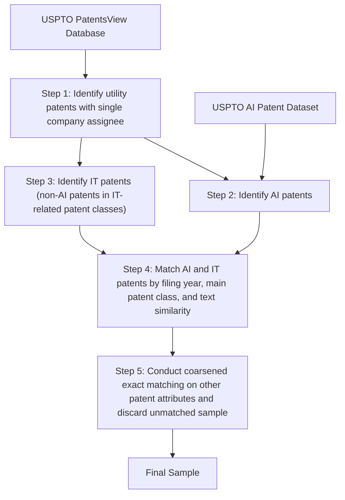

# ORGANIZING FOR AI INNOVATION: INSIGHTS FROM AN EMPIRICAL EXPLORATION OF U.S. PATENTS1

Yu-Kai Lin and Likoebe M. Maruping

Robinson College of Business, Georgia State University, Atlanta, GA, U.S.A.

{yklin@gsu.edu} {lmaruping@gsu.edu}

Although the prevalence of artificial intelligence (AI) innovations is on the rise, firms frequently report failures and setbacks in their development and implementation of AI innovation efforts. One common issue behind many failing AI initiatives is that they are organized just like other information technology (IT) innovation efforts. To elucidate why and how the production of AI and IT innovations may need to be managed differently, this study juxtaposes these two types of innovations based on two key dimensions of the Schumpeterian framework: the form (product vs. process) and magnitude (radical vs. incremental) of innovations. By analyzing a matched sample of AI and IT patents, we found robust evidence that AI innovations are less radical and more process oriented than comparable IT innovations. Drawing upon our empirical discovery, we developed a conceptual framework to suggest a new way to think about organizing AI innovation. Our research contributes to the literature and practice on AI innovation by illuminating the comparative differences between AI innovations and other IT innovations and advancing a set of empirically derived propositions on how firms may be able to better manage their AI innovation activities.

Keywords: Artificial intelligence, innovation management, organizing logic, empirical discovery, comparative analysis, patents, research and development, Schumpeter

# Introduction

The last two decades have witnessed rapid advances in artificial intelligence (AI) and its wide-ranging applications in organizational innovations. AI differs from other information technologies (IT), which emphasize data access and network connectivity (Trantopoulos et al., 2017), in that AI enables machines to engage in human-like cognitive functions, such as learning, sensing, planning, and reasoning (Rai et al., 2019). As such, AI empowers the creation of intelligent products, services, and processes capable of autonomously adapting to complex environments. Although firms have been pouring significant resources into AI innovation in recent years, these efforts frequently experience challenges and failures (Davenport & Ronanki, 2018; Joshi et al., 2021; Reis et al., 2020).2 Recent research suggests that approaching AI innovation like other IT initiatives is a common pitfall (Ångström et al., 2023; Hopf et al., 2023). This highlights a critical misunderstanding regarding the management of AI innovation.

There are several reasons why AI innovation may need to be understood differently from other IT innovation (see Table 1 for our working definitions). From a theoretical perspective, Berente et al. (2021) argued that AI differs qualitatively from other IT in three interrelated facets—autonomy, learning, and inscrutability—and discussed how to manage AI along these facets. The human-computer interaction literature has observed that designers in AI innovation face unique challenges with engaging machine learning (ML) as a design material, particularly given ML’s dependency on data and the challenges of understanding the reasoning behind ML modelgenerated output (Dove et al., 2017; Westenberger et al., 2022).

Recently, Hopf et al. (2023) revealed the paradoxical tension between management views and data scientist views regarding AI implementation. The former assumes that AI systems are just conventional computer programs in which errors can be easily traced and fixed, whereas the latter considers AI innovation to be a highly iterative, exploratory, and openended research endeavor compared to IT innovation. In the same vein, Ångström et al. (2023) explained that AI systems, in contrast to other IT systems, are often more dynamic, with greater volatility and unpredictability in their implementation, evolution, and use. They argued that “much remains to explore to provide actionable knowledge for managers charged with leading AI implementation initiatives” (Ångström et al., 2023, p. 8). In sum, these observations reflect a fundamental gap in our understanding of the management of AI innovation and invite a return to first principles.

Before arriving at an understanding of how AI innovation should be managed, it is important to establish the extent to which there are distinctions between AI innovations and IT innovations along two key dimensions within the framework proposed by Schumpeter (1934): form and magnitude. These two dimensions are fundamental to innovation, in general, and to our research inquiry, in particular, because they give a sense—in relative terms—of how such innovations are instantiated and to what extent they depart from existing similar innovations. Regarding the form of innovations, they can be either product or process oriented. Researchers have emphasized that the management, organizing logic, and knowledge search for process innovations differ significantly from those for product innovations (Adner & Levinthal, 2001; Terjesen & Patel, 2017). However, most innovations have a mix of product and process components (Toh & Ahuja, 2022). It is, hence, unclear whether AI innovations (e.g., a new recommender system) lend themselves to being more (or less) process oriented than IT innovations (e.g., a new payment processing system). Regarding the magnitude of innovations, researchers have distinguished between radical and incremental innovations because their creation requires distinct management practices, structural arrangements, and search strategies (Cardinal, 2001; Ettlie et al., 1984). However, the a priori classification of radical innovations is “exceptionally difficult and empirically problematic” (McMullen & Shepherd, 2006, p. 143).3 Taken together, it is theoretically ambiguous and practically difficult to determine the comparative differences between AI and IT innovations in terms of form and magnitude.

Table 1. Summary of Conceptual Foundation 

<table><tr><td>Concept</td><td>Our working definition</td><td>References</td></tr><tr><td>AI</td><td>AI is the ability of a machine to perform human-like cognitive functions, such as learning, sensing, and reasoning.</td><td>Rai et al., 2019; Raisch &amp; Krakowski, 2021</td></tr><tr><td>AI technologies</td><td>AI technologies are machine-based systems that perform human-like cognitive functions, autonomously and adaptively inferring from inputs to generate outputs based on implicit or explicit objectives. In these systems, inputs can include data, codified knowledge, or instructions, while outputs can take the form of content, decisions, predictions, or recommendations.</td><td>NIST, 2019; OECD, 2024</td></tr><tr><td>AI innovation</td><td>AI innovation involves the development or implementation of new products, services, or processes that leverage AI technologies as a key element in value creation.</td><td>This study</td></tr><tr><td>IT innovation</td><td>IT innovation, in contrast to AI innovation, involves the development or implementation of new products, services, or processes that leverage IT as a key element in value creation, rather than relying on AI technologies.</td><td>This study</td></tr></table>

Note: NIST, National Institute of Standards and Technology; OECD, Organization for Economic Co-operation and Development.

To shed light on their technological nature and arrive at an appropriate logic of their management, we utilized U.S. patent data to investigate the comparative process orientation and radicalness between AI and IT innovations. In the information systems (IS) literature, researchers have frequently used patents to study topics related to IT or software innovations (Bendig et al., 2023; Forman & Goldfarb, 2022; Guo et al., 2023; Kim et al., 2022). Our choice to use patent data is consistent with this convention. Results from our analyses reveal robust evidence that AI innovations tend to be significantly more process oriented and less radical than IT innovations. To be clear, our intention is not to assert that all AI innovations are incremental or process oriented. Undoubtedly, there are AI innovations that are radical and/or product oriented, yet our findings imply that these are less frequently encountered by managers. Given that it is difficult for managers to distinguish these attributes beforehand, our findings help establish informative a priori expectations in decisionmaking regarding the overall tendencies toward process orientation and less radicalness in AI innovations compared to IT innovations.

There are three compelling reasons why ascertaining the comparative process orientation and radicalness between AI and IT innovations is relevant and significant. First, a pivotal factor behind many failures and setbacks in AI innovation is the tendency for organizations to approach AI innovation in a manner akin to their handling of IT innovation (Ångström et al., 2023; Hopf et al., 2023). The distinct form and magnitude observed in AI innovations compared to IT innovations may offer one explanation for why these two types of innovation activities may need to be managed differently and why organizations struggle with creating AI innovations. Second, such discernment offers insights into thinking about how firms may manage AI innovation more effectively. There is a robust body of literature on how organizations can better approach the creation of innovations of different forms and magnitudes (e.g., Damanpour, 1991; Ettlie et al., 1984; Heinrich et al., 2022; Tarafdar & Gordon, 2007). Meanwhile, organizations are generally better versed in creating IT innovations than AI innovations (Hopf et al., 2023). Hence, the comparative differences between AI and IT innovations in process orientation and radicalness could inform firms about how they can adjust their processes, structures, and practices for AI innovation, relative to those they use for IT innovation. Third, and from a theoretical standpoint, our inductive research represents an “empiricalfirst” approach to knowledge generation (Golder et al., 2023). We have no ex ante expectations given that managing

AI innovation remains a poorly understood phenomenon in the literature. Similar to a case study, we seek to inductively learn from data to uncover stylized facts in ways that would “influence the intellectual framing of what we need to know” (Grover & Lyytinen, 2015, p. 285). In doing so, the nature of our study is not to establish causal evidence or provide direct solutions; instead, we aim to lay out a way for researchers and practitioners to think about the organizing of AI innovation. By delineating the comparative process orientation and radicalness of AI innovations alongside IT innovations, our findings serve as a foundation for future theory and enable an accurate framing and conceptualization about the intrinsic nature of AI innovations.4

# Conceptual Background

# Considerations in the Design of AI Innovations

Research on the challenges in AI innovation is still in its nascent stages. However, there appear to be some recurring themes that indicate that the challenges faced in AI innovation are unique. Broadly, there are two emergent themes from the literature on AI innovation: (1) challenges with the technology itself and (2) challenges with designers’ selection decisions.

First, a key challenge with AI innovation is that designers have trouble engaging with AI as a design material. In the innovation design process, designers often interact or play around with the foundational technology that underlies the innovation. The objective is to gain an understanding of what the technology is capable of doing so that they have an idea of how to integrate it as they devise a potential solution space for the innovation opportunity. To this point, Yang et al. (2018, p. 2) stated that “to envision things that have never before existed, designers innovate by engaging in reflective conversations with design materials.” This works well when designers understand the materials they are using and their capabilities. However, the lack of explainability in black box models, coupled with the difficulty in identifying the sources of errors (such as misclassification), hinders designers’ ability to grasp the potential applications of AI and anticipate its behavior in real-world post-deployment scenarios.

The second key challenge in AI innovation is that, owing to their lack of understanding of AI capabilities and the intricacies of AI (Burrell, 2016), designers often overestimate the capabilities of AI (Davenport & Ronanki, 2018; Dove et al., 2017). To this point, Yildirim et al. (2023) showed that in an ideation exercise, designers exhibited a stronger likelihood of ideating AI innovations targeted at difficult tasks that were beyond AI’s capability to address and impossible to build. This highlights designers’ lack of understanding of AI’s potential, leading to misguided choices in identifying problems to solve and selecting areas for innovation.

In sum, the literature suggests that AI is a unique design material that introduces challenges regarding the types of innovations for which it is well suited. Although there are ongoing efforts to devise design processes to improve the success rate of AI innovation by aligning AI capabilities with selected problem domains, there is, at present, no clear indication regarding the broad tendencies of AI innovations that have been produced to date. Providing such an understanding is a key step toward sensitizing designers and managers as to the types of AI innovation endeavors that are likely to be fruitful. This investigation may also offer insights into organizing and managing such innovation activities. To this end, a valuable first step is to characterize the nature of AI innovations vis-à-vis IT innovations (Crossan & Apaydin, 2010; Zmud, 1984). Since firms generally have experience in managing and organizing IT innovation, we were motivated to investigate empirical regularities in AI innovations by exploring the comparative differences between AI and IT innovations in two essential dimensions of innovations—form and magnitude.

# Dimensions of Innovations: Form and Magnitude

The innovation literature has developed many ways to characterize innovations. In their comprehensive review of innovation research, Crossan and Apaydin (2010) identified 10 different dimensions of innovation and innovations: nature (tacit/explicit), level (individual/group/firm), driver (resources/ market opportunity), direction (top-down/bottom-up), source (invention/adoption), locus (firm/network), form (product/ process/business model), magnitude (incremental/radical), referent (firm/market/industry), and type (administrative/ technical). These dimensions have helped researchers and practitioners make sense of research findings, delineate boundary conditions, and derive managerial insights. That said, individual empirical studies never consider all 10 of these dimensions at once, and some dimensions are more frequently considered than others. In particular, and consistent with the Schumpeterian tradition, form (product vs. process) and magnitude (radical vs. incremental) are among the most commonly employed dimensions to characterize innovations in the literature.

Form of innovations: A substantial body of work has considered product and process as two primary forms of innovations (e.g., Athey & Schmutzler, 1995; Hullova et al., 2016; Utterback & Abernathy, 1975).5 According to Utterback and Abernathy (1975), product innovations are typically featured by their demand-enhancing or performancemaximizing characteristics, while process innovations emphasize their cost-reducing benefits. Accordingly, Damanpour and Gopalakrishnan (2001) defined product innovations as “new products or services introduced to meet an external user or market need” (p. 47) and process innovations as “new elements introduced into an organization’s production or service operations … to produce a product or render a service” (p. 48). Research has shown that firms tend to focus on product over process innovations (Damanpour & Gopalakrishnan, 2001; Strebel, 1987), although there is also acknowledgement that the focus on product innovations tends to occur at early stages of development and the focus on process innovations tends to occur at later stages (Utterback & Abernathy, 1975). Generally, there is a consensus among scholars that these two forms of innovation often complement each other and that both are indispensable to a firm’s competitiveness (Athey & Schmutzler, 1995; Hullova et al., 2016).

Characterizing innovations by their form has yielded many theoretical and practical insights. For example, Cabagnols and Le Bas (2002) found that there are different determinants for product vs. process innovations, with process innovations relying more on upstream sources of technological knowledge and horizontal and downstream knowledge links promoting product innovations. Similarly, Hall et al. (2014) suggested that formal intellectual property (IP) strategies, such as patents, are more effective for product innovations, whereas informal appropriation mechanisms, such as secrecy and lead time, are more useful for process innovations.6 Therefore, Gilbert (2006) argued that it is important to distinguish product and process innovations because doing so has implications for competition, IP rights protection, and innovation incentives.

Magnitude of innovations: To delineate the magnitude of innovations, researchers have emphasized the distinctions between radical and incremental innovations (Dahlin & Behrens, 2005; Dewar & Dutton, 1986; Ettlie et al., 1984). Although there is no consistent definition and measurement of radical innovations in the literature, scholars tend to agree that radical innovations substantially depart from the existing ones in terms of introducing new elements or recombining established elements in a novel way (Dahlin & Behrens, 2005; Fleming, 2001). Despite substantial scholarly interest in radical innovations, most innovations are incremental. As such, many researchers have argued from the perspective of portfolio management that firms should pursue both incremental and radical innovations to balance risks and returns (Meifort, 2016).

Theory and evidence have long established that innovation management practice should align with the magnitude of the innovations sought. For example, Ettlie et al. (1984) discussed the differences in organizational strategy and structure for radical vs. incremental innovations. They argued that radical innovations demand distinct strategies and structures, whereas incremental innovations are typically sustained by more conventional approaches. McDermott and O’Connor (2002) elaborated the challenges in searching for a division in which to house radical innovation and underscored the importance of informal networks for such projects—considerations which are less salient for their incremental counterparts. In more recent work, Kavadias and Hutchison-Krupat (2020) developed a framework for managing innovation in which they emphasized that firms should approach creation of incremental innovations and radical innovations using different (1) plan and process structures, (2) monitoring mechanisms, (3) evaluation and incentive procedures, (4) coordination and communication practices, and (5) leadership attributes.

Taken together, it is useful and meaningful to assess the form and magnitude of AI innovations, relative to their IT counterparts. Clearly, different forms and magnitudes of innovations will require distinct organizing logics. Assessing the relative form and magnitude of AI innovations, hence, could enable IS scholarship to theorize about such innovation and its management and organizing logic based on a more realistic set of assumptions.

# Ambiguity in the Form and Magnitude of AI Innovations

It is theoretically ambiguous whether AI innovations, when compared to similar IT innovations, would exhibit a general tendency toward a specific form (product or process oriented) or magnitude (radical or incremental). As mentioned earlier, there certainly exist examples of AI innovations that are product oriented (or process oriented), and some AI innovations are clearly radical (or incremental). However, it is difficult for managers to ascertain the form and magnitude of AI innovations in practice (McMullen & Shepherd, 2006). The literature does not provide sufficient clarity with respect to the technical nature of AI innovations along these two critical dimensions, either in their own right or in comparison to IT innovations. To surface the theoretical ambiguity in the relative form and magnitude of AI innovations, we summarize some of the arguments in favor of each of these cases when it comes to the relative form and magnitude of AI innovations.

Ambiguity in the relative form of AI innovations: Following Moore’s law, computing power has increased over many decades (Mollick, 2006). This has facilitated the emergence of smart components that are being embedded in physical products with an eye toward enhancing products’ value proposition (Raj & Seamans, 2019; Tarafdar & Tanriverdi, 2018). There is a case to be made that these trends should favor a product emphasis in the development of AI innovations relative to IT innovations. AI innovations are better suited to dynamically sense and respond to a variety of data inputs from the environments in which products are used, enabling them to better meet user needs. Indeed, AI innovations have been embedded in products to enhance their value proposition (Padigar et al., 2022), including in autonomous vehicles, industrial robots, recommendation systems, and search engines. Therefore, AI innovations may be less process oriented than IT innovations. Conversely, there is also a case to be made that AI innovations tend to be more process oriented relative to IT innovations. Owing to their ability to perform human-like cognitive functions, many, if not most, AI use cases involve the automation of tasks that were previously performed by humans (Acemoglu et al., 2022). By removing humans from the equation, the primary objectives are often to increase workflow efficiency and reduce operational costs. From this perspective, AI innovations should generally be more process oriented than IT innovations.

Ambiguity in the relative magnitude of AI innovations: The radicalness of innovations depends in large part on whether they comprise novel knowledge recombination (Dahlin & Behrens, 2005; Fleming, 2001). As a generalpurpose technology, AI may have greater potential to be integrated with existing technologies and tools in a wide range of application domains (Bianchini et al., 2022). In theory, this will likely engender the novel recombination of (distant) knowledge, thereby elevating the inherent radicalness of AI innovations (Johnson et al., 2022). On the other hand, AI components, such as natural language processing and computer vision, are simply technological embodiments of human cognitive capabilities. While they can be applied in different application domains, such knowledge recombination is not necessarily novel. Indeed, AI is often used to automate or augment human tasks that are already known (Raisch & Krakowski, 2021). Therefore, AI innovations may be less likely to yield novel knowledge recombination—and hence less radical—than IT innovations that go beyond the automation and augmentation of existing tasks.

In sum, the relative form and magnitude of AI innovations cannot be ascertained with existing theoretical explanations and reasoning. As a beginning step toward gaining clarity on the nature of AI innovations, we now elaborate our inductive approach to making this assessment.

# Methodology

# Data Sources and Sample Construction

We investigated the comparative levels of process orientation and radicalness in AI and IT innovations using patent data from the United States Patent and Trademark Office (USPTO). This data choice is consistent with recent IS research relying on patent data to understand IT and software innovations (e.g., Bendig et al., 2023; Guo et al., 2023; Kim et al., 2022). To compile a representative and comparable sample of AI and IT innovations, we implemented a five-step procedure to identify and match AI and IT patents, as described below and illustrated in Figure 1.

First, we isolated utility patents with a single company assignee using data from the USPTO’s PatentsView database. A patent may be assigned to multiple organizations or individuals, but such co-assignments are rare. Indeed, the PatentsView data shows that over 96% of U.S. utility patents are assigned to single organizations or individuals. We choose to focus on single-assignee patents and limit the assignees to companies for two reasons. For one, focusing on patents owned by firms is consistent with our research motivation to understand how firms should manage and organize their AI innovation. Moreover, this data choice on single-assignee patents enabled us to econometrically address unobservable factors at the assignee level and avoid potential impacts from joint patenting on the radicalness and process orientation of a patent.

Second, we relied on the AI patent dataset from the USPTO to identify AI patents (Giczy et al., 2022). Unlike earlier studies relying on AI-related keywords or patent classes (e.g., Cockburn et al., 2019; Furman & Seamans, 2019; WIPO, 2019), the USPTO identified AI patents by training an ML classifier. Through a literature review and discussions with patent examiners who review AI patent applications, the USPTO defined AI patents as patents that comprise one or multiple of the following eight AI technologies: ML, evolutionary computation, natural language processing, speech, vision, planning/control, knowledge processing, and AI hardware. A patent is classified as an AI patent if its probability of involving any one of these AI components is greater than a 50% threshold (Giczy et al., 2022). To train this classifier, the USPTO extracted three sets of features from patent documents: (1) word embeddings for patent abstracts, (2) word embeddings for patent claims, and (3) one-hot encoding of backward and forward citations. The training involved the use of separate neural networks to obtain latent representations of the input features, which were then concatenated and passed through two more densely connected neural network layers to predict the probability of the patent belonging to each of the eight AI technology categories. Giczy et al. (2022) showed that this ML approach achieved a better balance of “precision” (the fraction of patents classified as AI that are actually AI) and “recall” (the fraction of true AI patents that are classified as AI by the algorithm) than alternative keyword- or query-based approaches in identifying AI patents.

Third, among non-AI patents, we identified IT patents based on their main patent classes in the Cooperative Patent Classification (CPC) scheme. Specifically, we restricted IT patents to those whose main CPC codes were under the G06 CPC class.7 This particular CPC class is designated for patents related to computing, calculating, or counting. Recent studies have used G06 or its subclasses to identify IT-related patents (Bendig et al., 2023; Chan et al., 2023; Kim et al., 2022). Although researchers sometimes also include other CPC categories to identify IT-related patents, e.g., G11 (information storage), IT innovations in these additional CPC categories are likely less comparable to typical computing-oriented AI innovations. We hence focused on IT patents in the computing-related domain as represented in the G06 CPC class.8


<details>
<summary>flowchart</summary>


</details>

Figure 1. Sample Construction Procedure

Fourth, to ensure that the AI and IT patents had comparable technological scope and subject matter, we restricted our sample to a smaller set of AI and IT patents that were matched by their patent class, filing year, and patent text. The purpose here was to ensure that the AI and IT patents in our analysis were as similar as possible along these scope- and subjectrelated dimensions in order to isolate their intrinsic characteristics related to process orientation and radicalness. To this end, we matched each AI patent with an IT counterpart that had the exact same filing year and main Level-4 CPC code.9 AI patents that had no matched IT patents in terms of their filing years and CPC codes were excluded from our analysis. In instances when there were multiple IT patents sharing the same filing year and main CPC code with an AI patent, we implemented the textual measure of patent

similarity from Arts et al. (2018), choosing only the IT patent that had the highest text similarity with the corresponding AI patent for our analysis.10 As a result, although the notion of AI innovations may evolve over time, our approach allowed us to identify and incorporate contemporaneous IT patents that had the most comparable technological scope and subject matter to the AI patents in our sample.

Fifth, we performed coarsened exact matching (CEM) (Iacus et al., 2012) on the matched sample from the previous step. The purpose of this additional CEM procedure was to ensure that beyond patent class, filing year, and patent text, the two groups of patents were also comparable on other observable patent characteristics.11 Specifically, we considered four patent characteristics for CEM (which, as we will elaborate,

matched) patents was 0.238 and that the average text similarity among primary-class-matched (but not text-matched) patents was 0.054. Since our matching involved both text similarity and primary patent class, we expected our average pairwise text similarity to be somewhere between the two extremes. In an unreported analysis, we also found that our results remained consistent even without performing this text similarity match and instead matching AI and IT patents solely based on their patent class and filing year.

11 As we will show, our findings were very similar when we did not implement this CEM procedure for our sample construction.

served as our control variables in the regression analysis): number of claims, number of backward citations, number of forward citations, and number of inventors. The CEM procedure coarsened each of these numeric attributes into bins, performed exact matching based on these coarsened data, and retained only AI and IT patents that could be matched. It is important to note that our CEM procedure was performed at the group level, not the pair level. Although our previous step of sample construction created matched pairs of AI-IT patents, it is highly unlikely that the AI-IT patents in a pair would have identical coarsened attributes across all four observable patent characteristics considered in our CEM procedure.12 By conducting CEM at the group level, a set of unmatched AI (n = 429) and IT (n = 69) patents were identified. We removed AI-IT pairs that involved any of these unmatched patents, resulting in a total of 283,688 pairs of AI and IT patents as our final sample. Aside from retaining a matched sample, the CEM procedure also produced weights for each observation to account for group differences with respect to the matching variables. Consistent with recent research (e.g., Ayabakan et al., 2023; Wang & Overby, 2022), we used the CEM weights in our ensuing regression analyses to strengthen our inferences.

Through this sample construction procedure, we obtained a longitudinal dataset of AI and IT patents in the U.S. issued between 1976 and 2020. Having outlined our data and sample, we now turn to describe how we assessed the nature of innovations in terms of magnitude and form. Specifically, we explain how we measured the radicalness of the innovations represented in our patent sample, followed by an explanation of how we measured their process orientation. We then discuss our model estimation approach before describing the results.

# Measuring Radicalness

Viewing innovations as embodying (re)combination of knowledge (Fleming, 2001; Uzzi et al., 2013), prior research has developed measurements of radicalness based on the uniqueness of knowledge (re)combination in innovations (Dahlin & Behrens, 2005; Kaplan & Vakili, 2015). These measurements typically rely on either patent citations or patent texts to represent knowledge and elements in innovations and then characterize the patterns of recombination. We followed Dahlin and Behrens (2005) and focused on the citation-based radicalness measure for two reasons. First, patent citations have long been used to represent the content and flow of knowledge in IS and management research (e.g., Ferguson & Carnabuci, 2017; Kleis et al., 2012). Second, our matched sample of AI and IT patents in comparable filing years and technological areas helps to mitigate issues of the changing data generation process of patent citations in recent years (Kuhn et al., 2020).13

Dahlin and Behrens (2005) measure radicalness through citations and suggest that patents with unique combinations of backward citations are deemed more radical. Specifically, let i and j denote the two patents and $c _ { i }$ and $c _ { j }$ their respective backward citations. They define the similarity between i and $j ,$ or sim(??, ??), using the Jaccard similarity index; that is, sim(??, ??) = $\vert c _ { i } \cap c _ { j } \vert / \vert c _ { i } \cup c _ { j } \vert .$ , where the numerator (denominator) is the size of the intersection (union) of the two sets of citations. Through this pairwise similarity measure, they further define the overlap score between patent i and all the patents issued in a specific year t as:

$$
\mathrm{os} (i, t) = \frac {\sum_ {j \in t , j \neq i} \mathrm{sim} (i , j)}{n _ {t}}, \tag {1}
$$

where $n _ { t }$ is the number of patents issued in year t, serving as a normalizing factor.

Suppose that patent i is issued in year $t _ { 0 } ,$ we can obtain an overlap score for patent i through os(??, ??) for $t \leq t _ { 0 } .$ . A higher value in this score would represent a less radical invention since the focal patent has a high similarity with the patents granted in year t.

Building on Dahlin and Behrens (2005), we operationalized the radicalness of each patent based on the average overlap score over the past k years. That is,

$$
R (i) = \frac {\sum_ {t = t _ {0} - k} ^ {t _ {0}} \mathrm{os} (i , t)}{k}. \qquad \qquad (2)
$$

A higher value of ??(??) would represent a higher degree of similarity between patent i and other patents granted over the past k years and is hence deemed less radical. In our main analysis, we set k = 3 in Equation (2) and explored the robustness of our results using alternative values for k.

Table 2. Example Patents and Classification of Process and Product Claims 

<table><tr><td>Patent</td><td>Claim</td><td>Label</td></tr><tr><td rowspan="2">US Patent #10776166: Methods and systems to proactively manage usage of computational resources of a distributed computing system</td><td>1. A process stored in one or more data-storage devices and executed using one or more processors of a computer system to proactively manage resources in a distributed computing system, the process comprising: ...</td><td>Process claim</td></tr><tr><td>9. A computer system to proactively manage resources in a distributed computing system, the system comprising: ...</td><td>Product claim</td></tr><tr><td rowspan="2">US Patent #10445147: System and method for deploying virtual servers in a hosting system</td><td>1. A computer-implemented method of generating an image of a virtual machine, the method comprising: ...</td><td>Process claim</td></tr><tr><td>11. A hosting and storage system for hosting a plurality of virtual machine configurations and for storing image files of the virtual machine configurations, the system comprising: ...</td><td>Product claim</td></tr></table>

Note: These two patents are from one pair of matched AI (#10776166) and IT (#10445147) patents from our text similarity matching. The two patents are similar as they both involve managing virtual computing resources.

# Measuring Process Orientation

Most innovations involve both product and process components (Toh & Ahuja, 2022). We hence considered the relative degree of emphasis on process vs. product components in innovations instead of categorizing the innovations as either one of these forms. Measuring the process orientation of innovations involves quantifying the emphasis of process, relative to product, in each one.

Consistent with recent research, our measure of process orientation was the proportion of process claims in a patent. To detect process claims, we followed Bena et al. (2022) and Toh and Ahuja (2022) and classified whether a claim was directed to a process (as opposed to a product) by detecting whether the keywords “process” or “method” appeared in the first w words of the claim (see Table 2 for examples).14 We set $w = 5$ in our main analysis and experimented with alternative cut-off values in a robustness check. We then quantified the overall process orientation of a patent, denoted as PO, based on the proportion of process claims in the patent. That is,

$$
P O (i) = \frac {\text { NumProcessClaims } (i)}{\text { NumClaims } (i)}. \tag {3}
$$

# Modeling the Differences Between AI and IT Patents

Having discussed our sample construction procedure and key outcome measures, we now turn to a regression framework to model the comparative differences in radicalness and process orientation between AI and IT patents. The regression model was estimated using the weighted least squares (WLS) approach, and the weights were obtained from the CEM procedure that we mentioned earlier. The weights in WLS helped mitigate selection bias and adjusted the discrepancies in the observable characteristics in our sample. Our empirical model has the following form:

$$
\begin{array}{l} y _ {i} = \beta_ {1} A I _ {i} + \beta_ {2} C l a i m s _ {i} \\ + \beta_ {3} B w d C i t a t i o n s _ {i} \\ + \beta_ {4} F w d C i t a t i o n s _ {i} \tag {4} \\ + \beta_ {5} I n v e n t o r _ {i} + \omega_ {i} \\ + \lambda_ {i} + \pi_ {t} + \varepsilon_ {i} \\ \end{array}
$$

In Equation (4), ???? is either ??(??) or ????(??). We used a dummy variable $A I _ { i }$ to denote whether patent i is an AI patent. To control for unobservable characteristics related to the assignee, the technological area, and the filing year of a patent, we included fixed effects (FEs) for assignee (????), the main Level-4 CPC code $( \lambda _ { i } ) ,$ , and the filing year $\left( \pi _ { t } \right)$ of the patent in the regression models. The last term in Equation (4), $\varepsilon _ { i } .$ represents the idiosyncratic error in our regression.

Also included in Equation (4) are a set of control variables for each patent that may have affected relationships of interest in this study. First, we accounted for the number of claims listed in a patent, ??????????????, because (1) it reflects the scope of a patent (Marco et al., 2019) and hence could have affected its citations, and (2) our PO measure was derived from the proportion of process claims in a patent, which could have been affected by the number of claims in a patent. Second, we controlled for the number of backward citations in a patent, ??????????????????????????, because our radicalness measure was derived based on the degree of overlap (i.e., similarity)

between the references in the focal patent and the references in other patents. Third, we included the number of forward citations to a patent, ??????????????????????????, to approximate the quality of the patent (Forman & Goldfarb, 2022). The number of forward citations a patent receives accumulates over time. Our ???????????????????????? measure reflects the forward citations as of September 20, 2023, from the most recent release of the PatentsView database when we conducted our analysis. Fourth, we included the number of inventors listed on a patent, ???????????????? , as a control. When there are more inventors listed on a patent, the patent is more likely to have a broader scope with technological knowledge integrated from multiple sources (Choudhury & Haas, 2018), which could potentially affect the radicalness of the patent.

# Empirical Findings

# Data Statistics

Table 3 summarizes the data statistics across our variables. The table provides preliminary model-free evidence that, compared to IT patents, AI patents are, on average, less radical (a higher mean in R) and more process oriented (a higher mean in PO). Another observation from Table 3 is that the original scale of radicalness (R) is very small. We hence normalized this variable to center at 0 with a standard deviation of 1 and used the scaled values in the ensuing regression analysis. We did this to improve the presentation of the regression results (otherwise, the coefficients would have been extremely small decimal numbers). Since we were primarily interested in directional rather than absolute differences between AI and IT innovations, this normalization served to preserve such relationships in the regression analysis.

We checked the balance of the observed baseline covariates between AI and IT patents by comparing their standardized mean differences. The standardized difference statistic considers the difference in means of a covariate between two groups, scaled by their standard deviations. In prior research, the degree of imbalance in a covariate between two groups is considered negligible when the standardized difference in means is below 0.1 (Austin, 2009; Gao et al., 2023). The last column in Table 3 shows that the imbalances across all the control variables are negligible. This means that the AI and IT patents in our final sample had similar distributions in these control variables. This balance check on the observed baseline covariates further enhances our confidence that the AI and IT patents in our sample are comparable.

Table 4 reports additional characteristics for the two groups of patents in our sample. First, we investigated the sets of CPC codes in each patent. We found that, on average, AI (IT) patents had 5.12 (5.16) Level-4 CPC codes. Moreover, pairs of AI/IT patents shared, on average, 2.10 Level-4 CPC codes. This suggests that the AI patents and IT patents had similar distributions in terms of their CPC patent classes. Second, we examined the number of patent litigations in each group by linking our data with the USPTO Patent Litigation Docket Reports Data (Toole et al., 2024). We found that less than 1% of patents in our sample had been involved in patent litigation. Nevertheless, litigations appear to be more likely for AI patents than IT patents.15 Third, we considered the economic value of the patents in each group. To obtain information about patents’ economic value, we used data from Kogan et al. (2017), who estimated the economic value of patents based on U.S. stock market reactions to patent grants. We found that markets tend to value AI patents more highly than IT patents. This is consistent with recent research that AI is becoming a source of competitive advantage (Krakowski et al., 2023). Fourth, we analyzed the geographical locations of the patent assignees. The leading countries of patent assignees were the U.S., Japan, Germany, South Korea, and Canada for AI patents, and the U.S., Japan, Korea, Germany, and Taiwan for IT patents. At the state level, the U.S.-based assignees of AI and IT patents were consistently concentrated in California, New York, Washington, Texas, and Massachusetts.

# Main Results

Table 5 presents the main results of our regression analysis. To demonstrate the stability of the estimates, we report four sets of results in the table: (1) main effect without control variables, (2) main effect and controls, (3) main effect and logtransformed controls, and (4) main effect and log-transformed controls without CEM weighting. Across the four sets of results, the coefficient of AI in each of the regressions is positive and significant (p-value < 0.01). This means that AI patents are associated with a higher R and PO. As mentioned earlier, a higher R value indicates that AI patents are less radical because they are more similar to existing patents in terms of their knowledge recombination. On the other hand, the higher PO in AI patents suggests that they place a greater emphasis on process components versus product components. In sum, the results show that AI patents are less radical and more process oriented than comparable IT patents.

Table 3. Summary Statistics 

<table><tr><td>Variable</td><td>AI patents (n = 283,688)</td><td>IT patents (n = 283,688)</td><td rowspan="2">Standardized mean difference</td></tr><tr><td></td><td>Mean (SD)</td><td>Mean (SD)</td></tr><tr><td>R (original scale)</td><td>0.0000293 (0.0000739)</td><td>0.0000201 (0.0000487)</td><td rowspan="3"></td></tr><tr><td>R (standardized scale)</td><td>0.0730 (1.18)</td><td>-0.0730 (0.777)</td></tr><tr><td>PO</td><td>0.502 (0.294)</td><td>0.476 (0.301)</td></tr><tr><td>Claims</td><td>19.9 (11.4)</td><td>18.7 (10.7)</td><td>0.060</td></tr><tr><td>BwdCitations</td><td>49.2 (119)</td><td>34.0 (80.8)</td><td>0.064</td></tr><tr><td>FwdCitations</td><td>18.9 (52.3)</td><td>12.3 (34.5)</td><td>0.078</td></tr><tr><td>Inventors</td><td>2.94 (1.95)</td><td>2.71 (1.85)</td><td>0.045</td></tr></table>

Table 4. Additional Patent-related Characteristics 

<table><tr><td>Patent-related characteristics</td><td>AI patents</td><td>IT patents</td></tr><tr><td>Average number of Level-4 CPC codes</td><td>5.12</td><td>5.16</td></tr><tr><td>Number of patents involved in a patent litigation $^{\dagger}$ </td><td>2,664</td><td>2,381</td></tr><tr><td>Average economic value*</td><td>16.80</td><td>13.81</td></tr><tr><td>Top five countries (in ISO 3166 Alpha-2 code) of the assignees in each group(US: United States, JP: Japan, DE: Germany, KR: South Korea, CA: Canada, TW: Taiwan)</td><td>US: 215,957JP: 24,210DE: 7,372KR: 5,721CA: 3,419</td><td>US: 177,627JP: 53,431KR: 12,307DE: 6,891TW: 5,196</td></tr><tr><td>Top five states of the US-based assignees in each group(CA: California, NY: New York, WA: Washington, TX: Texas, MA: Massachusetts)</td><td>CA: 76,134NY: 48,359WA: 22,023TX: 12,182MA: 9,271</td><td>CA: 65,421NY: 38,012WA: 12,878TX: 12,226MA: 8,014</td></tr></table>

Note:† Based on the USPTO Patent Litigation Docket Reports Data, which identifies patent-in-suit for district court cases filed between 2003 and 2020 (Toole et al., 2024). \*Based on the measure from Kogan et al. (2017) deflated to 1982 (million) dollars using the Consumer Price Index.

Table 5. Main Results 

<table><tr><td></td><td colspan="2">Main effect only</td><td colspan="2">Main effect and controls</td><td colspan="2">Main effect and log-transformed controls</td><td colspan="2">Main effect and log-transformed controls without CEM weighting</td></tr><tr><td>DV =</td><td>R(i)</td><td>PO(i)</td><td>R(i)</td><td>PO(i)</td><td>R(i)</td><td>PO(i)</td><td>R(i)</td><td>PO(i)</td></tr><tr><td></td><td>(1)</td><td>(2)</td><td>(3)</td><td>(4)</td><td>(5)</td><td>(6)</td><td>(7)</td><td>(8)</td></tr><tr><td> $AI_i$ </td><td>0.090***(0.018)</td><td>0.014***(0.003)</td><td>0.077***(0.017)</td><td>0.014***(0.003)</td><td>0.061***(0.016)</td><td>0.014***(0.003)</td><td>0.063***(0.015)</td><td>0.014***(0.003)</td></tr><tr><td> $Claims_i$ </td><td></td><td></td><td>0.001**(0.000)</td><td>-0.001***(0.000)</td><td>0.001(0.014)</td><td>-0.038***(0.014)</td><td>0.002(0.013)</td><td>-0.038***(0.014)</td></tr><tr><td> $BwdCitations_i$ </td><td></td><td></td><td>0.002***(0.000)</td><td>0.000*(0.000)</td><td>0.277***(0.027)</td><td>-0.002*(0.001)</td><td>0.274***(0.027)</td><td>-0.002*(0.001)</td></tr><tr><td> $FwdCitations_i$ </td><td></td><td></td><td>0.000***(0.000)</td><td>0.000(0.000)</td><td>0.000(0.008)</td><td>0.003(0.002)</td><td>0.002(0.008)</td><td>0.003*(0.002)</td></tr><tr><td> $Inventors_i$ </td><td></td><td></td><td>0.009(0.006)</td><td>0.000(0.001)</td><td>-0.003(0.024)</td><td>0.001(0.003)</td><td>-0.004(0.022)</td><td>0.001(0.003)</td></tr><tr><td>Adjusted  $R^2$ </td><td>0.366</td><td>0.168</td><td>0.397</td><td>0.169</td><td>0.423</td><td>0.171</td><td>0.420</td><td>0.170</td></tr><tr><td>Observations</td><td>567376</td><td>567376</td><td>567376</td><td>567376</td><td>567376</td><td>567376</td><td>567376</td><td>567376</td></tr></table>

Note: Heteroskedasticity robust standard errors are shown in parentheses. Fixed effects for the assignee, main CPC code (Level 4), and filing year are included in all models. $^ { \star } p < 0 . 1 , ^ { \star \star } p < 0 . 0 5 , ^ { \star \star \star } p < \dot { 0 } . 0 1$

# Robustness Checks

To examine the robustness of our findings, we implemented a set of additional checks. These internal replications aimed to ensure that our findings were not the result of some sampleor method-based artifact, hence reducing the risks of Type I and Type II errors (Bamberger, 2019). It is noteworthy that in Table 5, the magnitude and significance of AI coefficients were not sensitive to whether we log-transformed the control variables or performed CEM weighting. To conserve space, in our ensuing analyses, we only report results from models with log-transformed control variables and CEM weighting.16

# Alternative Sample Constructions

To ensure that the results were not impacted by our sample construction procedure, we considered two alternative approaches to construct our sample. First, we experimented with matching AI and IT patents at different levels of CPC codes. As mentioned, the AI and IT patents in our sample were matched to have the same Level-4 CPC code (e.g., “G06N3”). We constructed two alternative samples by matching the CPC codes at a broader level (Level 3; e.g., “G06N”) and a narrower level (Level 5; e.g., “G06N3/006”). We then reran our empirical models using these alternative samples. Columns 1-4 of Table 6 show the results from this analysis. The coefficients of AI here are very similar to those in Columns 5-6 of Table 5, suggesting that our findings were not impacted by the level of CPC matching in our sample construction procedure.

Second, we considered a broader set of CPC classes to identify IT patents. We previously restricted IT patents to those in the G06 CPC class because of its emphasis on computing, which aligns better with AI innovations in terms of subject matter. As a robustness check, we followed Bendig et al. (2023) and considered four CPC classes that are broadly related to “information, computing, communication, and connectivity technologies.” These four CPC classes are G06, G11 (information storage), G16 (information and communication technology specially adapted for specific application fields), and Y04 (information or communication technologies having an impact on other technology areas). We then reestimated our empirical models using this new and larger sample; the results are reported in Columns 5-6 of Table 6. The positive and significant coefficients of AI in these two columns indicate the robustness of our findings and suggest that AI patents continue to be less radical and more process oriented even when compared to a more broadly defined set of IT patents.

# Alternative Measures for Process Orientation

In our main analysis, we labeled a claim as a process claim based on the presence of two process keywords (“process” and “method”) within the first five words of the claim, considering all claims listed in a patent. Here, we assessed several alternative measures to construct the process orientation measure. To ensure that our results were not impacted by the number of words we searched for, we alternatively classified process claims based on the first three or 10 words of the claim. This exercise, as shown in Columns 1 and 2 of Table 7, yielded very similar results to those of our main analysis. Column 3 of Table 7 further shows that our findings regarding the stronger emphasis on process orientation in AI patents relative to IT patents are consistent when measuring process orientation using the proportion of process claims among independent claims only, which are potentially more important and informative than dependent claims (Marco et al., 2019). In Column 4 of Table 7, we see that the results are similar when considering a broader set of process keywords, including “process,” “method,” “procedure,” and “approach.”

# Alternative Measures for Radicalness

There are different ways to operationalize the radicalness measure. We now explicate why we can be certain that the results were not driven by the way we normalized the radicalness measure. As mentioned, we normalized the radicalness variable to center at 0 with a standard deviation of 1 to improve the presentation of the regression results and avoid coefficients with extremely small decimal numbers. As an alternative measure, we instead performed log-transformation for the radicalness measure. In Column 1 of Table 8, we see that the positive and significant coefficient of AI yielded the same conclusion—that AI patents are associated with a lower degree of radicalness relative to IT patents.

Next, we considered alternative time spans—that is, k in Equation (2)—in operationalizing the radicalness measure, R. Whereas we considered k = 3 in our main analysis, here we experimented with different window sizes as the basis on which we calculated patent similarity. Columns 2 and 3 of Table 8 show that the coefficients of AI in the radicalness regressions are consistently positive (all p-values < 0.01) when the time span is set to be 2 or 4 years. We also notice that these coefficients are very close to those in our main results when using a 3-year time span. This suggests that our finding regarding the lower radicalness in AI patents relative to IT patents was not impacted by the time span over which we quantified the radicalness score.

Third, we implemented another radicalness measure by considering both the novelty and the impact of the focal patent. In our main analysis, we chose to focus on the novelty aspect of radicalness only because radical innovations tend to face a greater degree of uncertainty and hence have a higher failure rate (O’Connor & Rice, 2013). Our ??(??) mitigates concerns about survival bias—which has been a common issue in studying radical innovations (Sood & Tellis, 2005)— since it only compares the focal patent with past patents. According to Dahlin and Behrens (2005), the radicalness measure we used in our main analysis represents an ex ante score, as it captured novelty before we could observe its impact on follow-on innovations. Nevertheless, we can derive an ex post score and capture the impact of the focal patent by looking into os(??, ??) for $t > t _ { 0 }$ in Equation (1). Therefore, we constructed another radicalness measure, $R ^ { \prime } ( i )$ , that incorporates both novelty and impact aspects:

$$
R ^ {\prime} (i) = \frac {\sum_ {t = t _ {0} - k} ^ {t _ {0}} \mathrm{os} (i , t)}{k} - \frac {\sum_ {t = t _ {0} + 1} ^ {t _ {0} + k} \mathrm{os} (i , t)}{k} \tag {5}
$$

Compared to ??(??) in Equation (2), ??′(??) here includes the second term on the right-hand side to quantify impact. Intuitively, when innovations have a large impact, they should show a higher similarity with future innovations. As a result, novel and impactful innovations would have a lower value in $R ^ { \prime } ( i )$ . In Column 4 of Table 8, we see that the AI variable is still associated with a higher $R ^ { \prime } ( i )$ , which again suggests a lower degree of radicalness among AI patents.

Table 6. Alternative Sample Constructions 

<table><tr><td rowspan="2"></td><td colspan="4">Match AI and IT patents at a different CPC Level</td><td rowspan="2" colspan="2">Match AI with a broader set of IT patents</td></tr><tr><td colspan="2">Matched at CPC Level 3</td><td colspan="2">Matched at CPC Level 5</td></tr><tr><td>DV =</td><td>R(i)</td><td>PO(i)</td><td>R(i)</td><td>PO(i)</td><td>R(i)</td><td>PO(i)</td></tr><tr><td></td><td>(1)</td><td>(2)</td><td>(3)</td><td>(4)</td><td>(5)</td><td>(6)</td></tr><tr><td> $AI_i$ </td><td>0.062***(0.016)</td><td>0.017***(0.004)</td><td>0.054***(0.018)</td><td>0.015***(0.002)</td><td>0.063***(0.015)</td><td>0.015***(0.003)</td></tr><tr><td>Log  $Claims_i$ </td><td>0.005(0.003)</td><td>-0.037***(0.006)</td><td>-0.005(0.015)</td><td>-0.038***(0.013)</td><td>0.000(0.014)</td><td>-0.037***(0.014)</td></tr><tr><td>Log BwdCitationsi</td><td>0.277***(0.018)</td><td>-0.002***(0.000)</td><td>0.269***(0.026)</td><td>-0.002(0.002)</td><td>0.280***(0.026)</td><td>-0.002(0.001)</td></tr><tr><td>Log FwdCitationsi</td><td>0.001(0.005)</td><td>0.003***(0.001)</td><td>-0.003(0.008)</td><td>0.004**(0.002)</td><td>0.000(0.008)</td><td>0.002(0.002)</td></tr><tr><td>Log  $Inventors_i$ </td><td>0.002(0.006)</td><td>0.002(0.002)</td><td>0.003(0.025)</td><td>0.005(0.003)</td><td>-0.003(0.024)</td><td>0.001(0.003)</td></tr><tr><td>Adjusted  $R^2$ </td><td>0.415</td><td>0.161</td><td>0.459</td><td>0.193</td><td>0.418</td><td>0.173</td></tr><tr><td>Observations</td><td>616304</td><td>616304</td><td>225068</td><td>225068</td><td>581610</td><td>581610</td></tr></table>

Note: Heteroskedasticity robust standard errors are shown in parentheses. Fixed effects for the assignee, main CPC code (at the matched level), and filing year are included in all models. $^ { \star } p < 0 . 1 , ^ { \star \star } p \dot { < } 0 . 0 5 , ^ { \star \star \star } p < 0 . 0 1$

Table 7. Alternative Measures for Process Orientation 

<table><tr><td rowspan="2"></td><td colspan="2">Detect process claim in the first w words</td><td rowspan="2">Consider only independent claims</td><td rowspan="2">A broader set of process keywords</td></tr><tr><td>w = 3</td><td>w = 10</td></tr><tr><td>DV =</td><td>PO(i)</td><td>PO(i)</td><td>PO(i)</td><td>PO(i)</td></tr><tr><td></td><td>(1)</td><td>(2)</td><td>(3)</td><td>(4)</td></tr><tr><td> $AI_i$ </td><td>0.012***(0.003)</td><td>0.015***(0.003)</td><td>0.016***(0.003)</td><td>0.014***(0.003)</td></tr><tr><td>Log  $Claims_i$ </td><td>-0.014(0.012)</td><td>-0.046***(0.014)</td><td>0.027***(0.004)</td><td>-0.038***(0.014)</td></tr><tr><td>Log BwdCitationsi</td><td>-0.001(0.001)</td><td>-0.002(0.001)</td><td>-0.003**(0.002)</td><td>-0.002*(0.001)</td></tr><tr><td>Log FwdCitationsi</td><td>0.003***(0.001)</td><td>0.002(0.001)</td><td>0.001(0.001)</td><td>0.003(0.002)</td></tr><tr><td>Log  $Inventors_i$ </td><td>0.001(0.002)</td><td>0.002(0.003)</td><td>0.000(0.003)</td><td>0.001(0.003)</td></tr><tr><td>Adjusted  $R^2$ </td><td>0.263</td><td>0.169</td><td>0.161</td><td>0.171</td></tr><tr><td>Observations</td><td>567376</td><td>567376</td><td>567376</td><td>567376</td></tr></table>

Note: Heteroskedasticity robust standard errors are shown in parentheses. Fixed effects for the assignee, main CPC code (Level 4), and filing year are included in all models.

<table><tr><td colspan="5">Table 8. Alternative Measures for Radicalness</td></tr><tr><td rowspan="2"></td><td rowspan="2">Use log transformed R, instead of standardizing the original R values</td><td colspan="2">Compare with patents granted in the past k years</td><td rowspan="2">Consider both novelty and impact</td></tr><tr><td>k = 2</td><td>k = 4</td></tr><tr><td>DV =</td><td>R(i)</td><td>R(i)</td><td>R(i)</td><td>R&#x27;(i)</td></tr><tr><td></td><td>(1)</td><td>(2)</td><td>(3)</td><td>(4)</td></tr><tr><td>AIi</td><td>0.0000038***(0.0000010)</td><td>0.059***(0.016)</td><td>0.060***(0.016)</td><td>0.022*(0.012)</td></tr><tr><td>Log Claimsi</td><td>0.0000001(0.0000009)</td><td>0.001(0.014)</td><td>-0.001(0.015)</td><td>-0.031**(0.015)</td></tr><tr><td>Log BwdCitationsi</td><td>0.0000174***(0.0000017)</td><td>0.265***(0.026)</td><td>0.279***(0.027)</td><td>0.080***(0.025)</td></tr><tr><td>Log FwdCitationsi</td><td>0.0000000(0.0000005)</td><td>0.005(0.008)</td><td>-0.004(0.008)</td><td>-0.061***(0.008)</td></tr><tr><td>Log Inventorsi</td><td>-0.0000002(0.0000015)</td><td>0.000(0.025)</td><td>-0.002(0.025)</td><td>0.050(0.031)</td></tr><tr><td>Adjusted  $R^2$ </td><td>0.423</td><td>0.410</td><td>0.414</td><td>0.178</td></tr><tr><td>Observations</td><td>567376</td><td>567376</td><td>567376</td><td>510457</td></tr></table>

Note: Heteroskedasticity robust standard errors are shown in parentheses. Fixed effects for the assignee, main CPC code (Level 4), and filing year are included in all models. In Column 4, the number of observations is smaller due to data censoring, as we were not able to calculate R'(i) for patents granted in 2020. \* p < 0.1, \*\* p < 0.05, \*\*\* p < 0.01

# Subsample Analysis by Filing Years

The development of AI innovations has accelerated in recent years, which raises questions about the temporal stability of the radicalness and process orientation estimates in our main results (which consider patents granted between 1976 and 2020). To explore potential temporal dynamics in the characteristics of AI innovations, we conducted a subsample analysis and reestimated our models using patents granted in three separate time periods: 1976-2000, 2001-2010, and 2011- 2020. These results are reported in Table 9. Here, we see that the coefficient estimates of AI in both radicalness and process orientation regressions are consistently positive and statistically significant across all the time periods. This means that compared to IT patents, the lower degree of radicalness and high degree of process emphasis in AI patents are enduring empirical patterns.

# Subsample Analysis by AI Type

Since there is a wide variety of AI technologies, it is possible that the comparative radicalness and process orientation between AI and IT patents we found exist in aggregate but not in specific AI subtypes. It is hence useful to analyze different types of AI patents separately to provide insights into the consistency of the comparative differences between AI and IT patents. As we mentioned, the USPTO considers eight AI component technologies when defining AI patents. We leveraged these eight components and aggregated them into four broad but theoretically distinct domains of AI types that are consistent with our conceptualization and definition of AI: learning (including ML and evolutionary computation), sensing (including natural language processing, computer vision, and speech), reasoning (including knowledge processing and planning/control), and AI hardware.17 We then created subsamples of AI patents that involve each of these AI types and reran our regression analysis on these subsamples. Table 10 summarizes our results about the comparative radicalness and process orientation of each AI type. Overall, we found remarkable consistency in terms of the lower radicalness and higher process orientation among AI patents, relative to their matched IT patents, in each of these different AI types.

# Quantile Regression Analysis

The preceding analysis aimed to identify the mean differences between the two groups of patents in terms of their radicalness and process orientation. Through classical linear regression, we showed that, on average, AI patents are less radical and more process oriented than IT patents. Understanding the average of these dimensions in and of itself can be useful because managers face challenges in accurately predicting the form and magnitude of their AI innovations when launching a new AI initiative or developing a new AI offering (McMullen & Shepherd, 2006).

Table 9. Subsample Analysis by Filing Years 

<table><tr><td>Filing Year</td><td colspan="2">1976-2000</td><td colspan="2">2001-2010</td><td colspan="2">2011-2020</td></tr><tr><td>DV =</td><td>R(i)</td><td>PO(i)</td><td>R(i)</td><td>PO(i)</td><td>R(i)</td><td>PO(i)</td></tr><tr><td></td><td>(1)</td><td>(2)</td><td>(3)</td><td>(4)</td><td>(5)</td><td>(6)</td></tr><tr><td> $AI_i$ </td><td>0.116***(0.037)</td><td>0.029***(0.005)</td><td>0.031***(0.008)</td><td>0.013**(0.005)</td><td>0.072**(0.031)</td><td>0.010***(0.003)</td></tr><tr><td>Log  $Claims_i$ </td><td>-0.054(0.033)</td><td>-0.025***(0.004)</td><td>-0.016***(0.005)</td><td>-0.039**(0.015)</td><td>0.059*(0.029)</td><td>-0.051*(0.023)</td></tr><tr><td>Log BwdCitationsi</td><td>0.506***(0.058)</td><td>-0.003(0.004)</td><td>0.252***(0.021)</td><td>-0.002(0.002)</td><td>0.252***(0.048)</td><td>-0.003(0.002)</td></tr><tr><td>Log FwdCitationsi</td><td>0.010(0.027)</td><td>-0.003(0.004)</td><td>0.005*(0.003)</td><td>0.004*(0.002)</td><td>-0.027*(0.014)</td><td>0.002(0.002)</td></tr><tr><td>Log  $Inventors_i$ </td><td>0.181(0.151)</td><td>-0.009(0.007)</td><td>0.004(0.007)</td><td>-0.003(0.004)</td><td>-0.053*(0.024)</td><td>0.004(0.003)</td></tr><tr><td>Adjusted  $R^2$ </td><td>0.314</td><td>0.177</td><td>0.626</td><td>0.187</td><td>0.427</td><td>0.199</td></tr><tr><td>Observations</td><td>79508</td><td>79508</td><td>216950</td><td>216950</td><td>270918</td><td>270918</td></tr></table>

Note: Heteroskedasticity robust standard errors are shown in parentheses. Fixed effects for the assignee, main CPC code (Level 4), and filing year are included in all models. $^ { \star } p < 0 . 1 , ^ { \star \star } p < 0 . 0 5 , ^ { \star \star \star } p < \dot { 0 . 0 1 }$

Table 10. Subsample Analysis by AI Types 

<table><tr><td rowspan="2">AI Type = DV =</td><td colspan="2">Learning</td><td colspan="2">Sensing</td><td colspan="2">Reasoning</td><td colspan="2">Hardware</td></tr><tr><td>R(i)</td><td>PO(i)</td><td>R(i)</td><td>PO(i)</td><td>R(i)</td><td>PO(i)</td><td>R(i)</td><td>PO(i)</td></tr><tr><td></td><td>(1)</td><td>(2)</td><td>(3)</td><td>(4)</td><td>(5)</td><td>(6)</td><td>(7)</td><td>(8)</td></tr><tr><td> $AI_i$ </td><td>0.033***(0.012)</td><td>0.014***(0.005)</td><td>0.048***(0.010)</td><td>0.021***(0.004)</td><td>0.045***(0.012)</td><td>0.011***(0.003)</td><td>0.096***(0.027)</td><td>0.011***(0.003)</td></tr><tr><td>Log  $Claims_i$ </td><td>0.002(0.007)</td><td>-0.035**(0.014)</td><td>-0.006(0.007)</td><td>-0.033***(0.010)</td><td>-0.005(0.011)</td><td>-0.041***(0.014)</td><td>0.009(0.024)</td><td>-0.041**(0.018)</td></tr><tr><td>Log BwdCitationsi</td><td>0.225***(0.019)</td><td>-0.001(0.003)</td><td>0.224***(0.024)</td><td>-0.004**(0.001)</td><td>0.262***(0.025)</td><td>-0.002(0.001)</td><td>0.321***(0.042)</td><td>-0.002*(0.001)</td></tr><tr><td>Log FwdCitationsi</td><td>0.011*(0.005)</td><td>0.004**(0.002)</td><td>0.006(0.007)</td><td>0.002(0.002)</td><td>0.008(0.006)</td><td>0.004**(0.001)</td><td>-0.010(0.014)</td><td>0.003*(0.002)</td></tr><tr><td>Log  $Inventors_i$ </td><td>-0.012(0.012)</td><td>-0.001(0.003)</td><td>0.005(0.016)</td><td>-0.004(0.004)</td><td>0.002(0.022)</td><td>0.000(0.002)</td><td>-0.013(0.038)</td><td>0.004(0.004)</td></tr><tr><td>Adjusted  $R^2$ </td><td>0.462</td><td>0.192</td><td>0.515</td><td>0.197</td><td>0.524</td><td>0.188</td><td>0.438</td><td>0.136</td></tr><tr><td>Observations</td><td>62410</td><td>62410</td><td>202322</td><td>202322</td><td>417522</td><td>417522</td><td>258304</td><td>258304</td></tr></table>

Note: Heteroskedasticity robust standard errors are shown in parentheses. Fixed effects for the assignee, main CPC code (Level 4), and filing year are included in all models. $^ { \star } p < 0 . 1 , ^ { \star \star } p < 0 . 0 5 , ^ { \star \star \star } p < \dot { 0 } . 0 1$

Nevertheless, it can be insightful to look beyond averages and examine the differences between AI and IT patents at different levels of these outcome measures. Accordingly, we applied quantile regression (Koenker, 2005) to understand the comparative differences outside of the mean of the data. Quantile regression models the conditional quantiles of a dependent variable through linear functions of the explanatory variables. As such, the method is useful in quantifying the differences between AI and IT patents, conditional on a specific level of radicalness or process orientation. Figure 2 visualizes the results from our quantile regression analysis. The AI coefficient exhibits a somewhat upward tendency and is consistently positive and significant across conditional quantiles between 0.1 and 0.9 for both dependent variables. This means that AI patents consistently exhibit lower levels of radicalness and greater process orientation compared to their comparable IT counterparts across the entire distribution of

radicalness and process orientation, not just on average. These results increase our confidence about the findings that AI innovations are comparatively less radical and more process oriented than similar IT innovations.

# Boundary Conditions

Having demonstrated evidence on the comparative differences between AI and IT patents, we now explore the boundary conditions of such relationships. Motivated by prior innovation research in the IS and management literatures (e.g., Bendig et al., 2023; Crossan & Apaydin, 2010; Kim et al., 2022; Xue et al., 2012), we focus our analysis on firm- and industry-level characteristics that may affect innovation behavior and outcomes.


<details>
<summary>line</summary>

| Conditional Quantile of the DV | AI coefficient (Process Orientation) | AI coefficient (Radicalness) |
| ------------------------------ | ------------------------------------ | ---------------------------- |
| 0.1                            | 0.006                                | 0.021                        |
| 0.2                            | 0.009                                | 0.013                        |
| 0.3                            | 0.007                                | 0.011                        |
| 0.4                            | 0.009                                | 0.012                        |
| 0.5                            | 0.011                                | 0.014                        |
| 0.6                            | 0.015                                | 0.017                        |
| 0.7                            | 0.026                                | 0.022                        |
| 0.8                            | 0.031                                | 0.035                        |
| 0.9                            | 0.026                                | 0.048                        |
</details>

Note: DV: dependent variable. The shaded area represents the 95% confidence interval of the estimates with standard errors constructed from 500 bootstrap replications.

Figure 2. Results From Quantile Regression Analysis 

<table><tr><td colspan="4">Table 11. Categories and Measures of Potential Boundary Conditions</td></tr><tr><td>Category</td><td>Specific measures</td><td>Source</td><td>References</td></tr><tr><td>Assignee type</td><td>Public/non-public firms: Binary variable indicating whether the assignee is a public firm.</td><td>DISCERN</td><td>Bernstein, 2015; Hill &amp; Rothaermel, 2003</td></tr><tr><td rowspan="2">Firm size and performance</td><td>Net sales: Annual net sales of the assignee.</td><td rowspan="2">Compustat</td><td rowspan="2">Crossan &amp; Apaydin, 2010; Xue et al., 2012</td></tr><tr><td>Market share: Proportion of net sales in the four-digit NAICS industry owned by the assignee.</td></tr><tr><td rowspan="4">Innovation capabilities and intensity</td><td>R&amp;D stock: Accumulated R&amp;D expenditures of the assignee with a depreciation rate of 0.15 per year.</td><td rowspan="4">DISCERN, Compustat</td><td rowspan="4">Bendig et al., 2023; Kim et al., 2022</td></tr><tr><td>R&amp;D stock intensity: R&amp;D stock divided by net sales.</td></tr><tr><td>Patent stock: Accumulated number of patent grants of the assignee with a depreciation rate of 0.15 per year.</td></tr><tr><td>Patent stock intensity: Patent stock divided by net sales.</td></tr><tr><td rowspan="4">Industry environment</td><td>IT/non-IT industries: Binary variable indicating whether the assignee&#x27;s four-digit NAICS code is within the set of IT-related NAICS codes suggested by Pan et al. (2018).</td><td rowspan="4">Compustat</td><td rowspan="4">Choi et al., 2024; Xue et al., 2012</td></tr><tr><td>Industry dynamism: The volatility of four-digit NAICS market sales as defined in Xue et al. (2012).</td></tr><tr><td>Industry munificence: The growth of four-digit NAICS market sales as defined in Xue et al. (2012).</td></tr><tr><td>Industry complexity: The Herfindahl index of four-digit NAICS market sales as defined in Xue et al. (2012).</td></tr></table>

Note: We also experimented with alternative ways to quantify firm size (using total assets rather than net sales), identify industries/markets (twodigit SIC codes used by Karanam et al. (2024), and calculate R&D and patent stock intensity (divided by total assets, rather than sales, as in Kim et al., 2022). These alternative measures led to qualitatively similar results, which are available upon request. Following Bendig et al. (2023), we winsorized all continuous variables at the 1% and 99% levels and replaced missing R&D expenditure with a value of zero.

Table 11 categorizes specific measures of potential boundary conditions in our analysis, along with relevant references suggesting their potential impact on organizational innovation. We examine potential boundary conditions by identifying two subsamples for each measure and comparing the estimated AI coefficients between them. Our objective

here is to determine the conditions under which the observed patterns in our main results (i.e., AI patents being less radical and more process oriented than IT patents) disappear or the differences in the estimated AI coefficients between the two subsamples become significant. To determine if an assignee is a public firm, we linked our patent data with the DISCERN (Duke Innovation and Scientific Enterprises Research Network) database using patent numbers (Arora et al., 2021, 2024). DISCERN compiles patents granted to Compustat firms since 1980 and includes each assignee’s Compustat firm identifier, GVKEY. For measures beyond assignee type, we extracted additional boundary condition data by querying firm-year observations in the Compustat annual fundamentals dataset using the GVKEY and patent filing year.

Table 12 summarizes the results of our boundary condition analysis, highlighting three key insights. First, in Columns 3- 5, we observe a consistent pattern of positive and significant AI coefficients, and the estimated AI coefficients between any pair of subsamples are not significantly different in any setting. This suggests that our finding of AI patents being less radical than IT patents is robust to a wide range of firm- and industry-level characteristics and cannot be disconfirmed by any of these potential boundary conditions.

Second, focusing on firm-level boundary condition categories (i.e., assignee type, firm size and performance, and innovation capabilities and intensity), Columns 6-8 show estimated AI coefficients that are consistently positive and significant. In these categories, the differences in the estimated AI coefficients between any pair of subsamples are statistically insignificant. This suggests that our finding of AI patents being more process oriented than IT patents cannot be explained away by these firm characteristics.

Third, focusing on the boundary conditions under the industry environment category, Columns 6-8 show significant differences in AI coefficients between subsamples in two boundary conditions: IT vs. non-IT industries and high vs. low industry dynamism. Given that the IT industry tends to be more volatile and dynamic than other industry sectors (Pan et al., 2018), these results collectively suggest that in dynamic environments, AI patents are more likely to have a higher degree of process orientation than IT patents.

<table><tr><td colspan="9">Table 12. Summary of Boundary Condition Analyses</td></tr><tr><td rowspan="4">Boundary condition</td><td rowspan="2" colspan="2">Subsample</td><td colspan="3">DV: Radicalness</td><td colspan="3">DV: Process orientation</td></tr><tr><td colspan="3">Estimated AI coefficient</td><td colspan="3">Estimated AI coefficient</td></tr><tr><td>A</td><td>B</td><td>A</td><td>B</td><td>Diff.</td><td>A</td><td>B</td><td>Diff.</td></tr><tr><td>(1)</td><td>(2)</td><td>(3)</td><td>(4)</td><td>(5)</td><td>(6)</td><td>(7)</td><td>(8)</td></tr><tr><td colspan="9">Category: Assignee type</td></tr><tr><td>Assignee type</td><td>Non-public firms</td><td>Public firms</td><td>0.043***</td><td>0.074***</td><td>-0.032 (n.s.)</td><td>0.014***</td><td>0.013***</td><td>0.001 (n.s.)</td></tr><tr><td colspan="9">Category: Firm size and performance</td></tr><tr><td>Net sales</td><td>≤ median</td><td>&gt; median</td><td>0.091**</td><td>0.052***</td><td>0.039 (n.s.)</td><td>0.013***</td><td>0.014***</td><td>-0.001 (n.s.)</td></tr><tr><td>Market share</td><td>≤ median</td><td>&gt; median</td><td>0.095**</td><td>0.046***</td><td>0.049 (n.s.)</td><td>0.013***</td><td>0.014***</td><td>-0.000 (n.s.)</td></tr><tr><td colspan="9">Category: Innovation capabilities and intensity</td></tr><tr><td>R&amp;D stock</td><td>≤ median</td><td>&gt; median</td><td>0.097**</td><td>0.045***</td><td>0.052 (n.s.)</td><td>0.018***</td><td>0.008*</td><td>0.009 (n.s.)</td></tr><tr><td>R&amp;D stock intensity</td><td>≤ median</td><td>&gt; median</td><td>0.085***</td><td>0.065**</td><td>0.021 (n.s.)</td><td>0.016***</td><td>0.010***</td><td>0.006 (n.s.)</td></tr><tr><td>Patent stock</td><td>≤ median</td><td>&gt; median</td><td>0.090**</td><td>0.060***</td><td>0.030 (n.s.)</td><td>0.014***</td><td>0.012***</td><td>0.003 (n.s.)</td></tr><tr><td>Patent stock intensity</td><td>≤ median</td><td>&gt; median</td><td>0.081**</td><td>0.067***</td><td>0.013 (n.s.)</td><td>0.013***</td><td>0.012***</td><td>0.001 (n.s.)</td></tr><tr><td colspan="9">Category: Industry environment</td></tr><tr><td>Industry</td><td>Non-IT</td><td>IT</td><td>0.073***</td><td>0.075*</td><td>-0.002 (n.s.)</td><td>0.008**</td><td>0.023***</td><td>-0.015**</td></tr><tr><td>Industry dynamism</td><td>≤ median</td><td>&gt; median</td><td>0.063***</td><td>0.089*</td><td>-0.026 (n.s.)</td><td>0.009**</td><td>0.019***</td><td>-0.010*</td></tr><tr><td>Industry munificence</td><td>≤ median</td><td>&gt; median</td><td>0.084***</td><td>0.062***</td><td>0.022 (n.s.)</td><td>0.014***</td><td>0.011**</td><td>0.003 (n.s.)</td></tr><tr><td>Industry complexity</td><td>≤ median</td><td>&gt; median</td><td>0.071*</td><td>0.075**</td><td>-0.004 (n.s.)</td><td>0.017***</td><td>0.012**</td><td>0.005 (n.s.)</td></tr></table>

Note: Results reported in this table only consider patents granted in and after 1980 because we relied on the DISCERN data to identify public firms, which maps patents granted to Compustat firms. AI coefficients in Columns 3, 4, 6, and 7 were estimated using the corresponding subsample group and dependent variable. Control variables and fixed effects for the assignee, main CPC code (Level 4), and filing year are included in all models. (n.s.) = not significantly different from zero. \* p < 0.1, \*\* p < 0.05, \*\*\* p < 0.01


<details>
<summary>flowchart</summary>

```mermaid
graph LR
    A["Comparative Characteristics of Innovations"] --> B["Configurations in the Management of Innovation"]
    B --> C["Outcome of Innovation"]

    subgraph_A["Comparative Characteristics of Innovations"]
        D["AI Innovations"] --> E["Process-oriented"]
        F["IT Innovations"] --> G["Product-oriented"]
        H["Magnitude"] --> I["Incremental"]
        J["FORM"] --> K["Process-oriented"]
        L["Radical"] --> M["Product-oriented"]
    end

    subgraph_B["Configurations in the Management of Innovation"]
        N["AI innovations being more incremental than IT innovations"] --> O["Process Management (P1)"]
        N --> P["Structural Arrangements (P2)"]
        N --> Q["Knowledge Search (P3a, P3b, P3c)"]
        O --> R["Success of AI Innovation"]
        P --> R
        Q --> R
    end

    subgraph_C["Outcome of Innovation"]
        S["Knowledge Search (P3a, P3b, P3c)"] --> R
    end
```
</details>

Figure 3. Conceptual Framework for Managing AI Innovation

# Conceptual Framework for Managing AI Innovation

As noted at the outset, ambiguity regarding the nature of AI innovations has made it difficult to ascertain appropriate approaches to organizing for such innovation. The robust empirical evidence presented here—that AI innovations generally tend to be more incremental and process oriented than IT innovations—provides a useful basis for envisioning such organizing. On this basis, we developed an initial conceptual framework, illustrated in Figure 3, which comprises three sets of propositions. Based on research regarding innovation as an undertaking (Yoo et al., 2012), we anchored on three key elements as starting points for theorizing about how to organize for AI innovation: how such innovation gets done via a set of activities (Colombo et al., 2017), how relations among personnel involved in innovation are structured (Glynn, 1996), and where ideas in innovation are sourced (Dahlander et al., 2016). Owing to the comparative differences between AI and IT innovations, we suggest that the success of firm AI innovation may be improved by the appropriate configurations of (1) process management, (2) structural arrangements, and (3) knowledge search. These theoretical predictions cannot be directly deduced from our results alone. Instead, they are derived from linking our findings with existing theory and evidence in the innovation literature. This is consistent with how IS researchers theorize generalizable relationships from a case study to advance knowledge of a poorly understood phenomenon (cf. Blanton & Moody, 1992; Lindberg et al., 2024; Rolland et al., 2018). Future studies are needed to validate these propositions.

# Process Management

Process management involves the representation, diagnosis and improvement, and adherence to organizational processes. Theory and evidence have shown that process management practices can affect organizational innovation and new product development (Benner, 2009; Benner & Tushman, 2003). Representation entails recording and codifying the core sets of activities involved in innovation. Diagnosis and improvement involve using measurement and observation to identify activities that produce variation in outputs and to eliminate or streamline them. Adherence ensures the use of repeatable proven processes (Benner & Tushman, 2003).

Process management is well-suited to the comparative incremental tendency of AI innovations. Relative to IT innovation, which has decades of research and practice behind it, AI innovation has no clear discernible process to guide innovation efforts. There are emerging efforts to develop guidelines for working with AI as a design material in AI innovation (Yang et al., 2020), but these have yet to be formalized. From this standpoint, organizational efforts to map systematic, repeatable processes for AI innovation, as opposed to ad hoc approaches, should yield greater efficiency in executing AI innovation. Diagnosis and improvement can facilitate refining the processes that have been mapped, moving them toward repeatability within organizations. These process management practices are important because, as a design material, AI development tends to be highly iterative, involving the constant testing, refining, and retraining of models (Hopf et al., 2023). This is unlike other IT projects with defined endpoints, clear deliverables, and pre-programmed rules. Indeed, Benner and Tushman (2003) suggest that process management activities, such as mapping and streamlining processes, are especially conducive to incremental innovations. Such practices encourage managers to focus their attention on reducing variation in the quality of innovation outputs and improving efficiency in workflows and routines. Given that AI innovations tend to be more incremental than IT innovations, it stands to reason that AI innovation would benefit from greater usage of process management practices, relative to the extent of their use for IT innovation.

Process management is also well-suited for supporting the process-oriented tendency of AI innovations. As previously noted, process innovations emphasize new ways of performing operations. Davenport and Ronanki (2018) document how Vanguard, an investment services firm, utilized AI technologies to automate many conventional tasks (e.g., portfolio rebalancing over time and tax-efficient investment selection). Given the challenges of working with AI as a design material, such as ambiguity in understanding how particular outputs of a process were generated based on given input data (Lebovitz et al., 2022), it becomes especially important to be intentional about mapping the steps in the process (e.g., creating a pipeline for an ML model), taking steps to measure, diagnose, and address root causes of faulty output and develop a systematic and repeatable process for executing and evaluating AI-enabled process innovations.

Proposition 1 (P1): Increases in process management practices, relative to the extent used for IT innovation, improve the success of AI innovation.

# Structural Arrangements

Structural arrangements are “formal structures and processes created to get individuals to perform tasks” (Tushman & Nadler, 1986, p. 79). Firms can enhance the performance of their innovation through strategic structural arrangements at both organizational and project levels, but the effectiveness of these arrangements is contingent upon the type of innovations being pursued (Ettlie et al., 1984; Patanakul et al., 2012). At the organizational level, Ettlie et al. (1984) found that creating incremental innovations relies more heavily on a formal, centralized organization structure. Similarly, Kavadias and Hutchison-Krupat (2020) argued that top-down, command-andcontrol organizational coordination benefits incremental innovations because such innovation activities tend to be more well-defined and their success often hinges on execution capabilities. Structural arrangements can also take place at the project level. For example, Patanakul et al. (2012) demonstrated that “heavyweight teams” (Clark & Wheelwright, 1992) are more effective in developing incremental innovations. Such teams involve cross-functional integration of members dedicated for the duration of the project and involve senior management.

Given the incremental tendency of AI innovations relative to IT innovations, we propose that more centralized and formal forms of organizing are likely to be especially conducive to success for two reasons. First, one of the unique challenges faced in AI innovation relates to decision-making and the selection of opportunities where AI can be integrated into products and services (Dove et al., 2017; Yildirim et al., 2023). Top-down hierarchical forms of organizing, where management is involved in such decision-making, are beneficial to ensure that any such selection is worth the investment insofar as it is geared toward improving the value proposition of products and services the organization already offers. Such arrangements would more readily empower AI innovation to clearly define the problem space and provide a frame of reference for evaluating potential AI technologies that can be leveraged.

Second, because of their relative incremental focus on improving existing offerings, AI innovation is likely to benefit from integrative structural arrangements that facilitate robust information flow among relevant actors. Indeed, AI innovation often involves a large number of actors, each possessing diverse backgrounds, needs, and specializations (Fountaine et al., 2021). Therefore, recent research has highlighted the importance of an ongoing dialog between designers, data scientists, and management for the success of AI innovation (Westenberger et al., 2022). As Arrow (1974, p. 69) argued, “authority, the centralization of decision making, serves to economize on the transmission and handling of information.” Formal and centralized structural arrangements can thus efficiently bridge gaps in knowledge and ensure alignment in objectives for successful AI innovation, thereby allowing management to ensure that the focus on user value is maintained, designers to ensure that the challenges and issues of the problem domain are considered, and data scientists to ensure that the technical limitations of AI technologies, as well as the iterative, exploratory, and open-ended nature of AI projects, are understood (Hopf et al., 2023; Yang et al., 2020).

Proposition 2 (P2): Increases in formal and centralized structural arrangements, relative to the extent used for IT innovation, improve the success of AI innovation.

# Knowledge Search

Knowledge search is a central theme in innovation research. This is because the performance of innovation activities often hinges on the ability to identify and integrate relevant knowledge for problem solving. Innovation research distinguishes whether knowledge search is directed internally (within firm boundaries) or externally (outside firm boundaries). Internal knowledge search emphasizes the identification and exploitation of existing knowledge resources within the organization, whereas external knowledge search focuses on the exploration and assimilation of knowledge from external sources, such as users, suppliers, competitors, or research institutes.

We propose that the incremental tendency of AI innovations, relative to their IT counterparts, lends them to being better supported by internal knowledge search. As a design material, AI relies heavily on local data and its contextual meaning. Internal knowledge search plays a crucial role by offering insights into key activity sequences, business logic, and data touchpoints within an AI innovation problem domain. This process enables managers to pinpoint opportunities for AIenabled automation or augmentation. A granular understanding of the innovation’s context further supports this effort, helping to contextualize AI outputs and enhancing sensemaking when interpreting results. To this point, Cardinal (2001) suggested that radical innovations benefit from external sources of knowledge, such as scientific and disciplinary knowledge, while incremental innovations depend more on internal knowledge embedded in or inspired by existing business operations, routines, and offerings. This is consistent with Forés and Camisón (2016), who found that internal knowledge creation capability is important for the performance of incremental but not for radical innovations. Incremental innovations rely more heavily (though not exclusively) on internal knowledge because they are often inspired by firm-specific experiences. Based on the preceding arguments, we expect improved success of AI innovation when firms increase their internal knowledge search, relative to the extent used for IT innovation.

Proposition 3a (P3a): Increases in internal knowledge search, relative to the extent used for IT innovation, improve the success of AI innovation.

For external knowledge search, there are two distinct orientations: depth and breadth (Terjesen & Patel, 2017). When firms emphasize the depth of search, they engage in intensive exploration of knowledge from fewer external sources that are deemed important. Alternatively, firms may focus on the breadth of their searches, seeking to access a wide range of external knowledge sources. Research indicates that effective search orientation depends on the form of innovations (Snihur & Wiklund, 2019).

In light of the findings of our empirical discovery that AI innovations tend to be more process oriented than IT innovations, we argue that firms may attain better performance and outcomes of their AI innovation by increasing, relative to IT innovation, the depth of their external knowledge search for two reasons. First, aside from technical implementation, the development and deployment of AI innovations involve many additional considerations related to bias, ethics, and privacy (Ångström et al., 2023; Rai et al., 2019). Deep external knowledge search facilitates the effective exchange of diverse perspectives, experiences, and insights between the focal innovating firm and external entities, aiding in the identification of best practices, ethical guidelines, and regulatory frameworks. By understanding the pitfalls and lessons learned from external sources, firms can proactively design and implement safer, more responsible AI systems that comply with legal and ethical standards, thereby enhancing the trust and adoption of AI innovations. IS and management researchers have suggested that search depth can significantly promote the performance of process innovations (Terjesen & Patel, 2017; Trantopoulos et al., 2017). Terjesen and Patel (2017) specifically argued that for process innovations, search depth is more critical than search breadth, as it fosters greater trust, communication, and understanding with external sources.

Second, deep external search has greater potential to enable more contextualized learning and adaptation. As a design material, AI operates on specific organizational data and involves carefully configured pipelines to integrate into operations. It is difficult to achieve sufficient understanding of such innovation without deep, embedded relationships. Detailed insights into an external partner’s context allow firms to better tailor the knowledge and solutions for their own specific needs, which would subsequently promote the performance and impact of AI innovation. Indeed, process innovations often involve more tacit and contextual knowledge than product innovations (Gopalakrishnan et al., 1999). As a result, such knowledge from external sources is difficult to acquire and integrate without first establishing deeper relationships with these sources. Through deeper search, firms can engage in intense collaborations with a narrow set of external partners and establish shared meanings, symbols, and language that are crucial for the successful transfer of tacit and contextual knowledge (Terjesen & Patel, 2017).

Proposition 3b (P3b): Increases in the depth of external knowledge search, relative to the extent used for IT innovation, improve the success of AI innovation.

Environmental dynamism is a potential boundary condition of our empirical discovery regarding the comparative process orientation between AI and IT innovations. The comparative difference of process orientation between AI and IT innovations seems to decrease (but remain significantly positive) in less dynamic environments. An explanation for this is that environmental conditions might moderate the propensity and effectiveness of process innovations in such a way that firms may be less inclined to pursue process innovations in stable environments (Piening & Salge, 2015). This is because when market conditions, technology, and customer preferences remain relatively stable, firms are less motivated to change the existing processes because they are usually well-aligned with the steady conditions. Moreover, Cruz-González et al. (2015) showed that firms operating in industries characterized by high turbulence benefit more from engaging in deep external search than those operating in stable environments. Consequently, the benefits of deepening external knowledge search would likely vary depending on the degree of environmental dynamism. In particular, we expect that for AI innovation, an increase in the depth of external knowledge search, relative to the extent used for IT innovation, would be more beneficial in dynamic environments than in stable ones.

Proposition 3c (P3c): The relationship in Proposition 3b is stronger in dynamic environments than in stable environments.

# Discussion

This research was motivated by the observation of high failure rates of AI innovation and an emergent recognition of the unique challenges that such projects face. One key issue that contributes to many failures and setbacks in firms’ AI innovation efforts is that they are often managed and organized just like IT innovation (Ångström et al., 2023; Hopf et al., 2023). To address the pervasive ambiguity regarding the nature of AI innovations, relative to IT innovations, this research reveals empirically grounded comparative differences between the two in aspects that are fundamental to the management of technological innovations. To this end, we constructed and analyzed a matched sample of AI and IT patents and found robust evidence that AI patents are less radical and more process oriented than comparable IT patents. We probed a wide array of potential boundary conditions, showing that such comparative differences cannot be explained away by firm- and industry-level characteristics. Drawing upon our findings, and in light of the unique challenges of AI innovation, we developed a conceptual framework to inform researchers and practitioners how to think about managing AI innovation. We suggest that firms may be able to increase the success of their AI innovation through proper reconfigurations of process management, structural arrangements, and knowledge search, relative to the extent used for IT innovation.

Taken together, our empirical findings and conceptual framework offer conceptual benefits (providing new concepts to improve practitioners’ understanding of an issue and, consequently, to enable action more directly) and instrumental benefits (enabling stakeholders to change something for the better) to practitioners when they develop or implement AI innovations (Burton-Jones et al., 2023). On the one hand, the evidence regarding the differences in form and magnitude between AI and IT innovations elucidates why the two kinds of innovations may need to be managed differently and why organizations often struggle with AI value creation when they approach AI innovation in the same way as IT innovation. On the other hand, such discernment offers a new way of thinking about organizing for AI innovation based on empirically identified patterns. Our empirically derived propositions provide a basis for researchers and practitioners to think about and work toward solutions to the challenges in the development and implementation of AI innovations.

# Theoretical Contributions and Implications

This study offers four main contributions to the emerging research on AI innovation. First and foremost, our findings help to empirically delineate the significant differences between AI and IT innovations and, in doing so, establish a “foundation for theory” (Grover & Lyytinen, 2015, p. 288) about why AI innovation and IT innovation may require different organizing logic. IS and management scholarship commonly draw attention to the important role of assumptions in shaping theory and our understanding of phenomena (e.g., Becker & Niehaves, 2007; Orlikowski & Baroudi, 1991; Tsang, 2006). Indeed, Ferraro et al. (2005) argue that assumptions and language can affect which theories win in the marketplace for ideas. By establishing the relatively incremental and process-oriented nature of AI innovations (compared to IT innovations) as stylized facts, this research provides a basis for theory and theorizing that is rooted in realistic assumptions. As a case in point, recent research often conceptualizes AI as radical innovations (e.g., Akter et al., 2023; Grashof & Kopka, 2023; Verganti et al., 2020). Our findings help provide a counterpoint to some of the radical framing made about AI innovations.

Second, recognizing the unique nature and challenges of AI innovations (Dove et al., 2017; Yang et al., 2020), we developed a conceptual framework focusing on the elements of organizing that may be conducive to the success of AI innovation. The existing literature currently offers limited theoretical guidance on such organizing, and our framework is grounded in an empirical understanding of the nature of AI innovations. Building on the emergent scholarship on the unique challenges of AI innovation and our empirical discovery regarding the relative incremental and processoriented nature of such innovations, our framework identifies the need to establish a clear frame of reference for the design space, an integrative coordination structure, a streamlined process for relevant expertise, an intentional focus on contextualization, and meaning-making for the innovated product or process. In this regard, we explain how firms may be able to enhance the success of their AI innovation through an increase, relative to the extent used for IT innovation, in (1)

process management practices (Benner & Tushman, 2003; Harkness et al., 1996), (2) formal and centralized structural arrangements (Ettlie et al., 1984; Kavadias & Hutchison-Krupat, 2020), and (3) internal or deep external knowledge search (Cardinal, 2001; Terjesen & Patel, 2017).

Third, we contribute to the strategy literature that has examined AI and digital strategy (Adner et al., 2019; Jacobides et al., 2021). Here, we extend this line of work and underscore the use of AI to achieve process improvement and incremental enhancement. These are consistent with findings from a recent survey study by Deloitte (2020), which shows that the top two objectives of AI adoption are (1) making processes more efficient and (2) enhancing existing products and services. In other words, while AI technologies are broadly considered to be one of the most disruptive technological forces in the coming decade, the current development of AI innovations appears to be more pragmatic in general, placing emphasis on incremental and processoriented advances. We draw attention to the need for scholarly discourse to accurately reflect and understand this reality.

Fourth, our study gives rise to a new way to explain the differential effects of AI for market incumbents vis-à-vis new entrants. AI is clearly driving the creation of numerous new digital firms (Bessen et al., 2018), but incumbents may have significant advantages over new entrants in the development of AI innovations (Furman & Seamans, 2019). Given that data is an important input to AI innovations, the prevailing theoretical reasoning of this differential effect of AI has been centered on the amount of data that incumbents have, compared to new entrant firms (Gregory et al., 2021; Jacobides et al., 2021). Our results suggest that a potential alternative explanation for why incumbents may be better positioned to leverage AI is the lower degree of radicalness and higher degree of process orientation in AI innovations. Indeed, prior research has shown that incumbents tend to outperform new entrants in incremental and process innovations (Hill & Rothaermel, 2003; Reichstein & Salter, 2006; Subramaniam & Youndt, 2005). Therefore, aside from the data advantage, established firms may be better able to develop and use AI for innovations simply due to the particular characteristics of AI innovations.

# Practical Implications

Our study provides implications for firms and practitioners on how to manage AI innovation. Recent surveys of executives, managers, and analysts across industries consistently indicate that AI has significant potential to reshape business (Ångström et al., 2023; Davenport & Ronanki, 2018; Ransbotham et al., 2017). At the same time, these studies also report that many companies are struggling to achieve success from their AI innovations (Reis et al., 2020; Vial et al., 2023). The prevalence of failures and setbacks in firms’ development and implementation of AI innovations has many potential reasons, one of which is the tendency to manage AI innovation like IT innovation (Hopf et al., 2023). To this point, Ångström et al. (2023, p. 7) argued:

Indeed, the potential, use, consequences, and expertise needed for AI are quite different from traditional IT, and it thus becomes essential to understand how AI can be implemented. That is, we must figure out how to design, configure, and deploy AI technologies and adapt organizational structures and routines to realize the technology’s potential while accommodating different demands. However, literature on AI implementation in organizations is scarce.

Our research indicates that AI innovations are indeed different from IT innovations in that the former tend to be more incremental and process oriented than the latter. Our findings may help managers, who typically exhibit greater expertise in IT innovation than in AI innovation (Hopf et al., 2023), adjust their approaches to AI innovation, relative to those used for IT innovation. Specifically, our conceptual framework suggests three areas through which such adjustments may be beneficial to the success of AI innovation, including process management, structural arrangements, and knowledge search.

# Limitations and Directions for Future Research

Three limitations of the current study are noteworthy and may suggest avenues for future research. First, the scope of our empirical analysis is limited to patented innovations. Although the use of patent data is an established convention in IS, strategy, and innovation research, we acknowledge that many technological innovations are not patented (Forman & Goldfarb, 2022; Guo et al., 2023; Kim et al., 2022). Our study does not capture non-patented innovations, and it is unclear whether they would exhibit similar or different tendencies in terms of innovations’ magnitude and form compared to their patented counterparts. That being said, the existing literature does not have any empirical evidence on whether patented innovations would be more (or less) radical or process oriented than their non-patented counterparts. Even if patented innovations were found to be systematically geared toward a specific form and magnitude compared to non-patented ones, our findings would remain valid unless the rates of change in these dimensions were to differ significantly between AI and IT innovations—a claim for which we find no empirical support. Nevertheless, we encourage future research to expand our work and validate the comparative radicalness and process orientation between AI and IT innovations in new product launches, open source software, and other innovation settings.

Second, prior research has shown many antecedents of radical/incremental innovations and process/product innovations. While we sought to ensure the reliability and robustness of our findings through careful sample construction, model specification, and a battery of robustness checks, this study does not make any causal claims about the form and magnitude of AI innovations. In other words, we systematically showed that AI innovations are less radical and more process oriented than IT innovations, but we did not trace the sources that contributed to the discrepancies in these two types of innovations because many of the theoretically plausible antecedents are latent organizational traits (e.g., culture, mindfulness, and vision) or individual project-level attributes (e.g., formalization, routines, and knowledge search). These critical factors are not readily available in secondary data, and we are not aware of any public data sources that systematically capture such detailed information. To wit, IS researchers typically employ surveys or qualitative methodologies to acquire primary data to understand the relationships between project/organizational attributes and the form/magnitude of innovations (e.g., Carlo et al., 2012; Tarafdar & Gordon, 2007). Therefore, a valuable future research direction would be to explore the antecedents and drivers of the relatively more incremental and processoriented nature of AI innovations in organizations.

Third, we developed our conceptual framework and theoretical predictions by linking our empirical findings with some of the well-established knowledge in the literature. However, there could be other factors or contingencies that could affect the success of AI innovation. For example, research has suggested that factors such as in-house analytics capabilities, data assets, IT infrastructure, and management’s expectations and knowledge about AI technologies can all potentially affect the outcome of AI innovation (Davenport & Ronanki, 2018; Hopf et al., 2023; Ransbotham et al., 2017). Future work could expand on the conceptual framework developed in this study or empirically validate our propositions. Doing so would provide more comprehensive and precise knowledge about how to manage AI innovation in organizations.

# Conclusion

AI innovations are becoming increasingly prevalent in organizations and are widely regarded as a key source of competitive advantage. This study aims to provide some clarity in the technological nature of AI innovations to inform their management, implementation, policies, and strategies. Our hope is that the initial work presented in this article will pave the way for future work and motivate researchers to further theorize and examine AI from the lens of innovation management.

# Acknowledgments

We express our gratitude to the senior editor, Peter Gray, for his very constructive feedback and guidance throughout the review process. We also thank the associate editor, Wen Wen, and the three anonymous referees for their insightful comments and suggestions. We would further like to thank Jan Recker, Alexander Benlian, Ann Majchrzak, and Youngjin Yoo for their invaluable comments on the earlier versions of this paper. In addition, we are grateful for the feedback provided by seminar participants at Bentley University, Chinese University of Hong Kong, Temple University, Tilburg University, University of Georgia, University of Minnesota, and University of Texas-San Antonio, where this work was presented. Finally, we express our gratitude to Monica Birth for her work in copyediting and typesetting this article.

# References

Acemoglu, D., Autor, D., Hazell, J., & Restrepo, P. (2022). Artificial intelligence and jobs: Evidence from online vacancies. Journal of Labor Economics, 40(S1), S293-S340. https://doi.org/10.1086/ 718327   
Adner, R., & Levinthal, D. (2001). Demand heterogeneity and technology evolution: Implications for product and process innovation. Management Science, 47(5), 611-628. https://doi.org/ 10.1287/mnsc.47.5.611.10482   
Adner, R., Puranam, P., & Zhu, F. (2019). What is different about digital strategy? From quantitative to qualitative change. Strategy Science, 4(4), 253-261. https://doi.org/10.1287/stsc.2019.0099   
Akter, S., Hossain, M. A., Sajib, S., Sultana, S., Rahman, M., Vrontis, D., & McCarthy, G. (2023). A framework for AI-powered service innovation capability: Review and agenda for future research. Technovation, 125, Article 102768. https://doi.org/10.1016/ j.technovation.2023.102768   
Ångström, R. C., Björn, M., Dahlander, L., Mähring, M., & Wallin, M. W. (2023). Getting AI implementation right: Insights from a global survey. California Management Review, 66(1), 5-22. https://doi.org/10.1177/00081256231190430   
Arora, A., Belenzon, S., Cioaca, L., Sheer, L., Shin, H. M. (John), & Shvadron, D. (2024). DISCERN 2: Duke Innovation & SCientific Enterprises Research Network (Version 2.0.1) [Dataset]. Zenodo. https://doi.org/10.5281/zenodo.13619821   
Arora, A., Belenzon, S., & Sheer, L. (2021). Matching patents to Compustat firms, 1980-2015: Dynamic reassignment, name changes, and ownership structures. Research Policy, 50(5), Article 104217. https://doi.org/10.1016/j.respol.2021.104217   
Arrow, K. J. (1974). The limits of organization. W. W. Norton & Company.   
Arts, S., Cassiman, B., & Gomez, J. C. (2018). Text matching to measure patent similarity. Strategic Management Journal, 39(1), 62-84. https://doi.org/10.1002/smj.2699   
Athey, S., & Schmutzler, A. (1995). Product and process flexibility in an innovative environment. RAND Journal of Economics, 26(4), 557-574. https://doi.org/10.2307/2556006   
Austin, P. C. (2009). Using the standardized difference to compare the prevalence of a binary variable between two groups in observational research. Communications in Statistics—Simulation and Computation, 38(6), 1228-1234. https://doi.org/10.1080/

03610910902859574   
Ayabakan, S., Bardhan, I. R., & Zheng, Z. (Eric). (2023). Impact of telehealth and process virtualization on healthcare utilization. Information Systems Research, 35(1), 45-65 https://doi.org/ 10.1287/isre.2023.1220   
Bamberger, P. A. (2019). On the replicability of abductive research in management and organizations: Internal replication and its alternatives. Academy of Management Discoveries, 5(2), 103-108. https://doi.org/10.5465/amd.2019.0121   
Becker, J., & Niehaves, B. (2007). Epistemological perspectives on IS research: A framework for analysing and systematizing epistemological assumptions. Information Systems Journal, 17(2), 197-214. https://doi.org/10.1111/j.1365-2575.2007.00234.x   
Bena, J., Ortiz-Molina, H., & Simintzi, E. (2022). Shielding firm value: Employment protection and process innovation. Journal of Financial Economics, 146(2), 637-664. https://doi.org/10.1016/ j.jfineco.2021.10.005   
Bendig, D., Wagner, R., Piening, E., & Foege, J. (2023). Attention to digital innovation: Exploring the impact of a chief information officer in the top management team. MIS Quarterly, 47(4), 1487- 1516. https://doi.org/10.25300/MISQ/2023/17152   
Benner, M. J. (2009). Dynamic or static capabilities? Process management practices and response to technological change. Journal of Product Innovation Management, 26(5), 473-486. https://doi.org/10.1111/j.1540-5885.2009.00675.x   
Benner, M. J., & Tushman, M. L. (2003). Exploitation, exploration, and process management: The productivity dilemma revisited. Academy of Management Review, 28(2), 238-256. https://doi.org/ 10.5465/AMR.2003.9416096   
Berente, N., Gu, B., Recker, J., & Santhanam, R. (2021). Managing artificial intelligence. MIS Quarterly, 45(3), 1433-1450. https://doi.org/10.25300/MISQ/2021/16274   
Bernstein, S. (2015). Does going public affect innovation? Journal of Finance, 70(4), 1365-1403. https://doi.org/10.1111/jofi.12275   
Bessen, J. E., Impink, S. M., Reichensperger, L., & Seamans, R. (2018). The business of AI startups. SSRN. https://doi.org/10.2139/ ssrn.3293275   
Bianchini, S., Müller, M., & Pelletier, P. (2022). Artificial intelligence in science: An emerging general method of invention. Research Policy, 51(10), Article 104604. https://doi.org/10.1016/j.respol. 2022.104604   
Blanton, J., & Moody, J. (1992). Toward a better understanding of information technology organization: A comparative case study. MIS Quarterly, 16(4), 531-555. https://doi.org/10.2307/249735   
Burrell, J. (2016). How the machine “thinks”: Understanding opacity in machine learning algorithms. Big Data & Society, 3(1). https://doi.org/10.1177/2053951715622512   
Burton-Jones, A., Gray, P., & Majchrzak, A. (2023). Producing significant research. MIS Quarterly, 47(1), i-xv.   
Cabagnols, A., & Le Bas, C. (2002). Differences in the determinants of product and process innovations: The French case. In A. Kleinknecht & P. Mohnen (Eds.), Innovation and firm performance: Econometric explorations of survey data (pp. 112- 149). Palgrave Macmillan.   
Cardinal, L. B. (2001). Technological innovation in the pharmaceutical industry: The use of organizational control in managing research and development. Organization Science, 12(1), 19-36. https://doi.org/10.1287/orsc.12.1.19.10119   
Carlo, J. L., Lyytinen, K., & Rose, G. (2012). A knowledge-based model of radical innovation in small software firms. MIS

Quarterly, 36(3), 865-895. https://dl.acm.org/doi/10.5555/24816 55.2481666   
Chan, T. H., Bharadwaj, A., & Varadarajan, D. (2023). Business method innovation in U.S. manufacturing and trade. Manufacturing & Service Operations Management, 25(1), 50-69. https://doi.org/10.1287/msom.2022.1129   
Choi, I., Cantor, D., Han, K., & George, J. (2024). Dual pathways of value creation from digital strategic posture: Contingent effects of competitive actions and environmental uncertainty. MIS Quarterly, 48(1), 409-426. https://doi.org/10.25300/MISQ/2023/ 16470   
Choudhury, P., & Haas, M. R. (2018). Scope versus speed: Team diversity, leader experience, and patenting outcomes for firms. Strategic Management Journal, 39(4), 977-1002. https://doi.org/10.1002/smj.2753   
Clark, K. B., & Wheelwright, S. C. (1992). Organizing and leading “heavyweight” development teams. California Management Review, 34(3), 9-28. https://doi.org/10.2307/41167421   
Cockburn, I. M., Henderson, R., & Stern, S. (2019). The impact of artificial intelligence on innovation: An exploratory analysis. In A. Agrawal, J. Gans, & A. Goldfarb (Eds.), The economics of artificial intelligence: An agenda (pp. 115-148). University of Chicago Press. https://doi.org/10.7208/chicago/9780226613475. 001.0001   
Colombo, M. G., von Krogh, G., Rossi-Lamastra, C., & Stephan, P. E. (2017). Organizing for radical innovation: Exploring novel insights. Journal of Product Innovation Management, 34(4), 394- 405. https://doi.org/10.1111/jpim.12391   
Crossan, M. M., & Apaydin, M. (2010). A multi-dimensional framework of organizational innovation: A systematic review of the literature. Journal of Management Studies, 47(6), 1154-1191. https://doi.org/10.1111/j.1467-6486.2009.00880.x   
Cruz-González, J., López-Sáez, P., Navas-López, J. E., & Delgado-Verde, M. (2015). Open search strategies and firm performance: The different moderating role of technological environmental dynamism. Technovation, 35, 32-45. https://doi.org/10.1016/ j.technovation.2014.09.001   
Dahlander, L., O’Mahony, S., & Gann, D. M. (2016). One foot in, one foot out: How does individuals’ external search breadth affect innovation outcomes? Strategic Management Journal, 37(2), 280- 302. https://doi.org/10.1002/smj.2342   
Dahlin, K. B., & Behrens, D. M. (2005). When is an invention really radical? Defining and measuring technological radicalness. Research Policy, 34(5), 717-737. https://doi.org/10.1016/j.respol. 2005.03.009   
Damanpour, F. (1991). Organizational innovation: A meta-analysis of effects of determinants and moderators. Academy of Management Journal, 34(3), 555-590. https://doi.org/10.5465/256406   
Damanpour, F., & Gopalakrishnan, S. (2001). The dynamics of the adoption of product and process innovations in organizations. Journal of Management Studies, 38(1), 45-65. https://doi.org/ 10.1111/1467-6486.00227   
Davenport, T., & Ronanki, R. (2018). Artificial intelligence for the real world. Harvard Business Review, 96(1), 108-116. https://hbr.org/2018/01/artificial-intelligence-for-the-real-world   
Deloitte. (2020). Thriving in the era of pervasive AI (State of AI in the Enterprise). https://www2.deloitte.com/cn/en/pages/about-deloitte/ articles/state-of-ai-in-the-enterprise-3rd-edition.html   
Dewar, R. D., & Dutton, J. E. (1986). The adoption of radical and incremental innovations: An empirical analysis. Management

Science, 32(11), 1422-1433. https://doi.org/10.1287/mnsc.32.11. 1422   
Dove, G., Halskov, K., Forlizzi, J., & Zimmerman, J. (2017). UX design innovation: Challenges for working with machine learning as a design material. In Proceedings of the CHI Conference on Human Factors in Computing Systems (pp. 278-288). https://doi.org/10.1145/3025453.3025739   
Ettlie, J. E., Bridges, W. P., & O’Keefe, R. D. (1984). Organization strategy and structural differences for radical versus incremental innovation. Management Science, 30(6), 682-695. https://doi.org/ 10.1287/mnsc.30.6.682   
Ferguson, J.-P., & Carnabuci, G. (2017). Risky recombinations: Institutional gatekeeping in the innovation process. Organization Science, 28(1), 133-151. https://doi.org/10.1287/orsc.2016.1106   
Ferraro, F., Pfeffer, J., & Sutton, R. I. (2005). Economics language and assumptions: How theories can become self-fulfilling. Academy of Management Review, 30(1), 8-24. https://doi.org/10.5465/amr. 2005.15281412   
Fleming, L. (2001). Recombinant uncertainty in technological search. Management Science, 47(1), 117-132. https://doi.org/10.1287/ mnsc.47.1.117.10671   
Forés, B., & Camisón, C. (2016). Does incremental and radical innovation performance depend on different types of knowledge accumulation capabilities and organizational size? Journal of Business Research, 69(2), 831-848. https://doi.org/10.1016/ j.jbusres.2015.07.006   
Forman, C., & Goldfarb, A. (2022). Concentration and agglomeration of IT innovation and entrepreneurship: Evidence from patenting. In M. J. Andrews, A. Chatterji, J. Lerner, & S. Stern (Eds.), The role of innovation and entrepreneurship in economic growth (pp. 95-122). University of Chicago Press.   
Fountaine, T., McCarthy, B., & Saleh, T. (2021). Getting AI to scale. Harvard Business Review, 99(3), 116-123.   
Furman, J., & Seamans, R. (2019). AI and the economy. Innovation Policy and the Economy, 19, 161-191. https://doi.org/10.1086/ 699936   
Gao, Y., Rui, H., & Sun, S. (2023). The power of identity cues in textbased customer service: Evidence from Twitter. MIS Quarterly, 47(3), 983-1014. https://doi.org/10.25300/MISQ/2022/17366   
Giczy, A. V., Pairolero, N. A., & Toole, A. A. (2022). Identifying artificial intelligence (AI) invention: A novel AI patent dataset. Journal of Technology Transfer, 47(2), 476-505. https://doi.org/ 10.1007/s10961-021-09900-2   
Gilbert, R. (2006). Looking for Mr. Schumpeter: Where are we in the competition-innovation debate? Innovation Policy and the Economy, 6, 159-215. https://doi.org/10.1086/ipe.6.25056183   
Glynn, M. A. (1996). Innovative genius: A framework for relating individual and organizational intelligences to innovation. Academy of Management Review, 21(4), 1081-1111. https://doi.org/ 10.5465/amr.1996.9704071864   
Golder, P. N., Dekimpe, M. G., An, J. T., van Heerde, H. J., Kim, D. S. U., & Alba, J. W. (2023). Learning from data: An empirics-first approach to relevant knowledge generation. Journal of Marketing, 87(3), 319-336. https://doi.org/10.1177/00222429221129200   
Gopalakrishnan, S., Bierly, P., & Kessler, E. H. (1999). A reexamination of product and process innovations using a knowledge-based view. The Journal of High Technology Management Research, 10(1), 147-166. https://doi.org/10.1016/ S1047-8310(99)80007-8   
Grashof, N., & Kopka, A. (2023). Artificial intelligence and radical

innovation: An opportunity for all companies? Small Business Economics, 61(2), 771-797. https://doi.org/10.1007/s11187-022- 00698-3   
Gregory, R. W., Henfridsson, O., Kaganer, E., & Kyriakou, H. (2021). The role of artificial intelligence and data network effects for creating user value. Academy of Management Review, 46(3), 534- 551. https://doi.org/10.5465/amr.2019.0178   
Grover, V., & Lyytinen, K. (2015). New state of play in information systems research: The push to the edges. MIS Quarterly, 39(2), 271-296. https://doi.org/10.25300/MISQ/2015/39.2.01   
Guo, F., Li, Y., Maruping, L. M., & Masli, A. (2023). Complementarity between investment in information technology (IT) and IT human resources: Implications for different types of firm innovation. Information Systems Research, 34(3), 1259-1275. https://doi.org/ 10.1287/isre.2022.1185   
Hall, B., Helmers, C., Rogers, M., & Sena, V. (2014). The choice between formal and informal intellectual property: A review. Journal of Economic Literature, 52(2), 375-423. https://doi.org/ 10.1257/jel.52.2.375   
Harkness, W., Kettinger, W., & Segars, A. (1996). Sustaining process improvement and innovation in the information services function: Lessons learned at the Bose corporation. MIS Quarterly, 20(3), 349-368. https://doi.org/10.2307/249661   
Heinrich, S., Seliger, F., & Wörter, M. (2022). Appropriability and basicness of R&D: Identifying and characterising product and process inventions in patent data. PLOS One, 17(8), Article e0272225. https://doi.org/10.1371/journal.pone.0272225   
Hill, C. W. L., & Rothaermel, F. T. (2003). The performance of incumbent firms in the face of radical technological innovation. Academy of Management Review, 28(2), 257-274. https://doi.org/ 10.2307/30040712   
Hopf, K., Müller, O., Shollo, A., & Thiess, T. (2023). Organizational implementation of AI: Craft and mechanical work. California Management Review, 66(1), 23-47. https://doi.org/10.1177/0008 1256231197445   
Hullova, D., Trott, P., & Simms, C. D. (2016). Uncovering the reciprocal complementarity between product and process innovation. Research Policy, 45(5), 929-940. https://doi.org/ 10.1016/j.respol.2016.01.012   
Iacus, S. M., King, G., & Porro, G. (2012). Causal inference without balance checking: Coarsened exact matching. Political Analysis, 20(1), 1-24. https://doi.org/10.1093/pan/mpr013   
Jacobides, M. G., Brusoni, S., & Candelon, F. (2021). The evolutionary dynamics of the artificial intelligence ecosystem. Strategy Science, 6(4), 412-435. https://doi.org/10.1287/stsc.2021.0148   
Johnson, P. C., Laurell, C., Ots, M., & Sandström, C. (2022). Digital innovation and the effects of artificial intelligence on firms’ research and development—Automation or augmentation, exploration or exploitation? Technological Forecasting and Social Change, 179, Article 121636. https://doi.org/10.1016/j.techfore. 2022.121636   
Joshi, M. P., Su, N., Austin, R. D., & Sundaram, A. K. (2021). Why so many data science projects fail to deliver. MIT Sloan Management Review, 62(3). https://sloanreview.mit.edu/article/why-so-manydata-science-projects-fail-to-deliver/   
Kaplan, S., & Vakili, K. (2015). The double-edged sword of recombination in breakthrough innovation. Strategic Management Journal, 36(10), 1435-1457. https://doi.org/10.1002/smj.2294   
Karanam, S. A., Mani, D., & Saha, R. L. (2024). Growing technological relatedness to the ICT industry and its impacts.

Information Systems Research, 36(1), 344-369. https://doi.org/ 10.1287/isre.2020.0627   
Kavadias, S. (Stelios), & Hutchison-Krupat, J. (2020). A framework for managing innovation. In C. Druehl & W. Elmaghraby (Eds.), Tutorials in operations research. Pushing the boundaries: Frontiers in impactful OR/OM research (pp. 202-228).   
Kim, K., Lee, J. (J.), & Gopal, A. (2022). Soft but strong: Softwarebased innovation and product differentiation in the IT hardware industry. MIS Quarterly, 46(2), 1273-1294. https://doi.org/ 10.25300/MISQ/2022/16517   
Kleis, L., Chwelos, P., Ramirez, R. V., & Cockburn, I. (2012). Information technology and intangible output: The impact of IT investment on innovation productivity. Information Systems Research, 23(1), 42-59. https://doi.org/10.1287/isre.1100.0338   
Koenker, R. (2005). Quantile regression. Cambridge University Press.   
Kogan, L., Papanikolaou, D., Seru, A., & Stoffman, N. (2017). Technological innovation, resource allocation, and growth. Quarterly Journal of Economics, 132(2), 665–712. https://doi.org/10.1093/qje/qjw040   
Krakowski, S., Luger, J., & Raisch, S. (2023). Artificial intelligence and the changing sources of competitive advantage. Strategic Management Journal, 44(6), 1425-1452. https://doi.org/10.1002/ smj.3387   
Kuhn, J., Younge, K., & Marco, A. (2020). Patent citations reexamined. RAND Journal of Economics, 51(1), 109-132. https://doi.org/10.1111/1756-2171.12307   
Lebovitz, S., Lifshitz-Assaf, H., & Levina, N. (2022). To engage or not to engage with AI for critical judgments: How professionals deal with opacity when using AI for medical diagnosis. Organization Science, 33(1), 126-148. https://doi.org/10.1287/orsc.2021.1549   
Lindberg, A., Schecter, A., Berente, N., Hennel, P., & Lyytinen, K. (2024). The entrainment of task allocation and release cycles in open source software development. MIS Quarterly, 48(1), 67-94. https://doi.org/10.25300/MISQ/2023/16789   
Marco, A. C., Sarnoff, J. D., & deGrazia, C. A. W. (2019). Patent claims and patent scope. Research Policy, 48(9), Article 103790. https://doi.org/10.1016/j.respol.2019.04.014   
McDermott, C. M., & O’Connor, G. C. (2002). Managing radical innovation: An overview of emergent strategy issues. Journal of Product Innovation Management, 19(6), 424-438. https://doi.org/ 10.1111/1540-5885.1960424   
McMullen, J. S., & Shepherd, D. A. (2006). Entrepreneurial action and the role of uncertainty in the theory of the entrepreneur. Academy of Management Review, 31(1), 132-152. https://doi.org/10.5465/ AMR.2006.19379628   
Meifort, A. (2016). Innovation portfolio management: A synthesis and research agenda. Creativity and Innovation Management, 25(2), 251-269. https://doi.org/10.1111/caim.12109   
Mollick, E. (2006). Establishing Moore’s law. IEEE Annals of the History of Computing, 28(3), 62-75. https://doi.org/10.1109/ MAHC.2006.45   
NIST (National Institute of Standards and Technology). (2019). U.S. leadership in AI: A plan for federal engagement in developing technical standards and related tools. https://www.nist.gov/ document/report-plan-federal-engagement-developing-technicalstandards-and-related-tools   
O’Connor, G. C., & Rice, M. P. (2013). A comprehensive model of uncertainty associated with radical innovation. Journal of Product Innovation Management, 30(S1), 2-18. https://doi.org/10.1111/ jpim.12060

OECD. (2024). Explanatory memorandum on the updated OECD definition of an AI system (OECD Artificial Intelligence Papers). https://doi.org/10.1787/623da898-en   
Orlikowski, W. J., & Baroudi, J. J. (1991). Studying information technology in organizations: Research approaches and assumptions. Information Systems Research, 2(1), 1-28. https://doi.org/10.1287/isre.2.1.1   
Padigar, M., Pupovac, L., Sinha, A., & Srivastava, R. (2022). The effect of marketing department power on investor responses to announcements of AI-embedded new product innovations. Journal of the Academy of Marketing Science, 50(6), 1277-1298. https://doi.org/10.1007/s11747-022-00873-8   
Pan, Y., Huang, P., & Gopal, A. (2018). Board independence and firm performance in the IT industry: The moderating role of new entry threats. MIS Quarterly, 42(3), 979-1000. https://doi.org/10.25300/ MISQ/2018/14688   
Patanakul, P., Chen, J., & Lynn, G. S. (2012). Autonomous teams and new product development. Journal of Product Innovation Management, 29(5), 734-750. https://doi.org/10.1111/j.1540- 5885.2012.00934.x   
Piening, E. P., & Salge, T. O. (2015). Understanding the antecedents, contingencies, and performance implications of process innovation: A dynamic capabilities perspective. Journal of Product Innovation Management, 32(1), 80-97. https://doi.org/10.1111/ jpim.12225   
Rai, A., Constantinides, P., & Sarker, S. (2019). Next-generation digital platforms: Toward human-AI hybrids. MIS Quarterly, 43(1), iii-ix.   
Raisch, S., & Krakowski, S. (2021). Artificial intelligence and management: The automation-augmentation paradox. Academy of Management Review, 46(1), 192-210. https://doi.org/10.5465/amr. 2018.0072   
Raj, M., & Seamans, R. (2019). Primer on artificial intelligence and robotics. Journal of Organization Design, 8(1), 1-14. https://doi.org/10.1186/s41469-019-0050-0   
Ransbotham, S., Kiron, D., Gerbert, P., & Reeves, M. (2017). Reshaping business with artificial intelligence: Closing the gap between ambition and action. MIT Sloan Management Review, 59(1), 1-17. https://sloanreview.mit.edu/projects/reshapingbusiness-with-artificial-intelligence/   
Reichstein, T., & Salter, A. (2006). Investigating the sources of process innovation among UK manufacturing firms. Industrial and Corporate Change, 15(4), 653-682. https://doi.org/10.1093/icc/ dtl014   
Reis, L., Maier, C., Mattke, J., Creutzenberg, M., & Weitzel, T. (2020). Addressing user resistance would have prevented a healthcare AI project failure. MIS Quarterly Executive, 19(4), 279-296. https://doi.org/10.17705/2msqe.00038   
Rolland, K. H., Mathiassen, L., & Rai, A. (2018). Managing digital platforms in user organizations: The interactions between digital options and digital debt. Information Systems Research, 29(2), 419-443. https://doi.org/10.1287/isre.2018.0788   
Schumpeter, J. A. (1934). The theory of economic development. Harvard University Press.   
Snihur, Y., & Wiklund, J. (2019). Searching for innovation: Product, process, and business model innovations and search behavior in established firms. Long Range Planning, 52(3), 305-325. https://doi.org/10.1016/j.lrp.2018.05.003   
Sood, A., & Tellis, G. J. (2005). Technological evolution and radical innovation. Journal of Marketing, 69(3), 152-168. https://doi.org/ 10.1509/jmkg.69.3.152.66361

Strebel, P. (1987). Organizing for innovation over an industry cycle. Strategic Management Journal, 8(2), 117-124. https://doi.org/ 10.1002/smj.4250080203   
Subramaniam, M., & Youndt, M. A. (2005). The influence of intellectual capital on the types of innovative capabilities. Academy of Management Journal, 48(3), 450-463. https://doi.org/10.5465/ amj.2005.17407911   
Tarafdar, M., & Gordon, S. R. (2007). Understanding the influence of information systems competencies on process innovation: A resource-based view. Journal of Strategic Information Systems, 16(4), 353-392. https://doi.org/10.1016/j.jsis.2007.09.001   
Tarafdar, M., & Tanriverdi, H. (2018). Impact of the information technology unit on information technology-embedded product innovation. Journal of the Association for Information Systems, 19(8), 716-751. https://doi.org/10.17705/1jais.00507   
Terjesen, S., & Patel, P. C. (2017). In search of process innovations: The role of search depth, search breadth, and the industry environment. Journal of Management, 43(5), 1421-1446. https://doi.org/10.1177/0149206315575710   
Toh, P. K., & Ahuja, G. (2022). Integration and appropriability: A study of process and product components within a firm’s innovation portfolio. Strategic Management Journal, 43(6), 1075- 1109. https://doi.org/10.1002/smj.3351   
Toole, A., Miller, R., & Sichelman, T. M. (2024). Technical documentation for patent litigation docket reports data, 1963- 2020. SSRN. https://doi.org/10.2139/ssrn.4780166   
Trantopoulos, K., von Krogh, G., Wallin, M. W., & Woerter, M. (2017). External knowledge and information technology: Implications for process innovation performance. MIS Quarterly, 41(1), 287-300. https://doi.org/10.25300/MISQ/2017/41.1.15   
Tsang, E. W. K. (2006). Behavioral assumptions and theory development: The case of transaction cost economics. Strategic Management Journal, 27(11), 999-1011. https://doi.org/10.1002/ smj.553   
Tushman, M., & Nadler, D. (1986). Organizing for innovation. California Management Review, 28(3), 74-92. https://doi.org/ 10.2307/41165203   
Utterback, J. M., & Abernathy, W. J. (1975). A dynamic model of process and product innovation. Omega, 3(6), 639-656. https://doi.org/10.1016/0305-0483(75)90068-7   
Uzzi, B., Mukherjee, S., Stringer, M., & Jones, B. (2013). Atypical combinations and scientific impact. Science, 342(6157), 468-472. https://doi.org/10.1126/science.1240474   
Verganti, R., Vendraminelli, L., & Iansiti, M. (2020). Innovation and design in the age of artificial intelligence. Journal of Product Innovation Management, 37(3), 212-227. https://doi.org/10.1111/ jpim.12523   
Vial, G., Cameron, A.-F., Giannelia, T., & Jiang, J. (2023). Managing artificial intelligence projects: Key insights from an AI consulting firm. Information Systems Journal, 33(3), 669-691. https://doi.org/ 10.1111/isj.12420   
Wang, H., & Overby, E. M. (2022). How does online lending influence bankruptcy filings? Management Science, 68(5), 3309-3329. https://doi.org/10.1287/mnsc.2021.4045   
Westenberger, J., Schuler, K., & Schlegel, D. (2022). Failure of AI projects: Understanding the critical factors. Procedia Computer Science, 196, 69-76. https://doi.org/10.1016/j.procs.2021.11.074

WIPO (World Intellectual Property Organization). (2019). WIPO technology trends 2019: Artificial intelligence. https://www.wipo. int/tech\_trends/en/artificial\_intelligence/story.html   
Xue, L., Ray, G., & Sambamurthy, V. (2012). Efficiency or innovation: How do industry environments moderate the effects of firms’ IT asset portfolios? MIS Quarterly, 36(2), 509-528. https://doi.org/ 10.2307/41703465   
Yang, Q., Banovic, N., & Zimmerman, J. (2018). Mapping machine learning advances from HCI research to reveal starting places for design innovation. In Proceedings of the CHI Conference on Human Factors in Computing Systems. https://doi.org/10.1145/ 3173574.3173704   
Yang, Q., Steinfeld, A., Rosé, C., & Zimmerman, J. (2020). Reexamining whether, why, and how human-AI interaction is uniquely difficult to design. In Proceedings of the CHI Conference on Human Factors in Computing Systems. https://doi.org/10.1145/ 3313831.3376301   
Yildirim, N., Oh, C., Sayar, D., Brand, K., Challa, S., Turri, V., Crosby Walton, N., Wong, A. E., Forlizzi, J., McCann, J., & Zimmerman, J. (2023). Creating design resources to scaffold the ideation of AI concepts. In Proceedings of the ACM Designing Interactive Systems Conference (pp. 2326-2346). https://doi.org/10.1145/ 3563657.3596058   
Yoo, Y., Boland, R. J., Lyytinen, K., & Majchrzak, A. (2012). Organizing for innovation in the digitized world. Organization Science, 23(5), 1398-1408. https://doi.org/10.1287/orsc.1120.0771   
Zmud, R. W. (1984). An examination of “push-pull” theory applied to process innovation in knowledge work. Management Science, 30(6), 727-738. https://doi.org/10.1287/mnsc.30.6.727

# About the Authors

Yu-Kai Lin is an associate professor of computer information systems at Georgia State University. He studies a broad range of topics including artificial intelligence, open collaboration and innovation, intellectual property, and healthcare. He received his Ph.D. from the Eller College of Management at the University of Arizona. ORCiD: 0000-0002-3928-9847

Likoebe M. Maruping is a professor of computer information systems and a member of the Center for Digital Innovation at the J. Mack Robinson College of Business at Georgia State University. His research is primarily focused on innovation in startups and small- and large-scale collectives such as teams, communities, and crowds. He focuses on how digital technology, governance, and collaboration are implicated in innovation at different levels of analysis. Dr. Maruping serves as a senior editor for MIS Quarterly and has previously served as an associate editor for Information Systems Research and MIS Quarterly and as a senior editor for Journal of the Association for Information Systems. He is a recipient of the MIS Quarterly Reviewer of the Year and Outstanding Associate Editor of the Year awards and the Information Systems Research Best Associate Editor award. ORCiD: 0000-0001-5105-6635

Copyright of MIS Quarterly is the property of MIS Quarterly and its content may not be copied or emailed to multiple sites or posted to a listserv without the copyright holder's express written permission. However, users may print, download, or email articles for individual use.